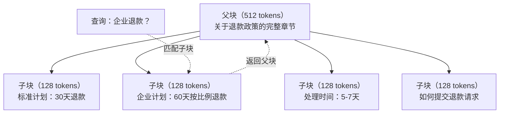
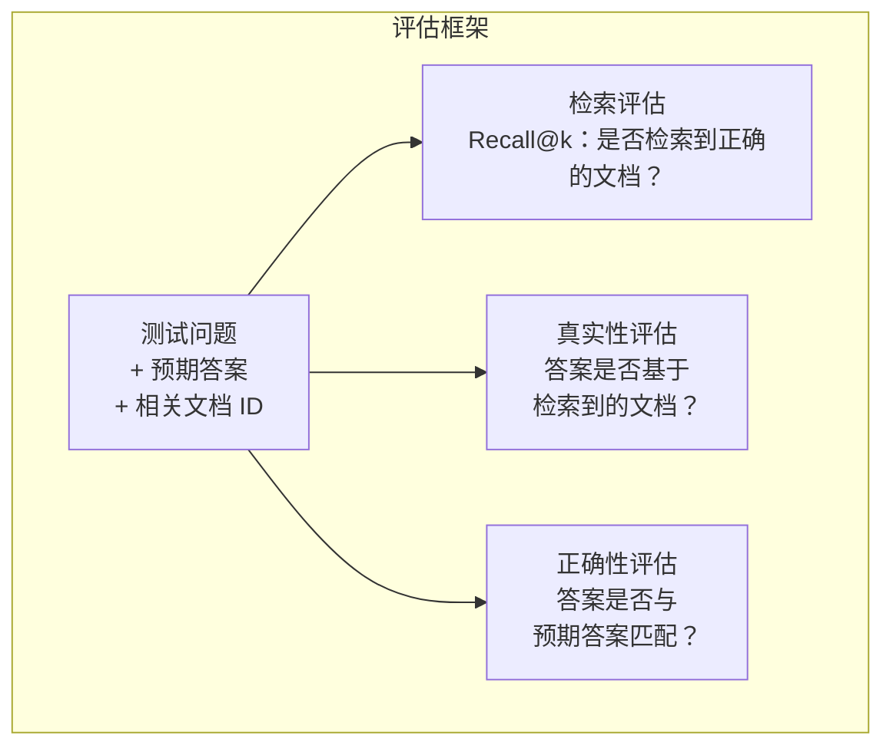

# 高级 RAG（分块（Chunking）、重排序（Reranking）、混合搜索（Hybrid Search））

> 基础 RAG 检索的是前 k 个最相似的块。这对简单问题有效，但在多跳推理、歧义查询和大规模语料库上失效。高级 RAG 是让演示在 10 份文档上有效与系统在 1000 万份文档上有效之间的差别。

**类型：** 构建  
**语言：** Python  
**先决条件：** 第11阶段，第06课（RAG）  
**时间：** 约 90 分钟  
**相关内容：** 第5阶段 · 23课（RAG 的分块策略）涵盖所有六种分块算法——递归（recursive）、语义（semantic）、句子（sentence）、父文档（parent-document）、后期分块（late chunking）、上下文检索（contextual retrieval）——并带有 Vectara/Anthropic 基准。本课构建在此基础上：混合搜索、重排序、查询转换。

## 学习目标

- 实现高级分块策略（语义、递归、父子关系），保留文档结构和上下文  
- 构建结合 BM25 关键词匹配与语义向量搜索及交叉编码器重排序器的混合搜索流水线  
- 应用查询转换技术（HyDE、多查询、多步后退）以提升对歧义或复杂问题的检索效果  
- 诊断并修复常见 RAG 失败：检索错块、答案不在上下文中、多跳推理失败  

## 问题

你在第06课构建了一个基础的 RAG 流水线。它能处理小型语料库中的直白问题。现在试试以下情况：

**歧义查询**：“上季度收入是多少？”语义搜索返回的块包含收入策略、收入预测和 CFO 关于收入增长的看法。所有这些与“收入”（revenue）这个词语义相似，但没有包含实际数字。正确的块里面写的是“2025年第三季度收入为 4720 万美元”，但用了“盈利”（earnings）而非“收入”这个词。嵌入模型认为“收入策略”比“Q3 盈利为 4720 万美元”更接近查询。

**多跳问题**：“哪个团队的客户满意度得分提升最高？”这需要找到每个团队的满意度得分，比较后取最大值。没有单个块包含答案，信息散布在各团队报告中。

**大语料库问题**：有200万个块。正确答案在编号为 1,847,293 的块中。你的前5检索结果包含块 #14、#89,201、#1,200,000、#44 和 #901,333。这些在嵌入空间距离近，但没有包含答案。在如此规模下，近似最近邻搜索带来的误差足以把相关结果挤出前 k。

基础 RAG 失败是因为向量相似度不等同于相关性。一个块的语义可能与查询相似，但不一定有用来回答问题。高级 RAG 通过四种技术解决这一问题：混合搜索（添加关键词匹配）、重排序（更仔细地评分候选）、查询转换（搜索前改写查询）和更好的分块（以合适粒度检索）。

## 概念

### 混合搜索：语义 + 关键词

语义搜索（基于向量相似度）擅长理解含义。例如，“如何取消我的订阅？”可以匹配“终止你的计划步骤”，虽然没共享任何词。但它会漏掉精确匹配。“错误码 E-4021”如果被嵌入模型当作噪声，可能无法匹配包含“E-4021”的块。

关键词搜索（BM25）则相反，擅长精确匹配。查询“E-4021”能完美匹配。但“取消我的订阅”如果文档用“终止你的计划”描述，则可能无结果。

混合搜索会同时运行两者，并合并结果。

**BM25**（Best Matching 25）是标准关键词搜索算法，自1990年代以来一直是搜索引擎核心。公式是：

```text
BM25(q, d) = sum over terms t in q:
    IDF(t) * (tf(t,d) * (k1 + 1)) / (tf(t,d) + k1 * (1 - b + b * |d| / avgdl))
```

其中，tf(t,d) 是词 t 在文档 d 中的词频，IDF(t) 是逆文档频率，|d| 是文档长度，avgdl 是平均文档长度，k1 控制词频饱和度（默认1.2），b 控制长度归一化（默认0.75）。

通俗来讲：BM25 会给包含查询词（尤其是稀有词）的文档更高分，但对重复词语回报递减。一个文档中有50次“revenue”不会比有1次的文档高50倍。

### 互惠排名融合（Reciprocal Rank Fusion，RRF）

你有两个排序列表：一个来自向量搜索，一个来自 BM25。如何合并？RRF 是标准方法。

```text
RRF_score(d) = sum over rankings R:
    1 / (k + rank_R(d))
```

k 是常数（通常取60），防止第一名结果垄断。

例如，一文档在向量搜索中排第1，在 BM25 中排第5，得分为 1/(60+1) + 1/(60+5) = 0.0164 + 0.0154 = 0.0318

另一文档向量搜索排第3，BM25 排第2，得分为 1/(60+3) + 1/(60+2) = 0.0159 + 0.0161 = 0.0320

RRF 自然平衡两侧信号，在两个列表排位都高的文档得最高分；只在一个列表排第1而另一个缺失的文档得中等分。该方法用排名而非原始得分，避免了两个系统分数分布差异的影响。

### 重排序（Reranking）

检索（无论向量、关键词或混合）速度快但不精确。它用的是双编码器（bi-encoders）：查询和文档各自独立编码，再比较。编码一次做缓存，适合数百万人文档检索。

重排序用的是交叉编码器（cross-encoders）：查询和候选文档同时输入一个模型，输出相关性分数。模型同时看两个文本，捕捉细粒度互动。交叉编码器能理解“什么是第三季度盈利？”与包含“2025年第三季度盈利 4720 万美元”的块高度相关，哪怕双编码器忽略了这层联系。

代价是交叉编码器比双编码器慢 100-1000 倍，因为要联合处理查询文档对。无法为上百万文档预计算交叉编码器分数。解决方案是先从混合搜索检索更大候选集（前50个），然后用交叉编码器重排序得到最终前5名。


常用重排序模型（2026 年阵容）：
- Cohere Rerank 3.5：托管 API，多语种，混合语料最佳召回提升  
- Voyage rerank-2.5：托管 API，延迟最低  
- Jina-Reranker-v2 多语种：开源权重，支持 100+ 语言  
- bge-reranker-v2-m3：开源权重，强基线  
- cross-encoder/ms-marco-MiniLM-L-6-v2：开源权重，适合 CPU 原型开发  
- ColBERTv2 / Jina-ColBERT-v2：后期交互多向量重排序——评分时复杂度与 token 数线性相关，不随文档数线性增加  

### 查询转换（Query Transformation）

有时问题出在查询本身。“那个关于新政策变更的事是什么？”是个糟糕的搜索查询，缺乏具体术语，嵌入向量模糊，无检索系统能从中找到合适文档。

**查询重写**：用 LLM 将用户查询改写成更优搜索词。

```text
用户："那个关于新政策变更的事是什么？"
改写后："近期政策变更和更新"
```

**HyDE（Hypothetical Document Embeddings）**：不直接用查询搜索，而是生成一个假设答案，将其编码后搜索与真文档相似的内容。

```text
查询："企业退款政策是什么？"
假设答案："企业客户在购买后60天内可获得全额退款。退款按剩余订阅期限比例计算，处理时间为5-7个工作日。"
```

对该假设答案做嵌入并搜索真实文档。直觉上，假设答案在向量空间里比原查询更接近真实答案。问题和答案语言结构不同，通过生成假设答案，实现“问题空间”与“答案空间”的桥接。

HyDE 在检索前增加一次 LLM 调用，增加延迟约 500-2000 毫秒。当原始查询检索质量不佳时，十分值得。

### 父子分块

标准分块需要在“块小以精准检索”与“块大以上下文充分”之间权衡。父子分块消除这一权衡。

对小块（128 tokens）建立索引用于检索。检索命中小块后，返回对应父块（512 tokens）作为提示。小块匹配查询精准，父块提供足够上下文帮助 LLM 生成更好答案。



查询“企业退款？”精准匹配子块 C2，但提示传递整个父块 P，包含有关处理时间和申请流程等上下文。

### 元数据过滤

向量搜索前，通过元数据（日期、来源、类别、作者、语言）过滤语料库，缩小搜索空间，防止无关结果出现。

“上个月安全政策有何改变？”应只搜索最近30天的安全类文档。没有元数据过滤，会在整个语料库搜索，可能检出两年前的语义相似文档。

生产环境 RAG 系统会随每块存储元数据：源文档、创建日期、类别、作者、版本。向量数据库支持在相似度搜索前先按元数据预过滤，这对大规模性能至关重要。

### 评估

你构建了 RAG 系统。怎样知道它有效？三个指标：

**检索相关性（Recall@k）**：针对一批带有已知相关文档的测试问题，有多少比例的相关文档出现在前 k 结果中？答案在块 #47，#47 是否出现在前5？

**忠实性（Faithfulness）**：生成答案是否立足于检索到的文档？检索到的块说“60天退款期”，模型却回答“90天退款期”，说明模型出现幻觉（hallucination），答案不忠实。

**答案正确性**：生成答案是否符合预期答案？这是端到端指标，结合了检索和生成质量。

简单忠实性检测：检查生成答案中的每个断言，是否实质出现在检索块中。如果答案包含不在任何检索块里的事实，很可能是幻觉。



## 构建它

### 第一步：BM25 实现

```python
import math
from collections import Counter

class BM25:
    def __init__(self, k1=1.2, b=0.75):
        self.k1 = k1
        self.b = b
        self.docs = []
        self.doc_lengths = []
        self.avg_dl = 0
        self.doc_freqs = {}
        self.n_docs = 0

    def index(self, documents):
        self.docs = documents
        self.n_docs = len(documents)
        self.doc_lengths = []
        self.doc_freqs = {}

        for doc in documents:
            words = doc.lower().split()
            self.doc_lengths.append(len(words))
            unique_words = set(words)
            for word in unique_words:
                self.doc_freqs[word] = self.doc_freqs.get(word, 0) + 1

        self.avg_dl = sum(self.doc_lengths) / self.n_docs if self.n_docs else 1

    def score(self, query, doc_idx):
        query_words = query.lower().split()
        doc_words = self.docs[doc_idx].lower().split()
        doc_len = self.doc_lengths[doc_idx]
        word_counts = Counter(doc_words)
        score = 0.0

        for term in query_words:
            if term not in word_counts:
                continue
            tf = word_counts[term]
            df = self.doc_freqs.get(term, 0)
            idf = math.log((self.n_docs - df + 0.5) / (df + 0.5) + 1)
            numerator = tf * (self.k1 + 1)
            denominator = tf + self.k1 * (1 - self.b + self.b * doc_len / self.avg_dl)
            score += idf * numerator / denominator

        return score

    def search(self, query, top_k=10):
        scores = [(i, self.score(query, i)) for i in range(self.n_docs)]
        scores.sort(key=lambda x: x[1], reverse=True)
        return scores[:top_k]
```

### 第二步：倒数排名融合（Reciprocal Rank Fusion）

```python
def reciprocal_rank_fusion(ranked_lists, k=60):
    scores = {}
    for ranked_list in ranked_lists:
        for rank, (doc_id, _) in enumerate(ranked_list):
            if doc_id not in scores:
                scores[doc_id] = 0.0
            scores[doc_id] += 1.0 / (k + rank + 1)
    fused = sorted(scores.items(), key=lambda x: x[1], reverse=True)
    return fused
```

### 第三步：混合搜索管道

```python
def hybrid_search(query, chunks, vector_embeddings, vocab, idf, bm25_index, top_k=5, fusion_k=60):
    query_emb = tfidf_embed(query, vocab, idf)
    vector_results = search(query_emb, vector_embeddings, top_k=top_k * 3)
    bm25_results = bm25_index.search(query, top_k=top_k * 3)
    fused = reciprocal_rank_fusion([vector_results, bm25_results], k=fusion_k)
    return fused[:top_k]
```

### 第四步：简单重排序器

在生产环境中，您会使用交叉编码器模型。这里我们构建一个通过词汇重叠、词语重要性和短语匹配来评分查询-文档相关性的重排序器。

```python
def rerank(query, candidates, chunks):
    query_words = set(query.lower().split())
    stop_words = {"the", "a", "an", "is", "are", "was", "were", "what", "how",
                  "why", "when", "where", "do", "does", "for", "of", "in", "to",
                  "and", "or", "on", "at", "by", "it", "its", "this", "that",
                  "with", "from", "be", "has", "have", "had", "not", "but"}
    query_terms = query_words - stop_words

    scored = []
    for doc_id, initial_score in candidates:
        chunk = chunks[doc_id].lower()
        chunk_words = set(chunk.split())

        term_overlap = len(query_terms & chunk_words)

        query_bigrams = set()
        q_list = [w for w in query.lower().split() if w not in stop_words]
        for i in range(len(q_list) - 1):
            query_bigrams.add(q_list[i] + " " + q_list[i + 1])
        bigram_matches = sum(1 for bg in query_bigrams if bg in chunk)

        position_boost = 0
        for term in query_terms:
            pos = chunk.find(term)
            if pos != -1 and pos < len(chunk) // 3:
                position_boost += 0.5

        rerank_score = (
            term_overlap * 1.0
            + bigram_matches * 2.0
            + position_boost
            + initial_score * 5.0
        )
        scored.append((doc_id, rerank_score))

    scored.sort(key=lambda x: x[1], reverse=True)
    return scored
```

### 第五步：HyDE（假设文档嵌入 Hypothetical Document Embeddings）

```python
def hyde_generate_hypothesis(query):
    templates = {
        "what": "关于 '{query}' 的答案如下：根据我们的文档，{topic} 涉及定义流程运作的具体政策和程序。",
        "how": "针对 '{query}'：该流程包含若干步骤。首先，您需要发起请求。接着，系统根据定义的规则进行处理。",
        "default": "关于 '{query}'：我们的记录显示与该主题相关的具体细节和政策，提供了全面的答案。"
    }
    query_lower = query.lower()
    if query_lower.startswith("what"):
        template = templates["what"]
    elif query_lower.startswith("how"):
        template = templates["how"]
    else:
        template = templates["default"]

    topic_words = [w for w in query.lower().split()
                   if w not in {"what", "is", "the", "how", "do", "does", "a", "an",
                                "for", "of", "to", "in", "on", "at", "by", "and", "or"}]
    topic = " ".join(topic_words) if topic_words else "该主题"

    return template.format(query=query, topic=topic)


def hyde_search(query, chunks, vector_embeddings, vocab, idf, top_k=5):
    hypothesis = hyde_generate_hypothesis(query)
    hypothesis_emb = tfidf_embed(hypothesis, vocab, idf)
    results = search(hypothesis_emb, vector_embeddings, top_k)
    return results, hypothesis
```

### 第六步：父子切分（Parent-Child Chunking）

```python
def create_parent_child_chunks(text, parent_size=200, child_size=50):
    words = text.split()
    parents = []
    children = []
    child_to_parent = {}

    parent_idx = 0
    start = 0
    while start < len(words):
        parent_end = min(start + parent_size, len(words))
        parent_text = " ".join(words[start:parent_end])
        parents.append(parent_text)

        child_start = start
        while child_start < parent_end:
            child_end = min(child_start + child_size, parent_end)
            child_text = " ".join(words[child_start:child_end])
            child_idx = len(children)
            children.append(child_text)
            child_to_parent[child_idx] = parent_idx
            child_start += child_size

        parent_idx += 1
        start += parent_size

    return parents, children, child_to_parent
```

### 第七步：真实性评估（Faithfulness Evaluation）

```python
def evaluate_faithfulness(answer, retrieved_chunks):
    answer_sentences = [s.strip() for s in answer.split(".") if len(s.strip()) > 10]
    if not answer_sentences:
        return 1.0, []

    grounded = 0
    ungrounded = []
    context = " ".join(retrieved_chunks).lower()

    for sentence in answer_sentences:
        words = set(sentence.lower().split())
        stop_words = {"the", "a", "an", "is", "are", "was", "were", "and", "or",
                      "to", "of", "in", "for", "on", "at", "by", "it", "this", "that"}
        content_words = words - stop_words
        if not content_words:
            grounded += 1
            continue

        matched = sum(1 for w in content_words if w in context)
        ratio = matched / len(content_words) if content_words else 0

        if ratio >= 0.5:
            grounded += 1
        else:
            ungrounded.append(sentence)

    score = grounded / len(answer_sentences) if answer_sentences else 1.0
    return score, ungrounded


def evaluate_retrieval_recall(queries_with_relevant, retrieval_fn, k=5):
    total_recall = 0.0
    results = []

    for query, relevant_indices in queries_with_relevant:
        retrieved = retrieval_fn(query, k)
        retrieved_indices = set(idx for idx, _ in retrieved)
        relevant_set = set(relevant_indices)
        hits = len(retrieved_indices & relevant_set)
        recall = hits / len(relevant_set) if relevant_set else 1.0
        total_recall += recall
        results.append({
            "query": query,
            "recall": recall,
            "hits": hits,
            "total_relevant": len(relevant_set)
        })

    avg_recall = total_recall / len(queries_with_relevant) if queries_with_relevant else 0
    return avg_recall, results
```

## 使用它

使用真实交叉编码器进行重排名：

```python
from sentence_transformers import CrossEncoder

reranker = CrossEncoder("cross-encoder/ms-marco-MiniLM-L-6-v2")

def rerank_with_cross_encoder(query, candidates, chunks, top_k=5):
    pairs = [(query, chunks[doc_id]) for doc_id, _ in candidates]
    scores = reranker.predict(pairs)
    scored = list(zip([doc_id for doc_id, _ in candidates], scores))
    scored.sort(key=lambda x: x[1], reverse=True)
    return scored[:top_k]
```

使用 Cohere 托管的重排名器：

```python
import cohere

co = cohere.Client()

def rerank_with_cohere(query, candidates, chunks, top_k=5):
    docs = [chunks[doc_id] for doc_id, _ in candidates]
    response = co.rerank(
        model="rerank-english-v3.0",
        query=query,
        documents=docs,
        top_n=top_k
    )
    return [(candidates[r.index][0], r.relevance_score) for r in response.results]
```

使用真实大语言模型（LLM）的 HyDE：

```python
import anthropic

client = anthropic.Anthropic()

def hyde_with_llm(query):
    response = client.messages.create(
        model="claude-sonnet-4-20250514",
        max_tokens=256,
        messages=[{
            "role": "user",
            "content": f"写一个简短段落，作为该问题的良好答案。不要说你不知道。只需写出答案应有的样子。\n\n问题: {query}"
        }]
    )
    return response.content[0].text
```

使用 Weaviate 的生产混合搜索：

```python
import weaviate

client = weaviate.connect_to_local()

collection = client.collections.get("Documents")
response = collection.query.hybrid(
    query="enterprise refund policy",
    alpha=0.5,
    limit=10
)
```

alpha 参数控制权重平衡：0.0 = 纯关键词（BM25），1.0 = 纯向量，0.5 = 权重均等。大多数生产系统使用 0.3 到 0.7 之间的 alpha。

## 发布它

本课产出：
- `outputs/prompt-advanced-rag-debugger.md` —— 用于诊断和修复 RAG 质量问题的提示模板
- `outputs/skill-advanced-rag.md` —— 构建具备混合搜索和重排序功能的生产级 RAG 技能

## 练习

1. 比较 BM25、向量搜索和混合搜索在示例文档上的表现。对于 5 个测试查询中的每一个，记录哪种方法在第 1 位返回了最相关的切片。混合搜索应在至少 3 个查询中胜出。
```text

2. 实现元数据过滤器。为每个文档添加一个“category”（类别）字段（security（安全）、billing（账单）、api（接口）、product（产品））。在运行向量搜索之前，仅过滤出相关类别的块。使用“What encryption is used?”（使用了什么加密？）进行测试，并验证它只搜索安全类别的块。

3. 使用第06课中的简单生成函数构建完整的HyDE流水线。比较直接查询搜索和HyDE搜索在所有5个测试查询上的检索质量（前3相关性）。HyDE应提升模糊查询的结果。

4. 在示例文档上实现父子分块策略。使用child_size=30和parent_size=100。搜索时使用子块，但在提示中返回父块。将生成的答案与标准的chunk_size=50的分块进行比较。

5. 创建一个评估数据集：包括10个具有已知答案块的问题。测量(a)仅向量搜索，(b)仅BM25，(c)混合搜索，(d)混合+重排序的Recall@3、Recall@5和Recall@10。绘制结果图，并识别重排序最有效的地方。

## 关键词

| 术语 | 人们常说 | 实际含义 |
|------|----------|----------|
| BM25 | “关键词搜索” | 一种基于词频、逆文档频率和文档长度归一化的概率排名算法 |
| Hybrid search（混合搜索） | “两者兼得” | 同时运行语义（向量）和关键词（BM25）搜索，然后用秩融合合并结果 |
| Reciprocal Rank Fusion（互惠秩融合） | “合并排序列表” | 通过对所有列表中的每个文档求和 1/(k + 排名) 来合并多个排序列表 |
| Reranking（重排序） | “第二次评分” | 使用更昂贵的cross-encoder模型对初步检索的候选集进行重新评分 |
| Cross-encoder（交叉编码器） | “联合查询-文档模型” | 一种将查询和文档作为单一输入，输出相关性分数的模型；比bi-encoder准确，但搜索整个语料库太慢 |
| Bi-encoder（双编码器） | “独立嵌入模型” | 独立嵌入查询和文档的模型；速度快因嵌入预先计算，但比交叉编码器准确度低 |
| HyDE | “带假答案的搜索” | 生成查询的假设答案并嵌入，再搜索与其相似的真实文档 |
| Parent-child chunking（父子分块） | “小搜索，大上下文” | 索引小块以实现精准检索，但返回更大的父块以提供足够上下文 |
| Metadata filtering（元数据过滤） | “先缩小范围再搜索” | 在运行向量搜索前按属性（日期、来源、类别）过滤文档以减少搜索空间 |
| Faithfulness（准确性） | “是否有根据” | 生成答案是否有检索到的文档支持，而非模型训练数据中的幻觉 |

## 进一步阅读

- Robertson & Zaragoza, “The Probabilistic Relevance Framework: BM25 and Beyond”（2009）-- BM25的权威参考，讲解公式背后的概率基础
- Cormack et al., “Reciprocal Rank Fusion Outperforms Condorcet and Individual Rank Learning Methods”（2009）-- 原始RRF论文，显示其优于更复杂的融合方法
- Gao et al., “Precise Zero-Shot Dense Retrieval without Relevance Labels”（2022）-- HyDE论文，展示假设文档嵌入无需训练数据即可提升检索
- Nogueira & Cho, “Passage Re-ranking with BERT”（2019）-- 展示基于BM25之上的cross-encoder重排序显著提升检索质量
- [Khattab et al., “DSPy: Compiling Declarative Language Model Calls into Self-Improving Pipelines”（2023）](https://arxiv.org/abs/2310.03714) -- 将提示构造和权重选择视为检索流水线的优化问题；推荐阅读以了解“程序化大模型”而非“提示大模型”
- [Edge et al., “From Local to Global: A Graph RAG Approach to Query-Focused Summarization”（Microsoft Research 2024）](https://arxiv.org/abs/2404.16130) -- GraphRAG论文：实体关系抽取+Leiden社区检测，用于面向查询的摘要；论述全局与局部检索的区别
- [Asai et al., “Self-RAG: Learning to Retrieve, Generate, and Critique through Self-Reflection”（ICLR 2024）](https://arxiv.org/abs/2310.11511) -- 通过反思标记实现自我评估的RAG；推进静态检索-生成模型的代理前沿
- [LangChain Query Construction blog](https://blog.langchain.dev/query-construction/) -- 如何将自然语言查询转换为结构化数据库查询（Text-to-SQL, Cypher），作为检索前置步骤
