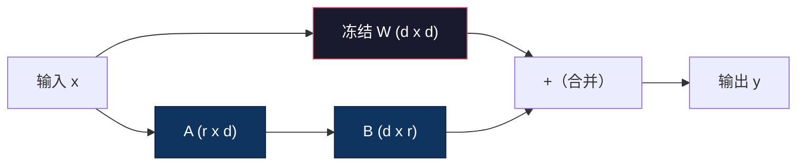
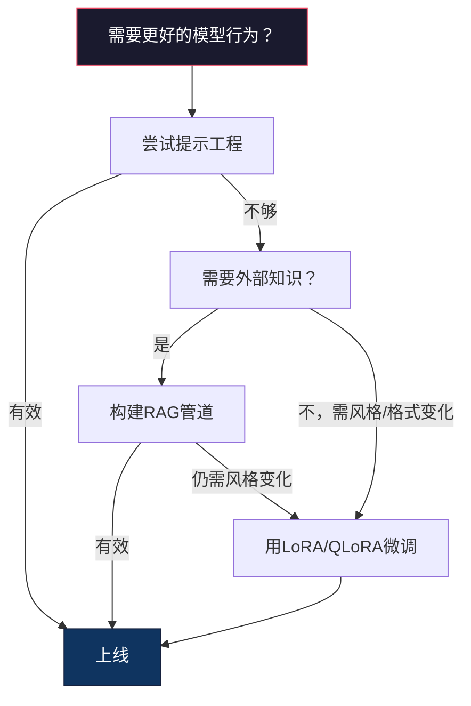

# 使用 LoRA 和 QLoRA 进行微调

> 完整微调一个 7B 模型需要 56GB 显存。你没有那么多，大多数公司也没有。LoRA 允许你通过训练不到 1% 的参数，在 6GB 显存中微调同一个模型。这不是妥协——它在大多数任务上匹配完整微调的质量。整个开源微调生态系统都基于这个技巧运行。

**类型：** 构建  
**语言：** Python  
**先决条件：** 阶段 10，课程 06（指令微调 / SFT）  
**时间：** 约 75 分钟  
**相关内容：** 阶段 10 从零开始讲解 SFT/DPO 循环。本课程将它们连接到 2026 年的 PEFT 工具集（PEFT、TRL、Unsloth、Axolotl、LLaMA-Factory）。

## 学习目标

- 通过在预训练模型的注意力层中注入低秩适配器矩阵（A 和 B）实现 LoRA
- 计算 LoRA 相对于完整微调的参数节省量：秩 r 和 d_model 维度训练 2*r*d 个参数，而不是 d^2
- 使用 QLoRA（4 位量化基模型 + LoRA 适配器）微调模型，以适应消费级 GPU 内存
- 将 LoRA 权重合并回基模型以部署，并比较有无适配器的推理速度

## 问题描述

你有一个基模型，Llama 3 8B。你希望它以公司风格回答客户支持工单。SFT 是答案。但 SFT 存在成本问题。

完整微调会更新模型中的每个参数。Llama 3 8B 有 80 亿参数。fp16 格式下，每个参数占 2 字节，仅加载权重就需要 16GB。训练时你还需要梯度（16GB）、Adam 优化器状态（动量 + 方差共 32GB）和激活值。总共：单个 8B 模型大约需要 56GB 显存。

A100 80GB 只能勉强装下。两块 A100 云端租赁费每小时 3-4 美元。用 50,000 个示例训练 3 个 epoch 需要 6-10 小时。一次实验成本 30-40 美元。做 10 次实验调整超参，成本达到 400 美元，尚未部署任何东西。

Llama 3 70B 时情况更加离谱。权重仅存储就需要 140GB。你得用集群，单次实验成本超过 100 美元。

还有更深层次的问题。完整微调会修改模型的所有权重。如果你用客户支持数据微调，可能会削弱模型的通用能力。这叫灾难性遗忘（catastrophic forgetting）。模型针对你的任务变好了，但其他方面变差了。

你需要一种训练更少参数、占用内存更少、且不破坏已有知识的方法。

## 概念介绍

### LoRA：低秩适配（Low-Rank Adaptation）

微软的 Edward Hu 等人在 2021 年 6 月发表了 LoRA。论文的洞察是：微调时的权重更新矩阵具有低秩本质。你不需要更新 4096x4096 权重矩阵中全部 1677 万个参数，更新矩阵中有用的信息可以用秩为 16 或 32 的矩阵捕获。

计算公式如下。标准线性层计算：

```text
y = Wx
```

其中 W 是 d_out x d_in 的矩阵。对于 4096x4096 的注意力投影，有 16,777,216 个参数。

LoRA 冻结 W，加入低秩分解：

```text
y = Wx + BAx
```

其中 B 是 (d_out x r)，A 是 (r x d_in)。秩 r 远小于 d，通常为 8、16 或 32。

以秩 r=16 应用在 4096x4096 层为例：  
- 原参数数量：4096 x 4096 = 16,777,216  
- LoRA 参数数量：(4096 x 16) + (16 x 4096) = 65,536 + 65,536 = 131,072  
- 参数占比：131,072 / 16,777,216 = 0.78%

也就是说，你只训练 0.78% 的参数，同时获得 95% 到 100% 的微调质量。



A 矩阵初始值服从随机高斯分布，B 矩阵初始化为零。这意味着 LoRA 贡献初期为零——模型从原始行为开始训练，逐渐学习适配。

### 缩放因子 Alpha（α）

LoRA 引入缩放因子 alpha，用于控制低秩更新对输出的影响：

```text
y = Wx + (alpha / r) * BAx
```

当 alpha = r 时，缩放为 1 倍；当 alpha = 2r（常用默认值）时，缩放为 2 倍。该超参数独立于基学习率，控制 LoRA 通道的学习速率。

实用建议：  
- alpha = 2 * rank 是社区常用约定（原论文多数实验用 alpha = rank）  
- alpha = rank 对应 1 倍缩放，保守且稳定  
- alpha 设得高会导致每步更新更大，可加速收敛，但可能不稳定

### 应用位置

Transformer 有许多线性层，你不必全部添加 LoRA。论文测试过不同组合：

| 目标层          | 可训练参数数（7B） | 质量     |
|----------------|---------------------|----------|
| 仅 q_proj      | 4.7M                | 良好     |
| q_proj + v_proj | 9.4M                | 更好     |
| q_proj + k_proj + v_proj + o_proj | 18.9M     | 注意力最佳 |
| 所有线性层（注意力 + MLP） | 37.7M          | 微小收益，参数翻倍 |

大多数任务的最佳折中是：q_proj + v_proj。这瞄准了自注意力中的查询和数值投影，控制模型关注什么和提取何种信息。对复杂任务（如代码生成）加入 MLP 层有帮助，但对简单任务收益递减且参数增加一倍。

### 秩 (Rank) 选择

秩 r 控制适配的表达能力：

| 秩 | 每层可训练参数数 | 适用场景              |
|----|------------------|-----------------------|
| 4  | 32,768           | 简单分类，情感分析      |
| 8  | 65,536           | 单领域问答，摘要        |
| 16 | 131,072          | 多领域任务，指令跟随    |
| 32 | 262,144          | 复杂推理，代码生成      |
| 64 | 524,288          | 多数任务边际收益递减    |
| 128| 1,048,576        | 罕见需求                |

论文表明 r=4 对简单任务亲和力足够，r=8 和 r=16 是实践中最常见的选择。超过 r=64 很少提升质量，且开始丧失 LoRA 的内存优势。

### QLoRA：4 位量化 + LoRA

华盛顿大学的 Tim Dettmers 等人于 2023 年 5 月发表了 QLoRA。思路是：将冻结的基模型量化为 4 位精度，然后以 fp16 格式附加 LoRA 适配器。

这大幅改变了内存需求：

| 方法                   | 权重内存（7B） | 训练内存（7B）  | 需要 GPU         |
|------------------------|----------------|-----------------|------------------|
| 完整微调（fp16）       | 14GB           | ~56GB           | 1x A100 80GB     |
| LoRA（fp16 基模型）    | 14GB           | ~18GB           | 1x A100 40GB     |
| QLoRA（4 位基模型）    | 3.5GB          | ~6GB            | 1x RTX 3090 24GB |

QLoRA 主要贡献三点技术革新：

**NF4（Normal Float 4-bit）**：新型数据类型，专为神经网络权重设计。网络权重近似正态分布，NF4 在标准正态分布的分位点上分布 16 个量化级。理论上对正态分布信息保存最佳，优于均匀量化（INT4）或标准 Float4。

**双重量化**：量化常数本身占内存。每块 64 个权重需要一个 fp32 缩放因子（4 字节）。7B 模型约需额外 0.4GB。双重量化将这些常数量化为 fp8，开销降到 0.1GB，虽小但积少成多。

**分页优化器**：训练时，Adam 优化器状态可能超出 GPU 显存，尤其长序列时。分页优化器利用 NVIDIA 统一内存，显存不足时自动将优化器状态分页到 CPU RAM，需时再分页回显存。防止 OOM，代价是吞吐率略降。

### 质量问题

减少训练参数或量化基模型会损失质量吗？多篇论文结果显示：

| 方法                     | MMLU（5-shot） | MT-Bench | HumanEval |
|--------------------------|----------------|----------|-----------|
| 完整微调（Llama 2 7B）   | 48.3           | 6.72     | 14.6      |
| LoRA r=16                | 47.9           | 6.68     | 14.0      |
| QLoRA r=16 (NF4)         | 47.5           | 6.61     | 13.4      |
| QLoRA r=64 (NF4)         | 48.1           | 6.70     | 14.2      |

LoRA 在 r=16 时，绝大多数基准测试中质量与完整微调差在 1% 内。QLoRA r=16 再损失极少，r=64 时几乎与完整微调持平，并节省 90% 内存。

### 实际成本

Llama 3 8B，50,000 示例，3 个 epoch 微调：

| 方法                 | GPU             | 时间  | 成本     |
|----------------------|-----------------|-------|----------|
| 完整微调             | 2x A100 80GB    | 8 小时 | ~$32     |
| LoRA r=16            | 1x A100 40GB    | 4 小时 | ~$8      |
| QLoRA r=16           | 1x RTX 4090 24GB| 6 小时 | ~$5      |
| QLoRA r=16 (Unsloth) | 1x RTX 4090 24GB| 2.5 小时 | ~$2     |
| QLoRA r=16           | 1x T4 16GB      | 12 小时| ~$4      |

QLoRA 在单张消费级 GPU 上的成本低于一份午餐。这就是 2023 年开权重微调社区爆发的原因，并且为什么下面所有训练框架在 2026 年默认都支持 QLoRA。

### 2026 年 PEFT 堆栈

| 框架           | 说明                           | 适用场景                                       |
|----------------|--------------------------------|------------------------------------------------|
| **Hugging Face PEFT** | 规范的 LoRA/QLoRA/DoRA/IA3 库 | 需要底层控制，且训练循环已有 `transformers.Trainer` |
| **TRL**        | HF 的基于反馈强化训练工具（SFT、DPO、GRPO、PPO、ORPO） | SFT 后需使用 DPO/GRPO，基于 PEFT 构建             |
| **Unsloth**    | 前向/反向计算的 Triton 内核重写 | 需要 2-5 倍加速和半显存，不损失准确率；支持 Llama/Mistral/Qwen  |
| **Axolotl**    | 基于 YAML 配置的 PEFT + TRL + DeepSpeed + Unsloth 封装 | 需要可复现且版本受控的训练                      |
| **LLaMA-Factory** | PEFT + TRL 的 GUI/CLI/API 封装 | 希望零代码微调，支持 100+ 模型系列             |
| **torchtune**  | 原生 PyTorch 方案，无 `transformers` 依赖 | 希望极简依赖，且组织已统一使用 PyTorch           |

经验法则：科研或一次性实验 → PEFT。可复现生产流水线 → Axolotl（启用 Unsloth 内核）。快速原型 → LLaMA-Factory。

### 适配器合并

训练完成后，你有两样东西：冻结的基模型和小型 LoRA 适配器（通常 10-100MB）。你可以：

1. **保持分离**：加载基模型，然后加载适配器。不同任务切换适配器。这是多微调版本共用单基模型的方式。

2. **永久合并**：计算 W' = W + (alpha / r) * BA，保存为新完整模型。合并模型大小与原始相同，无推理开销，无需管理适配器。

若服务多个任务（客户支持适配器、代码适配器、翻译适配器），保持分离更灵活。若部署单个专用模型，推荐合并。

多适配器合并的高级技术：

- **TIES-Merging**（Yadav 等人 2023 年）：修剪小幅度参数，解决符号冲突后合并，减少适配器间干扰。
- **DARE**（Yu 等人 2023 年）：合并前随机丢弃部分适配器参数，并重缩放剩余参数，惊人地有效。
- **任务算术**：简易地加减适配器权重。例如同时加“代码”适配器和“数学”适配器，模型能同时擅长两者。

### 何时不进行微调（Fine-Tune）

微调是第三选项，不是首选。

**第一：提示工程（prompt engineering）。** 写一个更好的系统提示，增加少样例演示（few-shot examples），使用链式思考（chain-of-thought）。这不花钱，仅需几分钟。如果提示能让你达到80%的目标，可能就不需要微调了。

**第二：检索增强生成（RAG）。** 如果模型需要了解你特定的数据（文档、知识库、产品目录），检索比直接把信息烙印进权重更便宜、也更容易维护。详见第06课。

**第三：微调。** 当你需要模型采用特定风格、格式或推理模式，且通过提示无法达到时。需要一致的结构化输出时。需要知识蒸馏（distill）一个更大模型成更小模型时。当延迟很重要且无法承担少样例提示带来的额外token时。



## 实现它

我们用纯 PyTorch 从零实现 LoRA。无库依赖。无魔法。你将构建 LoRA 层，注入模型，训练它，然后把权重合并回去。

### 第1步：LoRA层

```python
import torch
import torch.nn as nn
import math

class LoRALayer(nn.Module):
    def __init__(self, in_features, out_features, rank=8, alpha=16):
        super().__init__()
        self.rank = rank
        self.alpha = alpha
        self.scaling = alpha / rank

        self.A = nn.Parameter(torch.randn(in_features, rank) * (1 / math.sqrt(rank)))  # 初始为缩放的随机值
        self.B = nn.Parameter(torch.zeros(rank, out_features))  # 初始化为零

    def forward(self, x):
        return (x @ self.A @ self.B) * self.scaling
```

A 矩阵用缩放后的随机值初始化，B 矩阵初始化为零，BA乘积初始为零，模型行为从原始模型开始。

### 第2步：LoRA包装的线性层

```python
class LinearWithLoRA(nn.Module):
    def __init__(self, linear, rank=8, alpha=16):
        super().__init__()
        self.linear = linear
        self.lora = LoRALayer(
            linear.in_features, linear.out_features, rank, alpha
        )

        for param in self.linear.parameters():
            param.requires_grad = False  # 原始线性层被冻结

    def forward(self, x):
        return self.linear(x) + self.lora(x)
```

原始线性层参数被冻结，只有 LoRA 参数（A和B）可训练。

### 第3步：注入 LoRA 到模型

```python
def inject_lora(model, target_modules, rank=8, alpha=16):
    for param in model.parameters():
        param.requires_grad = False  # 冻结所有参数

    lora_layers = {}
    for name, module in model.named_modules():
        if isinstance(module, nn.Linear):
            if any(t in name for t in target_modules):
                parent_name = ".".join(name.split(".")[:-1])
                child_name = name.split(".")[-1]
                parent = dict(model.named_modules())[parent_name]
                lora_linear = LinearWithLoRA(module, rank, alpha)
                setattr(parent, child_name, lora_linear)  # 替换为LoRA版本
                lora_layers[name] = lora_linear
    return lora_layers
```

先冻结模型所有参数，遍历模型模块树，找到目标的线性层用LoRA包装替换。LoRA的A和B矩阵是模型中唯一可训练参数。

### 第4步：计算参数数量

```python
def count_parameters(model):
    total = sum(p.numel() for p in model.parameters())
    trainable = sum(p.numel() for p in model.parameters() if p.requires_grad)
    frozen = total - trainable
    return {
        "total": total,
        "trainable": trainable,
        "frozen": frozen,
        "trainable_pct": 100 * trainable / total if total > 0 else 0
    }
```

### 第5步：合并权重回主模型

```python
def merge_lora_weights(model):
    for name, module in model.named_modules():
        if isinstance(module, LinearWithLoRA):
            with torch.no_grad():
                merged = (
                    module.lora.A @ module.lora.B
                ) * module.lora.scaling
                module.linear.weight.data += merged.T  # 把LoRA调整合并到原权重
            parent_name = ".".join(name.split(".")[:-1])
            child_name = name.split(".")[-1]
            if parent_name:
                parent = dict(model.named_modules())[parent_name]
            else:
                parent = model
            setattr(parent, child_name, module.linear)  # 恢复原线性层
```

合并后，LoRA层消失，模型大小恢复，适配保存在权重里，无推理额外开销。

### 第6步：模拟QLoRA量化

```python
def quantize_to_nf4(tensor, block_size=64):
    blocks = tensor.reshape(-1, block_size)
    scales = blocks.abs().max(dim=1, keepdim=True).values / 7.0
    scales = torch.clamp(scales, min=1e-8)
    quantized = torch.round(blocks / scales).clamp(-8, 7).to(torch.int8)
    return quantized, scales

def dequantize_from_nf4(quantized, scales, original_shape):
    dequantized = quantized.float() * scales
    return dequantized.reshape(original_shape)
```

模拟了4位量化，将权重映射到块内16个离散等级。生产环境 QLoRA 使用 bitsandbytes 库实现 GPU 上真正 NF4。

### 第7步：训练循环示例

```python
def train_lora(model, data, epochs=5, lr=1e-3, batch_size=4):
    optimizer = torch.optim.AdamW(
        [p for p in model.parameters() if p.requires_grad], lr=lr
    )
    criterion = nn.MSELoss()

    losses = []
    for epoch in range(epochs):
        epoch_loss = 0.0
        n_batches = 0
        indices = torch.randperm(len(data["inputs"]))

        for i in range(0, len(indices), batch_size):
            batch_idx = indices[i:i + batch_size]
            x = data["inputs"][batch_idx]
            y = data["targets"][batch_idx]

            output = model(x)
            loss = criterion(output, y)

            optimizer.zero_grad()
            loss.backward()
            optimizer.step()

            epoch_loss += loss.item()
            n_batches += 1

        avg_loss = epoch_loss / n_batches
        losses.append(avg_loss)

    return losses
```

### 第8步：完整演示

```python
def demo():
    torch.manual_seed(42)
    d_model = 256
    n_classes = 10

    model = nn.Sequential(
        nn.Linear(d_model, 512),
        nn.ReLU(),
        nn.Linear(512, 512),
        nn.ReLU(),
        nn.Linear(512, n_classes),
    )

    n_samples = 500
    x = torch.randn(n_samples, d_model)
    y = torch.randint(0, n_classes, (n_samples,))
    y_onehot = torch.zeros(n_samples, n_classes).scatter_(1, y.unsqueeze(1), 1.0)

    data = {"inputs": x, "targets": y_onehot}

    params_before = count_parameters(model)  # 微调前参数统计

    lora_layers = inject_lora(
        model, target_modules=["0", "2"], rank=8, alpha=16
    )

    params_after = count_parameters(model)  # 注入后参数统计

    losses = train_lora(model, data, epochs=20, lr=1e-3)  # 训练LoRA

    merge_lora_weights(model)  # 合并权重回主模型
    params_merged = count_parameters(model)  # 合并后参数统计

    return {
        "params_before": params_before,
        "params_after": params_after,
        "params_merged": params_merged,
        "losses": losses,
    }
```

该演示创建一个小模型，在两层注入LoRA，训练后合并权重。训练时可训练参数从全部降到约1%，合并后恢复。

## 使用它

借助 Hugging Face 生态，LoRA 应用到真实模型只需约20行代码：

```python
from transformers import AutoModelForCausalLM, AutoTokenizer
from peft import LoraConfig, get_peft_model, TaskType

model = AutoModelForCausalLM.from_pretrained("meta-llama/Llama-3.1-8B")
tokenizer = AutoTokenizer.from_pretrained("meta-llama/Llama-3.1-8B")

lora_config = LoraConfig(
    task_type=TaskType.CAUSAL_LM,
    r=16,
    lora_alpha=32,
    lora_dropout=0.05,
    target_modules=["q_proj", "v_proj"],
)

model = get_peft_model(model, lora_config)
model.print_trainable_parameters()
```

对于 QLoRA，添加 bitsandbytes 量化配置：

```python
from transformers import BitsAndBytesConfig

bnb_config = BitsAndBytesConfig(
    load_in_4bit=True,
    bnb_4bit_quant_type="nf4",
    bnb_4bit_compute_dtype=torch.bfloat16,
    bnb_4bit_use_double_quant=True,
)

model = AutoModelForCausalLM.from_pretrained(
    "meta-llama/Llama-3.1-8B",
    quantization_config=bnb_config,
    device_map="auto",
)

model = get_peft_model(model, lora_config)
```

就是这样。训练循环不变，数据管道不变。基础模型以4位存储，LoRA适配器以fp16训练，整个过程仅需6GB显存。

使用 Hugging Face Trainer 训练示例：

```python
from transformers import TrainingArguments, Trainer
from datasets import load_dataset

dataset = load_dataset("tatsu-lab/alpaca", split="train[:5000]")

training_args = TrainingArguments(
    output_dir="./lora-llama",
    num_train_epochs=3,
    per_device_train_batch_size=4,
    gradient_accumulation_steps=4,
    learning_rate=2e-4,
    fp16=True,
    logging_steps=10,
    save_strategy="epoch",
    optim="paged_adamw_8bit",
)

trainer = Trainer(
    model=model,
    args=training_args,
    train_dataset=dataset,
)

trainer.train()

model.save_pretrained("./lora-adapter")
```

保存的适配器大小为10-100MB，基础模型保持不变。你可以只分享适配器文件，不必重新分发整个模型。

## 部署上线

本课生成内容：
- `outputs/prompt-lora-advisor.md` —— 通过提示帮助你为特定任务选择LoRA的秩（rank）、目标模块和超参数
- `outputs/skill-fine-tuning-guide.md` —— 教授代理选择何时以及如何微调的决策树技能

## 练习

1. **秩消融实验（Rank ablation study）。** 使用秩 r 为2，4，8，16，32和64运行demo。绘制最终loss与rank的关系。找出收益递减点，即rank翻倍时loss不再减半。对于简单的256维特征分类任务，这通常在r=8-16左右。

2. **目标模块比较。** 修改 inject_lora 只针对第“0”层、第“2”层、第“4”层以及全部三层。分别训练20个epoch。比较收敛速度和最终loss。这对应实际场景中选择q_proj、v_proj还是所有线性层的决策。

3. **量化误差分析。** 对训练好的模型权重矩阵，在调用 quantize_to_nf4 和 dequantize_from_nf4 前后，计算均方误差、最大绝对误差、以及原始与重建权重的相关系数。尝试 block_size 为32、64、128和256的效果。

4. **多适配器推理。** 分别在数据的偶数和奇数索引上训练两个LoRA适配器。保存两个适配器。加载基础模型一次，然后切换不同适配器，验证同一输入产生不同输出。这就是生产环境中同一基础模型提供多个微调版本的方式。

5. **合并（merge）与未合并推理（unmerged inference）。** 对比同一100条输入上 LoRA 模型在执行 `merge_lora_weights` 前后的输出。验证输出在浮点误差容忍度1e-5范围内完全相同。然后对两者进行推理速度基准测试——合并后稍快，因为它是单次矩阵乘法而非两次。

## 关键词

| 术语 | 常用说法 | 实际含义 |
|------|----------|----------|
| LoRA | “高效微调” | Low-Rank Adaptation（低秩自适应）：冻结基础权重，只训练两个小矩阵 A 和 B，它们的乘积近似完整权重更新 |
| QLoRA | “笔记本上微调” | Quantized LoRA（量化 LoRA）：基础模型以4位 NF4 量化加载，LoRA 适配器用 fp16 训练，使7B模型能在6GB显存下微调 |
| Rank (r) | “模型能学多少” | 矩阵 A 和 B 的内维度；控制表达能力与参数数量 |
| Alpha | “LoRA 学习率” | 作用于 LoRA 输出的缩放因子；alpha/r 调整适应对最终输出的贡献度 |
| NF4 | “4位量化” | Normal Float 4（正规浮点4）：一种4位数据类型，量化级别基于正态分布分位数，适合神经网络权重 |
| Adapter | “训练出的部分小模块” | 以单独文件（10-100MB）保存的 LoRA A 和 B 矩阵，能加载到任一基础模型上 |
| Target modules | “LoRA作用的层” | 注入 LoRA 适配器的特定线性层（q_proj、v_proj 等） |
| Merging | “烘焙入模型” | 计算 W + (alpha/r) * BA 并替换原权重，推理时消除适配器开销 |
| Paged optimizers | “训练时防止显存溢出” | 当GPU显存耗尽时，将优化器状态（Adam 动量、方差）卸载到CPU |
| Catastrophic forgetting | “微调破坏旧功能” | 更新所有权重导致模型丧失之前学习能力 |

## 深入阅读

- Hu 等，《LoRA: Low-Rank Adaptation of Large Language Models》（2021）——首个提出低秩分解方法的论文，在 GPT-3 175B 上测试，秩低至4
- Dettmers 等，《QLoRA: Efficient Finetuning of Quantized Language Models》（2023）——引入 NF4、双量化和分页优化器，实现单张48GB显卡上65B模型微调
- PEFT 库文档（huggingface.co/docs/peft）——Hugging Face 生态中 LoRA、QLoRA 及其他参数高效方法的标准库
- Yadav 等，《TIES-Merging: Resolving Interference When Merging Models》（2023）——多重 LoRA 适配器合并技巧，避免质量下降
- [Rafailov 等，《Direct Preference Optimization: Your Language Model is Secretly a Reward Model》（NeurIPS 2023）](https://arxiv.org/abs/2305.18290)——DPO 推导；偏好调优阶段，继 SFT 之后，无需奖励模型
- [TRL 文档](https://huggingface.co/docs/trl/)——`SFTTrainer`、`DPOTrainer`、`KTOTrainer` 及与 PEFT/bitsandbytes/Unsloth 的集成接口
- [Unsloth 文档](https://docs.unsloth.ai/)——融合内核，微调吞吐量翻倍，显存减半；TRL 之下的性能层
- [Axolotl 文档](https://axolotl-ai-cloud.github.io/axolotl/)——YAML 配置的多 GPU SFT/DPO/QLoRA 训练器；代码即配置的替代手写脚本方案
