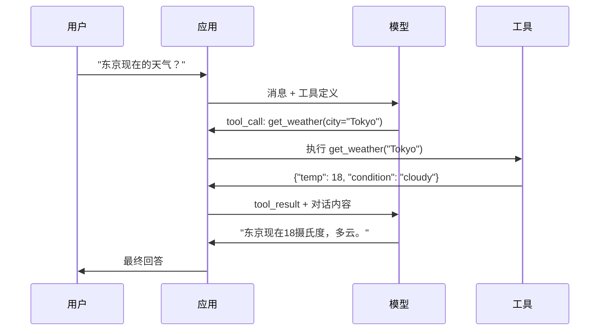

# 函数调用与工具使用

> 大语言模型（LLM，Large Language Models）本身不能做任何事情。它们只能生成文本。这就是它们全部的能力。它们不能查询天气、查询数据库、发送邮件、运行代码或读取文件。你见到的每个“AI 代理”都是 LLM 生成 JSON，告诉应该调用哪个函数——然后你的代码实际调用该函数。模型是大脑，工具是手，函数调用是连接两者的神经系统。

**类型：** 构建  
**语言：** Python  
**前置知识：** 第11阶段第03课（结构化输出）  
**时长：** 约75分钟  
**相关内容：** 第11阶段·第14课（模型上下文协议，Model Context Protocol）——当工具跨主机共享时，从内联函数调用毕业到 MCP 服务器。本课覆盖内联调用情况，MCP 覆盖协议情况。

## 学习目标

- 实现函数调用循环：定义工具 schema，解析模型的工具调用 JSON，执行函数并返回结果
- 设计带有清晰描述和类型参数的工具 schema，使模型能可靠调用
- 构建多轮代理循环，链接多个函数调用以回答复杂查询
- 处理函数调用边界情况：并行调用、错误传播及防止无限循环调用

## 问题描述

你构建了一个聊天机器人。用户问：“东京现在的天气怎么样？”

模型回复：“我无法获得实时天气数据，但根据季节，东京大概是15摄氏度左右……”

这其实是披着免责声明的幻觉。模型不知道天气，也永远不会知道。天气每小时变化，模型的训练数据已经是几个月前的了。

正确答案需要调用 OpenWeatherMap API，获取当前温度并返回真实数据。模型不能调用 API，你的代码可以。缺少的部分是一个结构化协议，让模型能说“我需要调用天气 API，传入这些参数”，让代码执行并把结果反馈回来。

这就是函数调用。模型输出结构化 JSON，描述调用哪个函数和参数。你的应用执行函数，结果回到对话中，模型用该结果生成最终答案。

没有函数调用，LLM 就是百科全书。使用函数调用后，它们变成智能代理。

## 概念介绍

### 函数调用循环

每次工具使用交互遵循同样的五步循环。



第一步：用户发送消息。第二步：模型接收消息及工具定义（描述可用函数的 JSON Schema）。第三步：模型不直接回复文本，而是输出调用工具的结构化 JSON 对象，包含函数名及参数。第四步：代码执行此函数并捕获结果。第五步：结果返回给模型，模型拥有真实数据后生成最终答案。

模型从不执行任何函数。它只决定调用哪个函数、传入哪些参数。代码是真正的执行者。

### 工具定义：JSON Schema 合约

每个工具都由 JSON Schema 定义，告知模型该函数做什么，接收什么参数及参数类型。

```json
{
  "type": "function",
  "function": {
    "name": "get_weather",
    "description": "获取城市的当前天气。返回摄氏温度和天气状况。",
    "parameters": {
      "type": "object",
      "properties": {
        "city": {
          "type": "string",
          "description": "城市名称，例如 'Tokyo' 或 'San Francisco'"
        },
        "units": {
          "type": "string",
          "enum": ["celsius", "fahrenheit"],
          "description": "温度单位"
        }
      },
      "required": ["city"]
    }
  }
}
```

`description` 字段非常关键。模型会读取它判断何时及如何使用工具。描述含糊如“获取天气”往往导致工具选择效果差，不如“获取城市的当前天气。返回摄氏温度和天气状况。”准确。描述即是工具选择时的提示词。

### 提供商对比

每个主流提供商都支持函数调用，但 API 表现形式不同。

| 提供商       | API 参数              | 工具调用格式                | 并行调用        | 强制调用          |
|--------------|-----------------------|-----------------------------|-----------------|-------------------|
| OpenAI（GPT-5, o4） | `tools`               | `tool_calls[].function`      | 支持（单轮多次） | `tool_choice="required"` |
| Anthropic（Claude 4.6/4.7） | `tools`               | `content[].type="tool_use"`  | 支持（多块）     | `tool_choice={"type":"any"}` |
| Google（Gemini 3） | `function_declarations` | `functionCall`               | 支持            | `function_calling_config` |
| 开源权重（Llama 4, Qwen3, DeepSeek-V3） | Llama 4 原生 `tools`; 其他 Hermes 或 ChatML | 混合           | 视模型而定       | 基于提示或支持时用 `tool_choice` |

到2026年，三大闭源提供商趋于采用近乎相同的基于 JSON Schema 格式。Llama 4 提供与 OpenAI 兼容的原生 `tools` 字段。开源权重微调版本差异尚存——NousResearch 的 Hermes 格式最为常用。对于跨主机共享的工具，建议使用 MCP（第11阶段·第14课）而非内联函数调用，MCP 服务器对所有客户端共用。

### 工具调用策略：自动、必需、指定

你可以控制模型使用工具的时机。

**自动**（默认）：模型判断是否调用工具还是直接回复。"2+2等于多少？"直接回答；"天气怎样？"调用工具。

**必需**：模型必须至少调用一个工具。适合你知道用户意图必需工具时，防止模型猜测而非查询真实数据。

**指定函数**：强制模型调用特定函数。`tool_choice={"type":"function", "function": {"name": "get_weather"}}` 保证一定调用天气工具，不论查询内容。适合路由场景，上游逻辑已确定所需工具。

### 并行函数调用

GPT-4o 和 Claude 支持单轮调用多个函数。用户问：“东京和纽约的天气怎么样？”模型同时输出两个工具调用：

```json
[
  {"name": "get_weather", "arguments": {"city": "Tokyo"}},
  {"name": "get_weather", "arguments": {"city": "New York"}}
]
```

你的代码并行执行两个调用，返回两个结果，模型合成单条回复。这将往返次数从2次降至1次。对于每个查询要5-10次调用的代理，并行调用能降低60%-80%延迟。

### 结构化输出vs函数调用

第03课讲过结构化输出，函数调用也用相同的 JSON Schema 机制，但目的不同。

**结构化输出**：强制模型生成符合特定格式的数据。输出即终稿。例如，从文本提取 `{name, price, in_stock}` 产品信息。

**函数调用**：模型声明执行某个动作的意图。输出只是中间步骤。例如 `get_weather(city="Tokyo")` 表示模型请求动作，不是最终答案。

想做数据抽取用结构化输出，要让模型与外部系统交互则用函数调用。

### 安全规则：绝不妥协

函数调用是授予 LLM 最危险的能力。模型选定执行内容。如果工具集包含数据库查询，模型构造查询；包含 shell 命令，模型编写命令。

**规则1：绝不将模型生成的 SQL 直接执行到数据库。** 模型可能生成 DROP TABLE、UNION 注入或返回所有记录的查询。必须使用参数化查询，严格验证，使用操作白名单。

**规则2：白名单函数。** 模型只能调用你明确定义的函数。绝不要构造“按名称执行任意函数”的泛用工具。若有50个内部函数，只暴露用户需用的5个。

**规则3：验证参数。** 模型可能传入 `"; DROP TABLE users; --"` 等恶意字符串。执行前对参数的类型、范围及格式严格验证。

**规则4：过滤工具结果。** 若工具返回敏感数据（API key、个人信息、内部错误），发送给模型前必须过滤。模型在回复中会原样引用工具结果。

**规则5：限制工具调用频率。** 模型循环调用工具可能上百次。设定上限（每次会话10-20次合理），防止无限循环。

### 错误处理

工具会失败。API 超时。数据库宕机。文件不存在。模型需知道工具失败及原因。

将错误作为结构化工具结果返回，而非异常：

```json
{
  "error": true,
  "message": "未找到城市 'Toky'。你是否指 'Tokyo'？",
  "code": "CITY_NOT_FOUND"
}
```

模型读懂它，调整参数重试。模型擅长从结构化错误消息自我修正，不擅长从空响应或模糊的“某些地方出错”消息恢复。

### MCP：模型上下文协议

MCP 是 Anthropic 的工具互操作开放标准。不是每个应用都定义自己的工具，而是 MCP 服务器统一提供工具，MCP 客户端（如 Claude Code、Cursor 或你自己的应用）共享使用。

一个 MCP 服务器能向所有兼容客户端暴露工具。比如 Postgres MCP 服务器让任何 MCP 兼容代理都能访问数据库，GitHub MCP 服务器提供仓库访问。工具定义一次，全处通用。

MCP 相当于函数调用的 HTTP，是运输层标准化，令工具实现可移植。

## 实践操作

### 步骤1：定义工具注册表

构建注册表存储工具定义及其实现。每个工具含 JSON Schema 定义（模型视图）和 Python 函数（代码执行）。

```python
import json
import math
import time
import hashlib


TOOL_REGISTRY = {}


def register_tool(name, description, parameters, function):
    TOOL_REGISTRY[name] = {
        "definition": {
            "type": "function",
            "function": {
                "name": name,
                "description": description,
                "parameters": parameters,
            },
        },
        "function": function,
    }
```

### 步骤2：实现5个工具

构建计算器、天气查询、网页搜索模拟器、文件读取器和代码执行器。

```python
def calculator(expression, precision=2):
    allowed = set("0123456789+-*/.() ")
    if not all(c in allowed for c in expression):
        return {"error": True, "message": f"表达式包含无效字符: {expression}"}
    try:
        result = eval(expression, {"__builtins__": {}}, {"math": math})
        return {"result": round(float(result), precision), "expression": expression}
    except Exception as e:
        return {"error": True, "message": str(e)}


WEATHER_DB = {
    "tokyo": {"temp_c": 18, "condition": "cloudy", "humidity": 72, "wind_kph": 14},
    "new york": {"temp_c": 22, "condition": "sunny", "humidity": 45, "wind_kph": 8},
    "london": {"temp_c": 12, "condition": "rainy", "humidity": 88, "wind_kph": 22},
    "san francisco": {"temp_c": 16, "condition": "foggy", "humidity": 80, "wind_kph": 18},
    "sydney": {"temp_c": 25, "condition": "sunny", "humidity": 55, "wind_kph": 10},
}


def get_weather(city, units="celsius"):
    key = city.lower().strip()
    if key not in WEATHER_DB:
        suggestions = [c for c in WEATHER_DB if c.startswith(key[:3])]
        return {
            "error": True,
            "message": f"未找到城市 '{city}'。",
            "suggestions": suggestions,
            "code": "CITY_NOT_FOUND",
        }
    data = WEATHER_DB[key].copy()
    if units == "fahrenheit":
        data["temp_f"] = round(data["temp_c"] * 9 / 5 + 32, 1)
        del data["temp_c"]
    data["city"] = city
    return data


SEARCH_DB = {
    "python function calling": [
        {"title": "OpenAI Function Calling Guide", "url": "https://platform.openai.com/docs/guides/function-calling", "snippet": "学习如何将 LLM 连接到外部工具。"},
        {"title": "Anthropic Tool Use", "url": "https://docs.anthropic.com/en/docs/tool-use", "snippet": "Claude 可与外部工具及 API 交互。"},
    ],
    "MCP protocol": [
        {"title": "Model Context Protocol", "url": "https://modelcontextprotocol.io", "snippet": "连接 AI 模型与数据源的开放标准。"},
    ],
    "weather API": [
        {"title": "OpenWeatherMap API", "url": "https://openweathermap.org/api", "snippet": "提供当前天气、预报及历史数据的免费天气 API。"},
    ],
}


def web_search(query, max_results=3):
    key = query.lower().strip()
    for db_key, results in SEARCH_DB.items():
        if db_key in key or key in db_key:
            return {"query": query, "results": results[:max_results], "total": len(results)}
    return {"query": query, "results": [], "total": 0}


FILE_SYSTEM = {
    "data/config.json": '{"model": "gpt-4o", "temperature": 0.7, "max_tokens": 4096}',
    "data/users.csv": "name,email,role\nAlice,alice@example.com,admin\nBob,bob@example.com,user",
    "README.md": "# My Project\n一个从零构建的工具使用代理。",
}


def read_file(path):
    if ".." in path or path.startswith("/"):
        return {"error": True, "message": "禁止路径穿越。", "code": "FORBIDDEN"}
    if path not in FILE_SYSTEM:
        available = list(FILE_SYSTEM.keys())
        return {"error": True, "message": f"未找到文件 '{path}'。", "available_files": available, "code": "NOT_FOUND"}
    content = FILE_SYSTEM[path]
    return {"path": path, "content": content, "size_bytes": len(content), "lines": content.count("\n") + 1}


def run_code(code, language="python"):
    if language != "python":
        return {"error": True, "message": f"语言 '{language}' 不支持。目前仅支持 'python'。"}
    forbidden = ["import os", "import sys", "import subprocess", "exec(", "eval(", "__import__", "open("]
    for pattern in forbidden:
        if pattern in code:
            return {"error": True, "message": f"禁止操作：{pattern}", "code": "SECURITY_VIOLATION"}
    try:
        local_vars = {}
        exec(code, {"__builtins__": {"print": print, "range": range, "len": len, "str": str, "int": int, "float": float, "list": list, "dict": dict, "sum": sum, "min": min, "max": max, "abs": abs, "round": round, "sorted": sorted, "enumerate": enumerate, "zip": zip, "map": map, "filter": filter, "math": math}}, local_vars)
        result = local_vars.get("result", None)
        return {"success": True, "result": result, "variables": {k: str(v) for k, v in local_vars.items() if not k.startswith("_")}}
    except Exception as e:
        return {"error": True, "message": f"{type(e).__name__}: {e}"}
```

### 第3步：注册所有工具

```python
def register_all_tools():
    register_tool(
        "calculator", "Evaluate a mathematical expression. Supports +, -, *, /, parentheses, and decimals. Returns the numeric result.",
        {"type": "object", "properties": {"expression": {"type": "string", "description": "Math expression, e.g. '(10 + 5) * 3'"}, "precision": {"type": "integer", "description": "Decimal places in result", "default": 2}}, "required": ["expression"]},
        calculator,
    )
    register_tool(
        "get_weather", "Get current weather for a city. Returns temperature, condition, humidity, and wind speed.",
        {"type": "object", "properties": {"city": {"type": "string", "description": "City name, e.g. 'Tokyo' or 'San Francisco'"}, "units": {"type": "string", "enum": ["celsius", "fahrenheit"], "description": "Temperature units, defaults to celsius"}}, "required": ["city"]},
        get_weather,
    )
    register_tool(
        "web_search", "Search the web for information. Returns a list of results with title, URL, and snippet.",
        {"type": "object", "properties": {"query": {"type": "string", "description": "Search query"}, "max_results": {"type": "integer", "description": "Maximum results to return", "default": 3}}, "required": ["query"]},
        web_search,
    )
    register_tool(
        "read_file", "Read the contents of a file. Returns the file content, size, and line count.",
        {"type": "object", "properties": {"path": {"type": "string", "description": "Relative file path, e.g. 'data/config.json'"}}, "required": ["path"]},
        read_file,
    )
    register_tool(
        "run_code", "Execute Python code in a sandboxed environment. Set a 'result' variable to return output.",
        {"type": "object", "properties": {"code": {"type": "string", "description": "Python code to execute"}, "language": {"type": "string", "enum": ["python"], "description": "Programming language"}}, "required": ["code"]},
        run_code,
    )
```

### 第4步：构建函数调用循环

这是核心引擎。它模拟模型决定调用哪个工具，执行该工具，并将结果反馈回来。

```python
def simulate_model_decision(user_message, tools, conversation_history):
    msg = user_message.lower()

    if any(word in msg for word in ["weather", "temperature", "forecast"]):
        cities = []
        for city in WEATHER_DB:
            if city in msg:
                cities.append(city)
        if not cities:
            for word in msg.split():
                if word.capitalize() in [c.title() for c in WEATHER_DB]:
                    cities.append(word)
        if not cities:
            cities = ["tokyo"]
        calls = []
        for city in cities:
            calls.append({"name": "get_weather", "arguments": {"city": city.title()}})
        return calls

    if any(word in msg for word in ["calculate", "compute", "math", "what is", "how much"]):
        for token in msg.split():
            if any(c in token for c in "+-*/"):
                return [{"name": "calculator", "arguments": {"expression": token}}]
        if "+" in msg or "-" in msg or "*" in msg or "/" in msg:
            expr = "".join(c for c in msg if c in "0123456789+-*/.() ")
            if expr.strip():
                return [{"name": "calculator", "arguments": {"expression": expr.strip()}}]
        return [{"name": "calculator", "arguments": {"expression": "0"}}]

    if any(word in msg for word in ["search", "find", "look up", "google"]):
        query = msg.replace("search for", "").replace("look up", "").replace("find", "").strip()
        return [{"name": "web_search", "arguments": {"query": query}}]

    if any(word in msg for word in ["read", "file", "open", "cat", "show"]):
        for path in FILE_SYSTEM:
            if path.split("/")[-1].split(".")[0] in msg:
                return [{"name": "read_file", "arguments": {"path": path}}]
        return [{"name": "read_file", "arguments": {"path": "README.md"}}]

    if any(word in msg for word in ["run", "execute", "code", "python"]):
        return [{"name": "run_code", "arguments": {"code": "result = 'Hello from the sandbox!'", "language": "python"}}]

    return []


def execute_tool_call(tool_call):
    name = tool_call["name"]
    args = tool_call["arguments"]

    if name not in TOOL_REGISTRY:
        return {"error": True, "message": f"Unknown tool: {name}", "code": "UNKNOWN_TOOL"}

    tool = TOOL_REGISTRY[name]
    func = tool["function"]
    start = time.time()

    try:
        result = func(**args)
    except TypeError as e:
        result = {"error": True, "message": f"Invalid arguments: {e}"}

    elapsed_ms = round((time.time() - start) * 1000, 2)
    return {"tool": name, "result": result, "execution_time_ms": elapsed_ms}


def run_function_calling_loop(user_message, max_iterations=5):
    conversation = [{"role": "user", "content": user_message}]
    tool_definitions = [t["definition"] for t in TOOL_REGISTRY.values()]
    all_tool_results = []

    for iteration in range(max_iterations):
        tool_calls = simulate_model_decision(user_message, tool_definitions, conversation)

        if not tool_calls:
            break

        results = []
        for call in tool_calls:
            result = execute_tool_call(call)
            results.append(result)

        conversation.append({"role": "assistant", "content": None, "tool_calls": tool_calls})

        for result in results:
            conversation.append({"role": "tool", "content": json.dumps(result["result"]), "tool_name": result["tool"]})

        all_tool_results.extend(results)
        break

    return {"conversation": conversation, "tool_results": all_tool_results, "iterations": iteration + 1 if tool_calls else 0}
```

### 第5步：参数验证

构建一个验证器，用于在执行前检查工具调用参数是否符合 JSON Schema。

```python
def validate_tool_arguments(tool_name, arguments):
    if tool_name not in TOOL_REGISTRY:
        return [f"Unknown tool: {tool_name}"]

    schema = TOOL_REGISTRY[tool_name]["definition"]["function"]["parameters"]
    errors = []

    if not isinstance(arguments, dict):
        return [f"Arguments must be an object, got {type(arguments).__name__}"]

    for required_field in schema.get("required", []):
        if required_field not in arguments:
            errors.append(f"Missing required argument: {required_field}")

    properties = schema.get("properties", {})
    for arg_name, arg_value in arguments.items():
        if arg_name not in properties:
            errors.append(f"Unknown argument: {arg_name}")
            continue

        prop_schema = properties[arg_name]
        expected_type = prop_schema.get("type")

        type_checks = {"string": str, "integer": int, "number": (int, float), "boolean": bool, "array": list, "object": dict}
        if expected_type in type_checks:
            if not isinstance(arg_value, type_checks[expected_type]):
                errors.append(f"Argument '{arg_name}': expected {expected_type}, got {type(arg_value).__name__}")

        if "enum" in prop_schema and arg_value not in prop_schema["enum"]:
            errors.append(f"Argument '{arg_name}': '{arg_value}' not in {prop_schema['enum']}")

    return errors
```

### 第6步：运行演示

```python
def run_demo():
    register_all_tools()

    print("=" * 60)
    print("  Function Calling & Tool Use Demo")
    print("=" * 60)

    print("\n--- Registered Tools ---")
    for name, tool in TOOL_REGISTRY.items():
        desc = tool["definition"]["function"]["description"][:60]
        params = list(tool["definition"]["function"]["parameters"].get("properties", {}).keys())
        print(f"  {name}: {desc}...")
        print(f"    params: {params}")

    print(f"\n--- Argument Validation ---")
    validation_tests = [
        ("get_weather", {"city": "Tokyo"}, "Valid call"),
        ("get_weather", {}, "Missing required arg"),
        ("get_weather", {"city": "Tokyo", "units": "kelvin"}, "Invalid enum value"),
        ("calculator", {"expression": 123}, "Wrong type (int for string)"),
        ("unknown_tool", {"x": 1}, "Unknown tool"),
    ]
    for tool_name, args, label in validation_tests:
        errors = validate_tool_arguments(tool_name, args)
        status = "VALID" if not errors else f"ERRORS: {errors}"
        print(f"  {label}: {status}")

    print(f"\n--- Tool Execution ---")
    direct_tests = [
        {"name": "calculator", "arguments": {"expression": "(10 + 5) * 3 / 2"}},
        {"name": "get_weather", "arguments": {"city": "Tokyo"}},
        {"name": "get_weather", "arguments": {"city": "Mars"}},
        {"name": "web_search", "arguments": {"query": "python function calling"}},
        {"name": "read_file", "arguments": {"path": "data/config.json"}},
        {"name": "read_file", "arguments": {"path": "../etc/passwd"}},
        {"name": "run_code", "arguments": {"code": "result = sum(range(1, 101))"}},
        {"name": "run_code", "arguments": {"code": "import os; os.system('rm -rf /')"}},
    ]
    for call in direct_tests:
        result = execute_tool_call(call)
        print(f"\n  {call['name']}({json.dumps(call['arguments'])})")
        print(f"    -> {json.dumps(result['result'], indent=None)[:100]}")
        print(f"    time: {result['execution_time_ms']}ms")

    print(f"\n--- Full Function Calling Loop ---")
    test_queries = [
        "What's the weather in Tokyo?",
        "Calculate (100 + 250) * 0.15",
        "Search for MCP protocol",
        "Read the config file",
        "Run some Python code",
        "Tell me a joke",
    ]
    for query in test_queries:
        print(f"\n  User: {query}")
        result = run_function_calling_loop(query)
        if result["tool_results"]:
            for tr in result["tool_results"]:
                print(f"    Tool: {tr['tool']} ({tr['execution_time_ms']}ms)")
                print(f"    Result: {json.dumps(tr['result'], indent=None)[:90]}")
        else:
            print(f"    [No tool called -- direct response]")
        print(f"    Iterations: {result['iterations']}")

    print(f"\n--- Parallel Tool Calls ---")
    multi_city_query = "What's the weather in tokyo and london?"
    print(f"  User: {multi_city_query}")
    result = run_function_calling_loop(multi_city_query)
    print(f"  Tool calls made: {len(result['tool_results'])}")
    for tr in result["tool_results"]:
        city = tr["result"].get("city", "unknown")
        temp = tr["result"].get("temp_c", "N/A")
        print(f"    {city}: {temp}C, {tr['result'].get('condition', 'N/A')}")

    print(f"\n--- Security Checks ---")
    security_tests = [
        ("read_file", {"path": "../../etc/passwd"}),
        ("run_code", {"code": "import subprocess; subprocess.run(['ls'])"}),
        ("calculator", {"expression": "__import__('os').system('ls')"}),
    ]
    for tool_name, args in security_tests:
        result = execute_tool_call({"name": tool_name, "arguments": args})
        blocked = result["result"].get("error", False)
        print(f"  {tool_name}({list(args.values())[0][:40]}): {'BLOCKED' if blocked else 'ALLOWED'}")
```

## 使用方法

### OpenAI 函数调用（Function Calling）

```python
# from openai import OpenAI
#
# client = OpenAI()
#
# tools = [{
#     "type": "function",
#     "function": {
#         "name": "get_weather",
#         "description": "获取某城市的当前天气",
#         "parameters": {
#             "type": "object",
#             "properties": {
#                 "city": {"type": "string"},
#                 "units": {"type": "string", "enum": ["celsius", "fahrenheit"]}
#             },
#             "required": ["city"]
#         }
#     }
# }]
#
# response = client.chat.completions.create(
#     model="gpt-4o",
#     messages=[{"role": "user", "content": "Tokyo 的天气如何？"}],
#     tools=tools,
#     tool_choice="auto",
# )
#
# tool_call = response.choices[0].message.tool_calls[0]
# args = json.loads(tool_call.function.arguments)
# result = get_weather(**args)
#
# final = client.chat.completions.create(
#     model="gpt-4o",
#     messages=[
#         {"role": "user", "content": "Tokyo 的天气如何？"},
#         response.choices[0].message,
#         {"role": "tool", "tool_call_id": tool_call.id, "content": json.dumps(result)},
#     ],
# )
# print(final.choices[0].message.content)
```

OpenAI 将工具调用返回为 `response.choices[0].message.tool_calls`。每个调用都有一个 `id`，返回结果时必须包含该 ID，模型使用此 ID 来匹配结果与调用。GPT-4o 可以在单个响应中返回多个工具调用 —— 需要遍历并执行所有调用。

### Anthropic 工具使用

```python
# import anthropic
#
# client = anthropic.Anthropic()
#
# response = client.messages.create(
#     model="claude-sonnet-4-20250514",
#     max_tokens=1024,
#     tools=[{
#         "name": "get_weather",
#         "description": "获取某城市的当前天气",
#         "input_schema": {
#             "type": "object",
#             "properties": {
#                 "city": {"type": "string"},
#                 "units": {"type": "string", "enum": ["celsius", "fahrenheit"]}
#             },
#             "required": ["city"]
#         }
#     }],
#     messages=[{"role": "user", "content": "Tokyo 的天气如何？"}],
# )
#
# tool_block = next(b for b in response.content if b.type == "tool_use")
# result = get_weather(**tool_block.input)
#
# final = client.messages.create(
#     model="claude-sonnet-4-20250514",
#     max_tokens=1024,
#     tools=[...],
#     messages=[
#         {"role": "user", "content": "Tokyo 的天气如何？"},
#         {"role": "assistant", "content": response.content},
#         {"role": "user", "content": [{"type": "tool_result", "tool_use_id": tool_block.id, "content": json.dumps(result)}]},
#     ],
# )
```

Anthropic 将工具调用返回为内容块，`type` 为 `"tool_use"`。工具结果则放在用户消息中，`type` 为 `"tool_result"`。注意关键区别：Anthropic 使用 `input_schema` 来定义工具参数，而 OpenAI 使用 `parameters`。

### MCP 集成

```python
# MCP 服务器通过标准协议暴露工具。
# 任何兼容 MCP 的客户端都能发现并调用这些工具。
#
# 例子：连接到一个 Postgres MCP 服务器
#
# from mcp import ClientSession, StdioServerParameters
# from mcp.client.stdio import stdio_client
#
# server_params = StdioServerParameters(
#     command="npx",
#     args=["-y", "@modelcontextprotocol/server-postgres", "postgresql://localhost/mydb"],
# )
#
# async with stdio_client(server_params) as (read, write):
#     async with ClientSession(read, write) as session:
#         await session.initialize()
#         tools = await session.list_tools()
#         result = await session.call_tool("query", {"sql": "SELECT count(*) FROM users"})
```

MCP 将工具实现与工具使用解耦。Postgres 服务器懂 SQL，GitHub 服务器懂 API。你的智能体只需发现并调用工具，不必为每个集成编写提供商特定代码。

## 交付（Ship It）

本课生成以下文件：

- `outputs/prompt-tool-designer.md` —— 用于设计工具定义的可复用提示模板。给它一个工具功能描述，它会生成含说明、类型和约束的完整 JSON Schema 定义。
- `outputs/skill-function-calling-patterns.md` —— 实现函数调用的生产决策框架，涵盖工具设计、错误处理、安全和供应商特定模式。

## 练习

1. **增加第6个工具：数据库查询。** 实现一个带内存表的模拟 SQL 工具。工具接收表名和过滤条件（非原始 SQL）。验证表名必须在白名单中，过滤条件操作符限制为 `=`, `>`, `<`, `>=`, `<=`。返回匹配行的 JSON。

2. **实现带错误反馈的重试。** 当工具调用失败（例如城市未找到）时，将错误消息反馈给模型决策函数，允许它修正参数。跟踪每次调用的重试次数，最多允许每次调用重试 3 次。

3. **构建多步骤智能体。** 某些查询需要串联工具调用：“读取配置文件，告诉我配置的模型，然后网上查询该模型的价格。” 实现一个循环，直到模型决定不再需要更多工具，且每步传入累积结果。限制最多 10 次迭代，防止无限循环。

4. **测量工具选择准确率。** 制作 30 个带预期工具名称的测试查询。对全部查询运行决策函数，测量模型选对工具的比例。找出最易混淆的查询。

5. **实现工具调用缓存。** 若 60 秒内相同工具以相同参数调用，返回缓存结果而不是重新执行。使用以 `(tool_name, frozenset(args.items()))` 为键的字典。衡量一次包含 20 条查询的对话中的缓存命中率。

## 关键术语

| 术语 | 大家如何说 | 实际含义 |
|------|------------|----------|
| Function calling | “工具使用” | 模型输出结构化 JSON 描述要调用的函数及参数 —— 代码执行函数，而非模型执行 |
| Tool definition | “函数模式” | 描述工具名称、用途、参数和类型的 JSON Schema 对象 —— 模型读取它以决定如何使用工具 |
| Tool choice | “调用模式” | 控制模型必须调用工具（required）、可调用工具（auto）或必须调用指定工具（named） |
| Parallel calling | “多工具” | 模型在单轮输出多个工具调用，减少往返 —— GPT-4o 和 Claude 都支持 |
| Tool result | “函数输出” | 执行工具的返回值，作为消息返回给模型，让其利用真实数据响应 |
| Argument validation | “输入校验” | 验证模型生成的参数是否符合预期类型、范围和约束，确保调用安全 |
| MCP | “工具协议” | Model Context Protocol —— Anthropic 的开放标准，通过服务器暴露工具，任何兼容客户端均可调用 |
| Agent loop | “ReAct 循环” | 模型决策调用工具、代码执行工具、结果反馈循环，直到模型有足够信息响应 |
| Tool poisoning | “通过工具的提示注入” | 利用工具结果中包含的指令操控模型行为的攻击 —— 必须清洗所有工具输出 |
| Rate limiting | “调用预算” | 限制每次对话最大工具调用次数，防止无限循环和API费用失控 |

## 深入阅读

- [OpenAI 函数调用指南](https://platform.openai.com/docs/guides/function-calling) —— GPT-4o 工具使用权威参考，涵盖并行调用、强制调用和结构化参数
- [Anthropic 工具使用指南](https://docs.anthropic.com/en/docs/tool-use) —— Claude 的工具使用实现，含 input_schema、多工具响应与 tool_choice 配置
- [Model Context Protocol 规范](https://modelcontextprotocol.io) —— AI 应用之间工具互操作的开放标准，包含服务器/客户端架构
- [Schick 等，2023 —— “Toolformer: Language Models Can Teach Themselves to Use Tools”](https://arxiv.org/abs/2302.04761) —— LLM 自主决策何时如何调用外部工具的基础论文
- [Patil 等，2023 —— “Gorilla: Large Language Model Connected with Massive APIs”](https://arxiv.org/abs/2305.15334) —— 精调 LLM 以跨 1,645 个 API 准确调用并减少幻觉现象
- [伯克利函数调用排行榜](https://gorilla.cs.berkeley.edu/leaderboard.html) —— 实时基准，比较 GPT-4o、Claude、Gemini 和开源模型的函数调用准确度
- [Yao 等，“ReAct: Synergizing Reasoning and Acting in Language Models” (ICLR 2023)](https://arxiv.org/abs/2210.03629) —— 思考-行动-观察循环，是所有工具调用的外层智能体循环；本课结束处，Phase 14 开始处
- [Anthropic — 构建高效智能体（2024年12月）](https://www.anthropic.com/research/building-effective-agents) —— 基于单一工具使用原语构建的五种可组合模式（提示链、路由、并行、协调器-工人、评估-优化）
