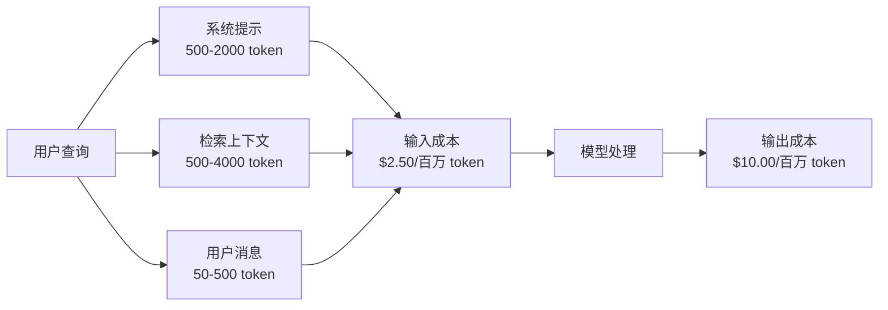
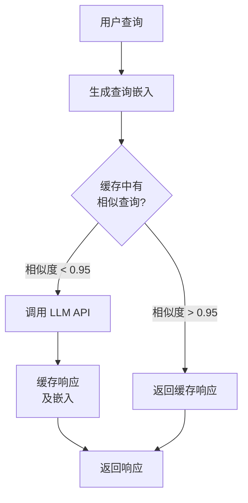
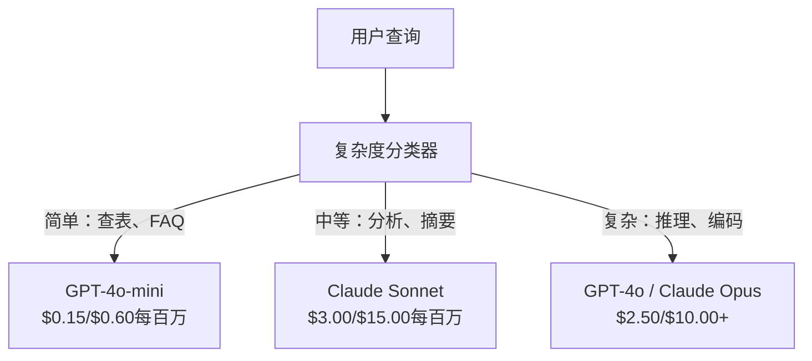

# 缓存（Caching）、限流（Rate Limiting）与成本优化（Cost Optimization）

> 大多数 AI 初创公司不是因为模型不好而失败。他们是因为单位经济学（unit economics）不好而死。一次 GPT-4o 调用费用仅为几分之一美分。每天一万用户各调用十次，单是输入 token 的费用就高达 250 美元——这还没开始收用户一分钱。真正能存活下来的公司，是那些把每次 API 调用都当做一笔财务交易，而不是函数调用的公司。

**类型：** 构建（Build）  
**语言：** Python  
**先决条件：** 第11阶段第09课（函数调用）  
**用时：** 约45分钟  
**相关内容：** 第11阶段 · 15课（提示缓存）——本课涵盖应用层缓存（语义缓存、精确哈希缓存、模型路由）。第15课涵盖提供商层的提示缓存（Anthropic cache_control，OpenAI 自动，Gemini CachedContent）。两者结合可实现 50-95% 的成本降低。

## 学习目标

- 实现语义缓存，用缓存响应重复或类似查询，避免新的 API 调用  
- 计算跨提供商的每次请求成本，实现基于 token 的限流和预算警报  
- 构建带有提示压缩、模型路由（昂贵 vs 便宜）和响应缓存的成本优化层  
- 设计分层缓存策略，结合精确匹配、语义相似度和前缀缓存，适应不同查询类型  

## 问题描述

你构建了一个 RAG 聊天机器人，一切运行良好，用户很喜欢。  
然后账单来了。

GPT-5 输入 token 价格为每百万 5 美元，输出 token 每百万 15 美元。Claude Opus 4.7 输入 15 美元 / 输出 75 美元。Gemini 3 Pro 输入 1.25 美元 / 输出 5 美元。GPT-5-mini 是 0.25/2 美元。以下价格仅作示例，务必查看提供商最新定价页面。

以下是杀死初创公司的恐怖数学：

- 每日活跃用户 10,000  
- 每用户每天 10 次查询  
- 每查询输入 token 1,000（系统提示 + 上下文 + 用户消息）  
- 每响应输出 token 500  

**每日输入成本：** 10,000 x 10 x 1,000 / 1,000,000 x $2.50 = **$250/天**  
**每日输出成本：** 10,000 x 10 x 500 / 1,000,000 x $10.00 = **$500/天**  
**月总成本：** **$22,500/月**

这仅是 LLM 成本。加上嵌入计算、向量数据库托管、基础设施，聊天机器人可能需要 30,000 美元/月。

残酷的事实是：40-60% 的查询是近重复的。用户用稍作更改的措辞提出相同的问题。系统提示在每次请求中均相同，都会计费。RAG 检索的上下文文档也在多个相同主题的用户中重复。

你为冗余计算支付了全价。

## 概念介绍

### LLM 调用的成本构成

每次 API 调用包含五个成本组件。



系统提示是无声的杀手。每次请求发送 1500 token 的系统提示，每百万请求仅该前缀成本 3.75 美元。每天 10 万请求，即 375 美元/天 —— 11,250 美元/月 —— 付费给永远不变的文本。

### 提供商缓存：内置折扣

2026 年，三大提供商均支持提供商侧提示缓存，但机制不同。详情见第11阶段 · 15课。

| 提供商      | 机制                         | 折扣          | 最小长度    | 缓存时长            |
|-------------|------------------------------|---------------|-------------|---------------------|
| Anthropic   | 显式 cache_control 标记       | 缓存命中 90%（写入多付 25%） | 1,024 tokens（Sonnet/Opus）、2,048（Haiku） | 默认 5 分钟；延长 1 小时（写入多付2倍） |
| OpenAI      | 自动前缀匹配                  | 缓存命中 50%  | 1,024 tokens | 尽力而为，最长 1 小时          |
| Google Gemini | 显式 CachedContent API         | 约 75% 降价（另加存储费）| 4,096（Flash）/ 32,768（Pro） | 用户可配置生存时间              |

**Anthropic 的方法**是显式的。你用 `cache_control: {"type": "ephemeral"}` 标记提示区块。首次请求支付 25% 额外写入费用，后续同前缀请求享 90% 折扣。2000 token 系统提示正常成本 0.005 美元，缓存命中时约 0.000625 美元。10 万请求每天节省 437.50 美元。

**OpenAI 的方法**是自动的。任何与之前请求前缀匹配的提示自动享 50% 折扣，无需标记。代价是折扣较少，控制较弱但实现极简。

### 语义缓存：你的定制层

提供商缓存仅针对完全相同的前缀有效。语义缓存解决更复杂问题：不同查询表达相同意图时。

“退货政策是什么？”与“如何退货？”语义不同，但意图相同。语义缓存对两者做向量嵌入，计算余弦相似度，如果超过 0.92-0.95 阈值，则返回缓存响应。



嵌入成本几乎可忽略。OpenAI text-embedding-3-small 每百万 tokens 仅 0.02 美元。查询缓存成本远低于调用完整 LLM。

### 精确缓存：哈希匹配

对于确定性调用（temperature=0，同模同提示），精确缓存更简单且更快。哈希整个提示，查询缓存，若命中则返回。

适用于：

- 系统提示 + 固定上下文 + 相同用户查询  
- 函数调用，工具定义相同  
- 批量处理同一文档多次  

### 限流机制：保护预算

限流不只是公平问题，更是存活问题。

**令牌桶算法（Token bucket）：** 每用户获分令牌桶，容量 N，按速率 R 恢复令牌。请求消耗令牌，桶空则拒绝请求。允许突发，控制平均速率。

**用户分级配额：** 设置不同用户层级每天/月度 token 限额。

| 层级      | 日 token 限额    | 最大请求/分钟  | 允许模型                 |
|-----------|-----------------|---------------|-------------------------|
| 免费      | 50,000          | 10            | GPT-4o-mini 仅            |
| 专业      | 500,000         | 60            | GPT-4o，Claude Sonnet    |
| 企业      | 5,000,000       | 300           | 所有模型                |

### 模型路由：合适模型，合适任务

非所有查询都需要 GPT-4o。

“商店几点关门？”无需用 10 美元/百万输出模型。GPT-4o-mini(0.60美元/百万输出) 或 Claude Haiku(1.25美元/百万输出) 足够。简单分类器把便宜请求送给便宜模型，复杂请求送贵模型。



精心调优路由器仅模型成本就节省 40-70%。

### 成本追踪：了解资金流向

无法优化你不测量的内容。记录每次 API 调用包括：

- 时间戳  
- 模型名称  
- 输入 token 数  
- 输出 token 数  
- 延迟（毫秒）  
- 计算成本（美元）  
- 用户 ID  
- 缓存命中/未命中  
- 请求类别  

这些数据揭示功能耗费，重度用户，缓存效果最强区域。

### 批量处理：批量折扣

OpenAI Batch API 异步处理且享 50% 折扣。最多可提交 5 万请求，结果 24 小时内返回。

适用于：

- 夜间文档处理  
- 批量分类  
- 评估运行  
- 数据增强管道  

不适用于实时用户查询（响应时间关键）。

### 预算警报与断路器

断路器在触达限制时停止花费。无断路器时，bug 或滥用可能数小时刷爆月预算。

设三阈值：

1. **警告**（预算 70%）：发送警报  
2. **限速**（预算 85%）：只切换低价模型  
3. **停止**（预算 95%）：拒绝新请求，仅返回缓存响应  

### 优化堆栈

按顺序应用以下技术。每层叠加节省。

| 层级 | 技术              | 典型节省   | 实现难度      |
|-------|------------------|------------|--------------|
| 1     | 提供商提示缓存     | 30-50%      | 低（加缓存标记） |
| 2     | 精确缓存          | 10-20%      | 低（哈希+字典）  |
| 3     | 语义缓存          | 15-30%      | 中等（嵌入+相似度） |
| 4     | 模型路由          | 40-70%      | 中等（分类器）   |
| 5     | 限流              | 预算保护    | 低（令牌桶）     |
| 6     | 提示压缩          | 10-30%      | 中等（重写提示） |
| 7     | 批量处理          | 50%（适用时）| 低（批量 API）   |

一个 RAG 应用采用层 1-5，可将成本从 $22,500/月降至 $4,000-6,000/月。区别就是烧钱跑道与构建企业。

### 真实节省对比

以下是真实 RAG 聊天机器人为 10,000 DAU 提供服务的成本细分。

| 指标               | 优化前          | 优化后          | 节省      |
|--------------------|----------------|----------------|----------|
| 月度 LLM 成本       | $22,500        | $5,200         | 77%       |
| 平均查询成本         | $0.0075        | $0.0017        | 77%       |
| 缓存命中率           | 0%             | 52%            | --       |
| 路由至 mini 模型查询比例 | 0%             | 65%            | --       |
| P95 延迟            | 2,800 毫秒     | 900 毫秒（缓存命中时 50 毫秒） | 68%       |
| 月度嵌入成本        | $0             | $180           | （新增成本） |
| 总月度成本           | $22,500        | $5,380         | 76%       |

语义缓存的嵌入成本（180 美元/月）在缓存命中第一小时内即已收回。

## 进行构建

### 步骤 1：成本计算器

构建一个 token 成本计算器，支持主要模型当前价格查询。

```python
import hashlib
import time
import json
import math
from dataclasses import dataclass, field


MODEL_PRICING = {
    "gpt-4o": {"input": 2.50, "output": 10.00, "cached_input": 1.25},
    "gpt-4o-mini": {"input": 0.15, "output": 0.60, "cached_input": 0.075},
    "gpt-4.1": {"input": 2.00, "output": 8.00, "cached_input": 0.50},
    "gpt-4.1-mini": {"input": 0.40, "output": 1.60, "cached_input": 0.10},
    "gpt-4.1-nano": {"input": 0.10, "output": 0.40, "cached_input": 0.025},
    "o3": {"input": 2.00, "output": 8.00, "cached_input": 0.50},
    "o3-mini": {"input": 1.10, "output": 4.40, "cached_input": 0.55},
    "o4-mini": {"input": 1.10, "output": 4.40, "cached_input": 0.275},
    "claude-opus-4": {"input": 15.00, "output": 75.00, "cached_input": 1.50},
    "claude-sonnet-4": {"input": 3.00, "output": 15.00, "cached_input": 0.30},
    "claude-haiku-3.5": {"input": 0.80, "output": 4.00, "cached_input": 0.08},
    "gemini-2.5-pro": {"input": 1.25, "output": 10.00, "cached_input": 0.3125},
    "gemini-2.5-flash": {"input": 0.15, "output": 0.60, "cached_input": 0.0375},
}


def calculate_cost(model, input_tokens, output_tokens, cached_input_tokens=0):
    if model not in MODEL_PRICING:
        return {"error": f"Unknown model: {model}"}
    pricing = MODEL_PRICING[model]
    non_cached = input_tokens - cached_input_tokens
    input_cost = (non_cached / 1_000_000) * pricing["input"]
    cached_cost = (cached_input_tokens / 1_000_000) * pricing["cached_input"]
    output_cost = (output_tokens / 1_000_000) * pricing["output"]
    total = input_cost + cached_cost + output_cost
    return {
        "model": model,
        "input_tokens": input_tokens,
        "output_tokens": output_tokens,
        "cached_input_tokens": cached_input_tokens,
        "input_cost": round(input_cost, 6),
        "cached_input_cost": round(cached_cost, 6),
        "output_cost": round(output_cost, 6),
        "total_cost": round(total, 6),
    }
```

### 第 2 步：精确缓存

对完整提示（prompt）进行哈希，并对相同请求返回缓存响应。

```python
class ExactCache:
    def __init__(self, max_size=1000, ttl_seconds=3600):
        self.cache = {}
        self.max_size = max_size
        self.ttl = ttl_seconds
        self.hits = 0
        self.misses = 0

    def _hash(self, model, messages, temperature):
        key_data = json.dumps({"model": model, "messages": messages, "temperature": temperature}, sort_keys=True)
        return hashlib.sha256(key_data.encode()).hexdigest()

    def get(self, model, messages, temperature=0.0):
        if temperature > 0:
            self.misses += 1
            return None
        key = self._hash(model, messages, temperature)
        if key in self.cache:
            entry = self.cache[key]
            if time.time() - entry["timestamp"] < self.ttl:
                self.hits += 1
                entry["access_count"] += 1
                return entry["response"]
            del self.cache[key]
        self.misses += 1
        return None

    def put(self, model, messages, temperature, response):
        if temperature > 0:
            return
        if len(self.cache) >= self.max_size:
            oldest_key = min(self.cache, key=lambda k: self.cache[k]["timestamp"])
            del self.cache[oldest_key]
        key = self._hash(model, messages, temperature)
        self.cache[key] = {
            "response": response,
            "timestamp": time.time(),
            "access_count": 1,
        }

    def stats(self):
        total = self.hits + self.misses
        return {
            "hits": self.hits,
            "misses": self.misses,
            "hit_rate": round(self.hits / total, 4) if total > 0 else 0,
            "cache_size": len(self.cache),
        }
```

### 第 3 步：语义缓存

对查询进行嵌入（embedding），当相似度超过阈值时返回缓存响应。

```python
def simple_embed(text):
    words = text.lower().split()
    vocab = {}
    for w in words:
        vocab[w] = vocab.get(w, 0) + 1
    norm = math.sqrt(sum(v * v for v in vocab.values()))
    if norm == 0:
        return {}
    return {k: v / norm for k, v in vocab.items()}


def cosine_similarity(a, b):
    if not a or not b:
        return 0.0
    all_keys = set(a) | set(b)
    dot = sum(a.get(k, 0) * b.get(k, 0) for k in all_keys)
    return dot


class SemanticCache:
    def __init__(self, similarity_threshold=0.85, max_size=500, ttl_seconds=3600):
        self.entries = []
        self.threshold = similarity_threshold
        self.max_size = max_size
        self.ttl = ttl_seconds
        self.hits = 0
        self.misses = 0

    def get(self, query):
        query_embedding = simple_embed(query)
        now = time.time()
        best_match = None
        best_sim = 0.0
        for entry in self.entries:
            if now - entry["timestamp"] > self.ttl:
                continue
            sim = cosine_similarity(query_embedding, entry["embedding"])
            if sim > best_sim:
                best_sim = sim
                best_match = entry
        if best_match and best_sim >= self.threshold:
            self.hits += 1
            best_match["access_count"] += 1
            return {"response": best_match["response"], "similarity": round(best_sim, 4), "original_query": best_match["query"]}
        self.misses += 1
        return None

    def put(self, query, response):
        if len(self.entries) >= self.max_size:
            self.entries.sort(key=lambda e: e["timestamp"])
            self.entries.pop(0)
        self.entries.append({
            "query": query,
            "embedding": simple_embed(query),
            "response": response,
            "timestamp": time.time(),
            "access_count": 1,
        })

    def stats(self):
        total = self.hits + self.misses
        return {
            "hits": self.hits,
            "misses": self.misses,
            "hit_rate": round(self.hits / total, 4) if total > 0 else 0,
            "cache_size": len(self.entries),
        }
```

### 第 4 步：速率限制器

基于令牌桶（token bucket）的每用户配额速率限制器。

```python
class TokenBucketRateLimiter:
    def __init__(self):
        self.buckets = {}
        self.tiers = {
            "free": {"capacity": 50_000, "refill_rate": 500, "max_requests_per_min": 10},
            "pro": {"capacity": 500_000, "refill_rate": 5_000, "max_requests_per_min": 60},
            "enterprise": {"capacity": 5_000_000, "refill_rate": 50_000, "max_requests_per_min": 300},
        }

    def _get_bucket(self, user_id, tier="free"):
        if user_id not in self.buckets:
            tier_config = self.tiers.get(tier, self.tiers["free"])
            self.buckets[user_id] = {
                "tokens": tier_config["capacity"],
                "capacity": tier_config["capacity"],
                "refill_rate": tier_config["refill_rate"],
                "last_refill": time.time(),
                "request_timestamps": [],
                "max_rpm": tier_config["max_requests_per_min"],
                "tier": tier,
                "total_tokens_used": 0,
            }
        return self.buckets[user_id]

    def _refill(self, bucket):
        now = time.time()
        elapsed = now - bucket["last_refill"]
        refill = int(elapsed * bucket["refill_rate"])
        if refill > 0:
            bucket["tokens"] = min(bucket["capacity"], bucket["tokens"] + refill)
            bucket["last_refill"] = now

    def check(self, user_id, tokens_needed, tier="free"):
        bucket = self._get_bucket(user_id, tier)
        self._refill(bucket)
        now = time.time()
        bucket["request_timestamps"] = [t for t in bucket["request_timestamps"] if now - t < 60]
        if len(bucket["request_timestamps"]) >= bucket["max_rpm"]:
            return {"allowed": False, "reason": "rate_limit", "retry_after_seconds": 60 - (now - bucket["request_timestamps"][0])}
        if bucket["tokens"] < tokens_needed:
            deficit = tokens_needed - bucket["tokens"]
            wait = deficit / bucket["refill_rate"]
            return {"allowed": False, "reason": "token_limit", "tokens_available": bucket["tokens"], "retry_after_seconds": round(wait, 1)}
        return {"allowed": True, "tokens_available": bucket["tokens"]}

    def consume(self, user_id, tokens_used, tier="free"):
        bucket = self._get_bucket(user_id, tier)
        bucket["tokens"] -= tokens_used
        bucket["request_timestamps"].append(time.time())
        bucket["total_tokens_used"] += tokens_used

    def get_usage(self, user_id):
        if user_id not in self.buckets:
            return {"error": "User not found"}
        b = self.buckets[user_id]
        return {
            "user_id": user_id,
            "tier": b["tier"],
            "tokens_remaining": b["tokens"],
            "capacity": b["capacity"],
            "total_tokens_used": b["total_tokens_used"],
            "utilization": round(b["total_tokens_used"] / b["capacity"], 4) if b["capacity"] else 0,
        }
```

### 第 5 步：成本追踪

记录每次调用并计算累计总额。

```python
class CostTracker:
    def __init__(self, monthly_budget=1000.0):
        self.logs = []
        self.monthly_budget = monthly_budget
        self.alerts = []

    def log_call(self, model, input_tokens, output_tokens, cached_input_tokens=0, latency_ms=0, user_id="anonymous", cache_status="miss"):
        cost = calculate_cost(model, input_tokens, output_tokens, cached_input_tokens)
        entry = {
            "timestamp": time.time(),
            "model": model,
            "input_tokens": input_tokens,
            "output_tokens": output_tokens,
            "cached_input_tokens": cached_input_tokens,
            "latency_ms": latency_ms,
            "cost": cost["total_cost"],
            "user_id": user_id,
            "cache_status": cache_status,
        }
        self.logs.append(entry)
        self._check_budget()
        return entry

    def _check_budget(self):
        total = self.total_cost()
        pct = total / self.monthly_budget if self.monthly_budget > 0 else 0
        if pct >= 0.95 and not any(a["level"] == "stop" for a in self.alerts):
            self.alerts.append({"level": "stop", "message": f"预算已耗费95%: ${total:.2f}/${self.monthly_budget:.2f}", "timestamp": time.time()})
        elif pct >= 0.85 and not any(a["level"] == "throttle" for a in self.alerts):
            self.alerts.append({"level": "throttle", "message": f"预算已耗费85%: ${total:.2f}/${self.monthly_budget:.2f}", "timestamp": time.time()})
        elif pct >= 0.70 and not any(a["level"] == "warning" for a in self.alerts):
            self.alerts.append({"level": "warning", "message": f"预算已耗费70%: ${total:.2f}/${self.monthly_budget:.2f}", "timestamp": time.time()})

    def total_cost(self):
        return round(sum(e["cost"] for e in self.logs), 6)

    def cost_by_model(self):
        by_model = {}
        for e in self.logs:
            m = e["model"]
            if m not in by_model:
                by_model[m] = {"calls": 0, "cost": 0, "input_tokens": 0, "output_tokens": 0}
            by_model[m]["calls"] += 1
            by_model[m]["cost"] = round(by_model[m]["cost"] + e["cost"], 6)
            by_model[m]["input_tokens"] += e["input_tokens"]
            by_model[m]["output_tokens"] += e["output_tokens"]
        return by_model

    def cache_savings(self):
        cache_hits = [e for e in self.logs if e["cache_status"] == "hit"]
        if not cache_hits:
            return {"saved": 0, "cache_hits": 0}
        saved = 0
        for e in cache_hits:
            full_cost = calculate_cost(e["model"], e["input_tokens"], e["output_tokens"])
            saved += full_cost["total_cost"]
        return {"saved": round(saved, 4), "cache_hits": len(cache_hits)}

    def summary(self):
        if not self.logs:
            return {"total_calls": 0, "total_cost": 0}
        total_latency = sum(e["latency_ms"] for e in self.logs)
        cache_hits = sum(1 for e in self.logs if e["cache_status"] == "hit")
        return {
            "total_calls": len(self.logs),
            "total_cost": self.total_cost(),
            "avg_cost_per_call": round(self.total_cost() / len(self.logs), 6),
            "avg_latency_ms": round(total_latency / len(self.logs), 1),
            "cache_hit_rate": round(cache_hits / len(self.logs), 4),
            "cost_by_model": self.cost_by_model(),
            "cache_savings": self.cache_savings(),
            "budget_remaining": round(self.monthly_budget - self.total_cost(), 2),
            "budget_utilization": round(self.total_cost() / self.monthly_budget, 4) if self.monthly_budget > 0 else 0,
            "alerts": self.alerts,
        }
```

### 第 6 步：模型路由器

将查询路由至能处理且成本最低的模型。

```python
SIMPLE_KEYWORDS = ["what time", "hours", "address", "phone", "price", "return policy", "hello", "hi", "thanks", "yes", "no"]
COMPLEX_KEYWORDS = ["analyze", "compare", "explain why", "write code", "debug", "architect", "design", "trade-off", "evaluate"]


def classify_complexity(query):
    q = query.lower()
    if len(q.split()) <= 5 or any(kw in q for kw in SIMPLE_KEYWORDS):
        return "simple"
    if any(kw in q for kw in COMPLEX_KEYWORDS):
        return "complex"
    return "medium"


def route_model(query, tier="pro"):
    complexity = classify_complexity(query)
    routing_table = {
        "simple": {"free": "gpt-4.1-nano", "pro": "gpt-4o-mini", "enterprise": "gpt-4o-mini"},
        "medium": {"free": "gpt-4o-mini", "pro": "claude-sonnet-4", "enterprise": "claude-sonnet-4"},
        "complex": {"free": "gpt-4o-mini", "pro": "gpt-4o", "enterprise": "claude-opus-4"},
    }
    model = routing_table[complexity].get(tier, "gpt-4o-mini")
    return {"query": query, "complexity": complexity, "model": model, "tier": tier}
```

### 第7步：运行演示

```python
def simulate_llm_call(model, query):
    input_tokens = len(query.split()) * 4 + 500
    output_tokens = 150 + (len(query.split()) * 2)
    latency = 200 + (output_tokens * 2)
    return {
        "model": model,
        "response": f"[模拟的 {model} 对以下内容的响应：{query[:50]}...]",
        "input_tokens": input_tokens,
        "output_tokens": output_tokens,
        "latency_ms": latency,
    }


def run_demo():
    print("=" * 60)
    print("  缓存、速率限制和成本优化演示")
    print("=" * 60)

    print("\n--- 模型定价 ---")
    for model, pricing in list(MODEL_PRICING.items())[:6]:
        cost_1k = calculate_cost(model, 1000, 500)
        print(f"  {model}: 每1K输入 + 500输出花费 ${cost_1k['total_cost']:.6f}")

    print("\n--- 成本比较：100K请求 ---")
    for model in ["gpt-4o", "gpt-4o-mini", "claude-sonnet-4", "claude-haiku-3.5"]:
        cost = calculate_cost(model, 1000 * 100_000, 500 * 100_000)
        print(f"  {model}: ${cost['total_cost']:.2f}")

    print("\n--- Anthropic缓存节省 ---")
    no_cache = calculate_cost("claude-sonnet-4", 2000, 500, 0)
    with_cache = calculate_cost("claude-sonnet-4", 2000, 500, 1500)
    saving = no_cache["total_cost"] - with_cache["total_cost"]
    print(f"  无缓存: ${no_cache['total_cost']:.6f}")
    print(f"  缓存1500个token: ${with_cache['total_cost']:.6f}")
    print(f"  每次调用节省: ${saving:.6f} ({saving/no_cache['total_cost']*100:.1f}%)")

    exact_cache = ExactCache(max_size=100, ttl_seconds=300)
    semantic_cache = SemanticCache(similarity_threshold=0.75, max_size=100)
    rate_limiter = TokenBucketRateLimiter()
    tracker = CostTracker(monthly_budget=100.0)

    print("\n--- 精确缓存 ---")
    messages_1 = [{"role": "user", "content": "退货政策是什么？"}]
    result = exact_cache.get("gpt-4o-mini", messages_1, 0.0)
    print(f"  第一次查询: {'命中' if result else '未命中'}")
    exact_cache.put("gpt-4o-mini", messages_1, 0.0, "您可以在30天内退货。")
    result = exact_cache.get("gpt-4o-mini", messages_1, 0.0)
    print(f"  第二次查询: {'命中' if result else '未命中'} -> {result}")
    result = exact_cache.get("gpt-4o-mini", messages_1, 0.7)
    print(f"  Temp=0.7时: {'命中' if result else '未命中（非确定性，跳过缓存）'}")
    print(f"  统计: {exact_cache.stats()}")

    print("\n--- 语义缓存 ---")
    test_queries = [
        ("退货政策是什么？", "凭收据可在30天内退货。"),
        ("我如何退货？", None),
        ("你们的营业时间是什么？", "我们周一至周六上午9点到晚上9点营业。"),
        ("店什么时候开门？", None),
        ("告诉我量子计算的相关信息", "量子计算机使用量子比特..."),
        ("解释量子力学", None),
    ]
    for query, response in test_queries:
        cached = semantic_cache.get(query)
        if cached:
            print(f"  '{query[:40]}' -> 缓存命中 (相似度={cached['similarity']}, 原始查询='{cached['original_query'][:40]}')")
        elif response:
            semantic_cache.put(query, response)
            print(f"  '{query[:40]}' -> 未命中 (已存储)")
        else:
            print(f"  '{query[:40]}' -> 未命中 (无匹配)")
    print(f"  统计: {semantic_cache.stats()}")

    print("\n--- 速率限制 ---")
    for i in range(12):
        check = rate_limiter.check("user_1", 1000, "free")
        if check["allowed"]:
            rate_limiter.consume("user_1", 1000, "free")
        status = "允许" if check["allowed"] else f"阻止 ({check['reason']})"
        if i < 5 or not check["allowed"]:
            print(f"  请求 {i+1}: {status}")
    print(f"  使用情况: {rate_limiter.get_usage('user_1')}")

    print("\n--- 模型路由 ---")
    routing_queries = [
        "你们什么时候关门？",
        "总结这季度的财报",
        "分析微服务与单体架构的权衡",
        "你好",
        "写一个支持删除的二叉搜索树代码",
    ]
    for q in routing_queries:
        route = route_model(q, "pro")
        print(f"  '{q[:50]}' -> {route['model']} ({route['complexity']})")

    print("\n--- 完整流程：优化前 vs 优化后 ---")
    queries = [
        "退货政策是什么？",
        "我如何退货？",
        "你们的营业时间是？",
        "你们什么时候开门？",
        "解释TCP和UDP的差别",
        "比较TCP与UDP协议",
        "你好",
        "你们的电话号码是多少？",
        "写一个Python函数对列表进行排序",
        "分析无服务器架构的优缺点",
    ]

    print("\n  [优化前：无缓存，单模型（gpt-4o）]")
    tracker_before = CostTracker(monthly_budget=1000.0)
    for q in queries:
        result = simulate_llm_call("gpt-4o", q)
        tracker_before.log_call("gpt-4o", result["input_tokens"], result["output_tokens"], latency_ms=result["latency_ms"], cache_status="miss")
    before = tracker_before.summary()
    print(f"  总成本: ${before['total_cost']:.6f}")
    print(f"  单次调用平均成本: ${before['avg_cost_per_call']:.6f}")
    print(f"  平均延迟: {before['avg_latency_ms']}ms")

    print("\n  [优化后：缓存 + 路由 + 速率限制]")
    exact_c = ExactCache()
    semantic_c = SemanticCache(similarity_threshold=0.75)
    tracker_after = CostTracker(monthly_budget=1000.0)

    for q in queries:
        messages = [{"role": "user", "content": q}]
        cached = exact_c.get("gpt-4o", messages, 0.0)
        if cached:
            tracker_after.log_call("gpt-4o-mini", 0, 0, latency_ms=5, cache_status="hit")
            continue
        sem_cached = semantic_c.get(q)
        if sem_cached:
            tracker_after.log_call("gpt-4o-mini", 0, 0, latency_ms=15, cache_status="hit")
            continue
        route = route_model(q)
        result = simulate_llm_call(route["model"], q)
        tracker_after.log_call(route["model"], result["input_tokens"], result["output_tokens"], latency_ms=result["latency_ms"], cache_status="miss")
        exact_c.put(route["model"], messages, 0.0, result["response"])
        semantic_c.put(q, result["response"])

    after = tracker_after.summary()
    print(f"  总成本: ${after['total_cost']:.6f}")
    print(f"  单次调用平均成本: ${after['avg_cost_per_call']:.6f}")
    print(f"  平均延迟: {after['avg_latency_ms']}ms")
    print(f"  缓存命中率: {after['cache_hit_rate']:.0%}")

    if before["total_cost"] > 0:
        savings_pct = (1 - after["total_cost"] / before["total_cost"]) * 100
        print(f"\n  节省: 成本降低 {savings_pct:.1f}%")
        print(f"  延迟提升: 加速 {(1 - after['avg_latency_ms'] / before['avg_latency_ms']) * 100:.1f}%")

    print("\n--- 预算警报演示 ---")
    alert_tracker = CostTracker(monthly_budget=0.01)
    for i in range(5):
        alert_tracker.log_call("gpt-4o", 5000, 2000, latency_ms=500)
    print(f"  总支出: ${alert_tracker.total_cost():.6f} / ${alert_tracker.monthly_budget}")
    for alert in alert_tracker.alerts:
        print(f"  警报 [{alert['level'].upper()}]: {alert['message']}")

    print("\n--- 按模型划分的成本明细 ---")
    multi_tracker = CostTracker(monthly_budget=500.0)
    for _ in range(50):
        multi_tracker.log_call("gpt-4o-mini", 800, 200, latency_ms=150)
    for _ in range(30):
        multi_tracker.log_call("claude-sonnet-4", 1500, 500, latency_ms=400)
    for _ in range(10):
        multi_tracker.log_call("gpt-4o", 2000, 800, latency_ms=600)
    for _ in range(10):
        multi_tracker.log_call("claude-opus-4", 3000, 1000, latency_ms=1200)
    breakdown = multi_tracker.cost_by_model()
    for model, data in sorted(breakdown.items(), key=lambda x: x[1]["cost"], reverse=True):
        print(f"  {model}: {data['calls']} 次调用, ${data['cost']:.6f}, {data['input_tokens']:,} 输入 / {data['output_tokens']:,} 输出")
    print(f"  总计: ${multi_tracker.total_cost():.6f}")

    print("\n" + "=" * 60)
    print("  演示完成。")
    print("=" * 60)


if __name__ == "__main__":
    run_demo()
```

## 使用指南

### Anthropic 提示缓存

```python
# import anthropic
#
# client = anthropic.Anthropic()
#
# response = client.messages.create(
#     model="claude-sonnet-4-20250514",
#     max_tokens=1024,
#     system=[
#         {
#             "type": "text",
#             "text": "你是Acme Corp有帮助的客户支持代理...",
#             "cache_control": {"type": "ephemeral"},
#         }
#     ],
#     messages=[{"role": "user", "content": "退货政策是什么？"}],
# )
#
# print(f"输入tokens数: {response.usage.input_tokens}")
# print(f"缓存创建tokens数: {response.usage.cache_creation_input_tokens}")
# print(f"缓存读取tokens数: {response.usage.cache_read_input_tokens}")
```

首次调用会写入缓存（25%额外费用）。后续所有带相同系统提示前缀的调用均从缓存读取（90%折扣）。缓存有效期5分钟，每次命中会重置计时器。

### OpenAI 自动缓存

```python
# from openai import OpenAI
#
# client = OpenAI()
#
# response = client.chat.completions.create(
#     model="gpt-4o",
#     messages=[
#         {"role": "system", "content": "你是一个有帮助的客户支持代理..."},
#         {"role": "user", "content": "退货政策是什么？"},
#     ],
# )
#
# print(f"提示tokens数: {response.usage.prompt_tokens}")
# print(f"缓存tokens数: {response.usage.prompt_tokens_details.cached_tokens}")
# print(f"完成tokens数: {response.usage.completion_tokens}")
```

OpenAI 自动进行缓存。匹配最近请求的任何1024+ tokens的提示前缀均享受50%折扣。无需修改代码，只需检查响应中的 `prompt_tokens_details.cached_tokens` 即可确认功能生效。

### OpenAI 批处理API

```python
# import json
# from openai import OpenAI
#
# client = OpenAI()
#
# requests = []
# for i, query in enumerate(queries):
#     requests.append({
#         "custom_id": f"request-{i}",
#         "method": "POST",
#         "url": "/v1/chat/completions",
#         "body": {
#             "model": "gpt-4o-mini",
#             "messages": [{"role": "user", "content": query}],
#         },
#     })
#
# with open("batch_input.jsonl", "w") as f:
#     for r in requests:
#         f.write(json.dumps(r) + "\n")
#
# batch_file = client.files.create(file=open("batch_input.jsonl", "rb"), purpose="batch")
# batch = client.batches.create(input_file_id=batch_file.id, endpoint="/v1/chat/completions", completion_window="24h")
# print(f"批处理ID: {batch.id}, 状态: {batch.status}")
```

批处理API对所有tokens给予统一50%折扣。结果在24小时内返回。适合非实时工作负载：评估、数据标注、大规模摘要。

### 生产环境中的基于Redis的语义缓存

```python
# import redis
# import numpy as np
# from openai import OpenAI
#
# r = redis.Redis()
# client = OpenAI()
#
# def get_embedding(text):
#     response = client.embeddings.create(model="text-embedding-3-small", input=text)
#     return response.data[0].embedding
#
# def semantic_cache_lookup(query, threshold=0.95):
#     query_emb = np.array(get_embedding(query))
#     keys = r.keys("cache:emb:*")
#     best_sim, best_key = 0, None
#     for key in keys:
#         stored_emb = np.frombuffer(r.get(key), dtype=np.float32)
#         sim = np.dot(query_emb, stored_emb) / (np.linalg.norm(query_emb) * np.linalg.norm(stored_emb))
#         if sim > best_sim:
#             best_sim, best_key = sim, key
#     if best_sim >= threshold and best_key:
#         response_key = best_key.decode().replace("cache:emb:", "cache:resp:")
#         return r.get(response_key).decode()
#     return None
```

在生产环境中，用向量索引（如 Redis Vector Search、Pinecone 或 pgvector）替换线性扫描。线性扫描适用于小于 1,000 条目。超过此数量时，使用 ANN（近似最近邻搜索）实现 O(log n) 查找。

## 发布

本课生成了 `outputs/prompt-cost-optimizer.md` —— 一个可复用的提示，分析您的大型语言模型（LLM）应用并针对特定成本优化提出建议及预期节省。

同时生成了 `outputs/skill-cost-patterns.md` —— 用于选择合适缓存策略、限流配置和模型路由规则的决策框架，适用于您的具体用例。

## 练习

1. **为语义缓存实现 LRU（最近最少使用，Least-Recently-Used）淘汰策略。** 用最近最少使用替换最早先淘汰的策略。跟踪每个条目的最后访问时间，缓存满时淘汰访问时间最早的条目。对比两种策略在 100 次查询中的命中率。

2. **构建成本预测工具。** 根据 API 调用日志（CostTracker 日志），基于最近 7 天平均值预测月度成本。考虑工作日与周末模式。如预测月度成本超过预算 20% 以上，触发警告。

3. **实现分级语义缓存。** 使用两个相似度阈值：0.98 作为高置信命中（立即返回），0.90 作为中置信命中（返回并附带免责声明：“基于类似的先前问题……”）。跟踪命中属于哪个分级，衡量用户满意度差异。

4. **构建模型路由分类器。** 用基于嵌入的分类器替换基于关键词的分类器。对 50 条标注查询（简单/中等/复杂）进行嵌入，然后通过寻找最近邻的标注示例来分类新查询。基于 20 条测试查询集测量分类准确率。

5. **实现带降级级别的断路器。** 预算使用达到 70% 时记录警告；达到 85% 时自动将所有路由切换到最便宜模型（gpt-4o-mini）；达到 95% 时仅提供缓存响应，拒绝新查询。通过模拟 1,000 次请求和 $1.00 预算测试，验证各阈值是否正确触发。

## 关键词

| 术语 | 常见说法 | 实际含义 |
|------|----------------|----------------------|
| Prompt caching（提示缓存） | “缓存系统提示” | 提供者级缓存，重复的提示前缀享受折扣（Anthropic 90%，OpenAI 50%）——OpenAI无需代码变更，Anthropic 需显式 cache_control 标记 |
| Semantic caching（语义缓存） | “智能缓存” | 将查询嵌入，计算与过去查询的相似度，若超过阈值则返回缓存响应——可捕获精确匹配遗漏的同义表达 |
| Exact caching（精确缓存） | “哈希缓存” | 对完整提示（模型+消息+温度）进行哈希，仅对温度=0的确定性调用返回缓存响应 |
| Token bucket（令牌桶） | “限流器” | 每个用户拥有容量为 N 的令牌桶，以速率 R 每秒补充令牌——允许最多 N 的突发请求，同时保证平均速率为 R |
| Model routing（模型路由） | “省钱路由” | 使用分类器将简单查询发送至廉价模型（GPT-4o-mini、Haiku），复杂查询发送至昂贵模型（GPT-4o、Opus）——节省 40-70% 模型成本 |
| Cost tracking（成本跟踪） | “计量” | 记录每次 API 调用的模型、token 数、延迟、成本和用户 ID，确保清楚资金流向及昂贵功能 |
| Circuit breaker（断路器） | “杀手开关” | 当花费逼近预算限制时，自动降级服务（更便宜模型，缓存响应）或完全停止请求 |
| Batch API（批量 API） | “批量折扣” | OpenAI 的异步处理，享受 50% 折扣——最多提交 50,000 个请求，24 小时内获得结果 |
| Prompt compression（提示压缩） | “令牌减负” | 重写系统提示和上下文，减少令牌数同时保留语义——更短的提示成本更低且常常性能更好 |
| Cache hit rate（缓存命中率） | “缓存效率” | 请求从缓存响应的百分比，生产聊天机器人通常为 40-60%，按比例节省成本 |

## 深入阅读

- [Anthropic Prompt Caching Guide](https://docs.anthropic.com/en/docs/build-with-claude/prompt-caching) —— Anthropic 官方关于显式 cache_control 标记、定价及缓存生命周期的文档
- [OpenAI Prompt Caching](https://platform.openai.com/docs/guides/prompt-caching) —— OpenAI 的自动缓存，如何通过使用字段验证缓存命中和最小前缀长度
- [OpenAI Batch API](https://platform.openai.com/docs/guides/batch) —— 异步处理享受 50% 折扣，支持 JSONL 格式，24 小时完成，限制 5 万请求
- [GPTCache](https://github.com/zilliztech/GPTCache) —— 支持多种嵌入后端、向量存储及替换策略的开源语义缓存库
- [Martian Model Router](https://docs.withmartian.com) —— 生产环境模型路由，自动选择能够处理查询的最便宜模型
- [Not Diamond](https://www.notdiamond.ai) —— 基于机器学习的模型路由器，通过学习流量模式优化跨提供者的成本/质量权衡
- [Helicone](https://www.helicone.ai) —— LLM 可观测性平台，具备成本跟踪、缓存、限流和预算警报功能，作为代理层
- [Dean & Barroso, "The Tail at Scale" (CACM 2013)](https://research.google/pubs/the-tail-at-scale/) —— 延迟、吞吐量、首次字节时间/每次操作时间分位数和预备请求；“选择仍满足 P95 的最便宜模型”背后的成本模型
- [Kwon et al., "Efficient Memory Management for Large Language Model Serving with PagedAttention" (SOSP 2023)](https://arxiv.org/abs/2309.06180) —— vLLM 论文；分页 KV-cache + 连续批处理为何在吞吐量上比简单服务器快 24 倍，构成“缓存与成本”下的基础设施层
- [Dao et al., "FlashAttention-2: Faster Attention with Better Parallelism and Work Partitioning" (ICLR 2024)](https://arxiv.org/abs/2307.08691) —— 与提示缓存正交的核级成本降低；结合推测解码和 GQA 阅读可获得完整成本曲线洞察。
