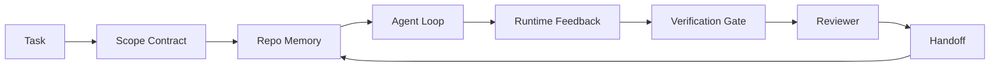

# Agent Workbench 工程：为什么有能力的模型仍会失败

> 一个有能力的模型并不足够。可靠的代理需要一个工作台（workbench）：说明、状态、范围、反馈、验证、审查和交接。剥离这些，即使是前沿模型也会产生不安全的交付结果。

**类型：** 学习 + 实践  
**语言：** Python（标准库）  
**先决条件：** 第14阶段 · 01节（Agent Loop（代理循环）），第14阶段 · 26节（Failure Modes（失败模式））  
**时间：** 约45分钟

## 学习目标

- 区分模型能力与执行可靠性。
- 命名决定代理是否能够交付的七个工作台表面。
- 对比仅用 prompt（提示词）执行与工作台引导执行在小型仓库任务中的表现。
- 生成失败模式报告，将每个遗漏的表面映射到其导致的症状。

## 问题

你将一个前沿模型放入真实仓库，要求它添加输入验证。它打开了四个文件，写出了看似合理的代码，声明成功，然后停止。你运行测试，两个失败了。第三个文件被修改，却与验证无关。没有任何记录显示代理假设了什么、首先尝试了什么、剩下的任务是什么。

模型对 Python 并不陌生，出错的是对工作内容的认识。它不知道什么算完成、允许写入哪里、哪些测试权威，或下一次会话如何接续。

这不是模型的缺陷，而是工作台的缺陷。围绕代理的表面缺少将一次性生成转变为可靠、可恢复工程的组成部分。

## 概念

工作台是任务中包裹模型的操作环境，共有七个表面：

| 表面 | 内容 | 缺失时的失败表现 |
|---------|-----------------|----------------------|
| Instructions（说明） | 启动规则、禁止操作、完成定义 | 代理猜测“交付”意味着什么 |
| State（状态） | 当前任务、触及的文件、阻塞项、下一步行动 | 每个会话都从零开始 |
| Scope（范围） | 允许文件、禁止文件、验收标准 | 修改泄露到无关代码 |
| Feedback（反馈） | 捕获到循环中的真实命令输出 | 代理在400错误上宣布成功 |
| Verification（验证） | 测试、lint、冒烟测试、范围检查 | “看起来没问题”的代码进入主分支 |
| Review（审查） | 由不同角色执行的二次通过 | 建造者自我审阅作业 |
| Handoff（交接） | 变更内容、原因和剩余工作 | 下一次会话重新发现一切 |

工作台与模型无关。你可以更换模型而保持这些表面，但无法更换表面而保持可靠性。



循环以状态文件闭合，而非聊天历史。聊天是易失的，仓库才是系统记录。

### 工作台与提示词工程的区别

提示词只告诉模型本轮要什么，工作台则告诉模型如何跨轮次、跨会话完成工作。大多数代理失败案例都是穿着提示工程外衣的工作台失败。

### 工作台与框架的区别

框架提供运行时（如 LangGraph、AutoGen、Agents SDK），工作台让代理在这个运行时环境中有一个工作场所。两者都需要。本微课关注后者。

### 从原语推理，而非供应商分类法

现今有很多关于“harness engineering（工作台工程）”的文章。Addy Osmani、OpenAI、Anthropic、LangChain、Martin Fowler、MongoDB、HumanLayer、Augment Code、Thoughtworks、walkinglabs 的优秀列表，以及 Medium 和 Hacker News 上频繁的讨论都在推动此话题。它们对工作台的边界、范围和用词不一而足。我们无需选边站队。七个表面是 UX 层；每个工作台的底层都是分布式系统的原语，这些原语是任何可靠后端所必需的。

暂时摒除“代理”标签。代理执行是跨越时间、进程和机器的计算。要使其可靠，你需要任何生产系统都需要的相同原语。

| 原语 | 定义 | 对代理的承载内容 |
|-----------|------------|------------------------------|
| Function（函数） | 带类型的处理函数。尽可能纯函数。管理自己的输入输出。 | 工具调用、规则检查、验证步骤、模型调用 |
| Worker（工作者） | 长期运行的进程，拥有一个或多个函数和生命周期 | 构建者、审查者、验证者、MCP服务器 |
| Trigger（触发器） | 调用函数的事件源 | 代理循环 tick、HTTP 请求、队列消息、定时、文件变化、挂钩 |
| Runtime（运行时） | 决定何处运行、超时和资源的边界 | Claude Code 进程，LangGraph 运行时，工作者容器 |
| HTTP / RPC | 调用者与工作者之间的通讯链路 | 工具调用协议、MCP请求、模型API |
| Queue（队列） | 触发器和工作者间的持久缓冲；背压、重试、幂等 | 任务板、反馈日志、审查收件箱 |
| Session persistence（会话持久化） | 存活于崩溃、重启、模型替换间的状态 | `agent_state.json`、检查点、KV存储、仓库本身 |
| Authorization policy（授权策略） | 谁能调用哪些函数，作用域限制 | 允许/禁用文件、审批边界、MCP权限列表 |

现在将七个工作台表面映射到这些原语。

- **Instructions（说明）** — 策略 + 函数元数据。规则是检查（函数）。路由器（`AGENTS.md`）是附加到运行时启动的策略。
- **State（状态）** — 会话持久化。运行时每步读取的键值存储。可以是文件、KV或数据库；持久化语义重要，存储后端不关键。
- **Scope（范围）** — 每任务的授权策略。允许/禁止的通配符是访问控制列表（ACL）。需要审批的是权限格局。
- **Feedback（反馈）** — 写入队列的调用日志。每个 shell 调用都是持久且可重放的记录。
- **Verification（验证）** — 函数，对输入确定性。任务关闭时触发，失败即阻止通过。
- **Review（审查）** — 拥有只读构建产物权限和只写审查报告权限的独立工作者。
- **Handoff（交接）** — 会话结束触发器产生的持久记录。下一会话启动触发器读取。

代理循环本身是个接收事件（用户消息、工具结果、定时器 tick）、调用函数（模型及其选择的工具）、写记录（状态、反馈）、触发事件（验证、审查、交接）的工作者。结构同作业处理器一致。

### 流传的模式，翻译成原语

每个流行的工作台模式都归结为这八个原语。翻译表：

| 供应商或社区模式 | 实质内容 |
|------------------------------|--------------------|
| Ralph Loop（Claude Code、Codex、agentic_harness 书）——代理试图提前停止时，将原始意图重新注入新上下文 | 触发器重新排队任务，带干净上下文；会话持久化传递目标 |
| Plan / Execute / Verify (PEV) | 三个分别对应角色的工作者，在阶段间通过状态和队列通信 |
| Harness-compute 分离（OpenAI Agents SDK, 2026年4月）——分离控制平面和执行平面 | 控制平面/数据平面重述。早于“代理”标签数十年 |
| Open Agent Passport (OAP, 2026年3月)——执行前依据声明式策略签名并审计每个工具调用 | 由前置动作工作者执行的授权策略，带签名审计队列 |
| Guides and Sensors（Birgitta Böckeler / Thoughtworks）——前馈规则 + 反馈可观测性 | 授权策略 + 验证函数 + 可观测性跟踪 |
| Progressive compaction，五阶段（Claude Code 逆向工程, 2026年4月） | 一个定期运行的状态管理工作者，维护会话持久化在预算内 |
| Hooks / middleware（LangChain，Claude Code）——拦截模型与工具调用 | 触发器 + 包围运行时调用路径的函数 |
| Skills 以 Markdown 表示并逐步展示（Anthropic，Flue） | 函数注册表，函数元数据即时加载到上下文 |
| Sandbox agents（Codex，Sandcastle，Vercel Sandbox） | 计算平面：有隔离文件系统、网络和生命周期的运行时 |
| MCP 服务器 | 通过稳定 RPC 暴露函数的工作者，以能力列表作为授权 |

表中每项都代表代理社区为分布式系统已有的原语重新命名。作为营销标签有用，但作为工程词汇则不。

### 实证数据表明

工作台优于纯模型的说法已有数据支撑，值得关注，也是反对“等更聪明模型”的唯一合理论据。

- Terminal Bench 2.0——相同模型，变更工作台让编码代理排名从30开外跃升至第5（LangChain，《Agent Harness 解剖》）。
- Vercel——删除80%代理工具后，成功率从80%提升至100%（MongoDB）。
- Harvey——法律代理单靠工作台优化准确率翻倍以上（MongoDB）。
- 88%的企业 AI 代理项目难产，失败多聚焦在运行时而非推理（preprints.org，《语言代理的工作台工程》，2026年3月）。
- 2025年对三大开源框架的基准测试报告完成率约50%；长上下文 WebAgent 在长上下文条件下从40-50%崩溃至低于10%，多数因无限循环和目标丢失（2026年初广泛报道）。

结论不是“工作台永远胜出”。模型会逐渐吸收工作台技巧。结论是现阶段，承重工程在模型之外，承重的原语正是所有生产系统一直需要的。

### 供应商简介未及之处

这些是你无需客气指出的地方。

- LangChain《Agent Harness 解剖》列举了十一组件——提示、工具、hook、沙盒、编排、内存、技能、子代理及运行时“傻循环”，未提及队列、作为部署单元的工作者、触发语义、独立的会话持久化或授权策略。它把工作台当成一个可配置对象，而非一个可部署系统。
- Addy Osmani 的《Agent Harness Engineering》提出 `Agent = Model + Harness` 和棘轮模式，但没详细说工作台由什么组成，更多像是一种态度而非规范。
- Anthropic 和 OpenAI 对表面讨论最深入，但仅限于自身运行时。2026年4月 Agents SDK 中对“工作台计算分离”的声明首次明确支持控制平面/数据平面分离。这是一个原语概念，并非新发明。
- agentic_harness 书（Jaymin West《Agentic Engineering》第6章）将工作台视为配置对象，书中最强论断是“工作台是代理系统的主要安全边界”，即授权策略的重述。
- Hacker News 讨论反复回到同一点。2026年4月《代理工作台应置于沙盒之外》帖声称工作台应更像“在一切之外的虚拟机管理器，根据上下文和用户授权访问”，同样是把授权策略作为独立平面。

你无需反对这些观点才能注意到差距。他们是在为一个已经存在的系统撰写 UX 描述。我们是在构建系统。当系统构建正确时，七个表面会从原语中自然产生。当系统构建错误时，无论怎样用 `AGENTS.md` 打磨，都无法弥补缺失的队列。

所以，当你在其他地方听到“harness engineering”（架构工程）时，请翻译成原语。Prompts（提示）和 rules（规则）是 policy（策略）和 functions（函数）。Scaffolding（脚手架）是 runtime（运行时）。Guardrails（护栏）是 authorization（授权）+ verification（验证）。Hooks（钩子）是 triggers（触发器）。Memory（内存）是 session persistence（会话持久化）。Ralph Loop（拉尔夫循环）是 requeue（重新排队）。Subagents（子代理）是 workers（工作者）。Sandboxes（沙盒）是 compute planes（计算层）。术语变了，工程本质没变。Workbench（工作台）是面向代理的 UX；而 harness（架构），以能在下一供应商重构中存续的含义，是将函数、工人、触发器、运行时、队列、持久化和策略正确连接起来。

## 构建它

`code/main.py` 会运行一个微型仓库任务两次。第一次仅用提示，第二次则连接了七个表面。模型相同，任务相同。该脚本统计失败运行中缺失了哪些表面，并打印失败模式报告。

这个仓库任务刻意做小：为一个单文件 FastAPI 风格的处理器添加输入验证，并编写通过的测试。

运行它：

```bash
python3 code/main.py
```

输出：两个运行的并排日志，一个总结提示仅运行的 `failure_modes.json`，以及工作台运行的一行结论。

代理是非常小的基于规则的桩；重点在于表面，而非模型。在本迷你课程的剩余部分，你将重构每个表面，变成真实的、可复用的工件。

## 使用它

工作台表面已经在现实世界中存在于三个地方，尽管没人把它们称为表面：

- **Claude Code、Codex、Cursor。** `AGENTS.md` 和 `CLAUDE.md` 是 instructions surface（指令表面）。斜杠命令是 scope（作用域）。Hooks 是 verification（验证）。
- **LangGraph、OpenAI Agents SDK。** Checkpoints（检查点）和 session stores（会话存储）是 state surface（状态表面）。Handoffs（交接）是 handoff surface（交接表面）。
- **真实仓库的 CI。** Tests（测试）、lint（代码风格检查）和 type-check（类型检查）属于 verification（验证）。PR 模板是交接。CODEOWNERS 是 review（审查）。

Workbench engineering（工作台工程）是将这些表面明确且可复用的学科，而不是让每个团队各自重新发现它们。

## 发布它

`outputs/skill-workbench-audit.md` 是一个可移植的技能，用于审计现有仓库中的七个工作台表面，并报告缺失、部分完成和健康的部分。放置在任一代理设置旁，它告诉你优先修复什么。

## 练习

1. 选一个你已经运行代理的仓库。给七个表面打分，从 0（缺失）到 2（健康）。哪个表面最弱？
2. 扩展 `main.py`，让仅用提示的运行也产生一个假的“成功”声明。验证验证门是否能捕捉到它。
3. 为你自己的产品添加第八个表面。说明为什么它不能合并进现有七个之一。
4. 使用一个会产生额外文件写入谵妄的新桩代理，重新运行脚本。哪个表面最先捕获异常？
5. 把 Phase 14 · 26 中五个行业常见失败模式映射到七个表面。每个表面设计吸收哪个失败模式？

## 关键术语

| 术语          | 人们说的是什么           | 实际含义                                   |
|--------------|-----------------------|----------------------------------------|
| Workbench（工作台） | “设置”                 | 围绕模型构建的工程表面，确保工作可靠                |
| Surface（表面）   | “一个文档”或“一个脚本”        | 代理每轮读取或写入的命名的、机器可读的输入               |
| System of record（记录系统） | “笔记”                 | 当聊天记录丢失时，代理视为真实的文件                   |
| Definition of done（完成定义） | “验收”                 | 代理无法伪造的客观、文件支持的检查清单                  |
| Workbench audit（工作台审计） | “仓库准备检查”             | 对七个表面进行扫描，标记缺失部分，工作开始前完成           |

## 深入阅读

请将以下资料作为数据点而非权威。每个都是局部分类。在决定是否采纳前，把每一概念翻译回原语（函数、工作者、触发器、运行时、HTTP/RPC、队列、持久化、政策）。

供应商框架：

- [Addy Osmani, Agent Harness Engineering](https://addyosmani.com/blog/agent-harness-engineering/) — `Agent = Model + Harness` 和棘轮模式；对基础设施描述较少
- [LangChain, The Anatomy of an Agent Harness](https://blog.langchain.com/the-anatomy-of-an-agent-harness/) — 十一组件：prompts, tools, hooks, orchestration, sandboxes, memory, skills, subagents, runtime；未提及队列、部署、授权
- [OpenAI, Harness engineering: leveraging Codex in an agent-first world](https://openai.com/index/harness-engineering/) — Codex 团队对其运行时表面的视角
- [OpenAI, Unrolling the Codex agent loop](https://openai.com/index/unrolling-the-codex-agent-loop/) — 将代理循环简化为函数调用的 `while` 循环
- [Anthropic, Effective harnesses for long-running agents](https://www.anthropic.com/engineering/effective-harnesses-for-long-running-agents) — 特定运行时内的长时表面
- [Anthropic, Harness design for long-running application development](https://www.anthropic.com/engineering/harness-design-long-running-apps) — 应用设计笔记
- [LangChain Deep Agents harness capabilities](https://docs.langchain.com/oss/python/deepagents/harness) — 运行时配置表面

具备可用细节的实务文章：

- [Martin Fowler / Birgitta Böckeler, Harness engineering for coding agent users](https://martinfowler.com/articles/harness-engineering.html) — 引导（前馈）+ 传感器（反馈）；最清晰的控制理论框架
- [HumanLayer, Skill Issue: Harness Engineering for Coding Agents](https://www.humanlayer.dev/blog/skill-issue-harness-engineering-for-coding-agents) — “这不是模型问题，是配置问题”
- [MongoDB, The Agent Harness: Why the LLM Is the Smallest Part of Your Agent System](https://www.mongodb.com/company/blog/technical/agent-harness-why-llm-is-smallest-part-of-your-agent-system) — 案例数据：Vercel 80% 到 100%，Harvey 提升 2 倍准确率，Terminal Bench Top 从 30 到 Top 5
- [Augment Code, Harness Engineering for AI Coding Agents](https://www.augmentcode.com/guides/harness-engineering-ai-coding-agents) — 先约束的演练
- [Sequoia podcast, Harrison Chase on Context Engineering Long-Horizon Agents](https://sequoiacap.com/podcast/context-engineering-our-way-to-long-horizon-agents-langchains-harrison-chase/) — 关注运行时胜过模型

书籍、论文与参考实现：

- [Jaymin West, Agentic Engineering — Chapter 6: Harnesses](https://www.jayminwest.com/agentic-engineering-book/6-harnesses) — 书籍篇幅，视 harness 为主要安全边界
- [preprints.org, Harness Engineering for Language Agents (March 2026)](https://www.preprints.org/manuscript/202603.1756) — 以控制/代理/运行时框架为学术视角
- [walkinglabs/awesome-harness-engineering](https://github.com/walkinglabs/awesome-harness-engineering) — 跨上下文、评估、可观察性、编排的精选阅读列表
- [ai-boost/awesome-harness-engineering](https://github.com/ai-boost/awesome-harness-engineering) — 另一精选列表（工具、评估、记忆、MCP、权限）
- [andrewgarst/agentic_harness](https://github.com/andrewgarst/agentic_harness) — 生产就绪参考实现，带 Redis 支持的内存和评估套件
- [HKUDS/OpenHarness](https://github.com/HKUDS/OpenHarness) — 开源代理 harness，内建个人代理

Hacker News 讨论串值得阅读，主要为异议非共识：

- [HN: Effective harnesses for long-running agents](https://news.ycombinator.com/item?id=46081704)
- [HN: Improving 15 LLMs at Coding in One Afternoon. Only the Harness Changed](https://news.ycombinator.com/item?id=46988596)
- [HN: The agent harness belongs outside the sandbox](https://news.ycombinator.com/item?id=47990675) — 主张授权作为独立层

本课程内相关链接：

- Phase 14 · 23 — OpenTelemetry GenAI 约定：传感器文献所指的可观察层
- Phase 14 · 26 — 七个表面设计用以吸收的失败模式目录
- Phase 14 · 27 — 设在授权策略原语处的提示注入防御
- Phase 14 · 29 — 生产运行时（队列、事件、定时）：本课原语在部署中的所在
