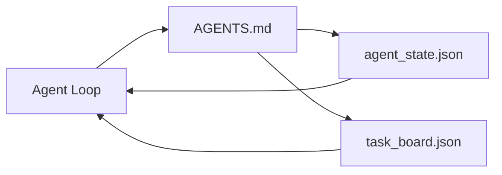

# 最简代理工作台（Minimal Agent Workbench）

> 最小可用的工作台由三个文件组成：根指令路由器，一个状态文件，以及一个任务板。其他一切都建立在此之上。如果一个代码库连这三者都没有，再强大的模型也无济于事。

**类型：** 构建  
**语言：** Python（标准库）  
**先决条件：** 阶段14 · 31（为什么有能力的模型仍然失败）  
**时间：** 约45分钟

## 学习目标

- 定义构成最小可用工作台的三个文件。  
- 解释为什么简短的根路由器胜过冗长的单体 `AGENTS.md`。  
- 构建代理每一步读取并在结束时写入的状态文件。  
- 构建一个在多会话工作中能持续留存而无需聊天历史的任务板。

## 问题描述

大多数团队通过编写一份3000行的 `AGENTS.md` 并将其视为完成来尝试搭建工作台。模型加载它，忽略无法总结的部分，却依然在老问题上失败。

你需要做相反的事。制作一个极小的根文件，仅在相关时将代理引导至更深层的文件。持久化状态，在代理行动前读取，行动后写入。任务板显示进行中的任务、阻塞的任务和下一个任务。

三个文件。各司其职。每个都足够机器可读，日后可以演变为真正的系统。

## 概念示意



### `AGENTS.md` 是路由器，不是手册

优秀的 `AGENTS.md` 很短。它指向代理：

- 状态文件（你当前的位置）。  
- 任务板（剩余任务）。  
- 更深入的规则（`docs/agent-rules.md` 下）。  
- 验证命令（如何确认系统工作正常）。

更长的内容放在更深层的文档里，仅在需要时加载。长手册通常被忽略。简短路由器被执行。

### `agent_state.json` 是记录系统

状态包含：当前活动任务ID，已触及的文件，做出的假设，阻碍因素，和下一步动作。代理每次行动前读取，下一会话读取文件而非重放聊天。

状态存储于文件中，因为聊天历史不可靠。会话会终止，聊天会被修剪，但文件不会。

### `task_board.json` 是队列

任务板记录所有任务及其状态（`todo | in_progress | done | blocked`）。当状态为空时，代理从此队列中拉取任务；当你想知道代理是否按计划执行时，读取此队列。

任务板上的任务有ID、目标、负责人（`builder`、`reviewer` 或 `human`）、验收标准。任务板有意保持简洁：超过一页内容就是规划问题，不是任务板问题。

### 三个文件是底线，不是上限

后续课程会添加范围合同、反馈运行器、验证门槛、审核清单和交接包。这里的三个文件是所有这些的基础。

## 构建它

`code/main.py` 向空代码库中写入最简工作台并演示单个代理步骤，过程为：

1. 读取 `agent_state.json`。  
2. 若状态为空，从 `task_board.json` 拉取下一个任务。  
3. 触及范围内的单个文件。  
4. 写回更新后的状态。

运行方式：

```text
python3 code/main.py
```

脚本会在其旁边创建 `workdir/` 文件夹，放置三个文件，执行一步代理操作，并打印差异。再次运行，会看到第二步如何从第一步结束处继续。

## 使用它

在生产代理产品中，同样的三个文件以不同名称出现：

- **Claude Code：** `AGENTS.md` 或 `CLAUDE.md` 作为路由器，`.claude/state.json` 风格的状态存储，任务板钩子。  
- **Codex / Cursor：** 用工作区规则作为路由器，使用会话内存为状态，聊天侧边栏中排队的任务为任务板。  
- **自定义 Python 代理：** 就是你刚写的那些文件。

名称会变，形态不变。

## 生产中的模式实践

最小工作台在三种模式叠加后能适应真实的单体库。三者独立，选择你的代码库实际需要的。

**带最近优先权的嵌套 `AGENTS.md`。** OpenAI 主库有88个 `AGENTS.md` 文件，分布于子组件。Codex、Cursor、Claude Code 和 Copilot 都从工作文件向仓库根目录不断查找并合并所有 `AGENTS.md`。子目录中的文件用于扩展根文件。Codex 额外添加了 `AGENTS.override.md` 用于替代而非扩展，该机制仅限 Codex，跨工具协作时建议避免。Augment Code 的度量标准最关键：最佳 `AGENTS.md` 文件带来品质飞跃，相当于从 Haiku 升级到 Opus；最差文件反而比没文件更差。

**必须摈弃的反模式，即便它们看似覆盖了需求。** 矛盾指令会让代理从交互模式降级到贪婪模式（ICLR 2026 AMBIG-SWE：解析率由 48.8% 降到 28%）；用编号优先级代替简单叠加。无可验证的风格规则（例如“遵循 Google Python 风格指南”），没有执行命令，让代理自行“发明”合规方法；每条风格规则都应配有确切的 Lint 命令。优先风格而非命令会掩埋验证路径；应命令优先，风格最后。写给人类的说明浪费上下文预算；简洁是特性。

**跨工具符号链接。** 单个根文件通过符号链接（例如 `ln -s AGENTS.md CLAUDE.md`，`ln -s AGENTS.md .github/copilot-instructions.md`，`ln -s AGENTS.md .cursorrules`）使所有代码代理共享同一事实来源。Nx 的 `nx ai-setup` 可从单一配置跨 Claude Code、Cursor、Copilot、Gemini、Codex 和 OpenCode 自动执行此操作。

## 交付它

`outputs/skill-minimal-workbench.md` 会为新代码库生成三个文件的工作台：调优后的项目路由器 `AGENTS.md`，具备正确键的 `agent_state.json`，以及植入现有待办事项的 `task_board.json`。

## 练习

1. 在 `agent_state.json` 加入 `last_run` 时间戳。如果文件超过24小时则拒绝运行，除非操作员确认。  
2. 在任务板增加一个 `priority` 字段，调整拉取逻辑使其总是选择最高优先级的未完成任务。  
3. 将 `task_board.json` 迁移为 JSON Lines 格式，使每条任务占一行，版本控制差异更加清晰。  
4. 编写 `lint_workbench.py`，若 `AGENTS.md` 行数超过80或引用了不存在的文件则报错。  
5. 决定三文件中丢失哪个对你影响最大，并证明你的选择。

## 关键词

| 术语          | 人们说的               | 实际含义                                       |
|---------------|------------------------|------------------------------------------------|
| Router        | `AGENTS.md`            | 指向代理更深文档和文件的简短根文件                   |
| State file    | “笔记”                 | 机器可读的代理当前位置记录，每步写入                   |
| Task board   | “待办事项”             | 带状态、负责人、验收标准的 JSON 工作队列               |
| System of record | “事实来源”            | 聊天停止后工作台据以为准的文件                          |

## 延伸阅读

- [agents.md — 开放规范](https://agents.md/) — 由 Cursor、Codex、Claude Code、Copilot、Gemini、OpenCode 采用  
- [Augment Code，一份好 AGENTS.md 是模型升级，差的比没有文档更糟](https://www.augmentcode.com/blog/how-to-write-good-agents-dot-md-files) — 质量飞跃的度量  
- [Blake Crosley，AGENTS.md 模式：什么真正改变了代理行为](https://blakecrosley.com/blog/agents-md-patterns) — 经验证的有效与无效方法  
- [Datadog 前端，在单体库中用 AGENTS.md 驾驭 AI 代理](https://dev.to/datadog-frontend-dev/steering-ai-agents-in-monorepos-with-agentsmd-13g0) — 实践中的嵌套优先级  
- [Nx 博客，教你的 AI 代理如何在单体库中工作](https://nx.dev/blog/nx-ai-agent-skills) — 六工具的单一来源生成  
- [The Prompt Shelf，AGENTS.md 最佳实践：结构、范围与真实示例](https://thepromptshelf.dev/blog/agents-md-best-practices/) — 经审核的章节顺序  
- [Anthropic，Claude Code 子代理与会话存储](https://docs.anthropic.com/en/docs/agents-and-tools/claude-code/sub-agents)  
- 阶段14 · 31 — 该最小工作台吸收的失败模式  
- 阶段14 · 34 — 本课预览的持久化状态架构
