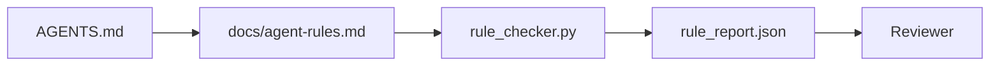

# Agent Instructions as Executable Constraints（代理指令作为可执行约束）

> 以散文形式写的指令是愿望。以约束形式写的指令是测试。工作台将每条规则转化为代理可以在运行时检查、审核者可以事后验证的内容。

**类型：** 构建  
**语言：** Python（stdlib 标准库）  
**先决条件：** 阶段 14 · 32（最小工作台）  
**时间：** ~50 分钟

## 学习目标

- 将路由散文与操作规则分离。  
- 将启动规则、禁止行为、完成定义、不确定性处理及审批边界表达为机器可检查的约束。  
- 实现一个规则检查器，对运行结果按规则集打分。  
- 使规则集便于差异比较，便于审核者查看变更内容。

## 问题所在

典型的 `AGENTS.md` 看起来像入职文档。它告诉代理要“谨慎”、“彻底测试”、“不确定时询问”。三天后，代理提交了无测试的变化，写入了禁用目录，从未问过，因为它根本不知道界线在哪里。

指令在操作性强时有力，在理想主义时无效。解决方案是编写工作台可以解释、审核者可以评分的规则。

## 概念

规则属于 `docs/agent-rules.md`，远离简短的根路由。每条规则包含名称、类别和检查函数。



### 五大类别覆盖大多数规则

| 类别 | 规则回答的问题 | 示例 |
|----------|-----------------|---------|
| Startup（启动） | 工作开始前必须满足什么条件？ | “状态文件存在且是最新的” |
| Forbidden（禁止） | 什么操作绝对不能发生？ | “不得编辑 `scripts/release.sh`” |
| Definition of done（完成定义） | 什么能证明任务已完成？ | “pytest 返回0且验收线通过” |
| Uncertainty（不确定性） | 不确定时代理做什么？ | “开启一个问题笔记，而非猜测” |
| Approval（审批） | 什么需要人工审批？ | “任何新依赖，任何生产写操作” |

不符合上述五类的规则通常应拆分成两条。强制拆分。

### 规则是机器可读

每条规则有一个 slug、类别、一行描述及一个 `check` 字段，指向 `rule_checker.py` 中的函数。添加规则意味着增加检查；检查器随着工作台成长。

### 规则便于差异对比

规则以单个 markdown 文件、每条规则一个标题的形式存放。重命名在差异中清晰可见。新规则置于所属类别顶端。废弃规则被删除，不注释掉，因为工作台是事实源，而非团队上季度情绪的聊天记录。

### 规则与框架护栏的区别

框架护栏（OpenAI Agents SDK 护栏，LangGraph 中断）在运行时层面强制执行规则。本课的规则集是人类可阅读、可审查的合约，供那些护栏实现。两者皆需：运行时捕获违规，规则集证明运行时符合要求。

## 构建它

`code/main.py` 提供：

- 解析 `agent-rules.md` 并加载规则到 dataclass。  
- `rule_checker.py` 风格的检查函数，每个 `check` 引用对应一个。  
- 一个演示代理运行示例，其中违反两条规则，且检查器能捕获。

运行：

```text
python3 code/main.py
```

输出：解析的规则集、运行跟踪、每条规则的通过/失败结果，以及与脚本同目录保存的 `rule_report.json`。

## 生产环境中的实践模式

三种模式区分了能持续一个季度的规则集与一周内退化的规则集。

**写时严重性标记。** 每条规则包含 `severity`：`block`、`warn` 或 `info`。检查器报告所有三种，运行时仅拒绝 `block`。多数团队初期将严重性夸大，截止压力下又悄悄弱化；写时标记强制提前校准。配合验证门（阶段 14 · 38），该门将任何 `block` 规则的覆盖记录签名存入 `overrides.jsonl` 审计日志。

**规则过期作为驱动力。** 每条规则含有 `expires_at` 日期（默认90天后）。当90天内无违规时，检查器发出警告；下一季度复审期间，要么证明继续保留，要么降级为 `info`，要么删除。Cloudflare生产级 AI 代码审查数据（2026年4月，30天内5,169个仓库共131,246次复审运行）显示，含显式过期规则集的仓库保持规则数低于30条；无明确过期的仓库规则数增长到80条以上且多数规则从未触发。

**Markdown 作为源，JSON 作为缓存。** `agent-rules.md` 是书写文件；`agent-rules.lock.json` 是检查器热路径读取的缓存。该锁文件由 pre-commit 钩子生成。Markdown 差异可审查；JSON 解析不在每轮中进行。类似于 `package.json` / `package-lock.json` 和 `Cargo.toml` / `Cargo.lock`。

## 使用它

在生产中：

- Claude Code、Codex、Cursor 在会话开始时读取规则，拒绝操作时引用之。检查器在 CI 中重跑规则，捕获无声漂移。  
- OpenAI Agents SDK 护栏注册相同检查作为输入输出护栏。markdown 是文档界面，SDK 是运行时界面。  
- LangGraph 中断在运行节点违规时触发。中断处理器读取规则，询问人工，然后恢复。

该规则集兼容上述三者，因为它只是 markdown 加函数名。

## 发布它

`outputs/skill-rule-set-builder.md` 采访项目负责人，将其现有的散文指令分类为五个类别，并输出带版本号的 `agent-rules.md` 和检查器模板。

## 练习

1. 如果你的产品确实需要，添加第六类。说明它为何不会归入前五类。  
2. 扩展检查器，使规则可携带严重性（`block`、`warn`、`info`）并据此汇总报告。  
3. 将检查器接入 CI：最新代理跑出违反 block 严重性规则时构建失败。  
4. 为规则添加“过期”字段。不违反规则且超过90天后，规则进入复审。  
5. 找一份真实的 `AGENTS.md`，将其改写为五类规则。它有多少行是操作性的？多少是理想性的？

## 关键词

| 术语 | 俗称 | 实际含义 |
|------|------|--------|
| Operational rule（操作规则） | “真实指令” | 工作台能运行时检查的规则 |
| Aspirational rule（理想规则） | “小心为上” | 无检查的规则；要么删除，要么升级 |
| Definition of done（完成定义） | “验收” | 任务完成的客观文件证明 |
| Block severity（阻断严重性） | “硬规则” | 违规中断运行；无管理员不可静默 |
| Rule expiry（规则过期） | “陈旧规则清理” | N天内无违规，规则待退役 |

## 延伸阅读

- [OpenAI Agents SDK 护栏](https://platform.openai.com/docs/guides/agents-sdk/guardrails)  
- [LangGraph 中断](https://langchain-ai.github.io/langgraph/how-tos/human_in_the_loop/breakpoints/)  
- [Anthropic，构建高效代理](https://www.anthropic.com/research/building-effective-agents)  
- [Rick Hightower，Agent RuleZ：确定性策略引擎](https://medium.com/@richardhightower/agent-rulez-a-deterministic-policy-engine-for-ai-coding-agents-9489e0561edf) — 生产中的 block/warn/info 严重性  
- [Cloudflare，大规模协调 AI 代码审查](https://blog.cloudflare.com/ai-code-review/) — 131k 审查运行，规则组合经验  
- [microservices.io，GenAI 开发平台 — 第1部分：护栏](https://microservices.io/post/architecture/2026/03/09/genai-development-platform-part-1-development-guardrails.html) — 规则与 CI 之间的深度防御  
- [Type-Checked Compliance：确定性护栏（arXiv 2604.01483）](https://arxiv.org/pdf/2604.01483) — Lean 4 作为规则检查的上界  
- [logi-cmd/agent-guardrails](https://github.com/logi-cmd/agent-guardrails) — 合并门实现：作用域、变异测试、违规预算  
- 阶段 14 · 32 — 该规则集所依赖的最小工作台  
- 阶段 14 · 38 — 消耗规则报告的验证门  
- 阶段 14 · 39 — 评分规则合规的审核代理
