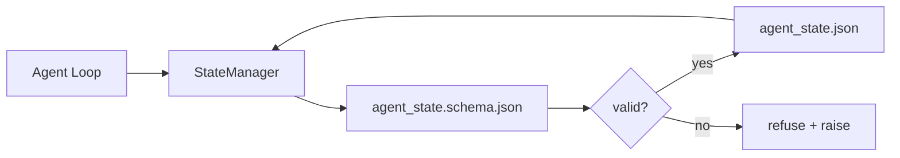

# Repo Memory 和 Durable State（持久状态）

> 聊天记录是易失的。仓库（repo）是持久的。工作台将智能体状态存储在版本化的文件中，以便下一个会话、下一个智能体以及下一个审阅者都能读取同一真实数据源。

**类型：** 构建  
**语言：** Python（标准库 + 可选 `jsonschema`）  
**先决条件：** 第14阶段 · 32（最小工作台）  
**时间：** ~60分钟

## 学习目标

- 定义什么应该属于 repo memory（仓库存储），什么属于聊天记录。
- 为 `agent_state.json` 和 `task_board.json` 编写 JSON Schema（JSON 模式）。
- 构建一个状态管理器，能够原子性地加载、验证、变更并持久化状态。
- 使用 schema 拒绝错误写入，保护工作台免受损坏。

## 问题描述

智能体完成一次会话，聊天关闭。下一次会话开启时，询问从哪里开始。模型说“让我检查文件”，却读取了过时的笔记，重新做了已完成的工作。更糟的是，它在没人告诉它文件已完成的情况下重写了已完成文件。

工作台的解决方案是 repo memory：状态保存在仓库中的 JSON 文件中，遵循 schema 规范，原子性持久化，且代码审查时便于对比。聊天是短暂的流；仓库是系统的真实记录。

## 概念



### 什么属于 repo memory

| 属于                 | 不属于                      |
|----------------------|-----------------------------|
| 活动任务ID           | 原始聊天记录                |
| 本次会话修改的文件   | 令牌级别的推理轨迹          |
| 智能体做出的假设     | “用户似乎很沮丧”类的描述    |
| 当前阻塞             | 采样的完成结果               |
| 下一步动作           | 供应商特定的模型ID           |

判断标准是持久性：它是否在三个月后的 CI 重新运行中仍然有用？如果有，放在仓库；如果没有，放到遥测。

### 先 schema，再状态

JSON Schema 是契约。没有它，每个智能体都会发明新字段，每个审阅者要学习全新结构，每个 CI 脚本都必须针对历史版本做特别处理。有了它，错误写入将被拒绝。

Schema 涵盖：

- 必需的键。
- 允许的 `status` 值。
- 禁止的值（例如数组中的 `null`）。
- 模式约束（任务 ID 匹配正则 `T-\d{3,}`）。
- 用于迁移的版本字段。

### 原子写入

状态写入必须能承受部分失败：写入临时文件，`fsync`，然后重命名覆盖目标文件。状态文件是权威来源；写到一半的文件比没有文件还糟。

### 迁移

当 schema 改变时，将迁移脚本与 schema 版本升级一同发布。状态文件包含 `schema_version` 字段；管理器会拒绝加载无法迁移的版本。

## 实现

`code/main.py` 实现了：

- `agent_state.schema.json` 和 `task_board.schema.json`。
- 纯标准库的验证器（JSON Schema 的子集：必须，类型，枚举，模式，项）。
- `StateManager.load`、`StateManager.update`、`StateManager.commit`，使用原子临时文件写重命名操作。
- 一个演示示例，变更状态、持久化、重新加载，并证明完整的循环。

运行：

```text
python3 code/main.py
```

脚本写入 `workdir/agent_state.json` 和 `workdir/task_board.json`，经过两轮变更，并打印每步验证后的状态。

## 生产环境实战模式

四种模式将本课最小实现扩展为能够支持多智能体单仓库的方案。

**原子临时文件写重命名操作是必需的。** 2026年3月Hive项目的 Bug 报告详细说明了失败模式：`state.json` 通过 `write_text()` 写入，异常被捕获但忽略。部分写入导致会话以损坏状态继续，且没有任何警告。修复方式始终是：在目标文件相同目录用 `tempfile.mkstemp` 创建临时文件，写入，`fsync`，`os.replace`（POSIX 和 Windows 上的原子重命名）。本课的 `atomic_write` 正是如此实现。

**每个非幂等工具调用加幂等键。** 如果智能体调用工具后崩溃且未检查点结果，恢复时会重试调用。对读操作安全；对邮件、数据库插入、文件上传等危险。模式是：调用前将每个工具调用 ID 记录到 `pending_calls.jsonl`。重试时检查是否存在 ID，存在则跳过调用，使用缓存结果。2026年Anthropic和LangChain均强调此方法；LangGraph的检查点程序也为此持久化待写操作。

**将大型工件与状态分开。** 不要将 CSV、长对话记录或生成文件存储在 `agent_state.json`。将工件存为单独文件（或上传到对象存储），状态中只保存路径。检查点保持小而快，工件单独增长。

**事件溯源用于审计，快照用于恢复。** 每次变更追加事件日志（`state.events.jsonl`）；定期做快照（`state.json`）。恢复时先读快照，再重放快照之后的事件。它占用更多磁盘，但允许一字不差地重现智能体决策，对调试长任务至关重要。Postgres 内部的 WAL 采用相同结构。

**Schema 迁移或拒绝加载。** `schema_version` 整数是契约。管理器遇到未知版本时拒绝加载。将迁移脚本随 schema 升级一起发布；`tools/migrate_state.py` 可在启动时幂等运行。

## 应用示例

生产中：

- **LangGraph 的检查点程序。** 相同理念，不同存储。检查点状态持久化到 SQLite、Postgres 或定制后端。本课示范的 schema 是检查点程序失效时手动读取状态的首选工具。
- **Letta memory blocks（记忆块）。** 带结构化 schema 的持久块（第14阶段 · 08）。面向长期运行角色的相同规范。
- **OpenAI Agents SDK 的会话存储。** 可插拔后端，支持 schema 认知。本课的状态文件相当于本地文件后端。

## 发布

`outputs/skill-state-schema.md` 会生成项目专用的 JSON Schema 配对（状态和任务板），一个支持原子写入的 Python `StateManager`，以及迁移脚手架，保证后续 schema 升级不会破坏工作台。

## 练习

1. 添加一个 `last_human_touch` 时间戳。拒绝智能体在人工编辑后的五秒内的写入。
2. 扩展验证器以支持 `oneOf`，使任务可以是构建任务或审阅任务，拥有不同必需字段。
3. 添加 `schema_version` 字段，写出从 v1 到 v2 的迁移脚本（将 `blockers` 重命名为 `risks`）。
4. 将存储后端从本地文件迁移到 SQLite，保持 `StateManager` API 不变。
5. 用50ms写入竞态时间，在同一状态文件上运行两个智能体。会出现什么问题？原子重命名如何解决？

## 关键词

| 术语            | 人们怎么说         | 实际含义                          |
|-----------------|--------------------|----------------------------------|
| Repo memory     | “笔记文件”         | 在仓库中受版本控制、遵守 schema 的状态文件 |
| Schema-first    | “验证输入”         | 先定义契约，再写入，拒绝漂移      |
| Atomic write    | “直接重命名”       | 写临时文件，`fsync`，重命名，防止部分失败破坏 |
| Migration       | “schema 升级”      | 将 vN 状态转换为 v(N+1) 状态的脚本 |
| System of record| “真实来源”         | 工作台视为权威的状态数据工件       |

## 推荐阅读

- [JSON Schema 规范](https://json-schema.org/specification.html)
- [LangGraph 检查点程序](https://langchain-ai.github.io/langgraph/concepts/persistence/)
- [Letta memory blocks（记忆块）](https://docs.letta.com/concepts/memory)
- [Fast.io，AI Agent 状态检查点：实用指南](https://fast.io/resources/ai-agent-state-checkpointing/) — 先 schema 后检查点，具幂等性
- [Fast.io，AI Agent 工作流状态持久化：2026年最佳实践](https://fast.io/resources/ai-agent-workflow-state-persistence/) — 并发控制，TTL，事件溯源
- [Hive Issue #6263 — 非原子 state.json 写入被静默忽略](https://github.com/aden-hive/hive/issues/6263) — 真实项目中的失败案例
- [eunomia，检查点/恢复系统：演变、技术与应用](https://eunomia.dev/blog/2025/05/11/checkpointrestore-systems-evolution-techniques-and-applications-in-ai-agents/) — 将操作系统历史中的 CR 原语应用于智能体
- [Indium，2026年长运行AI智能体的7种状态持久化策略](https://www.indium.tech/blog/7-state-persistence-strategies-ai-agents-2026/)
- [微软 Agent Framework，压缩](https://learn.microsoft.com/en-us/agent-framework/agents/conversations/compaction) — 供应商检查点管理器
- 第14阶段 · 08 — 记忆块与睡眠时计算
- 第14阶段 · 32 — 本课规范的三个文件最小集合
- 第14阶段 · 40 — 从同一 schema 读取的交接包
