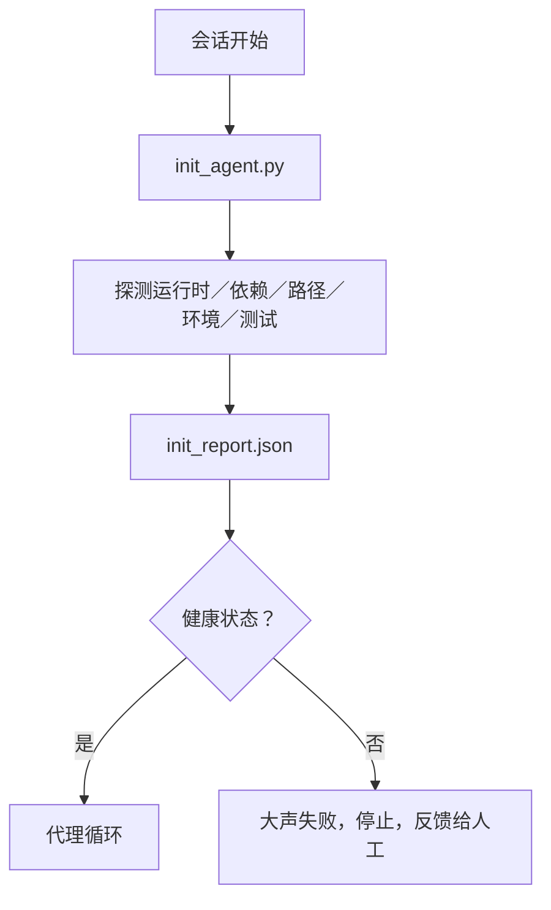

# Agent（代理）初始化脚本

> 每个冷启动的会话都要付出代价。代理会读取相同的文件，重试相同的探测，重新发现相同的路径。初始化脚本只需付出一次代价，并将答案写入状态。

**类型：** 构建  
**语言：** Python（标准库）  
**先决条件：** 第14阶段·第32节（最小工作台），第14阶段·第34节（仓库内存）  
**耗时：** 约45分钟

## 学习目标

- 识别代理每次会话中永远不应该重复完成的工作。
- 构建一个确定性的初始化脚本，用以探测运行时、依赖项和仓库健康状况。
- 持久化探测结果，使代理直接读取而不是重新执行检查。
- 初始化失败时快速、大声报错，并只需查阅一个地方。

## 问题描述

打开一个会话。代理猜测Python版本。猜测测试命令。五次列出仓库根目录以寻找入口点。尝试导入未安装的软件包。询问用户配置文件位置。到它真正修改代码时，已经消耗了上万令牌的准备工作，这些本应由一个脚本完成。

解决方案是在代理执行任何操作前运行一个初始化脚本，该脚本写入一个代理启动时读取的 `init_report.json`。

## 概念



### 初始化脚本探测内容

| 探测项 | 重要性 |
|-------|--------|
| 运行时版本 | 错误的Python或Node版本会导致隐蔽的版本错误 |
| 依赖可用性 | 缺失包稍后代价远大于现在捕获 |
| 测试命令 | 代理必须知道如何验证；命令缺失则工作台损坏 |
| 仓库路径 | 硬编码路径会漂移；一次解析并锁定 |
| 环境变量 | 缺失 `OPENAI_API_KEY` 是故障面，而非运行时迷案 |
| 状态+board新鲜度 | 来自崩溃会话的陈旧状态是隐患 |
| 最近的已知良好提交 | 会话结束时移交差异的锚点 |

### 大声失败、快速失败、单点失败

探测失败意味着立即停止并反馈给人工。没有“代理会自己弄明白”的说法。初始化的全部意义就是在工作台损坏时拒绝启动。

### 幂等性（Idempotent）

连续运行两次。第二次应为无操作，除了更新时间戳。幂等性使得可以将脚本接入CI、钩子或预任务斜杠命令。

### 初始化和启动规则的区别

规则（第14阶段·第33节）描述了执行动作必须满足的条件。初始化脚本保证这些规则能被检查。无初始化的规则变成“请小心”。无规则的初始化变成精致失败。

## 构建它

`code/main.py` 实现了 `init_agent.py`:

- 五个探测：Python版本、通过 `importlib.util.find_spec` 列举的依赖、测试命令可解析性、必需环境变量、状态文件新鲜度。
- 每个探测返回 `(name, status, detail)`。
- 脚本写入包含全套探测的 `init_report.json`，若任何阻塞级探测失败则以非零状态退出。

运行它：

```bash
python3 code/main.py
```

脚本打印探测表，写入 `init_report.json`，成功路径返回零，失败列出失败探测并返回非零。

## 生产环境中的常见模式

三种模式将有用的初始化脚本与形式主义区分开来。

**最近已知良好提交锚点。** 探测当前提交与最后成功合并时写入的 `LKG` 文件。若差异超出预算（默认50个文件），拒绝启动，需人工批准新基线。这是Cloudflare的AI代码审查用以限定审查器代理的方式：每个审查会话以相同的最近已知良好提交为锚点，避免跨会话漂移累积。

**带TTL的锁文件。** 第一次成功探测后写入 `prereqs.lock`，后续运行在N小时内（默认24小时）信任锁，跳过昂贵探测。初始化脚本先读锁，若新鲜且依赖清单哈希匹配，则短路跳过。这类似Docker层缓存模式：幂等探测＋内容哈希＝跳过。

**无网络、无大型语言模型（LLM）、无热路径惊喜。** 初始化探测属于确定性基础设施。若探测调用LLM判定失败，或访问外部服务检查许可则不算探测，是工作流。若探测干跑超过三秒，则视为工作台异味，移动出初始化或缓存结果。

## 使用它

生产环境：

- **Claude Code 钩子。** `pre-task` 钩子调用初始化脚本，失败拒绝启动代理。
- **GitHub Actions。** `setup-agent` 作业运行初始化脚本；代理作业依赖它。
- **Docker入口脚本。** 代理容器启动时先运行初始化脚本，再执行代理运行时；失败日志暴露。

初始化脚本便携，因为不调用具体框架。Bash、Make或任务文件均可包装。

## 发布它

`outputs/skill-init-script.md` 访谈项目，将其设置工作分类为探测项，输出项目特定的 `init_agent.py` 和CI工作流，执行于任何代理步骤前。

## 练习

1. 新增探测，比较当前提交与最近已知良好提交，若改动超50个文件则拒绝启动。
2. 编写脚本生成 `prereqs.lock`，若锁文件超过七天则拒绝启动。
3. 添加 `--fix` 标志，能自动安装缺失的开发依赖，但未经批准绝不修改运行时依赖。
4. 将探测从硬编码函数移至YAML注册表，并说明权衡。
5. 为每个探测添加耗时预算，超过三秒视为工作台异味。

## 关键词

| 术语 | 大众说法 | 实际含义 |
|------|----------|----------|
| Probe（探测） | “一个检查” | 返回 `(name, status, detail)` 的确定性函数 |
| Init report（初始化报告） | “设置输出” | 写在状态旁的包含探测结果的JSON |
| Idempotent（幂等性） | “可安全重跑” | 连续两次运行产生除时间戳外相同报告 |
| Fail loud（大声失败） | “不要吞咽错误” | 停止并反馈人工，无静默回退 |
| Setup tax（设置税） | “引导成本” | 代理每次会话重复发现显而易见内容的消耗令牌 |

## 深入阅读

- [Anthropic, Effective harnesses for long-running agents](https://www.anthropic.com/engineering/effective-harnesses-for-long-running-agents)
- [GitHub Actions, composite actions for setup](https://docs.github.com/en/actions/sharing-automations/creating-actions/creating-a-composite-action)
- [microservices.io, GenAI dev platform: guardrails](https://microservices.io/post/architecture/2026/03/09/genai-development-platform-part-1-development-guardrails.html) — 作为初始化的预提交＋CI检查
- [Augment Code, How to Build Your AGENTS.md (2026)](https://www.augmentcode.com/guides/how-to-build-agents-md) — 初始化期望
- [Codex Blog, Codex CLI Context Compaction](https://codex.danielvaughan.com/2026/03/31/codex-cli-context-compaction-architecture/) — 会话开始即为感知压缩的初始化
- 第14阶段·第33节 — 脚本支持的规则集
- 第14阶段·第34节 — 脚本播种的状态文件
- 第14阶段·第38节 — 初始化脚本所驱动的验证门槛
- 第14阶段·第40节 — 消费初始化报告最近已知良好提交的移交操作
