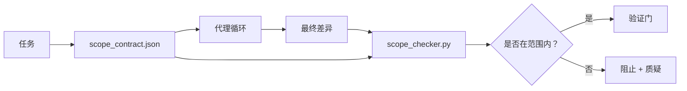

# 范围合同和任务边界

> 模型不知道工作在哪里结束。范围合同是每个任务的文件，说明工作从哪里开始，在哪里结束，以及如果溢出如何回滚。该合同将“保持范围内”从愿望变为检查。

**类型：** 构建  
**语言：** Python（标准库）  
**先决条件：** 第14阶段·32（最小工作台），第14阶段·33（规则作为约束）  
**时间：** 大约50分钟

## 学习目标

- 编写代理在任务开始时读取、验证器在任务结束时读取的范围合同。  
- 指定允许的文件、禁止的文件、验收标准、回滚计划和审批边界。  
- 实现范围检查器，将差异与合同进行比较并标记违规。  
- 使范围蔓延可见、自动且可审查。

## 问题

代理会发生范围蔓延。任务是“修复登录错误”。差异涉及登录路由、邮件助手、数据库驱动、README 和发布脚本。每次修改当时都有合理理由，但组合起来却是与审核时不同的更改。

范围蔓延是代理工作中最少被监控的失败模式，因为代理每步都善意叙述。解决方案不是更严格的提示，而是磁盘上的合同，声明承诺内容，并有检查将结果与承诺对比。

## 概念



### 范围合同包含内容

| 字段 | 目的 |
|-------|---------|
| `task_id` | 链接任务板上的任务 |
| `goal` | 审核者能验证的一句话目标 |
| `allowed_files` | 代理可以写入的通配符 |
| `forbidden_files` | 代理绝对不能触碰的通配符（即使是无意） |
| `acceptance_criteria` | 证明完成的测试命令或断言行 |
| `rollback_plan` | 操作员可执行的回滚说明，若需中止时用一段描述 |
| `approvals_required` | 超范围操作需人工明确签字的动作列表 |

没有 `forbidden_files` 的合同是不完整的。负空间（禁止部分）占合同的一半。

### 使用通配符而非原始路径

真实仓库会移动文件。用通配符绑定合同（如 `app/**/*.py`，`tests/test_signup*.py`），这样改名重构不会使合同失效。

### 回滚是范围的一部分

列出回滚方法迫使合同制定者思考可能出错的场景。无法回滚的合同不应被批准。

### 范围检查即差异检查

代理写差异。检查器读取差异、允许的通配符、禁止的通配符及执行过的任何验收命令。每个违规都被标注，验证门可拒绝。

## 实现

`code/main.py` 实现：

- `scope_contract.json` schema（JSON Schema 子集，包含通配符数组）。  
- 差异解析器，将触碰的文件列表及运行命令列表转换成 `RunSummary`。  
- `scope_check`，对合同返回 `(violations, in_scope, off_scope)`。  
- 两次演示：一次保持范围内，一次范围蔓延；检查器会精确标明违规文件和原因。

运行命令：

```text
python3 code/main.py
```

输出：合同、两次运行结果、每次运行裁决，以及保存的 `scope_report.json`。

## 生产环境中的模式

实施“规格最大化”（specsmaxxing，调用代理前的 YAML 规格合同）实操者报告，三周内错误率从52%降至21%，未改动代理本身。是合同发挥了作用，不是模型。三种模式促成此成效：

**违规预算，而非二元失败。** `agent-guardrails`（Claude Code、Cursor 等通过 MCP 使用的开源合并门）为每任务提供 `violationBudget`：预算内的小额范围溢出显示警告，超出预算才拒绝合并。搭配 `violationSeverity: "error" | "warning"` 使用。该预算决定合并门是否启用。

**路径类别严重性不对称。** 对 `docs/**` 的越界写入通常警告（warn）；对 `scripts/**`、`migrations/**`、`config/prod/**` 的越界写入直接阻止（block）。此不对称写入合同中，因项目特定且随任务变化，运行时无法处理。

**时间和网络预算并列于文件预算。** 字段 `time_budget_minutes` 限制墙钟时间，超过需重新审批。`network_egress` 主机名准入白名单防止代理悄悄访问非任务相关外部接口。这些都属于范围维度；文件通配符是必要不充分条件。

**多合同合并语义（最小权限）。** 若两个合同同时适用（如项目级合同与任务级合同），合并规则为：取 `allowed_files` 交集（路径需两合同均允许），取 `forbidden_files` 并集（任何一方禁止即禁止），`time_budget_minutes` 取最严格（最小值），`approvals_required` 累积。`network_egress` 为 `None` 表示不强制，`[]` 拒绝所有，列表则为白名单；合并时 `None` 继承另一方，两列表取交，拒绝所有保持拒绝。合同 schema 需说明此合并规则以实现机械式、可审查合并。

## 使用方式

生产实践：

- **Claude Code 斜杠命令。** `/scope` 命令写入合同并作为会话上下文。子代理行动前读取合同。  
- **GitHub PR。** 合同作为 JSON 文件推送到 PR 体或检入工件。CI 在合并差异上运行范围检查器。  
- **LangGraph 中断。** 触发范围违规时中断，处理器询问人工合同是否需要扩展或代理是否需退让。

合同随任务一起流转。任务结束时，合同存档入 `outputs/scope/closed/`。

## 发布

`outputs/skill-scope-contract.md` 生成针对任务描述的范围合同和支持通配符的检查器，CI 在每次代理差异时运行。

## 练习

1. 添加 `network_egress` 字段，列出允许的外部主机。拒绝访问其他主机的运行。  
2. 扩展检查器，对 `docs/**` 软失败，对 `scripts/**` 硬失败。说明不对称原因。  
3. 从 `goal` 字段用静态规则集（无 LLM）推导 `allowed_files`。第一个边界案例会出现什么问题？  
4. 添加 `time_budget_minutes`，超过时间拒绝继续运行。  
5. 对同一差异运行两个合同。两个合同同时生效时，合并规则应该是什么？

## 关键词汇

| 术语 | 人们说 | 实际含义 |
|------|--------|----------|
| Scope contract（范围合同） | “任务简报” | 每任务的 JSON，列出允许/禁止文件、验收、回滚 |
| Scope creep（范围蔓延） | “还修改了…” | 合同外的文件在同一任务中被修改 |
| Rollback plan（回滚计划） | “我们可以回退” | 供操作员执行的段落式中止手册 |
| Approval boundary（审批边界） | “需要签字” | 合同内需明确人工审批的操作 |
| Diff check（差异检查） | “路径审计” | 将修改的文件与合同通配符进行比较 |

## 延伸阅读

- [LangGraph 人工介入中断](https://langchain-ai.github.io/langgraph/concepts/human_in_the_loop/)  
- [OpenAI Agents SDK 工具审批政策](https://platform.openai.com/docs/guides/agents-sdk)  
- [logi-cmd/agent-guardrails —— 合并门与范围验证](https://github.com/logi-cmd/agent-guardrails) — 违规预算，严重等级  
- [Dev|Journal，防止 AI 代理配置漂移的代理合同测试](https://earezki.com/ai-news/2026-05-05-i-built-a-tiny-ci-tool-to-keep-ai-agent-configs-from-drifting-in-my-repo/) — `--strict` 模式，无外部依赖  
- [Agentic Coding Is Not a Trap (生产日志)](https://dev.to/jtorchia/agentic-coding-is-not-a-trap-i-answered-the-viral-hn-post-with-my-own-production-logs-33d9) — specsmaxxing 实例：错误率从52%降至21%  
- [OpenCode 权限通配符](https://opencode.ai/docs/agents/) — 精细粒度权限范围  
- [Knostic，AI 编码代理安全：威胁模型和防护策略](https://www.knostic.ai/blog/ai-coding-agent-security) — 范围作为最小权限一部分  
- [Augment Code，AI 规格模板](https://www.augmentcode.com/guides/ai-spec-template) — 三层边界系统（必须/询问/禁止）  
- 第14阶段·27 — 与范围锁配合的提示注入防御  
- 第14阶段·33 — 本合同针对任务的规则集  
- 第14阶段·38 — 检查器报告的验证门
