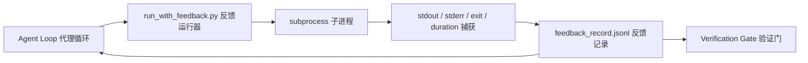

# Runtime Feedback Loops（运行时反馈循环）

> 看不到真实命令输出的代理会猜测。反馈运行器捕获 stdout、stderr、退出代码和耗时，保存为结构化记录，供下一轮读取。代理据此事实反应，而非对事实的预测。

**类型：** Build（构建）  
**语言：** Python（stdlib 标准库）  
**先决条件：** Phase 14 · 32（Minimal Workbench 最小工作台）、Phase 14 · 35（Init Script 初始化脚本）  
**时间：** 约 50 分钟

## 学习目标

- 区分 runtime feedback（运行时反馈）和 observability telemetry（可观测性遥测）。
- 构建一个反馈运行器，包装 shell 命令并持久化结构化记录。
- 确定性地截断大输出，保持循环在 token 预算内。
- 缺失反馈时拒绝推进循环。

## 问题描述

代理说“现在运行测试”。下一条消息说“所有测试通过”。实际上，没有测试运行。代理要么臆想了输出，要么运行了命令但未读取结果，要么读取了结果但静默截断了失败行。

反馈运行器消除这个差距。每个命令都通过运行器，生成包含命令、捕获的 stdout 和 stderr、退出代码、时钟时长和代理备注（一行）的记录。代理在下一轮读取该记录。验证门在任务结束时读取所有记录。

## 概念



### 反馈记录包含内容

| 字段           | 重要性说明                           |
|----------------|------------------------------------|
| `command`      | 精确 argv，无 shell 扩展意外         |
| `stdout_tail`  | 最后 N 行，确定性截断                 |
| `stderr_tail`  | 最后 N 行，独立于 stdout             |
| `exit_code`    | 明确的成功信号                       |
| `duration_ms`  | 揭示慢速探测和失控进程               |
| `started_at`   | 回放用时间戳                       |
| `agent_note`   | 代理写的期望一行备注                 |

### 截断是确定性的

50MB 日志会毁掉循环。运行器在首尾截断并插入`...truncated N lines...`标记，确定性地确保相同输出总产出相同记录。不采用采样；代理需要看到的部分（最终错误，最终摘要）保留在尾部。

### 反馈与遥测的区别

Telemetry（Phase 14 · 23，OTel GenAI 约定）针对人类操作员跨时间回顾运行。Feedback 是针对当前运行的下一轮。两者共享字段，但存储于不同文件，保留策略不同。

### 缺失反馈时拒绝推进

若运行器在捕获退出前错误，记录含 `exit_code: null` 和 `error: <reason>`。代理循环必须拒绝在 `exit_code` 为 `null` 时认定成功。无退出，无进展。

## 构建方法

`code/main.py` 实现：

- `run_with_feedback(command, agent_note)`，包装 `subprocess.run`，捕获 stdout/stderr/exit/duration，确定性截断，追加到 `feedback_record.jsonl`。
- 一个小型加载器，将 JSONL 流式读取到 Python 列表。
- 一个演示运行三个命令（成功、失败、慢速），打印每个命令的最后一条记录。

运行命令：

```text
python3 code/main.py
```

输出：三条反馈记录追加到 `feedback_record.jsonl`，每个命令的最后一条记录在内联显示。多次运行时 tail 文件，能看到循环的累积。

## 生产环境中的实践模式

三种模式增强运行器的健壮性，适合上线。

**写时脱敏，不读时脱敏。** 任何包含 stdout 或 stderr 的记录都可能泄露密钥。运行器在追加 JSONL 前进行脱敏处理：去掉匹配 `^Bearer `、`password=`、`api[_-]?key=`、`AKIA[0-9A-Z]{16}`（AWS）、`xox[baprs]-`（Slack）的行。读时脱敏易出问题；磁盘上的文件就是攻击者的目标。定期季度审计生产运行时的脱敏规则，确保覆盖实际密钥格式。

**旋转策略，非单文件。** 将 `feedback_record.jsonl` 限制为单文件 1MB，超出时旋转为 `.1`、`.2`，丢弃 `.5`。代理循环仅读取当前文件，运行时成本有限。CI 人工制品存储保存完整旋转文件集。没有旋转，文件在每次加载时成瓶颈。

**重试链的父命令 id。** 每条记录带 `command_id`，重试记录带指向前一次尝试的 `parent_command_id`。审核者的“失败尝试”列表（Phase 14 · 40）和验证门审计都追踪该链。无此关联，重试看起来像独立成功，审计隐藏失败历史。

## 如何使用

生产实践模式：

- **Claude Code Bash 工具。** 该工具已捕获 stdout、stderr、exit 和 duration。本课中的运行器是任何代理产品中框架无关的等效方案。
- **LangGraph 节点。** 将任何 shell 节点包装入运行器，记录持久化于图状态外。
- **CI 日志。** 将 JSONL 传输到 CI 人工制品存储；审核者可重放任一命令，无需重跑整个会话。

这个运行器是薄封装，因拥有记录形态，能适应所有框架迁移。

## 部署

`outputs/skill-feedback-runner.md` 生成专属项目的 `run_with_feedback.py`，带合适的截断预算，连线 workbench 的 JSONL 写入器，以及代理每轮读取的加载器。

## 练习

1. 新增每条记录的 `cwd` 字段，使不同目录执行相同命令可区分。
2. 新增 `redaction` 步骤，去除匹配 `^Bearer ` 或 `password=` 的行。用测试用例验证。
3. 通过旋转文件 `.1`、`.2`，将总 `feedback_record.jsonl` 大小限制在 1MB。论证旋转策略。
4. 添加 `parent_command_id`，使重试链可见：下一命令消耗的输入由哪条命令生成。
5. 将 JSONL 传给极简 TUI，突出显示最新非零退出。设计 TUI 的八大必需特性以辅助审核。

## 关键术语

| 术语             | 俗称           | 实际含义                                   |
|------------------|----------------|--------------------------------------------|
| Feedback record  | “运行日志”     | 结构化 JSONL 条目，包含命令、输出、退出、时长 |
| Tail truncation  | “修剪日志”     | 确定性截取头尾，确保记录符合 token 预算       |
| Refuse-on-null   | “缺失数据阻断” | 当 `exit_code` 为 null 时，循环不应推进         |
| Agent note      | “期望标签”     | 代理读结果前写的一行预测备注                   |
| Telemetry split | “两个日志文件” | 下一轮反馈用的文件，操作员遥测用的文件           |

## 拓展阅读

- [OpenTelemetry GenAI 语义约定](https://opentelemetry.io/docs/specs/semconv/gen-ai/)  
- [Anthropic，长运行代理的有效束缚](https://www.anthropic.com/engineering/effective-harnesses-for-long-running-agents)  
- [Guardrails AI x MLflow — 确定性安全、PII、质量验证器](https://guardrailsai.com/blog/guardrails-mlflow) — 脱敏模式作为回归测试  
- [Aport.io, 2026年最佳 AI 代理防护：预动作授权比较](https://aport.io/blog/best-ai-agent-guardrails-2026-pre-action-authorization-compared/) — 预/后工具捕获  
- [Andrii Furmanets，2026年 AI 代理：工具、记忆、评估、防护的实用架构](https://andriifurmanets.com/blogs/ai-agents-2026-practical-architecture-tools-memory-evals-guardrails) — 可观测面  
- Phase 14 · 23 — 面向遥测侧的 OTel GenAI 约定  
- Phase 14 · 24 — 代理可观测性平台（Langfuse、Phoenix、Opik）  
- Phase 14 · 33 — 要求确认反馈后才宣布完成的规则  
- Phase 14 · 38 — 读取 JSONL 的验证门
