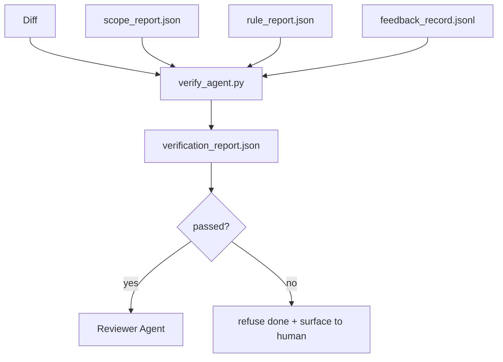

# Verification Gates（验证闸门）

> agent（代理）不能自行标记其工作为完成。验证闸门读取 scope contract（范围契约）、feedback log（反馈日志）、rule report（规则报告）和 diff（差异），回答一个问题：此任务是否真正完成？如果闸门判定否，任务就没完成，无论聊天内容如何。

**类型：** 构建  
**语言：** Python（stdlib）  
**先决条件：** Phase 14 · 33（规则）、Phase 14 · 36（范围）、Phase 14 · 37（反馈）  
**时间：** 约 55 分钟

## 学习目标

- 定义验证闸门为对 workbench artifacts（工作台工件）的确定性函数。 
- 将 rule report（规则报告）、scope report（范围报告）、feedback records（反馈记录）和 diff 合并成单一判定。 
- 输出 reviewer agent（审核代理）和 CI 都能读取的 `verification_report.json`。 
- 在任何 block-severity（阻断严重性）失败时拒绝推进任务，毫无例外。

## 问题所在

agents（代理）太容易宣称成功。三种失败典型表现：

- “看起来不错。”模型读取自己的 diff 并决定正确。 
- “测试通过。”信心十足，但无测试真实运行记录。 
- “验收达成。”验收条件解释得足够宽松，等同于“任何看起来完成的东西”。

workbench 的解决方案是单一验证闸门，读取代理已产出的工件并做出判断。闸门是确定性的，闸门受版本控制，闸门接入 CI，代理无法行贿。

## 概念



### 闸门检查内容

| 检查项 | 来源工件 | 严重性 |
|--------|----------|---------|
| 所有验收命令运行完毕 | `feedback_record.jsonl` | block |
| 所有验收命令均零退出 | `feedback_record.jsonl` | block |
| 范围检查无禁止写入 | `scope_report.json` | block |
| 范围检查无越界写入 | `scope_report.json` | block 或 warn |
| 所有阻断级规则通过 | `rule_report.json` | block |
| feedback 中无 `null` 退出码 | `feedback_record.jsonl` | block |
| 触及文件与 `scope.allowed_files` 匹配 | 均有 | warn |

`warn` 发现会注释判定；`block` 发现则阻止 `passed: true`。

### 确定性，而非概率性

闸门必须对同一套工件每次做出相同判定。不允许使用 LLM judges。LLM 裁判归 reviewer 端（Phase 14 · 39），其目标是定性评估，而非状态判定。

### 一报一链路

闸门每次任务关闭时输出一个 `verification_report.json`，存于 `outputs/verification/<task_id>.json`。CI 也消费同一路径。多个闸门若路径不同，则分叉事实来源。

### 拒绝无例外

阻断级（block-severity）发现不能被代理覆盖，只允许由人工覆盖，且需记录 `override_reason` 和 `overridden_by` 用户 ID。覆盖必须是签名变更，不是代理决策。

## 构建它

`code/main.py` 实现了：

- 各输入工件加载器，全部本地模拟，保证课程自包含。  
- 纯函数 `verify(task_id, artifacts) -> VerdictReport`。  
- 打印器显示每项检查结果和最终通过/失败。  
- 三个任务场景演示：干净通过、范围扩展、缺失验收。  

运行它：

```bash
python3 code/main.py
```

输出：三个判定报告，均保存于脚本旁。

## 实战中的生产模式

四种模式使闸门从“另一个 lint 任务”晋升为“决定性边缘”。

**纵深防御，不只单闸门。**  
Pre-commit 钩子 → CI 状态检查 → 预工具授权钩子 → 预合并闸门。每层都确定性，某层失败由下一层捕获。microservices.io 2026 年 3 月手册明示：pre-commit 钩子不可绕过，因其非依赖模型侧技能，不需代理服从指令。验证闸门处于 CI / 预合并层。

**确定性检查保防御，模型裁判只评细节。**  
Anthropic 2026 混合标准配对：可验证奖赏（单元测试、schema 检查、退出码）回答“代码是否解决了问题？” — LLM 评级回答“代码是否可读、安全、风格合规？”闸门执行前者；审核员（Phase 14 · 39）负责后者。二者混合会削弱信号。

**签名覆盖日志，不是 Slack 讨论串。**  
每次覆盖都会输出一行到 `outputs/verification/overrides.jsonl`，包含时间戳、发现代码、原因、签名用户、当前 HEAD commit。运行时拒绝无签名覆盖；审计链由 git 追踪。这是覆盖策略和覆盖表演的界限。

**覆盖率底线作为一等公民检查。**  
`coverage_report.json` 供给一个 `coverage_floor`（默认 80%）检查。若覆盖率低于底线或较之前合并的底线低超过 1 个百分点，闸门失败。无此检查，代理可能偷偷删减失败测试且验证报告仍旧绿灯。

**`--strict` 模式将 warn 升级为 block。**  
针对发布分支、阻断 PR 或事故后处理，`--strict` 让所有警告变硬失败。此标志分支选择启用，不全局默认，因严格模式会腐蚀日常流程。

## 使用它

生产模式：

- **CI 步骤。** `verify_agent` 任务对代理最终工件运行闸门。无 `passed: true` 拒绝合并保护。  
- **预交接钩子。** 代理运行时调用闸门，绿灯才生成交接文档。  
- **人工分流。** 当代理声称成功但人工怀疑时，运维读取报告。  

闸门是工作台流程中的最终决策边缘。其他界面均在上游。

## 交付它

`outputs/skill-verification-gate.md` 将闸门接入特定项目：哪些验收命令输入，哪些规则为阻断级，允许哪些越界写入，覆盖审计日志如何存储。

## 练习

1. 添加 `coverage_floor` 检查：测试命令必须产出覆盖率报告，且最低不低于 80%。确定底线存放于哪个工件。  
2. 支持 `--strict` 模式，将每条 `warn` 升级为 `block`。记录何种情况下严格模式为合适默认。  
3. 让闸门生成除 JSON 外的 Markdown 摘要。论证哪些字段应包含于摘要。  
4. 增加 `time_since_last_human_touch` 检查：任何文件在最后一次人工敲击后 60 秒内编辑者可免除越界标记。  
5. 在你的产品中运行闸门检测一个真实代理 diff。多少发现是真实问题，多少是噪音？闸门还需在哪些方面成长？

## 关键术语

| 术语 | 常见说法 | 实际含义 |
|------|----------|----------|
| Verification gate（验证闸门） | “阻止出错的检查” | 对工作台工件的确定性函数，生成通过/失败判定 |
| Block severity（阻断严重性） | “硬失败” | 阻止 `passed: true`，需签名覆盖的发现 |
| Override log（覆盖日志） | “为什么放行” | 签名条目含原因及用户 ID，经过审核 |
| Acceptance command（验收命令） | “证明” | 零退出的 shell 命令，表示任务 `done` |
| One report path（唯一报告路径） | “事实来源” | `outputs/verification/<task_id>.json`，供 CI 和人工使用 |

## 延伸阅读

- [Anthropic, Harness design for long-running application development](https://www.anthropic.com/engineering/harness-design-long-running-apps)  
- [OpenAI Agents SDK guardrails](https://platform.openai.com/docs/guides/agents-sdk/guardrails)  
- [microservices.io, GenAI dev platform: guardrails](https://microservices.io/post/architecture/2026/03/09/genai-development-platform-part-1-development-guardrails.html) — pre-commit 与 CI 之间的纵深防御  
- [ICMD, The 2026 Playbook for Agentic AI Ops](https://icmd.app/article/the-2026-playbook-for-agentic-ai-ops-guardrails-costs-and-reliability-at-scale-1776661990431) — 审批闸门阶梯（草稿 → 审批 → 阈值下自动）  
- [Type-Checked Compliance: Deterministic Guardrails (arXiv 2604.01483)](https://arxiv.org/pdf/2604.01483) — Lean 4 作为确定性闸门的上界  
- [logi-cmd/agent-guardrails — merge gate spec](https://github.com/logi-cmd/agent-guardrails) — 范围与变异测试闸门  
- [Guardrails AI x MLflow](https://guardrailsai.com/blog/guardrails-mlflow) — 将确定性验证器用作 CI 分数器  
- [Akira, Real-Time Guardrails for Agentic Systems](https://www.akira.ai/blog/real-time-guardrails-agentic-systems) — 预/后工具闸门  
- Phase 14 · 27 — prompt injection（提示注入）防御（闸门的对立面）  
- Phase 14 · 36 — 该闸门执行的范围契约  
- Phase 14 · 37 — 该闸门评分的反馈日志  
- Phase 14 · 39 — 闸门交接的审核代理
