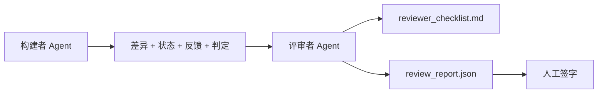

# Reviewer Agent: 将构建者与评审者分离

> 编写代码的 agent 不能对其代码进行评分。评审者是第二个循环，具有不同的系统提示、不同的目标，并且对构建者生成的所有内容拥有只读访问权限。构建者与评审者之间的差距是大部分可靠性的来源。

**类型：** 构建  
**语言：** Python（标准库）  
**前置条件：** 第14阶段 · 38（验证门）  
**时间：** ~55 分钟

## 学习目标

- 说明为什么同一个 agent 不能可靠地审查自己的工作。  
- 构建一个评审者 agent 循环，消耗构建者的产物并输出结构化的评审报告。  
- 编写一个评审者评分标准（rubric），对具体维度打分，而不是凭感觉。  
- 将评审者接入工作台，使人工评审步骤从真实产物开始。

## 问题背景

你让 agent 修复一个 bug。它修改了四个文件，运行了测试，报告完成。验证门（第14阶段 · 38）确认验收运行且作用域保持不变。验证门显示 `passed: true`。你合并了代码。两天后你发现修复解决的是错误的一半问题。

验收是必要的，但不足够。评审者提出验收不能问的问题：这真的解决了正确的问题吗？是否无提示地扩展了作用域？是否将应质疑的假设记录了？是否让工作台处于下一次会话可以无缝接续的状态？

## 概念



### 评审者评分标准（rubric）

五个维度，每个维度得分 0 到 2。

| 维度         | 关键问题                                                               |
|--------------|------------------------------------------------------------------------|
| 问题适配度   | 该变更是否解决了任务中陈述的问题，而非邻近问题？                      |
| 作用域纪律   | 修改是否局限于合同范围，还是合同被有意扩展了？                         |
| 假设         | 所有隐含假设是否已被记录在某处以供审查？                              |
| 验证质量     | 验收命令是否真正证明了目标，还是证明了一个较弱的版本？               |
| 交接准备度   | 下一次会话是否能从当前状态干净地接续工作？                            |

总分满分 10 分。低于 7 分为软失败；低于 5 分为硬失败。

### 评审者是一个独立角色，不是独立模型

你可以使用与构建者相同的模型运行评审者。纪律在于角色区分：不同的系统提示、不同输入、不具备修改差异的写权限。姿态的变化即信号的变化。

### 评审者不能修改差异（diff）

评审者读取差异、状态、反馈和判定。它写报告，不修改差异。如果报告说“修复这个”，则下一轮构建者进行修复，评审者继续审查。混合角色会破坏该差距。

### 评审者评分标准与验证门的区别

验证门（第14阶段 · 38）检查确定性事实：验收是否运行，规则是否通过，作用域是否保持。评审者做定性判断：这是正确工作吗？是否有文档？交接是否可用。两者皆不可少。

## 构建它

`code/main.py` 实现了：

- 一个 `ReviewerInputs` 数据类，打包评审者读取的产物。  
- 一个评分规则函数，每个维度一个函数，函数是课上用的确定性桩，真实实现会调用 LLM。  
- 一个写入 `review_report.json` 的功能，包含五个得分、总分及判定（`pass`、`soft_fail`、`hard_fail`）。  
- 两个演示案例：一次干净的修改和一次“测试正确，问题错误”的修改。

运行命令：

```text
python3 code/main.py
```

输出：两个评审报告写入磁盘，并在控制台输出维度得分表。

## 生产中的模式示例

事实案例：Cloudflare 2026 年 4 月的 AI 代码评审系统，在 30 天内处理了 5,169 个仓库中 48,095 个合并请求，共计 131,246 次评审。中位评审耗时 3 分 39 秒。最多有七个领域专家评审（安全、性能、代码质量、文档、发布管理、合规、Engineering Codex）并行运行，由一个评审协调员去重并评估严重性。最高端模型仅由协调员使用；专家使用成本更低的模型。

四种模式使其可规模化：

**专家池，而非单一评审者。** 一个带五维度评分标准的评审者适合单一仓库。代码库一旦涉及安全、性能、文档等多面，拆分为专家组，每组对应更小的提示。协调员做去重，专家不跑完整评分标准。模型层次分明：便宜的专家，昂贵的协调员。

**把偏差缓解视为设计需求而非优化。** LLM 评委展现四个可靠偏差（Adnan Masood，2026年4月）：位置偏差（GPT-4 在 (A,B) 和 (B,A) 顺序判断上约有 40% 不一致），冗长偏差（约 15% 得分偏向长文输出），自我偏好（评委偏向相同模型族输出），权威偏差（评委高估已知作者引用）。缓解方法：评估两种顺序，只数一致胜利；使用明确奖赏简洁的 1-4 级评分；评委跨模型家族轮换；计分前去掉作者名。

**校准集，而非凭感觉。** 一个含 10-20 个任务的历史集，带已知正确判定。每次修改提示时都在上面跑评审者。若与历史记录一致度低于 80%，则评分标准需修改后再发布。每支团队最终都会重新发现这点，最好一开始就采用。

**与验证门的混合规范。** 验证门（第14阶段 · 38）负责确定性检查（验收是否运行，测试是否通过，作用域是否持稳）。评审者负责语义检查（这是不是正确的工作，假设是否有文档，交接是否好用）。Anthropic 2026 指南明确这一分工：不要让评审者重新做验证门已验证的事情。

## 使用它

生产模式：

- **Claude Code 子代理。** 构建任务完成后运行评审子代理，在 PR 发布带有评分标准得分的评论。  
- **OpenAI Agents SDK 交接。** 构建者完成任务后交接给评审者。评审者可以返回发现列表或交给人类。  
- **双模型配对。** 构建者用快速低成本模型运行。评审者用更强模型但上下文更小，专注判断。

当人类无法完成所有评审时，评审者是工作台增加的“第二双眼”。

## 发布它

`outputs/skill-reviewer-agent.md` 生成项目专用评审评分标准、与构建者产物接口的评审者代理桩，以及与验证门的集成，使人工评审从书面报告开始，而非空白页。

## 练习

1. 为你的产品领域添加第六个维度。论证它为何不能被现有五维吸收。  
2. 用两个不同系统提示（简洁、冗长）运行评审者。哪一个产出的人类更可能阅读的报告？  
3. 为每个维度添加 `confidence` 字段。当最低维度信心低于 0.6 时拒绝发布该报告。  
4. 构建一个校准集：10 个历史任务结案，带已知正确判定。跑评审者，找出与历史记录不符的地方。  
5. 添加“请求更多证据”功能：评审者可以请求构建者提供具体测试运行再评分。如何设计合理的退避机制防止循环？

## 关键术语

| 术语            | 常说                | 实际含义                                         |
|-----------------|---------------------|--------------------------------------------------|
| 评审者评分标准  | “检查清单”          | 五维度 0-2 分，每维度附带书面问题                   |
| 软失败          | “需要修改”          | 总分低于 7；构建者收到待处理发现                     |
| 硬失败          | “拒绝”              | 总分低于 5 或任一维度为 0；停止并反馈给人工             |
| 角色分离        | “不同提示”          | 同一模型可做两个角色；纪律体现在输入与姿态          |
| 信心底限        | “不发布低信号报告”  | 评分标准不确定时拒绝输出判定                         |

## 拓展阅读

- [OpenAI Agents SDK 交接](https://platform.openai.com/docs/guides/agents-sdk/handoffs)  
- [Anthropic Claude Code 子代理](https://docs.anthropic.com/en/docs/agents-and-tools/claude-code/sub-agents)  
- [Cloudflare，规模化 AI 代码评审编排](https://blog.cloudflare.com/ai-code-review/) — 七专家 + 协调员架构，131k 次运行 / 30 天  
- [Agent-as-a-Judge: 用 agent 评估 agent（OpenReview / ICLR）](https://openreview.net/forum?id=DeVm3YUnpj) — DevAI 基准，366 层次化解决方案需求  
- [Adnan Masood，基于评分标准的评估与 LLM 评委：方法论、偏差及实证验证](https://medium.com/@adnanmasood/rubric-based-evals-llm-as-a-judge-methodologies-and-empirical-validation-in-domain-context-71936b989e80) — 四种偏差及缓解措施  
- [MLflow，LLM 评委评估](https://mlflow.org/llm-as-a-judge) — 分离构建者与评估器的生产工具  
- [LangChain，如何用人工修正校准 LLM 评委](https://www.langchain.com/articles/llm-as-a-judge) — 校准集工作流  
- [Evidently AI，LLM 评委完整指南](https://www.evidentlyai.com/llm-guide/llm-as-a-judge)  
- [Arize，LLM 作为评委 — 入门与预制评估器](https://arize.com/llm-as-a-judge/)  
- 第14阶段 · 05 — Self-Refine 和 CRITIC（单 agent 自我审查基线）  
- 第14阶段 · 30 — 基于评测驱动的 agent 开发（校准集生成器）  
- 第14阶段 · 38 — 评审者读取的验证门  
- 第14阶段 · 40 — 评审报告喂入的交接包
