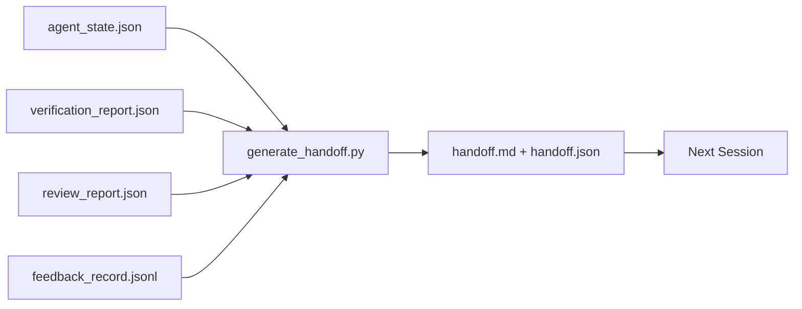

# 多会话交接（Multi-Session Handoff）

> 会话即将结束，但工作未完成。交接包（handoff packet）是将“代理工作了一个小时”转化为“下一会话第一分钟即高效”的工件。请有意设计它，而非事后补充。

**类型：** 构建  
**语言：** Python（标准库）  
**先决条件：** 阶段 14 · 34（仓库内存 Repo Memory），阶段 14 · 38（验证 Verification），阶段 14 · 39（复审 Reviewer）  
**时间：** ~50 分钟

## 学习目标

- 识别每个交接包必需包含的七个字段。  
- 从工作台工件（workbench artifacts）自动生成交接，而非手写文本。  
- 将大型反馈日志精简为交接包尺寸的摘要。  
- 使下一会话的首个动作具有确定性。

## 问题描述

会话结束，代理说“很好，我们取得进展了。”下一会话打开，下一代理问“我们停在哪里了？”第一个代理的答案消失了。下一代理重新发现、重新运行相同命令，重新问人类同样问题，浪费三十分钟来恢复上次会话的最后三十秒内容。

劣质交接的代价在任务生命周期内每会话支付。解决方案是在会话结束时自动生成交接包：变更了什么，为什么变更，尝试了什么，失败了什么，剩下什么，下一次先做什么。

## 概念



### 每个交接包包含的七个字段

| 字段 | 回答的问题 |
|-------|---------------------|
| `summary` | 一个段落总结做了什么 |
| `changed_files` | 一目了然的差异（diff） |
| `commands_run` | 实际执行的命令 |
| `failed_attempts` | 试过什么，为什么没成功 |
| `open_risks` | 可能困扰下一会话的风险和严重程度 |
| `next_action` | 下一会话的第一个具体操作 |
| `verdict_pointer` | 指向验证和复审报告的路径 |

`next_action` 字段是承重关键。缺少 `next_action` 的交接包仅是状态报告，不是真正的交接。

### 交接包是生成的，而非手写的

手写的交接包容易在忙碌时被跳过。生成器读取工作台工件并输出交接包。代理的职责是将工作台状态保持在生成器能概括的状态，而非写摘要。

### 两种形式：人类可读与机器可读

`handoff.md` 是供人类阅读的，`handoff.json` 是供下一代理加载的。两者都基于同一源工件生成。如果两者不一致，以 JSON 为准。

### 反馈日志精简

完整的 `feedback_record.jsonl` 可能有数百条目。交接包只带最后 K 条和所有非零退出条目。下一会话在需要时加载完整日志，但包体保持小巧。

## 构建它

`code/main.py` 实现了：

- 一个加载器，聚合状态、判决、复审、反馈为一个 `WorkbenchSnapshot`。  
- 一个 `generate_handoff(snapshot) -> (markdown, payload)` 函数。  
- 一个筛选器，选取最后 K 条反馈及所有非零退出。  
- 一个演示运行，写入 `handoff.md` 和 `handoff.json` 于脚本旁。

运行命令：

```text
python3 code/main.py
```

输出：打印交接内容，且在磁盘上生成两个文件。

## 生产环境中模式

Codex CLI、Claude Code 和 OpenCode 各自有不同的压缩方案；结构化交接包位于三者之上。

**压缩策略不同，包架构不变。** Codex CLI 的 POST /v1/responses/compact 是服务端不透明的 AES 加密数据（OpenAI 模型的快速路径）；回退方案是本地的“handoff summary”，作为 `_summary` 用户角色消息附加。Claude Code 在 95% 上下文中执行五阶段渐进压缩。OpenCode 采用基于时间戳的消息隐藏加五段大纲式 LLM 摘要。三种机制，同一需求：将压缩结果序列化为可移植工件。交接包即该工件。

**新会话交接非压缩。** 压缩是延续会话；交接是优雅关闭当前会话并启动下一个。Hermes Issue #20372（2026 年 4 月）阐述正确：当原位压缩质量下降时，代理应写出紧凑交接包，结束会话，在新上下文中恢复。交接包使转移高效。错误是一直压缩直到质量崩溃，正确做法是预留早期干净交接的预算。

**每个分支和话题保持一个活动交接。** 多代理协调中，过时交接比模型输出差更致命。务必包含 `branch`，`last_known_good_commit` 和状态 `active | superseded | archived`。过时交接归档，只有活动交接驱动下一会话。区别于仅为笔记的交接，真正意义上的交接是状态。

**会话结束点在上下文的 50-75%，而非资源耗尽点。** 手写模板（CLAUDE.md + HANDOVER.md）报告，在会话耗用 50-75% 上下文预算时结束效果最佳，不是 95%。此时生成器运行干净，未受上下文污染。上下文完整时生成低成本，模型丧失上下文时代价高。

## 使用它

生产模式：

- **会话结束钩子。** 用户关闭聊天时，运行生成器。包写入 `outputs/handoff/<session_id>/`。  
- **PR 模板。** 生成的 markdown 也用作 PR 描述。复审无需打开多文件。  
- **跨代理交接。** 用一种产品（Claude Code）构建，另一种（Codex）继续。交接包是通用语言。

交接包小巧、规范、低成本。每个会话累积节省费用。

## 发布它

`outputs/skill-handoff-generator.md` 生成一个针对项目工件路径调优的生成器，配套会话结束钩子以运行生成器，还有下一代理启动时读取的 `handoff.json` 架构。

## 练习

1. 添加 `assumptions_to_validate` 字段，列出所有构建者记录但复审分数未达 1 分的假设。  
2. 针对失败与成功运行，差异化反馈摘要精简，论证这种不对称合理性。  
3. 增加“待人类解答的问题”列表。什么阈值下的问题放入包，比放进聊天消息更合适？  
4. 使生成器幂等：运行两次产生同一交接包。为此需哪些稳定因素？  
5. 增添“下一会话前提”部分，详列下一会话启动前必须加载的工件。

## 术语表

| 术语 | 口语说法 | 实际含义 |
|------|----------|---------------------|
| 交接包（Handoff packet） | “会话总结” | 生成的含七个字段的工件，既有 markdown 也有 JSON |
| 下一步动作（Next action） | “先做什么” | 启动下一会话的具体第一步 |
| 反馈精简（Feedback trim） | “日志摘要” | 最后 K 条记录加所有非零退出 |
| 状态报告（Status report） | “做了什么” | 缺少 `next_action` 的文档，有用但非交接 |
| 判决指针（Verdict pointer） | “凭证” | 指向验证和复审报告路径以便追溯 |

## 延伸阅读

- [Anthropic，长运行代理的有效约束](https://www.anthropic.com/engineering/effective-harnesses-for-long-running-agents)  
- [OpenAI Agents SDK 交接](https://platform.openai.com/docs/guides/agents-sdk/handoffs)  
- [Codex 博客，Codex CLI 上下文压缩：架构、配置、长会话管理](https://codex.danielvaughan.com/2026/03/31/codex-cli-context-compaction-architecture/) — POST /v1/responses/compact 与本地回退  
- [Justin3go，剥离沉重记忆：Codex、Claude Code 和 OpenCode 的上下文压缩](https://justin3go.com/en/posts/2026/04/09-context-compaction-in-codex-claude-code-and-opencode) — 三厂商压缩对比  
- [JD Hodges，Claude 交接提示：如何跨会话保持上下文（2026）](https://www.jdhodges.com/blog/ai-session-handoffs-keep-context-across-conversations/) — CLAUDE.md + HANDOVER.md，50-75% 上下文预算  
- [Mervin Praison，多代理编码会话交接管理：新上下文不丢失连贯性](https://mer.vin/2026/04/managing-handoffs-in-multi-agent-coding-sessions-fresh-context-without-losing-continuity/) — 分布式系统框架  
- [Hermes Issue #20372 — 压缩风险升高时自动新会话交接](https://github.com/NousResearch/hermes-agent/issues/20372)  
- [Hermes Issue #499 — 上下文压缩质量大修](https://github.com/NousResearch/hermes-agent/issues/499) — Codex CLI 中以交接为导向的提示  
- [Microsoft Agent Framework，压缩](https://learn.microsoft.com/en-us/agent-framework/agents/conversations/compaction)  
- [OpenCode，上下文管理与压缩](https://deepwiki.com/sst/opencode/2.4-context-management-and-compaction)  
- [LangChain，代理的上下文工程](https://www.langchain.com/blog/context-engineering-for-agents)  
- 阶段 14 · 34 — 生成器读取的状态文件  
- 阶段 14 · 38 — 交接包指向的验证判决  
- 阶段 14 · 39 — 包含于交接包的复审报告
