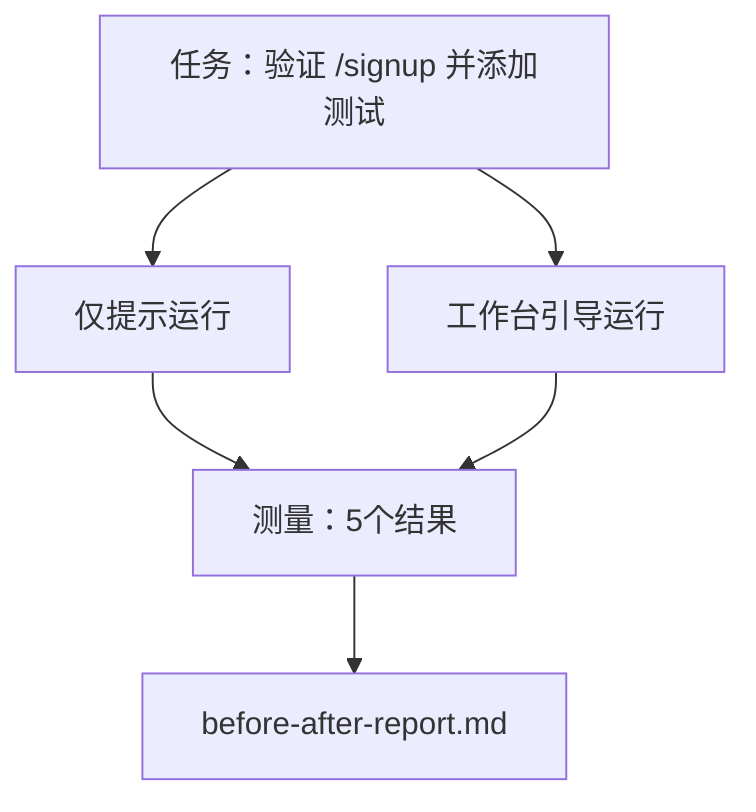

# 在真实仓库中的工作台

> 十一课的表面功夫如果无法经受住真实代码库的考验，那么一文不值。本课在一个小型示例应用上对同一任务运行两次：仅提示（prompt-only）与工作台引导（workbench-guided）。数字会说明一切。

**类型：** 构建  
**语言：** Python（标准库）  
**先决条件：** 阶段 14 · 32 至 14 · 40  
**时间：** 约60分钟

## 学习目标

- 在一个小型应用上整合七个工作台表面。
- 运行同一任务两次（仅提示和工作台引导）并测量五项结果。
- 阅读前后报告，判断哪些表面带来了最大影响。
- 面对“但我的模型已经足够好”的质疑，有理有据地捍卫工作台。

## 问题描述

单纯在玩具任务上的演示无法说服任何人。真正能证明工作台有效的是，当一个真实感任务在真实感仓库中上线生产时，失败率更低，回滚更少，并且产生可供下一会话使用的交接包。

本课提供了这个真实感仓库，并分别用两条流水线运行相同的任务。结果是你能提供给怀疑者的前后对比报告。

## 概念图



### 示例应用

在 `sample_app/` 中的一个最简 FastAPI 风格处理器：

- `app.py` 包含 `/signup`（尚无验证）。
- `test_app.py` 包含一个成功路径测试。
- `README.md` 和 `scripts/release.sh` 作为禁区诱饵。

### 任务说明

> 为 `/signup` 添加输入验证：拒绝少于8个字符的密码，返回带类型错误包的422状态码。添加一个测试以证明新行为生效。

### 两条流水线

仅提示：

1. 阅读 README。
2. 阅读 `app.py`。
3. 编辑文件。
4. 声称完成。

工作台引导：

1. 运行初始化脚本（第35课）。
2. 阅读范围合同（第36课）。
3. 阅读状态（第34课）。
4. 仅编辑允许文件。
5. 通过反馈运行器运行验收命令（第37课）。
6. 运行验证关卡（第38课）。
7. 运行审查器（第39课）。
8. 生成交接包（第40课）。

### 测量的五项结果

| 结果                     | 意义说明                           |
|--------------------------|----------------------------------|
| `tests_actually_run`      | 大多数“测试通过”声明无法验证        |
| `acceptance_met`          | 证明目标的测试必须是实际运行的测试  |
| `files_outside_scope`     | 范围蔓延是主要的无声失败            |
| `handoff_quality`         | 下一会话支付或受益于此交接包        |
| `reviewer_total`          | 基于关卡的定性评判                  |

## 构建实现

`code/main.py` 协调两条流水线针对相同的示例应用夹具运行。两条流水线均通过脚本实现（无大语言模型（LLM）参与），以确保测量可复现。脚本将对比结果写入 `before-after-report.md` 与 `comparison.json`。

运行命令：

```text
python3 code/main.py
```

输出：控制台显示每条流水线的结果表，markdown格式报告保存在脚本旁，JSON用于需要绘图的场景。

## 真实生产中的模式

怀疑者的问题是：“工作台到底帮了多少忙？” 2026年的数据揭示了远超解释本身的效果。

**Terminal Bench 前30名一举提升至前5名。** LangChain 《Anatomy of an Agent Harness》（2026年4月）：一个编码代理仅通过更换harness，从Terminal Bench 2.0的第30名以外跃升至第5名。模型不变，表面不同，排名提升25位。

**Vercel 删除工具使成功率从80%提高至100%。** Vercel 报告称删除代理80%的工具，成功率从80%升至100%。工具面缩小，范围更聚焦，失败途径更少。负空间获胜。

**Harvey 仅凭harness优化准确度翻倍。** 法律代理通过优化harness，准确率提升超过2倍，无需更换模型。

**88%的企业AI代理项目未能进入生产。** preprints.org《Harness Engineering for Language Agents》论文（2026年3月）指出失败源于运行时问题而非推理：过期状态、脆弱重试、上下文膨胀、中间错误恢复差。

**长上下文崩溃。** WebAgent基线成功率40-50%在长上下文条件下跌至不足10%，多因无限循环和目标丢失产生。Ralph Loop和交接包机制即为应对之策。

**假阴性依然存在。** 单步事实性任务、一行lint、格式化运行、任何模型完全记忆的内容——这些仅用提示运行更快。基准应诚实列举它们，以免工作台被视作过度设计。

关键结论不是“harness 永远获胜”，模型随着时间吸收harness技巧。结论是目前，工程负载集中在这七个表面，数字证明了这一点。

## 使用场景

当出现以下情况时，本课即为你引用的案例：

- 有人质疑为何每个PR都附带 `agent-rules.md` 和范围合同。
- 团队想取消“仅此一冲刺”的验证关卡。
- 新产品上线，你需要一个可移植的基准来验证其是否真的节省时间。

数字的说服力远胜解释。

## 发布使用

`outputs/skill-workbench-benchmark.md` 是一个可移植的评估harness，可将任意代理产品通过两条流水线运行，基于项目自身示例应用报告五项结果。

## 练习

1. 添加第六项结果：首次有意义编辑所需时间。如何清晰衡量？
2. 在你代码库中真实的二日任务上运行对比。工作台数字在哪些环节下滑？
3. 添加一轮“假阴性”检测：提示运行更快且工作台开销真实存在的任务。尝试为继续使用工作台辩护。
4. 用真实LLM调用替换脚本化“代理”。哪些结果变得更噪声？
5. 编写一页面向非工程师的摘要。哪些内容能保留下来？

## 关键词

| 术语             | 常见说法             | 实际含义                                  |
|------------------|----------------------|-------------------------------------------|
| Sample app       | “玩具仓库”           | 体积小但足够真实，能覆盖所有七个表面         |
| Pipeline         | “工作流程”           | 代理遵循的一系列表面读写顺序                   |
| Before/after report | “凭证”             | 你提供给怀疑者的成果物                        |
| False negative   | “工作台过度设计”      | 提示运行更快的任务；诚实列举有益于判断使用场景  |
| Workbench benchmark | “可靠性评分”       | 在你代码库上运行对比的可移植harness              |

## 拓展阅读

- [LangChain, The Anatomy of an Agent Harness](https://blog.langchain.com/the-anatomy-of-an-agent-harness/) — Terminal Bench 前30到前5名案例  
- [MongoDB, The Agent Harness: Why the LLM Is the Smallest Part of Your Agent System](https://www.mongodb.com/company/blog/technical/agent-harness-why-llm-is-smallest-part-of-your-agent-system) — Vercel + Harvey 数据  
- [preprints.org, Harness Engineering for Language Agents](https://www.preprints.org/manuscript/202603.1756) — 88%企业失败率，运行时根因分析  
- [HN: Improving 15 LLMs at Coding in One Afternoon. Only the Harness Changed](https://news.ycombinator.com/item?id=46988596) — 跨15模型复现  
- [Cloudflare, Orchestrating AI Code Review at Scale](https://blog.cloudflare.com/ai-code-review/) — 13.1万次审核运行 / 30天生产环境  
- [Anthropic, Building Effective Agents](https://www.anthropic.com/research/building-effective-agents)  
- 阶段 14 · 32 至 14 · 40 — 本课涵盖的端到端表面  
- 阶段 14 · 19 — 本课补充的宏基准 SWE-bench、GAIA、AgentBench  
- 阶段 14 · 30 — 评价驱动代理开发，harness复用方案
