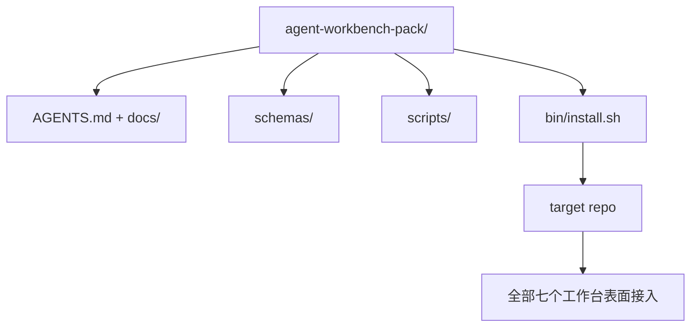

# Capstone：发布可重用的 Agent 工作台包

> 该小系列课程以一个可以放入任何仓库的包结尾。十一节课程内容浓缩为一个目录，您可以通过 `cp -r` 复制，并在第二天早上让代理可靠工作。该 Capstone 即为本课程重点交付物。

**类型：** 构建  
**语言：** Python（stdlib 标准库）  
**先决条件：** 阶段 14 · 31 至 14 · 41  
**时长：** ~75 分钟

## 学习目标

- 将七个工作台表面整合打包成一个即插即用目录。
- 锁定 schemas、脚本和模板，确保新仓库获得已知良好的基线。
- 添加单一安装脚本，实现包的幂等安装。
- 决定哪些内容留在包内，哪些内容排除，阐述每项取舍的理由。

## 问题

一个散布于 Google Doc、聊天记录和三份模糊记忆脚本中的工作台，会导致每季度都需重建。解决方案是一个带版本控制的包：包含表面、schemas、脚本和一键安装器的仓库或目录。

本课结尾，您将拥有存放在 `outputs/agent-workbench-pack/` 的包，以及一个可用于任何目标仓库的 `bin/install.sh`。

## 概念



### 包结构

```text
outputs/agent-workbench-pack/
├── AGENTS.md
├── docs/
│   ├── agent-rules.md
│   ├── reliability-policy.md
│   ├── handoff-protocol.md
│   └── reviewer-rubric.md
├── schemas/
│   ├── agent_state.schema.json
│   ├── task_board.schema.json
│   └── scope_contract.schema.json
├── scripts/
│   ├── init_agent.py
│   ├── run_with_feedback.py
│   ├── verify_agent.py
│   └── generate_handoff.py
├── bin/
│   └── install.sh
└── README.md
```

### 包内留存，包外排除

包含：

- 表面 schemas。它们是契约。
- 上述四个脚本。它们负责运行时。
- 四份文档。它们是规则与评价标准。

排除：

- 项目特定任务。任务应归属目标仓库的看板，而非包内。
- 供应商 SDK 调用。包需要保持框架兼容。
- 入门文案。包应放置于团队已有入门文档旁，而非融合其中。

### 安装器

一个简短的 `bin/install.sh`（或 `bin/install.py`）：

1. 无 `--force` 参数时拒绝覆盖已存在包。
2. 将包复制到目标仓库。
3. 目标仓库有 `.github/workflows/` 时，配置 CI。
4. 打印下一步指示：填写看板、设置验收命令、运行初始化脚本。

### 版本控制

包中含 `VERSION` 文件。Schema 升级和需要迁移的脚本改动提升主版本号（major），仅文档改动提升补丁号（patch）。目标仓库的 `agent_state.json` 记录初始化所用的包版本。

## 构建它

`code/main.py` 将包组装至本课相邻的 `outputs/agent-workbench-pack/`，内容基于先前小系列课程的 schemas、脚本与您已编写的文档。

运行：

```text
python3 code/main.py
```

该脚本会复制并锁定表面，生成 README，打印包目录结构，最后以零状态码退出。重复运行操作幂等。

## 生产环境常见模式

包只有经历分叉、更新和不友好上游环境考验后才有价值。以下四个模式确保这一点：

**`VERSION` 是契约，不是宣传语。** 主版本升级需执行状态迁移，次版本需重新运行检查器，补丁版本只涉及文档。安装器每次安装时在目标仓库写入 `.workbench-version`，`lint_pack.py` 若发现包版本与锁定不符则拒绝发布。这就像 `npm`、`Cargo` 和 `pyproject.toml` 经历十年变迁的生存法则，agent 领域无异。

**跨工具分发的单代码源。** Nx 通过一个 `nx ai-setup` 命令一次性布局了 `AGENTS.md`、`CLAUDE.md`、`.cursor/rules/`、`.github/copilot-instructions.md` 和 MCP 服务器。包也应如此；安装器应发布符号链接（`ln -s AGENTS.md CLAUDE.md`），实现一个信息源能分发至所有智能体。为支持某款工具而分叉包是失败模式。

**`uninstall.sh` 拒绝删除非平凡状态。** 卸载包时绝不删除用户的 `agent_state.json`、`task_board.json` 或 `outputs/`。卸载器只删除 schemas、脚本、文档和 `AGENTS.md`（可通过 `--keep-agents-md` 参数保留），若状态文件有任何未提交变更则拒绝继续。状态归用户所有，包无权拥有。

**技能即可发布。SkillKit 式分发。** 包作为 SkillKit 技能发布：`skillkit install agent-workbench-pack` 从单一源同时部署到 32 个 AI 代理。包仓库是真实源，SkillKit 是分发通道。供应商绑定崩解，七个表面保持不变。

## 使用它

该包可用于三个场景：

- **作为目录，放入一个仓库。** `cp -r outputs/agent-workbench-pack /path/to/repo`。
- **作为公开模板仓库。** Fork 并定制，`VERSION` 控制版本漂移。
- **作为 SkillKit 技能。** 集成到您的代理产品中，一键安装。

包即为配方，每次安装即一道菜。

## 发布它

`outputs/skill-workbench-pack.md` 会生成项目定制包：规则针对团队历史调整，范围匹配该仓库，并在评价标准维度上添加一个领域特定条目。

## 练习

1. 决定哪份可选的第五份文档值得纳入官方包，阐述理由。
2. 用 Python 重写安装脚本，添加 `--dry-run` 选项。对比其与 bash 版本的易用性。
3. 添加 `bin/uninstall.sh`，安全移除包，遇到非平凡状态文件则拒绝。何为非平凡？
4. 添加 `lint_pack.py`，在包偏离 `VERSION` 时失败。将其集成到包自身仓库的 CI。
5. 撰写从手工工作台迁移到该包的迁移运行手册。什么操作顺序能最大程度降低停机时间？

## 关键词

| 术语           | 常见说法         | 实际含义                      |
|----------------|------------------|-------------------------------|
| Workbench pack | “入门套件”       | 一个包，包含全部七个工作台表面 |
| Installer      | “安装脚本”       | `bin/install.sh` 实现包的幂等安装 |
| Pack version   | “VERSION”       | 主版本针对 schema/脚本更改，补丁仅文档 |
| Drop-in pack   | “拷贝即用”       | 包第一天起即无需仓库定制即可工作  |
| Forkable template | “GitHub 模板” | GitHub “使用此模板”可克隆的公开仓库 |

## 拓展阅读

- 阶段 14 · 31 至 14 · 41 — 包含的所有表面  
- [SkillKit](https://github.com/rohitg00/skillkit) — 跨 32 个 AI 代理安装该技能  
- [Nx Blog，教你的 AI 代理如何在 Monorepo 工作](https://nx.dev/blog/nx-ai-agent-skills) — 六个工具共享的单一配置生成器  
- [agents.md — 开放规范](https://agents.md/) — 你的包路由器必须实现的规范  
- [HKUDS/OpenHarness](https://github.com/HKUDS/OpenHarness) — 类包的参考实现  
- [andrewgarst/agentic_harness](https://github.com/andrewgarst/agentic_harness) — 基于 Redis 的带评测套件的参考实现  
- [Augment Code，优秀的 AGENTS.md 是模型升级](https://www.augmentcode.com/blog/how-to-write-good-agents-dot-md-files) — 包文档质量标准  
- [Anthropic，针对长运行代理的高效哈尼斯设计](https://www.anthropic.com/engineering/effective-harnesses-for-long-running-agents)  
- [Anthropic，长运行应用开发的哈尼斯设计](https://www.anthropic.com/engineering/harness-design-long-running-apps)  
- 阶段 14 · 30 — 基于评价驱动的代理开发，使用包的验证门  
- 阶段 14 · 41 — 本包改进前后的基准测试
