# 通信协议

> 不能说同一种语言的代理不是团队。他们只是对虚无大喊的陌生人。

**类型：** 构建  
**语言：** TypeScript  
**先决条件：** 阶段 14（Agent 工程），课程 16.01（为什么多代理）  
**时间：** ~120 分钟

## 学习目标

- 实现 MCP 工具发现和调用，使代理能够使用由外部服务器暴露的工具  
- 构建一个 A2A 代理卡和任务端点，允许一个代理通过 HTTP 将工作委派给另一个代理  
- 比较 MCP（工具访问）、A2A（代理间）、ACP（企业审计）和 ANP（去中心化信任）协议，并解释哪个协议解决了哪个问题  
- 将多个协议连接到一个系统中，让代理通过 MCP 发现工具，通过 A2A 委派任务

## 问题

你将系统拆分成多个代理：研究员、程序员、评审。他们各自擅长自己的工作。但现在你需要他们真正相互交流。

你的第一个尝试显而易见：传递字符串。研究员返回一大段文本，编码者用各种方式解析它。它能工作，直到编码者误解了研究总结，或两个代理互相等待死锁，或需要由不同团队构建的代理协作。突然间，“只是传字符串”崩溃了。

这就是通信协议问题。没有共享的代理间信息交换约定，多代理系统会变得脆弱、无法审计，并且不可能扩展到超过仅你个人开发的少数几个代理。

AI 生态系统提出了四个协议，各自解决问题的不同侧面：

- **MCP** 用于工具访问  
- **A2A** 用于代理间协作  
- **ACP** 用于企业审计  
- **ANP** 用于去中心化身份和信任  

本课程深入探讨这些协议。你将阅读每个规范的真实线格式，构建可用实现，并将四者连接成统一系统。

## 概念

### 协议全景

把这四个协议看成层级，每个层次处理不同的问题：

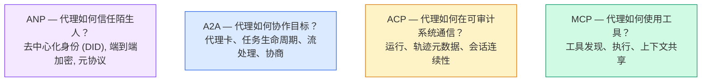

他们不是竞争关系。它们在不同层面解决不同问题。

### MCP（回顾）

MCP 在阶段 13 中有详细介绍。简要回顾：MCP 标准化了一个大语言模型（LLM）如何连接外部工具和数据源。它是一个**客户端-服务器**协议，代理（客户端）发现并调用由服务器暴露的工具。

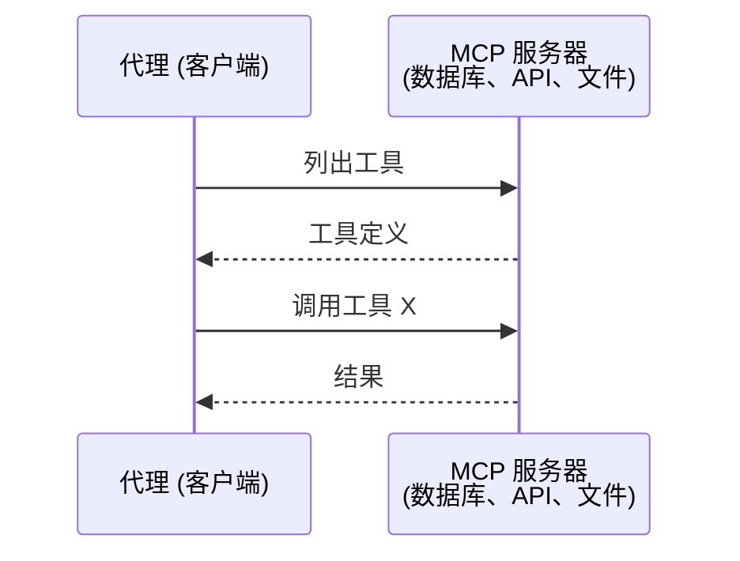

MCP 是**代理到工具**的通信，不支持代理之间的对话。

### A2A（代理间协议）

**创建者：** Google（现由 Linux 基金会维护，名为 `lf.a2a.v1`）  
**规范版本：** 1.0.0  
**问题：** 自主代理如何协作、协商和委派任务？

A2A 是**点对点代理协作**协议。MCP 将代理与工具连接，A2A 将代理与其他代理连接。每个代理在一个知名 URL 发布**代理卡（Agent Card）**，其他代理通过它发现、协商并委派任务。

#### A2A 工作原理

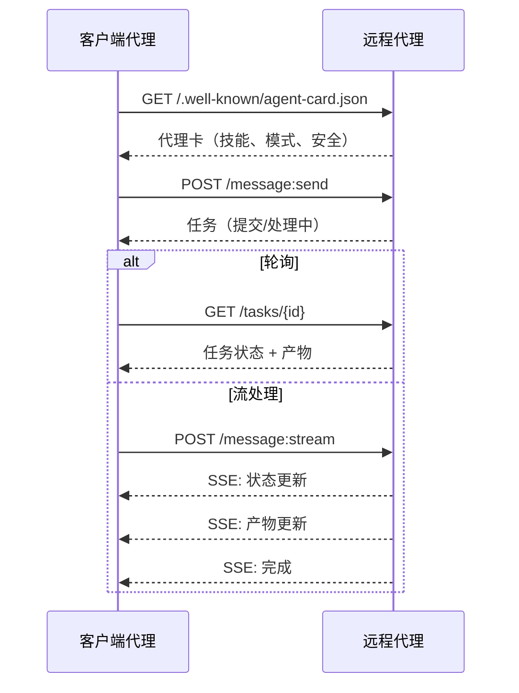

#### 真实代理卡示例

这是一个实际的 A2A 代理卡，位于 `GET /.well-known/agent-card.json`：

```json
{
  "name": "Research Agent",
  "description": "搜索文档并总结发现",
  "version": "1.0.0",
  "supportedInterfaces": [
    {
      "url": "https://research-agent.example.com/a2a/v1",
      "protocolBinding": "JSONRPC",
      "protocolVersion": "1.0"
    },
    {
      "url": "https://research-agent.example.com/a2a/rest",
      "protocolBinding": "HTTP+JSON",
      "protocolVersion": "1.0"
    }
  ],
  "provider": {
    "organization": "Your Company",
    "url": "https://example.com"
  },
  "capabilities": {
    "streaming": true,
    "pushNotifications": false
  },
  "defaultInputModes": ["text/plain", "application/json"],
  "defaultOutputModes": ["text/plain", "application/json"],
  "skills": [
    {
      "id": "web-research",
      "name": "网络研究",
      "description": "搜索网络并综合发现",
      "tags": ["research", "search", "summarization"],
      "examples": ["研究 React 19 的最新变化"]
    },
    {
      "id": "doc-analysis",
      "name": "文档分析",
      "description": "阅读和分析技术文档",
      "tags": ["docs", "analysis"],
      "inputModes": ["text/plain", "application/pdf"],
      "outputModes": ["application/json"]
    }
  ],
  "securitySchemes": {
    "bearer": {
      "httpAuthSecurityScheme": {
        "scheme": "Bearer",
        "bearerFormat": "JWT"
      }
    }
  },
  "security": [{ "bearer": [] }]
}
```

重点说明：  
- **技能（skills）** 表示代理能做的事情。每项技能有 ID、标签和支持的输入/输出 MIME 类型。客户端据此判断远程代理是否能处理请求。  
- **supportedInterfaces** 列出多个协议绑定。一个代理可以同时支持 JSON-RPC、REST 和 gRPC。  
- **安全（Security）** 内置于代理卡，客户端在发起请求前就知道需要何种认证。

#### 任务生命周期

任务是 A2A 的核心工作单元。任务会经历这些定义的状态：

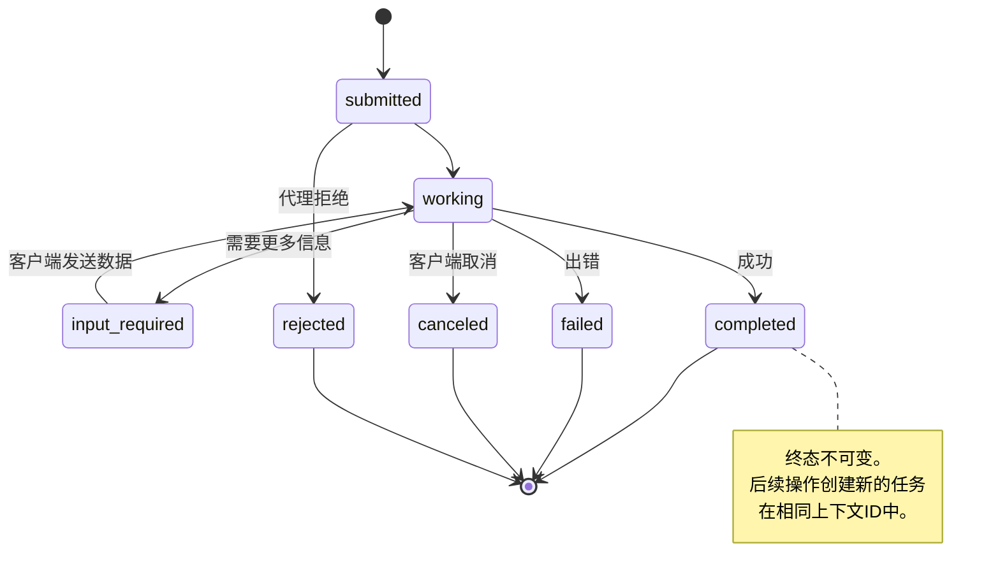

八种状态（规范还定义了一个哨兵状态 `UNSPECIFIED`，此处省略）：

| 状态 | 终态？ | 含义 |
|---|---|---|
| `TASK_STATE_SUBMITTED` | 否 | 已收到，尚未处理 |
| `TASK_STATE_WORKING` | 否 | 正在处理 |
| `TASK_STATE_INPUT_REQUIRED` | 否 | 代理需要更多信息 |
| `TASK_STATE_AUTH_REQUIRED` | 否 | 需要认证 |
| `TASK_STATE_COMPLETED` | 是 | 成功完成 |
| `TASK_STATE_FAILED` | 是 | 出错完成 |
| `TASK_STATE_CANCELED` | 是 | 处理中被取消 |
| `TASK_STATE_REJECTED` | 是 | 代理拒绝任务 |

任务一旦进入终态即不可变，更无后续消息。续发创建新任务但共用相同的 `contextId`。

#### 线格式

A2A 使用 JSON-RPC 2.0。真实消息交换示例如下：

**客户端发送任务：**
```json
{
  "jsonrpc": "2.0",
  "id": 1,
  "method": "SendMessage",
  "params": {
    "message": {
      "messageId": "msg-001",
      "role": "ROLE_USER",
      "parts": [{ "text": "Research React 19 compiler features" }]
    },
    "configuration": {
      "acceptedOutputModes": ["text/plain", "application/json"],
      "historyLength": 10
    }
  }
}
```

**代理返回任务：**
```json
{
  "jsonrpc": "2.0",
  "id": 1,
  "result": {
    "task": {
      "id": "task-abc-123",
      "contextId": "ctx-xyz-789",
      "status": {
        "state": "TASK_STATE_COMPLETED",
        "timestamp": "2026-03-27T10:30:00Z"
      },
      "artifacts": [
        {
          "artifactId": "art-001",
          "name": "research-results",
          "parts": [{
            "data": {
              "findings": [
                "React 19 编译器自动 memoization 组件",
                "不再需要手动 useMemo/useCallback",
                "编译器在构建时运行，不在运行时"
              ]
            },
            "mediaType": "application/json"
          }]
        }
      ]
    }
  }
}
```

**通过 SSE 流处理：**
```text
POST /message:stream HTTP/1.1
Content-Type: application/json
A2A-Version: 1.0

data: {"task":{"id":"task-123","status":{"state":"TASK_STATE_WORKING"}}}

data: {"statusUpdate":{"taskId":"task-123","status":{"state":"TASK_STATE_WORKING","message":{"role":"ROLE_AGENT","parts":[{"text":"正在搜索文档..."}]}}}}

data: {"artifactUpdate":{"taskId":"task-123","artifact":{"artifactId":"art-1","parts":[{"text":"部分发现..."}]},"append":true,"lastChunk":false}}

data: {"statusUpdate":{"taskId":"task-123","status":{"state":"TASK_STATE_COMPLETED"}}}
```

### ACP（代理通信协议）

**创建者：** IBM / BeeAI  
**规范版本：** 0.2.0（OpenAPI 3.1.1）  
**状态：** 正在合并至 Linux 基金会的 A2A  
**问题：** 代理如何实现完全审计、会话连续性和轨迹追踪的通信？

ACP 是**企业级协议**。与许多摘要所说不同，ACP 不使用 JSON-LD。它是基于 OpenAPI 定义的简单 REST/JSON API。其特色是 **TrajectoryMetadata（轨迹元数据）**：每个代理响应都可以携带详细的推理步骤和工具调用日志。

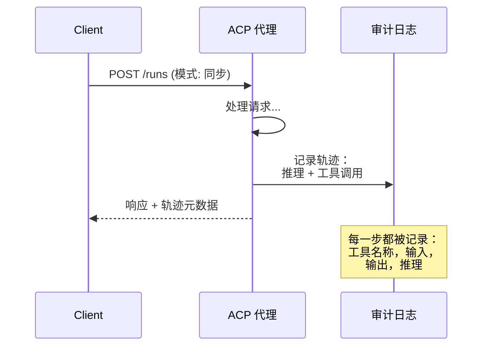

#### ACP 中的代理发现

ACP 定义了四种发现方式：

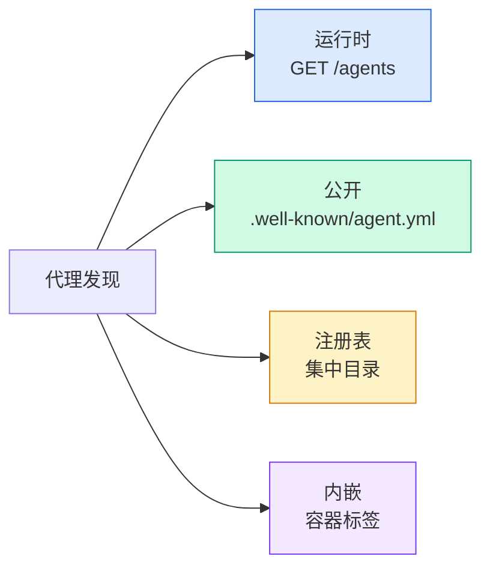

**AgentManifest** 比 A2A 的 Agent Card 更简单：

```json
{
  "name": "summarizer",
  "description": "Summarizes documents with source citations",
  "input_content_types": ["text/plain", "application/pdf"],
  "output_content_types": ["text/plain", "application/json"],
  "metadata": {
    "tags": ["summarization", "RAG"],
    "framework": "BeeAI",
    "capabilities": [
      {
        "name": "Document Summarization",
        "description": "Condenses long documents into key points"
      }
    ],
    "recommended_models": ["llama3.3:70b-instruct-fp16"],
    "license": "Apache-2.0",
    "programming_language": "Python"
  }
}
```

#### 运行生命周期

ACP 使用“Runs”代替“Tasks”。Run 是代理执行的一个实例，具有三种模式：

| 模式 | 行为 |
|---|---|
| `sync` | 阻塞。响应包含完整结果。 |
| `async` | 立即返回 202。轮询 `GET /runs/{id}` 获取状态。 |
| `stream` | SSE 流。代理工作时触发事件。 |

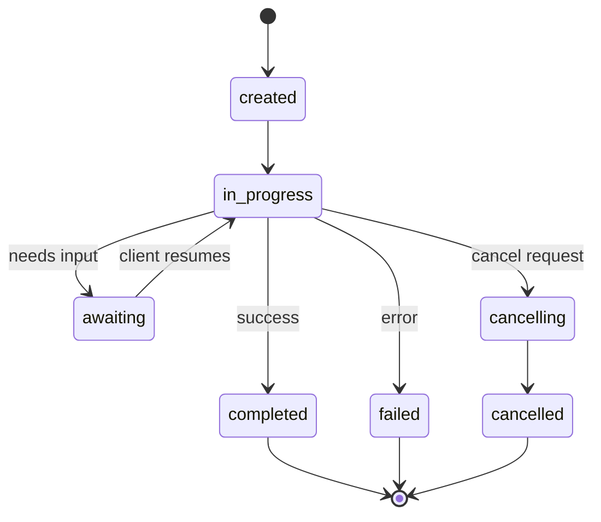

#### TrajectoryMetadata（审计轨迹）

这是 ACP 的关键差异点。每条消息部分都可以包含元数据，精确展示代理的操作：

```json
{
  "role": "agent/researcher",
  "parts": [
    {
      "content_type": "text/plain",
      "content": "The weather in San Francisco is 72F and sunny.",
      "metadata": {
        "kind": "trajectory",
        "message": "I need to check the weather for this location",
        "tool_name": "weather_api",
        "tool_input": { "location": "San Francisco, CA" },
        "tool_output": { "temperature": 72, "condition": "sunny" }
      }
    }
  ]
}
```

对于受监管行业来说，这非常宝贵。每个答案都附带可验证的推理链：调用了哪些工具，使用了什么输入，收到了什么输出。没有黑箱操作。

ACP 还支持 **CitationMetadata** 用于来源引用：

```json
{
  "kind": "citation",
  "start_index": 0,
  "end_index": 47,
  "url": "https://weather.gov/sf",
  "title": "NWS San Francisco Forecast"
}
```

### ANP（Agent Network Protocol，代理网络协议）

**创建者：** 开源社区（由GaoWei Chang创立）  
**仓库：** [github.com/agent-network-protocol/AgentNetworkProtocol](https://github.com/agent-network-protocol/AgentNetworkProtocol)  
**问题：** 不依赖中心权威，来自不同组织的代理如何互相信任？

ANP 是**去中心化身份协议**。它利用 W3C Decentralized Identifiers（DIDs，去中心化身份标识）和端到端加密（E2EE）建立信任。与通过已知端点发现代理的 A2A 不同，ANP 允许代理通过密码学方式证明身份。

ANP 有三层结构：

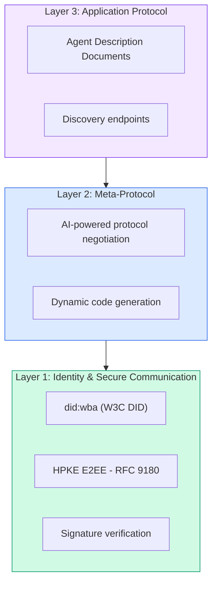

#### DID 文档（真实结构）

ANP 使用名为 `did:wba`（Web-Based Agent，基于网页的代理）的自定义 DID 方法。DID `did:wba:example.com:user:alice` 解析为 `https://example.com/user/alice/did.json`：

```json
{
  "@context": [
    "https://www.w3.org/ns/did/v1",
    "https://w3id.org/security/suites/jws-2020/v1",
    "https://w3id.org/security/suites/secp256k1-2019/v1"
  ],
  "id": "did:wba:example.com:user:alice",
  "verificationMethod": [
    {
      "id": "did:wba:example.com:user:alice#key-1",
      "type": "EcdsaSecp256k1VerificationKey2019",
      "controller": "did:wba:example.com:user:alice",
      "publicKeyJwk": {
        "crv": "secp256k1",
        "x": "NtngWpJUr-rlNNbs0u-Aa8e16OwSJu6UiFf0Rdo1oJ4",
        "y": "qN1jKupJlFsPFc1UkWinqljv4YE0mq_Ickwnjgasvmo",
        "kty": "EC"
      }
    },
    {
      "id": "did:wba:example.com:user:alice#key-x25519-1",
      "type": "X25519KeyAgreementKey2019",
      "controller": "did:wba:example.com:user:alice",
      "publicKeyMultibase": "z9hFgmPVfmBZwRvFEyniQDBkz9LmV7gDEqytWyGZLmDXE"
    }
  ],
  "authentication": [
    "did:wba:example.com:user:alice#key-1"
  ],
  "keyAgreement": [
    "did:wba:example.com:user:alice#key-x25519-1"
  ],
  "humanAuthorization": [
    "did:wba:example.com:user:alice#key-1"
  ],
  "service": [
    {
      "id": "did:wba:example.com:user:alice#agent-description",
      "type": "AgentDescription",
      "serviceEndpoint": "https://example.com/agents/alice/ad.json"
    }
  ]
}
```

关键要点：  
- 强制**密钥分离**。签名密钥（secp256k1）和加密密钥（X25519）分开管理。  
- **`humanAuthorization`** 是 ANP 独有。此类密钥使用前须经人工授权（生物识别、密码、HSM）。用于诸如资金转账等高风险操作。  
- **`keyAgreement`** 密钥用于 HPKE 端到端加密（RFC 9180）。  
- **service** 部分链接到代理描述（Agent Description）文档。

#### ANP 中的信任机制

ANP 不使用信任网络或 endorsement 图。信任是双向的，且逐次交互验证：

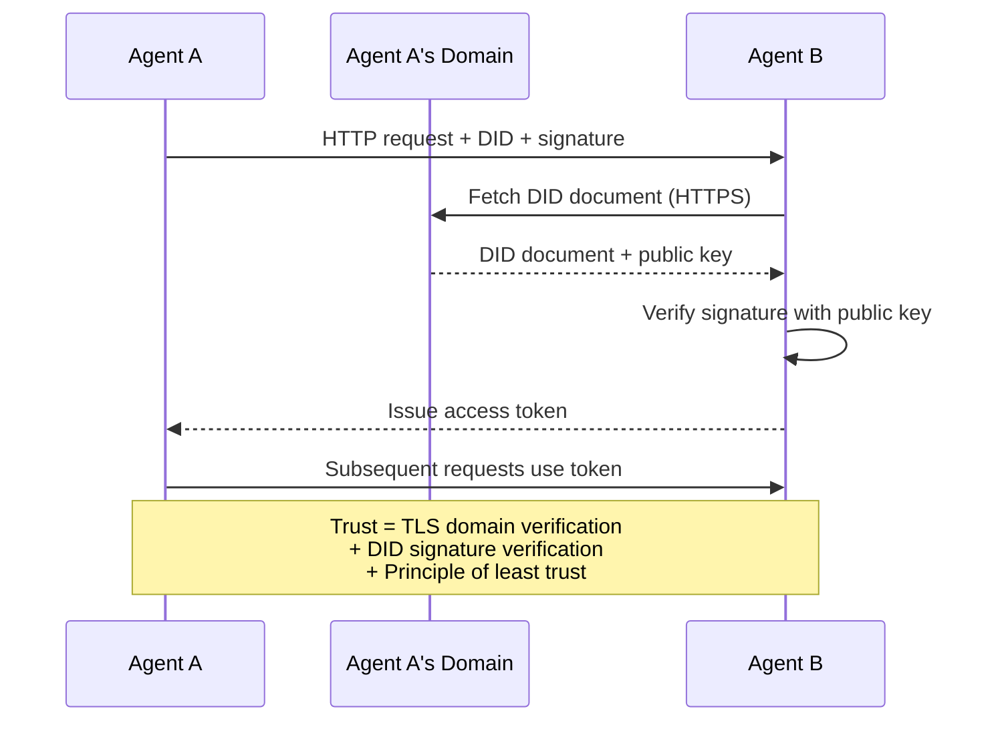

信任来自三个方面：  
1. **域级 TLS** 验证 DID 文档的主机  
2. **DID 密码学签名** 验证代理身份  
3. **最小信任原则** 仅授予最低权限

没有基于八卦传播的信任扩散或 PageRank 打分。你直接通过 DID 验证每个代理。

#### 元协议协商（Meta-Protocol Negotiation）

这是 ANP 最创新的特性。两个来自不同生态系统的代理首次见面时，无需预先约定数据格式，通过自然语言协商：

```json
{
  "action": "protocolNegotiation",
  "sequenceId": 0,
  "candidateProtocols": "I can communicate using:\n1. JSON-RPC with hotel booking schema\n2. REST with OpenAPI 3.1 spec\n3. Natural language over HTTP",
  "modificationSummary": "Initial proposal",
  "status": "negotiating"
}
```

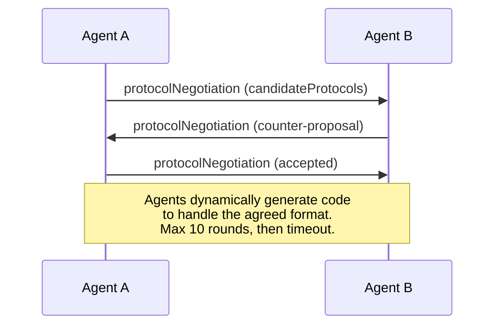

双方来回协商（最多 10 轮），最终达成一致格式，然后动态生成处理该格式的代码。状态值包括：`negotiating`，`rejected`，`accepted`，`timeout`。

这意味着两个从未见过面的代理可以自主商定通信方式，无需任何人预定义共享 schema。

### 比较（修正后）

|  | MCP | A2A | ACP | ANP |
|---|---|---|---|---|
| **创建者** | Anthropic | Google / Linux Foundation | IBM / BeeAI | 社区 |
| **规范格式** | JSON-RPC | JSON-RPC / REST / gRPC | OpenAPI 3.1 (REST) | JSON-RPC |
| **主要用途** | 代理到工具 | 代理到代理 | 代理到代理 | 代理到代理 |
| **发现方式** | 工具列表 | `/.well-known/agent-card.json` | `GET /agents`, `/.well-known/agent.yml` | `/.well-known/agent-descriptions`, DID 服务端点 |
| **身份** | 隐式（本地） | 安全方案（OAuth，mTLS） | 服务器级别 | W3C DID (`did:wba`) + E2EE |
| **审计轨迹** | 无 | 基础（任务历史） | TrajectoryMetadata（工具调用，推理） | 未正式指定 |
| **状态机** | 无 | 9 任务状态 | 7 运行状态 | 无 |
| **流式传输** | 无 | SSE | SSE | 传输无关 |
| **独有特性** | 工具 schema | Agent Cards + Skills | Trajectory 审计轨迹 | 元协议协商 |
| **适用场景** | 工具和数据 | 动态协作 | 受监管行业 | 跨组织信任 |
| **状态** | 稳定 | 稳定（v1.0） | 合并至 A2A | 积极开发中 |

### 它们如何协同工作

这些协议并非互斥。现实企业系统通常组合使用：

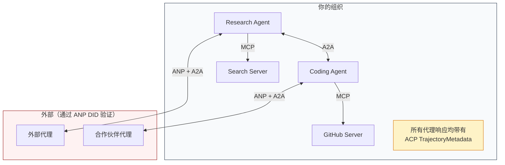

- **MCP** 连接每个代理与其工具  
- **A2A** 处理代理间协作（内部与外部）  
- **ACP** 在响应中包装轨迹元数据以支持审计  
- **ANP** 为非自控代理提供身份验证

## 构建它

### 第 1 步：核心消息类型

每个多代理系统都从消息格式开始。我们定义与真实协议对应的类型：

```typescript
import crypto from "node:crypto";

type MessageRole = "user" | "agent";

type MessagePart =
  | { kind: "text"; text: string }
  | { kind: "data"; data: unknown; mediaType: string }
  | { kind: "file"; name: string; url: string; mediaType: string };

type TrajectoryEntry = {
  reasoning: string;
  toolName?: string;
  toolInput?: unknown;
  toolOutput?: unknown;
  timestamp: number;
};

type AgentMessage = {
  id: string;
  role: MessageRole;
  parts: MessagePart[];
  trajectory?: TrajectoryEntry[];
  replyTo?: string;
  timestamp: number;
};

function createMessage(
  role: MessageRole,
  parts: MessagePart[],
  replyTo?: string
): AgentMessage {
  return {
    id: crypto.randomUUID(),
    role,
    parts,
    replyTo,
    timestamp: Date.now(),
  };
}

function textMessage(role: MessageRole, text: string): AgentMessage {
  return createMessage(role, [{ kind: "text", text }]);
}
```

注意：`MessagePart` 是多模态类型（文本、结构化数据、文件），与真实的 A2A 和 ACP 规范一致。`TrajectoryEntry` 捕捉推理链，符合 ACP 的 TrajectoryMetadata 标准。

### 步骤 2：A2A 代理卡及注册表

构建符合真实 A2A 规范的代理发现：

```typescript
type Skill = {
  id: string;
  name: string;
  description: string;
  tags: string[];
  inputModes: string[];
  outputModes: string[];
};

type AgentCard = {
  name: string;
  description: string;
  version: string;
  url: string;
  capabilities: {
    streaming: boolean;
    pushNotifications: boolean;
  };
  defaultInputModes: string[];
  defaultOutputModes: string[];
  skills: Skill[];
};

class AgentRegistry {
  private cards: Map<string, AgentCard> = new Map();

  register(card: AgentCard) {
    this.cards.set(card.name, card);
  }

  discoverBySkillTag(tag: string): AgentCard[] {
    return [...this.cards.values()].filter((card) =>
      card.skills.some((skill) => skill.tags.includes(tag))
    );
  }

  discoverByInputMode(mimeType: string): AgentCard[] {
    return [...this.cards.values()].filter(
      (card) =>
        card.defaultInputModes.includes(mimeType) ||
        card.skills.some((skill) => skill.inputModes.includes(mimeType))
    );
  }

  resolve(name: string): AgentCard | undefined {
    return this.cards.get(name);
  }

  listAll(): AgentCard[] {
    return [...this.cards.values()];
  }
}
```

这远比简单的名称到能力映射更丰富。你可以通过技能标签、输入 MIME 类型或名称来发现代理，就像真实的 A2A 规范支持的那样。

### 步骤 3：A2A 任务生命周期

构建完整的任务状态机：

```typescript
type TaskState =
  | "submitted"
  | "working"
  | "input-required"
  | "auth-required"
  | "completed"
  | "failed"
  | "canceled"
  | "rejected";

const TERMINAL_STATES: TaskState[] = [
  "completed",
  "failed",
  "canceled",
  "rejected",
];

type TaskStatus = {
  state: TaskState;
  message?: AgentMessage;
  timestamp: number;
};

type Artifact = {
  id: string;
  name: string;
  parts: MessagePart[];
};

type Task = {
  id: string;
  contextId: string;
  status: TaskStatus;
  artifacts: Artifact[];
  history: AgentMessage[];
};

type TaskEvent =
  | { kind: "statusUpdate"; taskId: string; status: TaskStatus }
  | {
      kind: "artifactUpdate";
      taskId: string;
      artifact: Artifact;
      append: boolean;
      lastChunk: boolean;
    };

type TaskHandler = (
  task: Task,
  message: AgentMessage
) => AsyncGenerator<TaskEvent>;

class TaskManager {
  private tasks: Map<string, Task> = new Map();
  private handlers: Map<string, TaskHandler> = new Map();
  private listeners: Map<string, ((event: TaskEvent) => void)[]> = new Map();

  registerHandler(agentName: string, handler: TaskHandler) {
    this.handlers.set(agentName, handler);
  }

  subscribe(taskId: string, listener: (event: TaskEvent) => void) {
    const existing = this.listeners.get(taskId) ?? [];
    existing.push(listener);
    this.listeners.set(taskId, existing);
  }

  async sendMessage(
    agentName: string,
    message: AgentMessage,
    contextId?: string
  ): Promise<Task> {
    const handler = this.handlers.get(agentName);
    if (!handler) {
      const task = this.createTask(contextId);
      task.status = {
        state: "rejected",
        timestamp: Date.now(),
        message: textMessage("agent", `No handler for ${agentName}`),
      };
      return task;
    }

    const task = this.createTask(contextId);
    task.history.push(message);
    task.status = { state: "submitted", timestamp: Date.now() };

    this.processTask(task, handler, message).catch((err) => {
      task.status = {
        state: "failed",
        timestamp: Date.now(),
        message: textMessage("agent", String(err)),
      };
    });
    return task;
  }

  getTask(taskId: string): Task | undefined {
    return this.tasks.get(taskId);
  }

  cancelTask(taskId: string): boolean {
    const task = this.tasks.get(taskId);
    if (!task || TERMINAL_STATES.includes(task.status.state)) return false;
    task.status = { state: "canceled", timestamp: Date.now() };
    this.emit(taskId, {
      kind: "statusUpdate",
      taskId,
      status: task.status,
    });
    return true;
  }

  private createTask(contextId?: string): Task {
    const task: Task = {
      id: crypto.randomUUID(),
      contextId: contextId ?? crypto.randomUUID(),
      status: { state: "submitted", timestamp: Date.now() },
      artifacts: [],
      history: [],
    };
    this.tasks.set(task.id, task);
    return task;
  }

  private async processTask(
    task: Task,
    handler: TaskHandler,
    message: AgentMessage
  ) {
    task.status = { state: "working", timestamp: Date.now() };
    this.emit(task.id, {
      kind: "statusUpdate",
      taskId: task.id,
      status: task.status,
    });

    try {
      for await (const event of handler(task, message)) {
        if (TERMINAL_STATES.includes(task.status.state)) break;

        if (event.kind === "statusUpdate") {
          task.status = event.status;
        }
        if (event.kind === "artifactUpdate") {
          const existing = task.artifacts.find(
            (a) => a.id === event.artifact.id
          );
          if (existing && event.append) {
            existing.parts.push(...event.artifact.parts);
          } else {
            task.artifacts.push(event.artifact);
          }
        }
        this.emit(task.id, event);
      }
    } catch (err) {
      task.status = {
        state: "failed",
        timestamp: Date.now(),
        message: textMessage("agent", String(err)),
      };
      this.emit(task.id, {
        kind: "statusUpdate",
        taskId: task.id,
        status: task.status,
      });
    }
  }

  private emit(taskId: string, event: TaskEvent) {
    for (const listener of this.listeners.get(taskId) ?? []) {
      listener(event);
    }
  }
}
```

这实现了真实的 A2A 任务生命周期：submitted（已提交）、working（处理中）、input-required（需要输入）、终态。处理函数是异步生成器，按 SSE 流模型产出事件（状态更新和 artifact 数据块）。

### 步骤 4：ACP 风格审计轨迹

用轨迹追踪封装通讯：

```typescript
type AuditEntry = {
  runId: string;
  agentName: string;
  input: AgentMessage[];
  output: AgentMessage[];
  trajectory: TrajectoryEntry[];
  status: "created" | "in-progress" | "completed" | "failed" | "awaiting";
  startedAt: number;
  completedAt?: number;
  sessionId?: string;
};

class AuditableRunner {
  private log: AuditEntry[] = [];
  private handlers: Map<
    string,
    (input: AgentMessage[]) => Promise<{
      output: AgentMessage[];
      trajectory: TrajectoryEntry[];
    }>
  > = new Map();

  registerAgent(
    name: string,
    handler: (input: AgentMessage[]) => Promise<{
      output: AgentMessage[];
      trajectory: TrajectoryEntry[];
    }>
  ) {
    this.handlers.set(name, handler);
  }

  async run(
    agentName: string,
    input: AgentMessage[],
    sessionId?: string
  ): Promise<AuditEntry> {
    const entry: AuditEntry = {
      runId: crypto.randomUUID(),
      agentName,
      input: structuredClone(input),
      output: [],
      trajectory: [],
      status: "created",
      startedAt: Date.now(),
      sessionId,
    };
    this.log.push(entry);

    const handler = this.handlers.get(agentName);
    if (!handler) {
      entry.status = "failed";
      return entry;
    }

    entry.status = "in-progress";
    try {
      const result = await handler(input);
      entry.output = structuredClone(result.output);
      entry.trajectory = structuredClone(result.trajectory);
      entry.status = "completed";
      entry.completedAt = Date.now();
    } catch (err) {
      entry.status = "failed";
      entry.trajectory.push({
        reasoning: `Error: ${String(err)}`,
        timestamp: Date.now(),
      });
      entry.completedAt = Date.now();
    }
    return entry;
  }

  getFullAuditLog(): AuditEntry[] {
    return structuredClone(this.log);
  }

  getAuditLogForAgent(agentName: string): AuditEntry[] {
    return structuredClone(
      this.log.filter((e) => e.agentName === agentName)
    );
  }

  getAuditLogForSession(sessionId: string): AuditEntry[] {
    return structuredClone(
      this.log.filter((e) => e.sessionId === sessionId)
    );
  }

  getTrajectoryForRun(runId: string): TrajectoryEntry[] {
    const entry = this.log.find((e) => e.runId === runId);
    return entry ? structuredClone(entry.trajectory) : [];
  }
}
```

每次代理执行都会产出完整审计条目：输入是什么，输出是什么，以及中间所有工具调用和推理步骤的完整轨迹。你可以按代理、会话或具体运行查询。

### 步骤 5：ANP 风格身份验证

构建基于 DID（去中心化身份标识）的身份和验证：

```typescript
type VerificationMethod = {
  id: string;
  type: string;
  controller: string;
  publicKeyDer: string;
};

type DIDDocument = {
  id: string;
  verificationMethod: VerificationMethod[];
  authentication: string[];
  keyAgreement: string[];
  humanAuthorization: string[];
  service: { id: string; type: string; serviceEndpoint: string }[];
};

type AgentIdentity = {
  did: string;
  document: DIDDocument;
  privateKey: crypto.KeyObject;
  publicKey: crypto.KeyObject;
};

class IdentityRegistry {
  private documents: Map<string, DIDDocument> = new Map();

  publish(doc: DIDDocument) {
    this.documents.set(doc.id, doc);
  }

  resolve(did: string): DIDDocument | undefined {
    return this.documents.get(did);
  }

  verify(did: string, signature: string, payload: string): boolean {
    const doc = this.documents.get(did);
    if (!doc) return false;

    const authKeyIds = doc.authentication;
    const authKeys = doc.verificationMethod.filter((vm) =>
      authKeyIds.includes(vm.id)
    );

    for (const key of authKeys) {
      const publicKey = crypto.createPublicKey({
        key: Buffer.from(key.publicKeyDer, "base64"),
        format: "der",
        type: "spki",
      });
      const isValid = crypto.verify(
        null,
        Buffer.from(payload),
        publicKey,
        Buffer.from(signature, "hex")
      );
      if (isValid) return true;
    }
    return false;
  }

  requiresHumanAuth(did: string, operationKeyId: string): boolean {
    const doc = this.documents.get(did);
    if (!doc) return false;
    return doc.humanAuthorization.includes(operationKeyId);
  }
}

function createIdentity(domain: string, agentName: string): AgentIdentity {
  const did = `did:wba:${domain}:agent:${agentName}`;
  const { publicKey, privateKey } = crypto.generateKeyPairSync("ed25519");

  const publicKeyDer = publicKey
    .export({ format: "der", type: "spki" })
    .toString("base64");

  const keyId = `${did}#key-1`;
  const encKeyId = `${did}#key-x25519-1`;

  const document: DIDDocument = {
    id: did,
    verificationMethod: [
      {
        id: keyId,
        type: "Ed25519VerificationKey2020",
        controller: did,
        publicKeyDer,
      },
      {
        id: encKeyId,
        type: "X25519KeyAgreementKey2019",
        controller: did,
        publicKeyDer,
      },
    ],
    authentication: [keyId],
    keyAgreement: [encKeyId],
    humanAuthorization: [],
    service: [
      {
        id: `${did}#agent-description`,
        type: "AgentDescription",
        serviceEndpoint: `https://${domain}/agents/${agentName}/ad.json`,
      },
    ],
  };

  return { did, document, privateKey, publicKey };
}

function signPayload(identity: AgentIdentity, payload: string): string {
  return crypto
    .sign(null, Buffer.from(payload), identity.privateKey)
    .toString("hex");
}
```

这反映了真实的 ANP 身份模型：代理拥有带有独立认证（authentication）、密钥协商（key agreement）和人工授权密钥的 DID 文档。`IdentityRegistry` 模拟了 DID 解析（在生产环境中，这将是对代理域的 HTTP 请求）。

### 第6步：协议网关

将所有四个协议连接成一个统一系统：

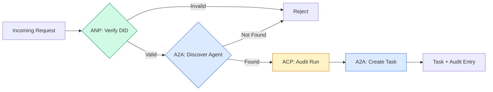

```typescript
class ProtocolGateway {
  private registry: AgentRegistry;
  private taskManager: TaskManager;
  private auditRunner: AuditableRunner;
  private identityRegistry: IdentityRegistry;

  constructor(
    registry: AgentRegistry,
    taskManager: TaskManager,
    auditRunner: AuditableRunner,
    identityRegistry: IdentityRegistry
  ) {
    this.registry = registry;
    this.taskManager = taskManager;
    this.auditRunner = auditRunner;
    this.identityRegistry = identityRegistry;
  }

  async delegateTask(
    fromDid: string,
    signature: string,
    targetAgent: string,
    message: AgentMessage,
    sessionId?: string
  ): Promise<{ task: Task; audit: AuditEntry } | { error: string }> {
    if (!this.identityRegistry.verify(fromDid, signature, message.id)) {
      return { error: "身份验证失败" };
    }

    const card = this.registry.resolve(targetAgent);
    if (!card) {
      return { error: `代理 ${targetAgent} 在注册表中未找到` };
    }

    const audit = await this.auditRunner.run(
      targetAgent,
      [message],
      sessionId
    );
    const task = await this.taskManager.sendMessage(targetAgent, message);

    return { task, audit };
  }

  discoverAndDelegate(
    fromDid: string,
    signature: string,
    skillTag: string,
    message: AgentMessage
  ): Promise<{ task: Task; audit: AuditEntry } | { error: string }> {
    const candidates = this.registry.discoverBySkillTag(skillTag);
    if (candidates.length === 0) {
      return Promise.resolve({
        error: `没有找到带有技能标签：${skillTag} 的代理`,
      });
    }
    return this.delegateTask(
      fromDid,
      signature,
      candidates[0].name,
      message
    );
  }
}
```

网关在一次调用中完成四件事：
1. **ANP**：通过 DID 签名验证调用者身份
2. **A2A**：发现目标代理并检查其能力
3. **ACP**：在执行过程中创建带有轨迹记录的审计日志
4. **A2A**：创建具有完整生命周期跟踪的任务

### 第7步：整体连接

```typescript
async function protocolDemo() {
  const registry = new AgentRegistry();
  registry.register({
    name: "researcher",
    description: "搜索并汇总发现内容",
    version: "1.0.0",
    url: "https://researcher.local/a2a/v1",
    capabilities: { streaming: true, pushNotifications: false },
    defaultInputModes: ["text/plain"],
    defaultOutputModes: ["text/plain", "application/json"],
    skills: [
      {
        id: "web-research",
        name: "网页调研",
        description: "搜索网页内容",
        tags: ["research", "search", "summarization"],
        inputModes: ["text/plain"],
        outputModes: ["application/json"],
      },
    ],
  });
  registry.register({
    name: "coder",
    description: "根据规格编写代码",
    version: "1.0.0",
    url: "https://coder.local/a2a/v1",
    capabilities: { streaming: false, pushNotifications: false },
    defaultInputModes: ["text/plain", "application/json"],
    defaultOutputModes: ["text/plain"],
    skills: [
      {
        id: "code-gen",
        name: "代码生成",
        description: "自动生成代码",
        tags: ["coding", "generation"],
        inputModes: ["text/plain", "application/json"],
        outputModes: ["text/plain"],
      },
    ],
  });

  const taskManager = new TaskManager();
  const auditRunner = new AuditableRunner();

  const researchTrajectory: TrajectoryEntry[] = [];

  taskManager.registerHandler(
    "researcher",
    async function* (task, message) {
      yield {
        kind: "statusUpdate" as const,
        taskId: task.id,
        status: { state: "working" as const, timestamp: Date.now() },
      };

      researchTrajectory.push({
        reasoning: "正在搜索 React 19 文档",
        toolName: "web_search",
        toolInput: { query: "React 19 compiler features" },
        toolOutput: {
          results: ["react.dev/blog/react-19", "github.com/react/react"],
        },
        timestamp: Date.now(),
      });

      researchTrajectory.push({
        reasoning: "从搜索结果中提取关键发现",
        toolName: "doc_analysis",
        toolInput: { url: "react.dev/blog/react-19" },
        toolOutput: {
          summary:
            "React 19 编译器会自动 memoize，无需手动使用 useMemo",
        },
        timestamp: Date.now(),
      });

      yield {
        kind: "artifactUpdate" as const,
        taskId: task.id,
        artifact: {
          id: crypto.randomUUID(),
          name: "research-results",
          parts: [
            {
              kind: "data" as const,
              data: {
                findings: [
                  "React 19 编译器自动 memoize 组件",
                  "无需再手动使用 useMemo/useCallback",
                  "编译器运行于构建时，而非运行时",
                ],
                sources: ["react.dev/blog/react-19"],
              },
              mediaType: "application/json",
            },
          ],
        },
        append: false,
        lastChunk: true,
      };

      yield {
        kind: "statusUpdate" as const,
        taskId: task.id,
        status: { state: "completed" as const, timestamp: Date.now() },
      };
    }
  );

  auditRunner.registerAgent("researcher", async () => ({
    output: [
      textMessage("agent", "React 19 编译器自动 memoize 组件"),
    ],
    trajectory: researchTrajectory,
  }));

  const identityRegistry = new IdentityRegistry();

  const coderIdentity = createIdentity("coder.local", "coder");
  const researcherIdentity = createIdentity("researcher.local", "researcher");

  identityRegistry.publish(coderIdentity.document);
  identityRegistry.publish(researcherIdentity.document);

  const gateway = new ProtocolGateway(
    registry,
    taskManager,
    auditRunner,
    identityRegistry
  );

  console.log("=== 协议演示 ===\n");

  console.log("1. 代理发现（A2A）");
  const researchAgents = registry.discoverBySkillTag("research");
  console.log(
    `   找到 ${researchAgents.length} 个代理:`,
    researchAgents.map((a) => a.name)
  );

  console.log("\n2. 身份验证（ANP）");
  const message = textMessage("user", "研究 React 19 编译器特性");
  const signature = signPayload(coderIdentity, message.id);
  const verified = identityRegistry.verify(
    coderIdentity.did,
    signature,
    message.id
  );
  console.log(`   Coder DID: ${coderIdentity.did}`);
  console.log(`   签名验证成功: ${verified}`);

  console.log("\n3. 任务委托（A2A + ACP + ANP）");
  const result = await gateway.delegateTask(
    coderIdentity.did,
    signature,
    "researcher",
    message,
    "session-001"
  );

  if ("error" in result) {
    console.log(`   错误: ${result.error}`);
    return;
  }

  console.log(`   任务 ID: ${result.task.id}`);
  console.log(`   任务状态: ${result.task.status.state}`);
  console.log(`   工件数量: ${result.task.artifacts.length}`);

  console.log("\n4. 审计轨迹（ACP）");
  console.log(`   运行 ID: ${result.audit.runId}`);
  console.log(`   状态: ${result.audit.status}`);
  console.log(`   轨迹步骤: ${result.audit.trajectory.length}`);
  for (const step of result.audit.trajectory) {
    console.log(`     - ${step.reasoning}`);
    if (step.toolName) {
      console.log(`       工具: ${step.toolName}`);
    }
  }

  console.log("\n5. 完整审计日志");
  const fullLog = auditRunner.getFullAuditLog();
  console.log(`   总运行次数: ${fullLog.length}`);
  for (const entry of fullLog) {
    const duration = entry.completedAt
      ? `${entry.completedAt - entry.startedAt}ms`
      : "正在进行中";
    console.log(`   ${entry.agentName}: ${entry.status} (${duration})`);
  }
}

protocolDemo().catch((err) => {
  console.error("协议演示失败:", err);
  process.exitCode = 1;
});
```

## 可能出现的问题

协议解决了理想路径，但生产环境中会遇到以下问题：

**模式漂移（Schema drift）。** 代理 A 发布的 Agent Card 宣传 `application/json` 输出格式，但 JSON 模式在版本间发生改变。代理 B 解析旧格式得到错误结果。解决方法：给技能和输出模式加版本号。A2A 规范支持 Agent Card 上的 `version` 字段即为此考虑。

**状态机违规。** 代理处理程序先返回一个 `completed` 事件，然后又尝试产出更多工件。任务是不可变（immutable）的，代码会默默丢弃更新或抛出异常。解决方法：在产出前检查终态。上述 `TaskManager` 在终态后使用了 `break` 强制退出以保证状态正确。

**信任解析失败。** 代理 A 试图校验代理 B 的 DID，但代理 B 域名不可访问，无法获取 DID 文档。你是选择开放失败（接受未验证代理）还是封闭失败（全部拒绝）？ANP 推荐封闭失败，遵循最少信任原则。

**轨迹膨胀。** ACP 轨迹日志极具威力但成本昂贵。一个复杂代理一轮调用 200 次工具，会产生庞大的审计条目。解决方法：根据可配置的详细等级记录轨迹。对合规要求强的流程，记录工具名称和输入输出；非受管控工作负载可跳过部分推理步骤。

**发现洪峰（Discovery thundering herd）。** 50 个代理同时启动时发起 `GET /agents` 查询。解决方法：为 Agent Card 加 TTL 进行缓存，错开发现间隔，或改用推送式注册代替轮询。

## 使用建议

### 真实实现

**A2A** 最成熟。谷歌的[官方规范](https://github.com/google/A2A)开源于 Linux 基金会，有 Python 和 TypeScript SDK。如果你的代理需要动态发现和协作，从这里开始最合适。

**ACP** 正在合并入 A2A。IBM 的[BeeAI 项目](https://github.com/i-am-bee/acp)创建了ACP作为 REST 优先的替代方案，但轨迹元数据概念正在被吸收到 A2A 生态。即使你使用 A2A 作为传输层，也建议采用 ACP 模式（轨迹日志，运行生命周期管理）。

**ANP** 最为实验性。[社区仓库](https://github.com/agent-network-protocol/AgentNetworkProtocol)有 Python SDK（AgentConnect）。元协议协商机制确实新颖。适合跨组织代理部署应用，值得关注。

**MCP** 已在第13阶段涵盖。如果你希望代理使用工具，MCP 是标准协议。

### 选择合适的协议

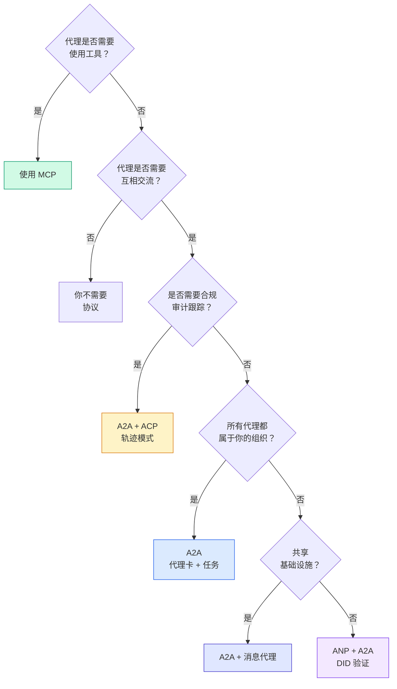

## 交付成果

本课产出：
- `code/main.ts` —— 四种协议模式的完整实现
- `outputs/prompt-protocol-selector.md` —— 一份帮助你选择系统协议的提示

## 练习

1. **多跳任务委派。** 扩展 `TaskManager`，使代理处理器能够将子任务委派给其他代理。研究员接收任务，委派“搜索”和“摘要”子任务给两个专家代理，等待两者完成后，再将结果合并到自己的产物中。

2. **流式审计跟踪。** 修改 `AuditableRunner` 以支持流式模式。不用等待完整结果，而是随着轨迹条目的添加实时产出 `AuditEntry` 更新。使用异步生成器生成审计快照。

3. **DID 轮换。** 为 `IdentityRegistry` 添加密钥轮换功能。代理应能发布包含更新密钥的新 DID 文档，同时保持 `previousDid` 引用。在宽限期内，验证者应接受当前和以前密钥的签名。

4. **协议协商。** 实现 ANP 的元协议概念。两个代理交换 `protocolNegotiation` 消息，带有候选格式（例如“我会说 JSON-RPC” vs “我更喜欢 REST”）。最多协商三轮，达成一致或超时。最终确定的格式决定使用的 `TaskManager` 或 `AuditableRunner`。

5. **限速发现。** 添加一个 `RateLimitedRegistry` 包装器，缓存代理卡查询，带有可配置的 TTL，并限制每个代理每秒的发现查询次数。模拟100个代理启动时发现彼此的“洪峰”，测量差异。

## 关键词

| 术语 | 常用说法 | 实际含义 |
|------|----------|----------|
| MCP | “AI 工具协议” | 一个客户端-服务器协议，供代理发现和使用工具。是代理-工具协议，不是代理-代理。 |
| A2A | “谷歌的代理协议” | Linux Foundation 下的点对点代理协作协议。通过代理卡发现，支持9状态任务生命周期，使用 SSE 流媒体。支持 JSON-RPC、REST 和 gRPC 绑定。 |
| ACP | “企业代理消息” | IBM/BeeAI 的代理运行 REST API，带 TrajectoryMetadata：每个响应包含完整的推理链和工具调用。正合并进 A2A。 |
| ANP | “去中心化代理身份” | 一个社区协议，使用 `did:wba`（DID）实现密码学身份认证，HPKE 实现端到端加密（E2EE），以及 AI 驱动的元协议协商，适用于从未见过面的代理。 |
| 代理卡（Agent Card） | “代理的名片” | 一个 JSON 文档，位于 `/.well-known/agent-card.json`，描述技能、支持的 MIME 类型、安全方案和协议绑定。 |
| DID | “去中心化身份” | W3C 标准的密码学可验证身份，托管于代理自有域名上。ANP 使用 `did:wba` 方法。 |
| TrajectoryMetadata | “审计凭证” | ACP 用于附加推理步骤、工具调用及其输入输出到每个代理响应的机制。 |
| 元协议（Meta-protocol） | “代理协商通信方式” | ANP 的方法，代理使用自然语言动态协商数据格式，然后生成处理代码。 |
| 任务（Task） | “工作单元” | A2A 的有状态对象，从提交到完成跟踪工作，一旦终结即不可变。 |

## 延伸阅读

- [Google A2A 规范](https://github.com/google/A2A) —— 官方规范和 SDK（v1.0.0，Linux Foundation）
- [IBM/BeeAI ACP 规范](https://github.com/i-am-bee/acp) —— 代理运行和轨迹元数据的 OpenAPI 3.1 规范
- [Agent Network Protocol](https://github.com/agent-network-protocol/AgentNetworkProtocol) —— 基于 DID 的身份认证、端到端加密和元协议协商
- [Model Context Protocol 文档](https://modelcontextprotocol.io/) —— Anthropic 的 MCP 规范（第13阶段涵盖）
- [W3C 去中心化身份标识符](https://www.w3.org/TR/did-core/) —— 支撑 ANP 的身份标准
- [RFC 9180 (HPKE)](https://www.rfc-editor.org/rfc/rfc9180) —— ANP 用于端到端加密的加密方案
- [FIPA 代理通信语言](http://www.fipa.org/specs/fipa00061/SC00061G.html) —— 现代代理协议的学术前身
