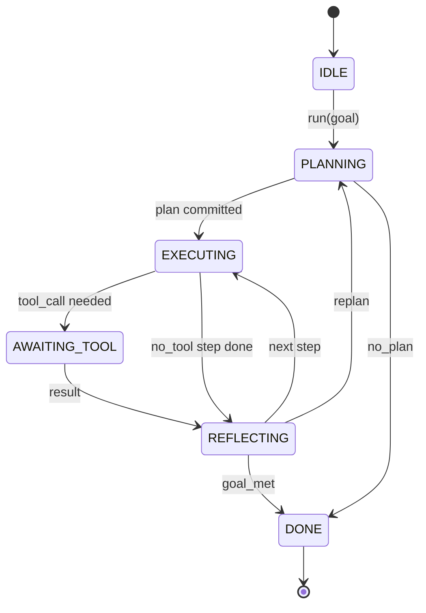

# Agent Harness 循环契约

> Harness（执行框架）就是 agent（代理）。Model（模型）是协处理器。本课冻结了一个任何模型都能接入的循环契约。

**类型：** 构建  
**语言：** Python  
**先决条件：** 第13阶段课程01-07，第14阶段课程01  
**时间：** ~90分钟

## 学习目标
- 将 agent harness 循环指定为一个确定性状态机，并明确状态转换。
- 实现十个生命周期钩子主题，操作人员在其中接入策略（policy）、遥测（telemetry）和护栏（guardrails）。
- 定义两个拉取点（pull points），循环在此处产出控制权并在接收新输入时恢复。
- 强制执行每会话预算（轮次、工具调用、时钟时间），超出时不泄露部分状态。
- 发出十一种事件类型的类型化事件流，以便下游 UI 和跟踪器无需直接检查循环即可订阅。

## 框架概述

一个无人值守运行四十轮的编码 agent 不只是一个聊天循环。它是一个状态机，节点可由操作人员拦截，边可由操作人员审计。一旦你写下这份契约，替换模型、工具或策略就不再是重构，而是注册调用。

本课构建了这份契约。我们命名了六个状态、十个钩子主题、两个拉取点、十一种事件类型和一个预算封装。代理框架中的其他内容（工具注册表、JSON-RPC传输、调度器、规划器）都接入这个形态。

## 状态

循环包含六个状态。五个为活动状态，一个为终止状态。



`IDLE` 是唯一合法入口点。`DONE` 是唯一合法出口。`AWAITING_TOOL` 是唯一产生拉取点的状态。其它所有转移均为内部转移。

状态机是确定性的。给予相同的事件日志，harness 会重新进入同一状态。该特性允许你重放会话进行调试，而无需重新调用模型。

## 钩子主题

钩子是操作人员接入循环的接口。harness 触发十个主题。每个主题支持多个订阅者。订阅者按注册顺序触发。订阅者可以修改负载（payload）、抛异常中止该轮，或返回哨兵值跳过下一步。

```text
before_plan         after_plan
before_tool_call    after_tool_call
before_step         after_step
on_error
on_pause
on_budget_exceeded
on_complete
```

该结构与 Claude Code、Cursor 和 OpenCode 到2025年中期达成的共识一致。命名是功能性的，而非品牌化。阻止 `rm -rf` 命令的钩子应放在 `before_tool_call`。发送 OpenTelemetry span 的钩子应放在 `after_step`。暂停会话后恢复的钩子应放在 `on_pause`。

## 拉取点

循环会两次产出控制权。第一次在 `AWAITING_TOOL` 状态，当需要工具结果无法继续前进时。第二次在 `on_pause` 钩子，当预算用尽或钩子显式请求人工审核时。

拉取点不是异常，而是返回。调用方检查 harness 状态，获取 harness 请求的内容，然后调用 `resume(payload)`。harness 从停下的地方继续。这和 Python generator（生成器）形态相同。拉取点的传输方式由你决定。在 TUI 中是按键，在 MCP 中是 `tools/call`，在队列中是任务轮询。

## 事件流

循环在契约指定的点向类型化事件流追加事件。事件流仅支持追加，订阅者可以从任意偏移重放。十一种事件类型如下：

- `session.start` — 当调用 `run(goal)` 时发出一次
- `plan.draft` — 规划器返回草案计划时发出
- `plan.commit` — 草案计划被提交为活动计划后发出
- `step.start` — 每个执行步骤开始时发出
- `step.end` — 每个执行步骤结束时发出
- `tool.call` — 当执行步骤需要工具结果并将控制权交还调用方时发出
- `tool.result` — 使用工具结果恢复时发出
- `tool.error` — 恢复时发生错误或钩子中止调用时发出
- `budget.warn` — 达到预算限制时发出
- `session.pause` — 循环因暂停（预算或钩子）产出控制权时发出
- `session.complete` — 循环到达 `DONE` 时发出一次

事件不会复制钩子负载。钩子是命令式的（修改、终止），事件是观察式的（记录、发送），两者可并行处理。

## 预算封装

每会话有三条限制：轮次计数、工具调用计数、时钟秒数。每轮次加一，工具调用加一，时钟在每次状态转换时检查。当任一预算到达上限，循环触发 `on_budget_exceeded`，发出 `budget.warn`，然后在下一拉取点以预算超限原因切换到 `IDLE`。

预算不是终止开关，而是让渡控制。调用方决定是否延长预算并恢复，或关闭会话。

## 本课未涵盖内容

本课不调用模型，不注册真实工具，也不实现传输。这些内容在后续四课完成。本课确立了契约，后续课程可在此基础上接入而无需重写。

`main.py` 中的确定性规划器是占位符。返回了一个硬编码的三步计划，其中两步需要工具结果。重点在循环，而非计划。

## 如何阅读代码

`HarnessLoop` 是主类，持有状态，触发钩子，发出事件。`Budget` 追踪限制。`Event` 是事件流上的类型化封装。`HookRegistry` 是调度表。`_transition` 是唯一修改状态的函数，状态机不变量集中管理。

自上而下阅读 `main.py`，然后阅读 `code/tests/test_loop.py`。测试覆盖了所有状态转换和钩子触发顺序。

## 拓展方向

在生产环境中构建 harness 最难的部分不是状态机本身，而是使契约具有强制执行力。契约必须能够经受以下考验：规划器热重载、返回格式错误 JSON 的工具、运行四十轮过程中过两三次在 `before_tool_call` 中触发异常的钩子。本课测试涵盖这些失败模式。运行它们，破坏它们，添加用例。

下一课加入工具注册表，继而加入 JSON-RPC 传输，随后是调度器。到第24课时，本文件中的循环将针对真实工具执行真实计划并强制执行真实预算。
