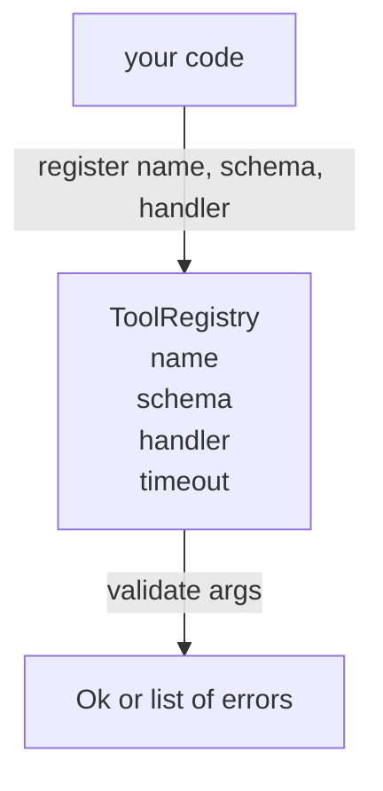

# 带架构验证的工具注册表

> 代理无法验证的工具也是代理无法调用的工具。在构建工具之前先构建注册表和架构检查器。

**类型：** 构建  
**语言：** Python  
**前置条件：** 第13阶段课程01-07节，第14阶段课程01节  
**时间：** 约90分钟

## 学习目标
- 持有一个工具名称 → 架构 → 处理器的类型化注册表，调度器可以只询问一次并以后信任。
- 实现一个 JSON Schema 2020-12 子集，涵盖九成工具调用实际使用的关键字。
- 返回精确的、json-pointer 形式的错误路径，使模型能在一次往返中自我纠正。
- 拒绝无明确覆盖的重新注册，避免生产环境中工具目录悄然漂移。
- 保持验证器纯净（无 I/O、无时间依赖、无全局变量），以便能对重放日志重新执行。

## 为什么注册表要先于工具

2026 年的编码代理拥有比模型单次上下文窗口能容纳的更多注册工具。一个非平凡的工具框架会注册两百个工具，每次展示 10 到 40 个。注册表是“存在哪些工具”、“它们参数的形状是什么”以及“调用哪个处理器”的事实来源。一旦这三个答案确定，框架的其余部分就无需再猜测。

我们避免的错误是发布没有架构的处理器，或者发布没有验证的架构。这两者都很常见，都会使下一层（第23节课的调度器）变成一种猜测游戏，而唯一失败模式是处理器栈追踪。

## 工具记录的样子

```text
ToolRecord
  name        : str          （唯一，小写字母数字和下划线分段，中间用点分隔，如 snake_case.segment.case）
  description : str          （一行，展示给模型）
  schema      : dict         （JSON Schema 2020-12 子集）
  handler     : Callable     （异步或同步，返回 Any）
  idempotent  : bool         （调度器用于重试决策）
  timeout_ms  : int          （覆盖调度器默认超时）
```

只有 schema 是验证器处理的字段。handler 对它来说是透明的。我们有意将它们分开。schema 是数据，handler 是代码。混合它们会诱导你把验证逻辑打包到 handler 内，这是我们避免的错误。

## JSON Schema 2020-12 子集

完整的 2020-12 规范内容庞大。我们需要八个关键字。

```text
type           string / number / integer / boolean / object / array / null
properties     属性名映射到 schema 的映射
required       属性名列表
enum           允许的原始值列表
minLength      整数，应用于字符串
maxLength      整数，应用于字符串
pattern        兼容 ECMA-262 的正则，应用于字符串
items          应用于数组每个元素的 schema
```

这足以覆盖工具 API 实际需要的内容。未加入的一些关键字（oneOf，anyOf，allOf，$ref，条件判断）虽在生产 schema 中有效，但会将验证器变成带环的树遍历器。我们是在构建注册表，不是 JSON Schema 引擎。

## Json pointer 错误路径

验证失败时，验证器返回错误列表。每条错误带有指向输入中位置的 json-pointer 路径。指针是以斜杠开头的一串属性名和数组索引。

```text
{"a": {"b": [1, 2, "x"]}}
                    ^
                    /a/b/2
```

模型对错误路径的识别能力优于对句子的解析。如果 schema 要求 `args.user.email` 是字符串，但模型传了整数，错误路径应为 `/user/email`，附带 `expected_type: string`。模型下一次调用时可直接修正，无需自然语言往返。

## 注册和覆盖

`register(name, schema, handler, **opts)` 默认拒绝重复注册。调用方必须传入 `override=True` 才能替换。这是运维卫生习惯。代码库的两个部分静默地注册相同工具名，是生产环境中最难定位的错误之一。

注册表开放三个读方法。`get(name)` 返回记录或抛异常，`validate(name, args)` 返回 `Ok` 或错误列表，`names()` 按注册顺序返回工具名称。

## 验证器是什么、什么不是

它是一种对 schema 树的单遍递归，纯函数。不调用 handler。不做类型强制转换（字符串 `"42"` 不满足数字 schema）。不进行静默截断。

它不是安全边界。恶意 handler 仍然可能在验证通过后行为异常。第23节课的调度器添加了超时和沙箱层。注册表只做形状检查。

## 形状



## 如何阅读源码

`code/main.py` 定义了 `ToolRegistry`，`ToolRecord`，`ValidationError`，以及八个验证函数。验证器通过 `schema["type"]` 分派（或者将带有 `enum` 的 schema 视为无类型枚举检查）。每个类型验证器返回空列表或 `ValidationError` 列表。顶层访问者拼接错误并在递归时加路径片段前缀。

`code/tests/test_registry.py` 涵盖了注册、覆盖、验证成功、带路径的验证失败，以及本子集内全部关键字测试。

## 拓展阅读

本课交付后你可能想支持 `$ref` 解析到本地 definitions 块，以及开启 `additionalProperties: false` 以严格限定形状。这两者都不大，且普通工具目录超五十件时常加。我们为保持课程文件简洁暂时剔除。

下节课（22节）构建 JSON-RPC stdio 通信层，将此注册表暴露给模型客户端。再下一节课（23节）用带超时和重试的调度器包装两者。
