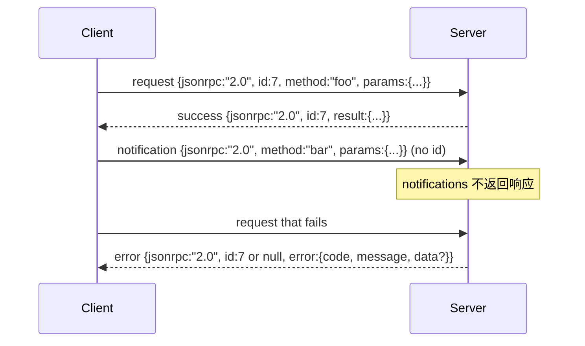

# 基于换行分隔标准输入输出的 JSON-RPC 2.0

> 模型客户端与工具服务器之间的传输是基于 stdio 的 JSON-RPC。手动实现一次可以让你明白每一个封装层的作用。

**类型：** 构建  
**语言：** Python  
**前置知识：** 第13阶段课程01-07，第14阶段课程01  
**耗时：** ~90分钟

## 学习目标
- 理解 JSON-RPC 2.0 作为换行分隔 JSON（newline-delimited JSON）通过标准输入输出（stdin/stdout）传输的封装方式。
- 映射五个标准错误代码（-32700, -32600, -32601, -32602, -32603），并以正确语义呈现它们。
- 区分请求、响应、通知和批量请求，不引入新的封装键。
- 每行处理一个解析错误且不影响后续流解析。
- 使用 `io.BytesIO` 构建一个自终止的演示，让课程在不创建子进程的情况下运行。

## 为什么 JSON-RPC 能成为通用语言（lingua franca）

2026年的编程代理在单一会话中可能与十几个工具服务器通信。每个服务器是独立进程或远程端点。自2013年以来，数据传输格式基本未变。JSON-RPC 2.0 是一个两页的规范。它之所以能存活，是因为替代方案（gRPC、HTTP 每次调用、自定义二进制协议）都带来了 JSON-RPC 无需权衡的折衷：它们只能选择流式、批处理或绑定特定传输。JSON-RPC 在 stdio、sockets、websockets 和 HTTP 间对称，客户端只要遵守规范，就能驱动未见过的服务器。

本课程构建的是 stdio 变体。换行分隔 JSON。每个请求一行，每个响应一行。传输边界是 `\n`。

## 传输格式（wire shape）

存在四种封装格式。客户端说两种，服务器说两种。



通知没有 `id` 字段，服务器不得回应通知。如果服务器回应通知，客户端无法将响应关联到调用点。这个单一规则简化了封装逻辑。

批量请求是请求或通知的 JSON 数组。服务器以响应数组回复，顺序不限，每个非通知请求对应一个响应。如果批量中的所有条目都是通知，则服务器不返回任何内容。

## 五个错误代码

```text
-32700  解析错误（Parse error）      JSON 无法解析
-32600  无效请求（Invalid Request） 封装格式错误
-32601  方法未找到（Method not found）
-32602  参数无效（Invalid params）
-32603  服务器内部错误（Internal error）
```

-32000 到 -32099 保留给服务器自定义错误。其他错误由应用定义。本课程仅使用这五种。如果处理器抛异常，传输层会包装为 -32603 错误，并将异常类名放入 `data.exception`。

解析错误有特殊规则。响应中的 `id` 为 `null`，因为请求没能解析出 id。

## 换行封装与 BytesIO 演示

传输一次读取一行字节，包括 `\n`。若行无法解析，传输写入一个 `id: null` 的 -32700 响应，并继续处理后续行。流不会被破坏，下行新行将重新解析。

课程用 `io.BytesIO` 创建伪 stdin 和 stdout，服务器循环读请求直到 EOF，写入相应响应然后返回。客户端读取响应。无进程创建，无超时。此传输行为和真实子进程管道无异，因为 Python 的 `io` 接口提供了相同的 `.readline()` 和 `.write()` 协议。

## 方法分发

传输层不识别方法存在与否。它调用由框架提供的可调用对象 `handler(method, params)`。处理器返回结果或抛异常。三种异常类对应具体错误码：

```text
MethodNotFound -> -32601
InvalidParams  -> -32602
其他异常       -> -32603，异常名放入 data
```

传输层看不到工具注册表。注册表位于处理器背后。这是我们期望的分层。传输层使用 JSON-RPC，注册表管理工具形态，调度器（第23课）将两者结合。

## 错误发生时的流行为

```text
客户端写入               服务器读取               服务器写出
---------------          -----------              -------------
{...有效请求...}          解析成功                 {...响应, id匹配...}
{...格式错误的JSON...}    解析失败                 {id:null, error: -32700}
{...有效请求...}          解析成功                 {...响应, id匹配...}
{...缺失 method...}       封装格式无效             {id:X, error: -32600}
```

格式错误的 JSON 行不会停止循环。缺失 `method` 字段不会停止循环。处理器异常也不会停止循环。传输持续读取直到 EOF。

## 通知与非对称流程

通知是发送即忘。框架用通知表示进度事件、取消信号和日志行。通知允许长时间运行的工具无需每次等待响应即可流式发送状态更新。

课程实现一个出站通知辅助函数 `write_notification`。服务器在请求处理中用它发出进度通知。演示中显示了流程：请求进入，处理器发出两个进度通知，最后写入最终响应。

## 如何阅读代码

`code/main.py` 定义了 `StdioTransport`、解析辅助函数 `parse_request`、三个写辅助函数 `write_response`、`write_error`、`write_notification`，以及调度循环 `serve`。错误代码常量在模块作用域定义。

`code/tests/test_transport.py` 测试了五个错误代码、通知（无响应）、批量请求（数组输入输出，通知跳过）、格式错误的 JSON（先报告错误后继续）、以及处理器在调用中间发通知的非对称流程。

## 深入了解

本传输层足够满足后续课程需求。生产环境传输会增加三样东西。一个支持转发的关联 ID 字段（你的 `id` 已是此，但在网格中还需要一个外层追踪 id）。一个取消通道（类似通知的 `$/cancelRequest`，携带正在处理调用的 id）。以及一种内容协商握手，以便同一个套接字支持 JSON-RPC 和可流式 HTTP。这些改进不会改变传输格式，只是添加元数据。
