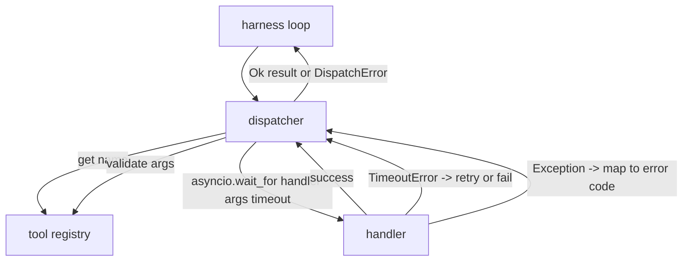
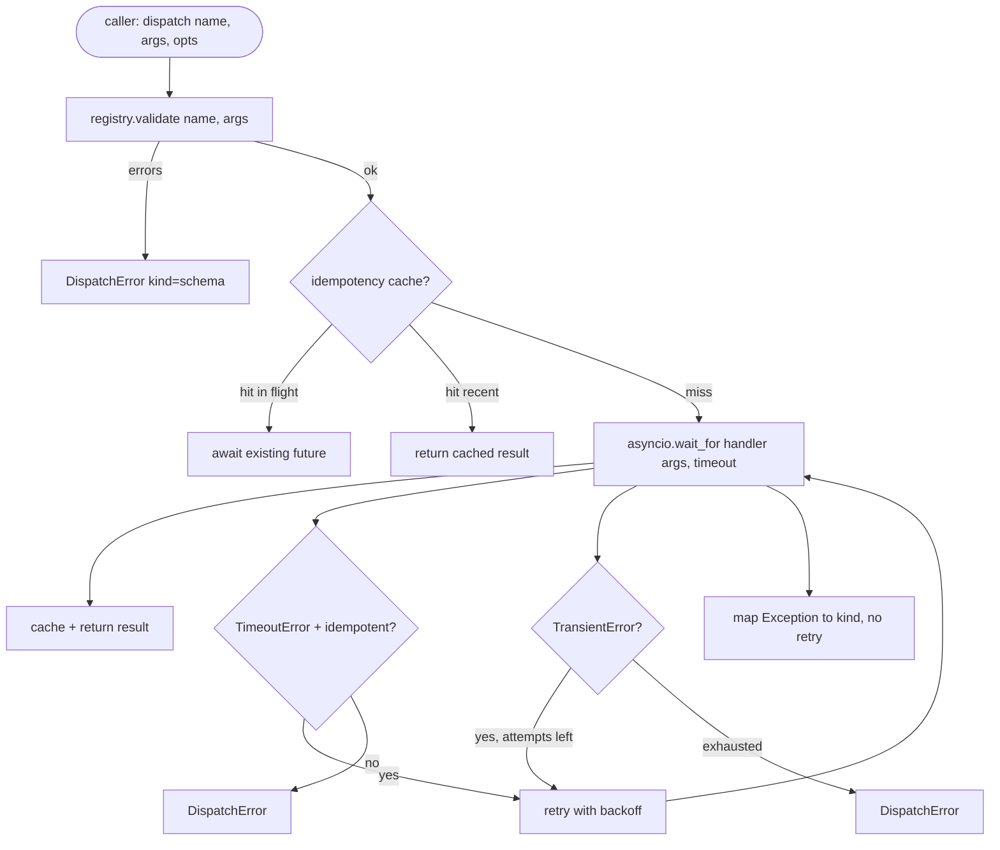

# Function Call Dispatcher（函数调用调度器）

> 调度器是 harness（执行框架）兑现 schema（架构）所有承诺的地方。超时、重试、去重、错误映射，都集中在这一层。

**类型：** 构建  
**语言：** Python  
**先决条件：** 第13阶段课程01-07课，第14阶段课程01课  
**时间**：约90分钟

## 学习目标
- 使用每次调用的超时包装工具处理器，超时后返回类型错误而非阻塞事件循环。
- 应用带抖动的指数退避重试策略，设置最大重试次数。
- 使用幂等键进行重试去重，避免慢请求未完成时重试调用重复执行。
- 将处理器异常和传输故障映射为执行框架循环已识别的统一错误格式。
- 使用并发限制限制并行调度，避免批量发起四十次调用耗尽事件循环。

## 调度器所在位置

位于 harness 循环（第20课）和工具注册表（第21课）之间。传输层（第22课）提供数据给循环。循环将工具调用交给调度器。调度器调用注册表，执行处理器，并返回结果或符合 JSON-RPC 格式的错误封装。



调度器是唯一了解定时器、重试和幂等性的层。循环不知，注册表不知，处理器不知。这种隔离是设计的重点。

## 超时处理

每个工具有默认的超时时间，注册表记录中包含 `timeout_ms`。调度器可通过每次调用传入的重写值覆盖。使用 `asyncio.wait_for` 实现超时。超时后取消处理器任务，调度器返回 `DispatchError(kind="timeout")`。

默认情况下，非幂等工具的超时不是可重试错误。比如 `db.write` 超时后可能已经写入，也可能未写入，重试可能导致写入重复。调度器尊重注册表中的 `idempotent` 标志。幂等工具重试，非幂等工具不重试。

## 指数退避重试

最大重试尝试次数为三次，退避采用带抖动的指数退避策略。

```text
attempt 1  -> delay 0
attempt 2  -> delay 0.1s * (1 + random[0..0.5])
attempt 3  -> delay 0.4s * (1 + random[0..0.5])
```

只有 `timeout` 和 `transient`（暂时性）错误会重试。`schema` 错误、`not_found`（未找到）或 `internal` 错误不会重试。schema 错误是确定性的，重试不会改变结果，还浪费预算。

重试循环遵守执行框架的预算限制。如果调用者预算余量为零，调度器会在第一次尝试时快速失败并返回 `kind="budget_exceeded"`。

## 幂等键去重

如果第一次调用尚未完成时重试发起，属于生产环境中的严重错误。第一次调用挂起在4.9秒（略低于超时），重试在第5秒发起，导致两个请求同时竞争后端资源。如果工具是 `payments.charge`，会导致重复扣款。

调度器接受可选的 `idempotency_key`。如果相同键当前调用正在执行中，调度器等待已有的调用完成并返回其结果。调用完成后键在缓存中保留60秒，用于吸收晚到的重试请求。

键由调用者负责生成。执行框架从计划器中推导出键，格式为：`f"{step_id}:{tool_name}:{hash(args)}"`。调度器不负责自动生成键，因为仅从参数推导键可能会将语义不同的调用误判为相同。

## 错误封装结构

失败的调度返回统一格式：

```text
DispatchError
  kind        : "timeout" | "transient" | "schema" | "not_found" | "internal" | "budget_exceeded"
  message     : str
  attempts    : int
  jsonrpc_code: int   (-32601, -32602, -32603 中的一个)
```

执行框架循环根据 `kind` 跳转下一状态。`schema` 和 `not_found` 进入 `on_error` 并触发重新规划。`timeout` 和 `transient` 进入 `on_error`，根据重试次数可能触发重新规划。`budget_exceeded` 触发 `on_budget_exceeded`。

## 扇出调用的并发限制

`gather(*calls)` 会同时执行所有协程。四十个工具调用意味着四十个打开的 socket 或子进程管道，大多数后端不支持这么多并发连接。

调度器用信号量包装 `gather`。默认并发限制为八。每个调用调度前需获取信号量，完成后释放。调用者对外仍看到 `gather` 格式的结果，实际执行受限于并发数。

## 单次调用流程



## 如何阅读代码

`code/main.py` 定义了 `Dispatcher`、`DispatchError` 和 `TransientError`。调度器构造时需要传入注册表。异步方法 `dispatch(name, args, ...)` 是唯一入口。尝试超时在线程 `_run_with_retries` 内使用 `asyncio.wait_for` 应用。`gather_bounded(calls)` 以并发限制执行多次调度。

`code/tests/test_dispatcher.py` 测试了超时触发、暂时性错误重试、schema 错误不重试、幂等去重（两个并发同键调用合并为一次处理器执行）和并发限制（信号量生效）。

测试用例使用 `asyncio.sleep(0)` 和确定性的基于 Counter 的处理器，测试运行毫秒级完成且不依赖真实时间。

## 进阶扩展

生产环境调度器会增加两大功能。首先，在每次状态转移处增加结构化日志（虽然事件循环已有事件流，调度器应额外发射 `dispatch.attempt` 和 `dispatch.retry` 事件）。其次，断路器（circuit breaker）：在窗口期内若失败次数超过阈值，工具将进入冷却期，调度调用不再执行处理器，立即返回 `kind="circuit_open"`。这两者均可基于当前调度器扩展，无需更改接口约定。

第24课将调度器与计划执行代理（plan-and-execute agent）整合，展示四个模块协同工作。
