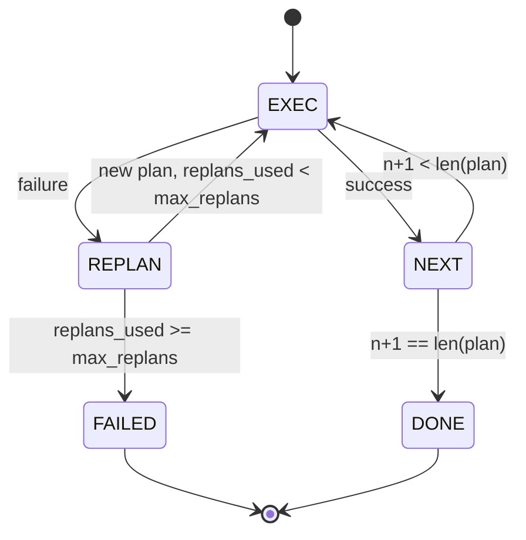

# 计划-执行 控制流程

> 一个不能在失败中存活的计划只是脚本。一个能够重新规划的脚本才是智能体。先构建重新规划器。

**类型：** 构建  
**语言：** Python  
**前置条件：** 第13阶段课程01-07节，第14阶段课程01节  
**用时：** ~90分钟

## 学习目标
- 将计划表示为有序的类型化步骤列表，便于执行者推理进度和结果。
- 按顺序执行步骤，对失败进行受控传递回规划器。
- 从当前游标开始重新规划，将之前的错误作为上下文使下一个计划更加明智。
- 每次修订时发出计划差异（plan diff），使下游跟踪器或UI能展示为何计划变化。
- 强制执行两个预算：硬性步骤上限和硬性重新规划上限。

## 计划并执行，而非思维链（chain-of-thought）

思维链智能体发出标记，由循环猜测工具调用何时结束。计划执行智能体先发出结构化计划，然后确定性地执行每一步。计划是可供框架检查的数据。执行是框架通过分发器运行这些数据。

两部分：产生计划的规划器和执行计划的执行器。关键在于执行器遇到失败时的处理方式，有三种：

```text
1. 中止          （返回失败，展现错误）
2. 跳过          （标记步骤失败，继续执行后续）
3. 重新规划       （将错误交给规划器，从游标处获得新计划）
```

重新规划使脚本变为智能体。

## 步骤结构

```text
Step
  id              : int           （计划修订内单调递增）
  tool_name       : str
  args            : dict
  expected_outcome: str           （规划器声明的成功条件）
  result          : Any | None
  error           : str | None
```

`expected_outcome` 是规划器附加在步骤旁的简短句子。执行器不强制执行，作用有两个：重新规划器修订计划时读取；事件流发出以供跟踪器显示“此步骤预期完成X”。

## 规划器函数签名

```python
def planner(goal: str, history: list[Step], last_error: str | None) -> list[Step]:
    ...
```

纯函数。`goal` 是用户目标。`history` 是已执行步骤（结果和错误已填充）。`last_error` 第一次调用为None，后续调用为最近失败信息。规划器返回从游标处开始的下一计划。

规划器不关心执行器，不关心重试，不关心超时。它只产生计划。

## 执行器

执行器是一个小状态机。每个步骤通过分发器运行。结果为三种之一：成功、可重新规划的失败、致命失败。可重规划失败交回规划器。致命失败（预算超限，重新规划次数到达上限）返回`FAILED`会话结果。



## 修订时的计划差异

规划器在失败后返回新计划时，执行器发出带有三个字段的`plan.diff`事件。

```text
removed: 老计划中有、新计划中无的步骤id列表  
added  : 新计划中有、老计划中无的步骤id列表  
revised: 工具名(tool_name)或参数(args)发生变化的步骤id列表
```

跟踪器或UI可将已移除步骤画划线，将新增步骤高亮。重点不在差异格式，而在于修订是显式事件，而非静默重写。

## 两个硬性预算

`max_steps` 限制整个会话中步骤执行总次数，包括重新规划。默认十二次。一个线性五步计划重规划两次且每次新增三步，执行次数达十六，会超预算。执行器会拒绝重新规划并返回FAILED。

`max_replans` 限制规划器调用次数（除第一次计划外）。默认五次。这是更重要的限制。一个规划器连续五次返回相同的错误计划会无限循环直到步数预算触发。限制重新规划让失败更快发生且原因更明确。

## 本课的确定性规划器

本课不调用模型。课程提供基于`last_error`的确定性规划器。

```text
last_error 是 None    -> 发出四步计划
last_error 匹配 X     -> 发出绕开X的三步计划
last_error 匹配 Y     -> 发出优雅放弃的两步计划
否则                  -> 返回 []（表示无可重新规划内容）
```

足以测试执行器在各种路径上的行为：成功、一次重新规划、两次重新规划、重新规划用尽和步骤预算用尽。

## 结果结构

```text
SessionResult
  status      : "completed" | "failed"
  reason      : str     ("goal_met" | "step_budget" | "replan_budget" | "no_plan")
  history     : list[Step]
  revisions   : list[PlanDiff]
  events      : list[Event]
```

第20课的框架循环可直接读取此结构。第23课的分发器负责执行每步。第21课的注册器验证每步参数。第22课的传输层通过 JSON-RPC 将整个流程呈现给模型客户端。

## 如何阅读代码

`code/main.py` 定义了 `PlanExecuteAgent`、`Step`、`PlanDiff`、`SessionResult` 和确定性规划器。执行器是单个 `run(goal)` 方法，返回 `SessionResult`。计划差异通过比较步骤id及其`(tool_name, args)`元组计算。

`code/tests/test_agent.py` 覆盖了线性成功、中途失败重新规划一次、重新规划用尽返回 `failed:replan_budget`、步骤预算用尽和计划差异事件格式。

## 进一步拓展

连接真实模型后你会需要两个扩展：  
第一，部分计划缓存（partial-plan caching）：计划前半部分成功，后续失败时不必重复执行已成功的步骤。执行器已有历史，规划器只需读取。  
第二，平行分支（parallel branches）：当前执行器严格线性。规划器发出独立分支（如`gather_step`而非`next_step`）可同时通过分发器并发运行多个工具调用。

两者都极大增加复杂性，建议先稳固线性执行器后再实现。本课即完成此目标。
