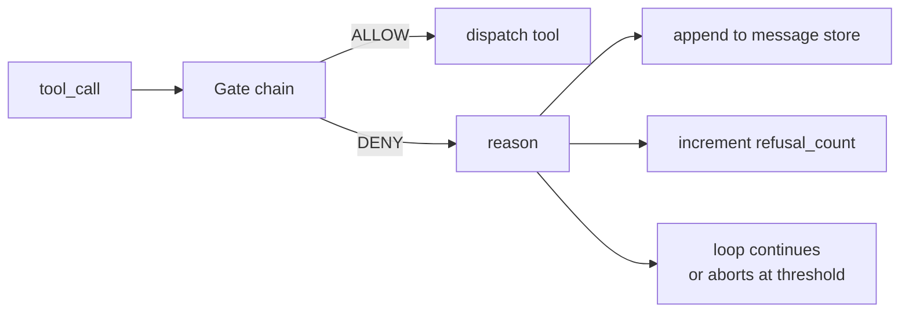
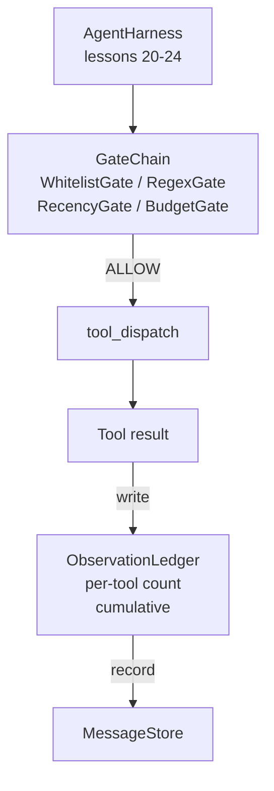

# Capstone Lesson 25: Verification Gates and the Observation Budget  
# 结业课 25：验证闸门（Verification Gates）和观察预算（Observation Budget）

> An agent harness without a verification layer is a wish in a trenchcoat. This lesson builds the deterministic gate chain that decides whether a tool call is allowed to fire, how much of its output the agent is allowed to see, and when the loop has to stop because the agent has read too much. The chain is a function of small, named gates plus an observation ledger that tracks every token the model has been shown.  
> 一个没有验证层的智能体框架就像穿了风衣的愿望。这节课构建了确定性的闸门链，用来决定是否允许调用工具、允许代理查看多少输出，以及当代理读取过多时循环何时停止。链条由多个小型的、命名的闸门组成，并配合一个观察账簿（observation ledger）记录模型所见的每个 token。

**Type:** Build  
**类型：** 构建  
**Languages:** Python (stdlib)  
**语言：** Python（标准库）  
**Prerequisites:** Phase 19 · 20-24 (Track A1: agent loop, tool registry, message store, prompt builder, model router), Phase 14 · 33 (instructions as constraints), Phase 14 · 36 (scope contracts), Phase 14 · 38 (verification gates)  
**先决条件：** 第 19 阶段 · 20-24（路径 A1：代理循环、工具注册、消息存储、提示构建器、模型路由器），第 14 阶段 · 33（将指令作为约束）、第 14 阶段 · 36（作用域合约）、第 14 阶段 · 38（验证闸门）  
**Time:** ~90 minutes  
**时间：** 约 90 分钟

## Learning Objectives  
## 学习目标

- Build a `VerificationGate` protocol with a deterministic `evaluate(call)` method.  
- 构建带有确定性 `evaluate(call)` 方法的 `VerificationGate` 协议。  
- Compose budget, recency, whitelist, and regex gates into a chain with short-circuit semantics.  
- 将预算（budget）、时效性（recency）、白名单（whitelist）和正则表达式（regex）闸门组成带有短路语义的链条。  
- Track every observation through an `ObservationLedger` keyed by tool and turn.  
- 通过以工具和回合为键的 `ObservationLedger` 跟踪每个观测。  
- Refuse a tool call when the cumulative observation budget would be exceeded.  
- 当累计观察预算被超出时拒绝工具调用。  
- Surface a structured `GateDecision` record that downstream observability can ingest.  
- 生成结构化的 `GateDecision` 记录，方便下游可观测性使用。

## The Problem  
## 问题定义

When an agent harness lets the model call tools freely, three classes of bug appear within the first hour of real use.  
当代理框架允许模型自由调用工具时，实际使用的第一个小时内会出现三类错误。

The first is unbounded observation. A grep across a 200K-line repo dumps half a million tokens of output into the next turn. The model sees one match per kilobyte and the rest of the context is wasted. The token bill is large and the agent is now worse, not better, at the task.  
第一类是无界观察。一条针对 20 万行代码库的 grep 命令，将五十万个 token 的输出倒入下一回合。模型每千字节只看到一个匹配，剩余的上下文浪费掉了。token 账单巨大，且智能体的任务表现变得更差而非更好。

The second is stale recency. A long-running task accumulates fifty tool calls. The model rereads the first read_file from turn three as if it were live state. Edits made on turn forty-seven never show up because the prompt builder serialized the earliest observations first.  
第二类是陈旧的时效性。一个长时间运行的任务累计了五十次工具调用。模型重新读取来自第三回合的首次 read_file，仿佛它是最新状态。第四十七回合的编辑却从未出现，因为提示构建器先序列化了最早的观察。

The third is privilege creep. A research task starts by calling `web_search`, then somehow ends up running `shell` because the model invented a tool name and the harness defaulted to permissive. By the time anyone reads the trace, a junk file is sitting in /tmp and a curl ran against a private API.  
第三类是权限蔓延。一个研究任务开始调用 `web_search`，然后不知何故以运行 `shell` 结束，因为模型自创了工具名而框架默认宽容。等人们查看日志时，垃圾文件正躺在 /tmp，且 curl 正对私有 API 发起请求。

A verification gate is the harness component that says no. It is not a model. It is not a judge. It is a deterministic function of `(call, history, ledger)` that returns either ALLOW or DENY with a reason. The reason is logged. The model is told. The loop continues or aborts.  
验证闸门是判断“不”的框架组件。它不是模型，也不是评判者。它是 `(call, history, ledger)` 的确定性函数，返回 ALLOW 或 DENY 并附带理由。理由会被记录，模型会被告知，循环要么继续，要么中止。

## The Concept  
## 概念



A gate is anything with an `evaluate(call, ctx) -> GateDecision` method. The chain is an ordered list. Evaluation short-circuits on the first deny. Order matters: cheap structural gates run before expensive token-counting gates.  
闸门（gate）是带有 `evaluate(call, ctx) -> GateDecision` 方法的任何组件。链是有序列表。评估在首次拒绝时短路。顺序至关重要：成本低的结构闸门先运行，成本高的 token 计数闸门后运行。

This lesson ships four gates:  
本课程包含四个闸门：

- `WhitelistGate`. Allowed tool names are an explicit set. Anything outside is denied. This is the cheapest gate and runs first.  
- `WhitelistGate`（白名单闸门）。允许的工具名称是显式集合，其他一律拒绝。这是最便宜的闸门，最先运行。  
- `RegexGate`. Tool arguments are matched against a regex. Useful for refusing shell calls with `rm -rf` in them, or HTTP calls to internal IPs. Pure on the call payload.  
- `RegexGate`（正则闸门）。工具参数与正则表达式匹配。用于拒绝包含 `rm -rf` 的 shell 调用，或指向内部 IP 的 HTTP 调用。纯函数，仅依赖调用负载。  
- `RecencyGate`. The model only sees observations from the last N turns. Older observations are masked. The gate refuses a tool call whose result would extend an observation window that has already aged out.  
- `RecencyGate`（时效性闸门）。模型仅看到最近 N 回合的观察。更老的观察被屏蔽。该闸门拒绝其结果会扩展已过期观察窗口的工具调用。  
- `BudgetGate`. The cumulative tokens the model has read across the session has a ceiling. When the ledger says the ceiling is reached, every further tool call is denied.  
- `BudgetGate`（预算闸门）。模型本次会话累计读取的 token 有上限。当账簿显示达上限，所有后续工具调用都被拒绝。

The observation ledger is the bookkeeping. Every successful tool call writes one row: tool name, turn, tokens emitted, cumulative. The ledger answers two questions: how much has the model seen total, and how much has it seen of tool X. The budget gate reads the first. A per-tool budget gate, which you will write as an exercise, reads the second.  
观察账簿负责记账。每个成功工具调用写入一行：工具名、回合数、输出 token 数、累计值。账簿回答两个问题：模型总共看了多少、模型对工具 X 看了多少。预算闸门读取第一个；每工具预算闸门（作为练习编写）读取第二个。

## Architecture  
## 架构



The harness asks the chain. The chain either nods or refuses. If it nods, the tool runs, the ledger ticks, and the result is appended to the message store. If it refuses, the model is handed the refusal as a system message and the loop decides whether to retry or abort.  
框架请求闸门链。链条要么通过，要么拒绝。如果通过，工具运行，账簿更新，结果追加到消息存储。如果拒绝，模型收到系统消息的拒绝通知，循环决定重试或终止。

## What you will build  
## 你将构建的内容

The implementation is a single `main.py` plus tests.  
实现包含一个 `main.py` 和测试。

1. `Observation` and `ToolCall` dataclasses define the wire shapes.  
1. `Observation` 和 `ToolCall` 数据类定义数据结构。  
2. `ObservationLedger` records `(turn, tool, tokens)` rows and answers `cumulative()` and `per_tool(name)`.  
2. `ObservationLedger` 记录 `(turn, tool, tokens)` 行，并实现 `cumulative()` 和 `per_tool(name)` 方法。  
3. `GateDecision` carries `(allow, reason, gate_name)`.  
3. `GateDecision` 携带 `(allow, reason, gate_name)`。  
4. `VerificationGate` is the protocol. Each gate implements `evaluate(call, ctx)`.  
4. `VerificationGate` 是协议。每个闸门实现 `evaluate(call, ctx)`。  
5. `GateChain` wraps an ordered list. It calls each gate, returns the first deny, or returns allow if every gate passes.  
5. `GateChain` 封装有序列表，调用每个闸门，第一次拒绝时返回拒绝；全部通过则返回允许。  
6. The demo runs a tiny synthetic agent loop. Three turns. The third turn trips the budget gate and the loop reports a clean refusal with a non-zero refusal count.  
6. 演示运行一个简易合成代理循环，三回合。第三回合触发预算闸门，循环报告含非零拒绝计数的明确拒绝。

The token counter is intentionally a stupid `len(text) // 4` heuristic. The point of this lesson is the gate plumbing, not the tokenizer. Drop in a real tokenizer in production.  
token 计数器故意用简单的 `len(text) // 4` 规则。本课重点是闸门链路，而非分词器。生产环境中请替换为真实分词器。

## Why the chain order matters  
## 为什么链条顺序很重要

A deny is cheaper than an allow. `WhitelistGate` runs in O(1) hash lookup. `RegexGate` runs in O(pattern * argv). `RecencyGate` reads a small slice of the message store. `BudgetGate` reads the entire ledger. You order them by ascending cost so a denied call short-circuits before doing the expensive work.  
拒绝操作比允许更廉价。`WhitelistGate` 通过 O(1) 哈希查找运行。`RegexGate` 复杂度为 O(pattern * argv)。`RecencyGate` 读取消息存储中的小切片。`BudgetGate` 读取整个账簿。按成本从低到高排序，确保被拒绝调用能短路，避免执行昂贵的操作。

You also order them by blast radius. Whitelist is the strongest claim: this tool is not in the contract. The regex gate is next: this argument is not in the contract. Recency comes after: the harness still cares but the call is structurally legal. Budget is last because, by definition, it only fires when everything else passed.  
还要按影响范围排序。白名单最严格：此工具不在合约内。正则闸门次之：参数不在合约内。时效性闸门随后：框架仍在意，但调用结构上合法。预算闸门最后，因为它只在其他闸门都通过时才触发。

## How this composes with the rest of Track A  
## 本课在路径 A 中的组合方式

The previous lessons gave you the loop, the tool registry, the message store, the prompt builder, and the model router. This lesson adds the layer between the model and the tools. Lesson 26 ships the sandbox that the dispatcher hands the tool call to once the gate chain says ALLOW. Lesson 27 ships the eval harness that records refusal counts as a quality signal. Lesson 28 wires the gate decisions into OpenTelemetry spans. Lesson 29 stitches the lot into a working coding agent.  
之前的课程提供了循环、工具注册、消息存储、提示构建器和模型路由器。本课增加了模型与工具间的中间层。第 26 课交付沙箱，派发器在闸门链同意后将调用发送给沙箱。第 27 课交付评估框架，记录拒绝计数作为质量信号。第 28 课将闸门决策接入 OpenTelemetry 跟踪。第 29 课将所有环节拼接成工作中的编码代理。

## Running it  
## 运行方法

```bash
cd phases/19-capstone-projects/25-verification-gates-observation-budget
python3 code/main.py
python3 -m pytest code/tests/ -v
```

The demo prints a turn-by-turn trace including every gate decision and exits zero. The tests cover the ledger, each gate in isolation, the chain short-circuit, and the synthetic loop end-to-end.  
演示打印每回合跟踪，包括每个闸门决策，程序正常退出。测试覆盖了账簿、各闸门单独测试、链条短路机制以及合成循环的端到端。
