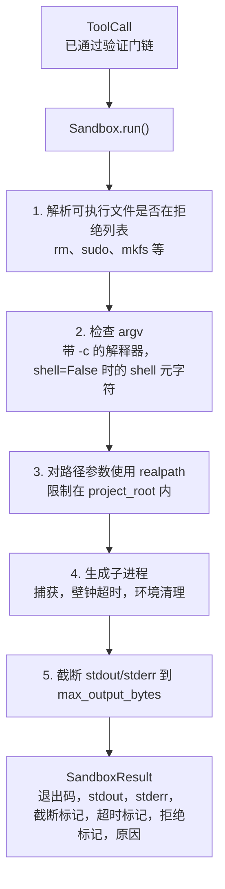
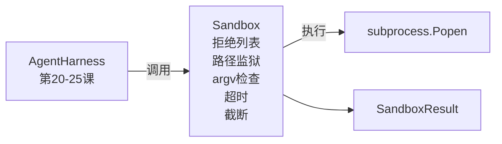

# 结课第26课：带拒绝列表和路径监狱的沙箱运行器

> 验证门决定是否运行某个工具调用。沙箱决定当运行时会发生什么。本课实现一个子进程运行器，该运行器拒绝危险的可执行文件、拒绝结构异常的 argv、将所有文件路径限制在项目根目录内、截断超大输出，并在壁钟超时后结束失控进程。它是模型和操作系统之间的第二层防线。

**类型：** 构建  
**语言：** Python（标准库）  
**先决条件：** 第19阶段·第25课（验证门和观察预算）、第14阶段·第33课（以约束形式的指令）、第14阶段·第38课（验证门）  
**时间：** 约90分钟

## 学习目标

- 构建一个包装 `subprocess.run` 的 `Sandbox` 类，支持超时、捕获和截断。  
- 使用拒绝列表从名称层面拒绝命令，使用 argv 检查器从结构层面拒绝命令。  
- 拒绝任何解析到项目根目录之外的路径参数。  
- 当 `shell=False` 时拒绝 shell 元字符。  
- 返回结构化的 `SandboxResult`，供下游可观测性和评测环境使用。

## 问题描述

一个可以调用 shell 的编码代理可能在一次操作中安装后门、窃取密钥、使开发者笔记本变砖，甚至产生大量云费用。最省钱的防御是不给它 shell 权限。第二种防御是沙箱，针对特定模式说不。

代理日志中反复出现三类失败。

第一类是危险的可执行文件。当模型被迫修复路径问题时，会尝试 `sudo`、`chmod -R 777`、`rm -rf`、`mkfs`、`dd` 等操作。这些操作绝不应该出现在代理执行中。拒绝列表按名称和别名捕获它们。

第二类是 argv 技巧。当模型被告知禁止 shell 时，会通过解释器传递攻击：如 `python3 -c "import os; os.system('rm -rf /')"`、`bash -c '...'`、`node -e '...'`、`perl -e '...'`。沙箱需要知道，任何带有 `-c` 类似参数的解释器运行实际上就是带额外步骤的 shell 调用。

第三类是路径逃逸。模型应读取 `./src/main.py`，却读取了 `../../etc/passwd`。沙箱通过使用 `os.path.realpath` 解析路径参数，并断言前缀是否属于项目根目录来进行路径限制。

沙箱不是操作系统意义上的安全边界。有代码执行能力的攻击者仍可逃逸。沙箱是开发时的护栏：把常见失败模式高声警告，防止代理因粗心大意造成危害。

## 概念图



沙箱有四个拒绝维度：名称、argv、路径、结构。每个维度都是调用的纯函数，不涉及生成子进程。只有所有维度通过后才生成子进程。

`SandboxResult` 退出码是传统定义：0 成功，非0 失败，以及三个哨兵码：拒绝 (-100)、超时 (-101)、截断（退出码为真实退出码并设置相应标志）。下游课程读取结构化结果，而非解析 stderr。

## 架构图



拒绝列表是可执行文件 basename 的 frozenset。别名（如 `/bin/rm`、`/usr/bin/rm`）均归约为相同 basename。argv 检查器识别解释器形态：任何 argv[0] 是解释器且之后某个参数以 `-c` 或 `-e` 开头的都拒绝。shell 元字符（`;`、`|`、`&`、`>`、`<`、反引号、`$()`） 在调用未显式开启 shell 模式时导致拒绝。

路径监狱是最微妙的部分。沙箱在构造时接受 `project_root` 参数。任何看似路径的参数（包含 `/` 或匹配存在文件）先通过 `os.path.realpath` 标准化，再与项目根的 realpath 对比。如果目标路径不在根目录下即拒绝。通过检查 realpath 而非字面路径，阻止了符号链接逃逸尝试（项目根下的符号链接指向外部）。

## 你将构建的内容

实现文件为 `main.py` 以及一个测试目录。

1. 定义 `SandboxResult` 数据类：exit_code、stdout、stderr、truncated、timed_out、denied、reason、duration_ms。  
2. 定义 `SandboxConfig` 数据类：project_root、max_output_bytes、timeout_seconds、denylist、interpreter_block。  
3. `Sandbox` 类：`run(argv, *, shell=False, cwd=None)` 返回 `SandboxResult`。  
4. 内部拒绝检查函数：`_check_executable_denylist`、`_check_argv_interpreter`、`_check_shell_metachars`、`_check_path_jail`。  
5. 输出截断，带清晰的 `truncated` 标志和标记行。  
6. 底部示例：一系列合法和敌对的调用，以及对应结果。

沙箱默认使用 `subprocess.run`，`shell=False`，`capture_output=True`。壁钟超时通过 `timeout` 参数实现；遇到 `TimeoutExpired` 时杀死进程组，生成相应的 `SandboxResult`。

## 为什么这不是一个真正的沙箱

本课沙箱不使用命名空间（namespaces）、控制组（cgroups）、seccomp、gVisor、Firecracker 或任何内核级隔离。子进程能做的事情沙箱都能做。防护是结构上的：禁止最常见的危险调用，拒绝时日志输出至可观测系统，而不是静默执行。

生产环境代理要做更多安全强化：在无特权 Docker 容器内运行，在微虚拟机（microVM）里运行，剥离能力、挂载项目目录为只读且挂载临时目录为可写，设置内存和 CPU 的 ulimit，环境只留白名单。第29课会涉及部分内容。操作系统级隔离超出本课范围。

## 运行方法

```bash
cd phases/19-capstone-projects/26-sandbox-runner-denylist
python3 code/main.py
python3 -m pytest code/tests/ -v
```

示例会创建临时目录，放入一个干净文件，然后执行一系列调用。合法调用执行成功。被拒绝的调用返回 `SandboxResult`，包含 `denied=True` 和理由。超时调用返回 `timed_out=True`。截断设置 `truncated=True`。示例输出 JSON 表格显示结果，最终退出码为 0。

## 与 A 轨道其它课程的组合

第25课实现验证门链。第26课是验证门允许后的执行器。第27课的评测环境会对比沙箱结果与每个任务期望退出码。第28课会在每个 `Sandbox.run` 调用周围发出 `gen_ai.tool.execution` 量度。第29课的端到端示例将一个真实编码代理穿过这两层防线。
