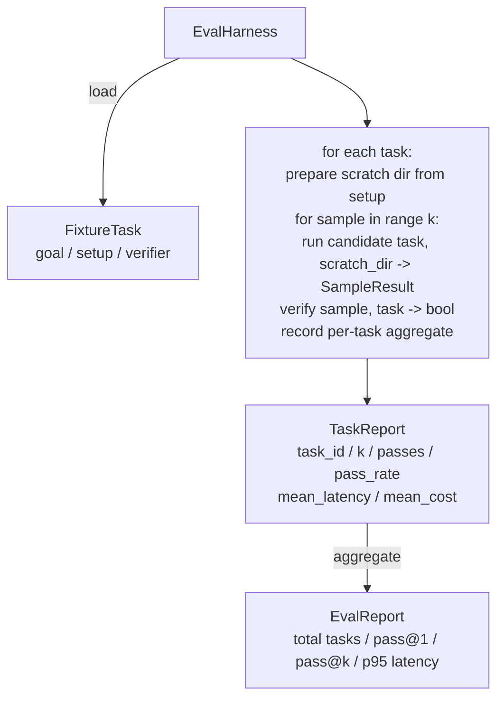

# 毕业项目第27课：使用夹具任务的评估框架

> 一个编码代理的好坏取决于你用来衡量它的任务套件。本课构建了一个评估框架，接收一个夹具任务文件夹，依次用候选代理运行每个任务，通过确定性验证器评分通过或失败，并将结果汇总为 pass@1、pass@k、平均延迟和平均成本。该框架是真理源，让你能区分回归和重构。

**类型：** 构建  
**语言：** Python（标准库）  
**先决条件：** 第19阶段·25课（验证关卡）、第19阶段·26课（沙盒运行器）、第14阶段·30课（基于评估的代理开发）、第14阶段·19课（SWE-bench 和 GAIA 基准）  
**时间：** 约90分钟

## 学习目标

- 定义夹具任务为目标、设置和验证器的三元组。
- 对每个任务多次运行采样并计算 pass@1 和 pass@k。
- 汇总延迟和成本为平均值和95百分位数指标。
- 将确定性验证器（文件差异、退出码、正则匹配）封装为可复用函数。
- 输出结构化 JSON 报告，供回归跟踪脚本读取。

## 问题

没有评估框架的代理基准存在三种失败模式。

第一是未经验证的通过。代理声称修复了 bug，人工简单查看差异，测试套件标记为通过，三周后回归测试又发现同样的 bug。代理只是合理推断，但未真正修复。

第二是未检测回归。提示模板改动使代理在一项大声任务上提升4%，另一项静音任务上下降14%。没有金标准和逐任务得分，回归直接合入主干，只在客户投诉时暴露。

第三是逐任务漂移。周一运行评估有100个任务，周五因有人重命名了五个夹具只跑了95个，误以为通过率提升了5%，实际上没有。

框架是将这些失败转换为事实的程序。它对每个夹具任务均执行，按可重现顺序运行，调用返回真或假的确定性验证器。

## 概念

```mermaid
flowchart LR
  F1[fixtures/task_001/<br/>task.json + expected/] --> Harness
  F2[fixtures/task_002/<br/>...] --> Harness
  Harness[Harness<br/>for each task:<br/>setup / run agent k samples /<br/>verify each sample /<br/>record latency, cost]
  Harness --> Report[EvalReport<br/>pass@1 / pass@k<br/>mean ms / p95 ms<br/>mean cost]
```

`FixtureTask` 是一个小型 JSON 文件加上可选的 `expected/` 目录。JSON 文件声明了 `id`、`goal`（输入代理的提示）、`setup` 块（需放入临时目录的文件），和 `verifier` 块。`verifier` 块命名框架验证器注册表中的函数并提供参数。

三种验证器覆盖了大多数有用任务。

第一是 `file_equals`。代理运行后，比较指定文件与预期内容。此验证适用于“必须以此精确方式修复该 bug”的任务。

第二是 `regex_match`。指定文件内容匹配一个正则表达式。适用于“函数必须存在并返回X”且存在多种解法的任务。

第三是 `shell_exit_zero`。框架通过第26课的沙盒执行 shell 命令，仅当命令退出码为0时通过。适用于“测试必须全部通过”的任务。

框架对每个任务运行 `k` 次。Pass@k 的计算公式是 `1 - (1 - p)^k`，其中 p 是经验通过率；框架也报告原始计数，方便观察方差。延迟为每个样本的壁钟时间。成本由代理自报告（令牌数、美元或两者）；框架计算样本总和，并展示逐任务及总体数值。

## 架构



候选对象是一个可调用：`Callable[[FixtureTask, str], SampleResult]`。框架通过 `tempfile.mkdtemp()` 创建临时目录，并以纯字符串形式传入路径。框架不关心候选如何工作。候选可以是确定性补丁应用器（适合框架自测）、真实大语言模型代理或模糊测试器。合同是 SampleResult。

## 你将构建的内容

`main.py` 提供：

1. `FixtureTask` 数据类。  
2. `SampleResult` 数据类：success_self_reported、latency_ms、cost_units、edits。  
3. `TaskReport`、`EvalReport` 数据类及其 `to_dict()` 方法。  
4. `VerifierRegistry`，将验证器名映射到函数。内建验证器包括：file_equals、regex_match、shell_exit_zero。  
5. `EvalHarness` 类。对任务目录中的所有任务运行候选代理，返回 EvalReport。  
6. 打包的五个夹具任务于 `tasks/`：  
   - `fizzbuzz` 中的越界一位错误  
   - `factorial` 缺少返回  
   - 错误消息中的拼写错误  
   - 空函数体  
   - 链表遍历中的越界一位错误  
7. 一个确定性的参考候选（`apply_known_fixes`），框架用它演示干净的 pass@1=1.0。  
8. 演示打印 EvalReport JSON 并正常退出。

夹具任务以 JSON 文件打包在 `tasks/`，对应源文件在 `tasks/<id>/buggy/` 和 `tasks/<id>/expected/`。框架把 buggy 复制到临时目录，交给候选运行，然后与 expected 验证。

## 为什么用 pass@k，而不仅仅是 pass@1

真实的 LLM 代理具有随机性。pass@1 若是0.6看似失败，pass@5 达0.95表明代理大部分时间能给出正确答案，但早期采样可能选错。修正方案是采样和排序，而非总是增加训练。Pass@k 使这一点可视化。

同时报告 pass@1 和 pass@k，因为 pass@k 掩盖了真实失败：模型偶尔在20次尝试中答对一次，并不是有用代理。框架展示两者。

## 与 Track A 其余部分的组合

第25课产出关卡链，第26课产出沙盒。框架对任何 `shell_exit_zero` 验证器都用沙盒。第28课将每次框架运行包裹在 OTel 跟踪下，第29课基于打包夹具运行端到端演示，并对参考候选断言 pass@1=1.0。

## 运行方法

```bash
cd phases/19-capstone-projects/27-eval-harness-fixture-tasks
python3 code/main.py
python3 -m pytest code/tests/ -v
```

演示打印 JSON 格式的 EvalReport，包含 pass@1、pass@5、平均延迟及逐任务细分，退出码为0。测试覆盖验证器函数、pass@k 计算、夹具加载以及针对捆绑参考候选的框架端到端运行。
