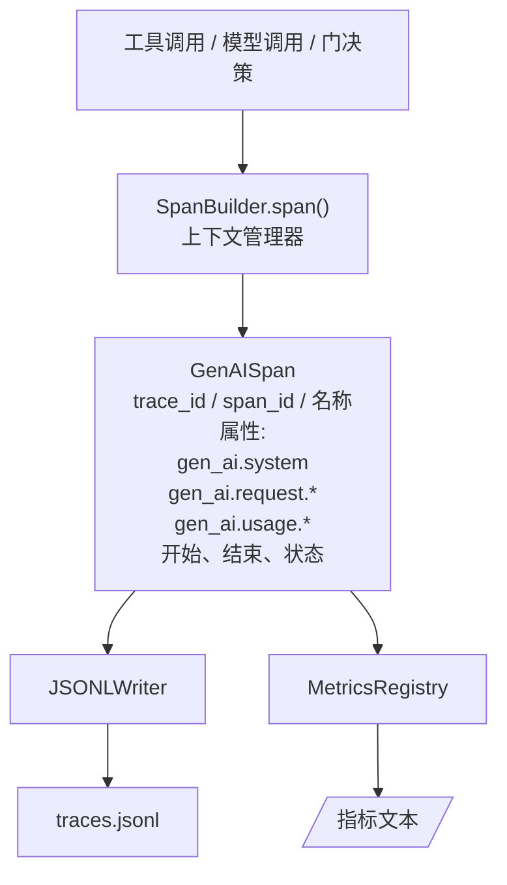
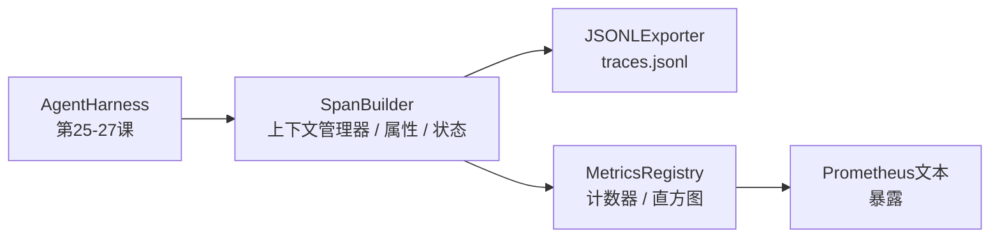

# 结业课第28课：使用OTel GenAI跨度和Prometheus指标实现可观测性（Observability）

> 没有可观测性的Agent harness是一个烧钱的黑盒子。本课将手工实现一个跨度生成器（span builder），它输出符合OpenTelemetry GenAI语义规范的记录，将它们写入每行一个跨度的JSONL文件，并以Prometheus文本格式暴露计数器和直方图。整个实现使用Python标准库，离线运行。

**类型：** 构建  
**语言：** Python（标准库）  
**先决条件：** 第19阶段·25（验证门）、第19阶段·26（沙箱）、第19阶段·27（评估框架）、第13阶段·20（OpenTelemetry GenAI）、第14阶段·23（OTel GenAI规范）  
**时间：** 约90分钟

## 学习目标

- 构建一个符合OpenTelemetry GenAI语义规范的跨度（span）数据类。  
- 实现一个JSONL导出器，每行写入一个自包含的跨度。  
- 构建带有标签的计数器和直方图，并以Prometheus文本格式公开指标。  
- 将任何可调用对象包装在跨度上下文管理器中，记录持续时间、状态和异常。  
- 验证输出的跨度可通过`json.loads`反序列化且符合规范形态。  

## 问题描述

生产环境中的编码Agent每个步骤都会产生三类产物：模型调用、工具执行和验证门决策。没有结构化的遥测数据，这些产物毫无用处。

第一种失败模式是缺失追踪。周二发生了故障，但唯一的记录是一条500行的聊天日志。没有记录哪个工具执行了、耗时多久、提示中包含多少tokens，或者验证门是否拒绝了什么。Agent作者只能猜测。

第二种失败模式是无法解析的追踪。框架写入了跨度但用了自定义字段名。Grafana、Honeycomb、Jaeger或本地CLI都无法读取。团队堆栈中的工具被浪费了，因为跨度不符合标准。

第三种失败模式是指标未聚合。你能在追踪中看到某次慢的工具调用，却无法回答“过去一小时read_file调用的p95延迟是多少？”，因为没有任何指标，只有追踪数据。

OpenTelemetry GenAI语义规范正是为此而生。它定义了一组跨LLM框架共享的标准属性。只要你的框架写入这些属性，任何兼容OTel的后端都能读取它们。

## 概念说明



框架中的每个操作都会生成一个跨度。跨度拥有trace id（整个agent调用）、span id（此操作）、名称（例如`gen_ai.chat`，`gen_ai.tool.execution`），符合GenAI规范的属性，开始时间和结束时间，及状态。

GenAI规范标准化了这些属性键：`gen_ai.system`（提供商，例如`anthropic`、`openai`）、`gen_ai.request.model`（模型ID）、`gen_ai.request.max_tokens`、`gen_ai.usage.input_tokens`、`gen_ai.usage.output_tokens`、`gen_ai.response.model`、`gen_ai.response.id`、`gen_ai.operation.name`，加上工具特定的键`gen_ai.tool.name`和`gen_ai.tool.call.id`。

导出器写入JSONL格式。每行一条JSON对象。这是最简单的格式，方便下游工具流式处理、grep搜索和导入。真正的OTel导出器会使用OTLP gRPC；本课的JSONL导出器是离线等价物，且在所有工作站均正常退出。

指标与追踪并存。工具调用时递增计数器：`tools_called_total{tool="read_file"}`。直方图记录观察到的延迟：`tool_latency_ms{tool="read_file"}`。两者都序列化为Prometheus文本格式，该格式是基于拉取的指标事实标准。

## 架构设计



跨度构建器是一个小型类，含有`span(name, attrs)`方法，返回上下文管理器。上下文管理器进入时记录开始时间，退出时记录结束时间，如果有异常则附带异常信息，并将完成的跨度推送给导出器。

指标注册表由两个字典组成。计数器是 `{(name, frozen_labels): int}` 。直方图保存原始样本列表，展示时按Prometheus直方图桶序列化。

## 你将构建的部分

`main.py`包含：

1. `GenAISpan`数据类：trace_id、span_id、parent_span_id、名称、属性、start_unix_nano、end_unix_nano、状态、状态信息、事件。  
2. `SpanBuilder`类，带有`span(name, attrs, parent=None)`上下文管理器。  
3. `JSONLExporter`类，含`export(span)`方法追加单行。  
4. `Counter`和`Histogram`类及`MetricsRegistry`。  
5. `prometheus_exposition(registry)`函数，生成文本格式输出。  
6. `wrap_tool_call(name)`装饰器，发出跨度并更新指标。  
7. 演示：合成完整agent调用（`gen_ai.chat`跨度包裹工具跨度），写入traces.jsonl，打印Prometheus指标表现，正常退出。

跨度ID和追踪ID是16字节的十六进制字符串，由`os.urandom`生成。符合OTel的W3C追踪上下文规范。导出器不会抛异常；IO错误被记录但框架继续运行。

直方图采用固定桶集（OTel延迟默认的毫秒桶：5、10、25、50、100、250、500、1000、2500、5000、10000、+Inf）。样本存储为列表，展示时按需计算每桶计数。

## 为什么不用opentelemetry-sdk而手工实现

OTel Python SDK是个真实依赖，也有几千行代码，需要多个进程支持OTLP导出器，且运行开销大于课程预算。手工实现能教授协议格式。在生产环境中你会将相同属性接入SDK，直接获得OTLP导出、批处理和资源检测。

规范是稳定的。课程输出的协议格式到2030年依然有效，因为OTel不会破坏GenAI属性名，只会新增。

## 与Track A其他课程的组合

第25课产出验证链，第26课产出沙箱，第27课产出评估框架，第28课令三者都可观测，第29课将端到端演示每步包裹在跨度中并在末尾打印Prometheus文本。

## 运行方法

```bash
cd phases/19-capstone-projects/28-observability-otel-traces
python3 code/main.py
python3 -m pytest code/tests/ -v
```

演示在课程工作目录生成`traces.jsonl`（课后清理），然后打印三个跨度示例，接着打印计数器和直方图的Prometheus指标文本。测试验证跨度序列化可反序列化，包含标准GenAI属性，计数器正确递增，以及直方图文本包含预期桶计数。
