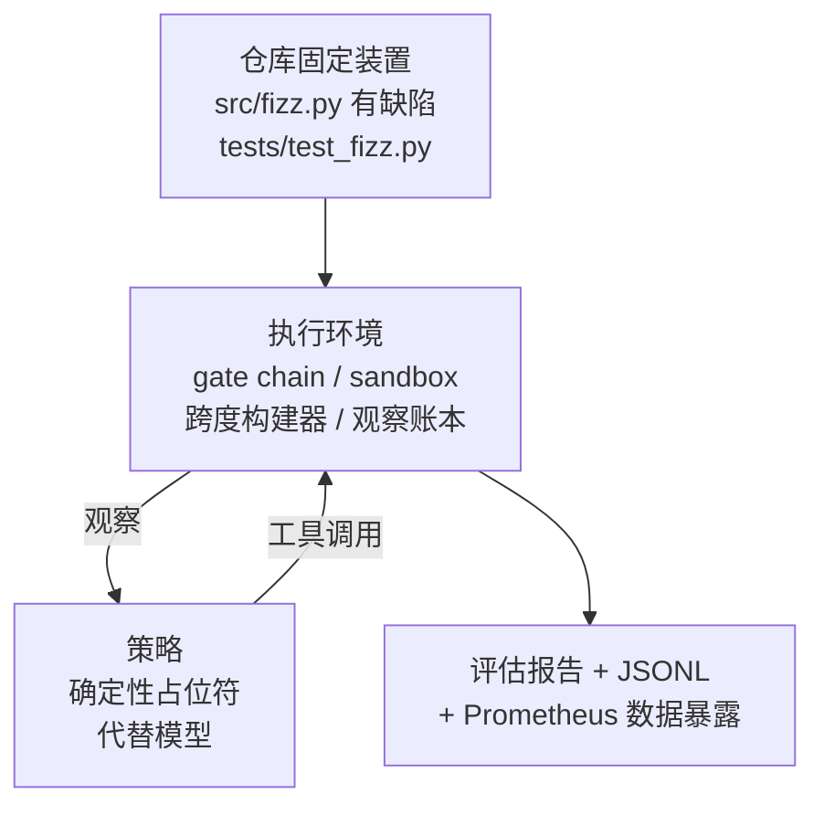
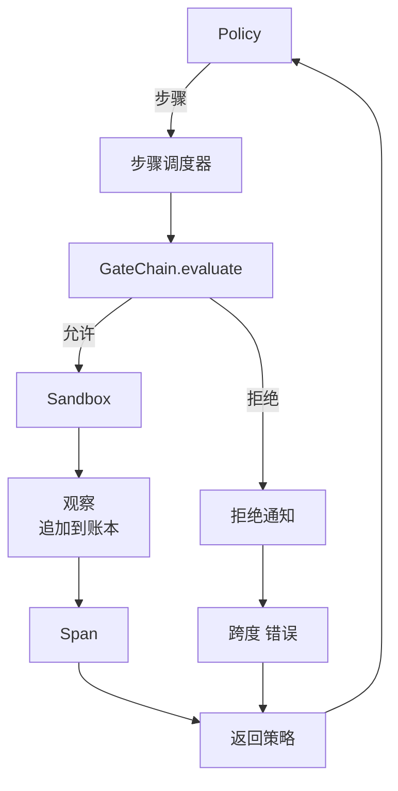

# 结业课程 29：Harness 上的端到端编码代理

> Track A 的成果展示。本课将 gate chain（门链）、sandbox（沙箱）、eval harness（评估执行环境）和 OTel spans（开放遥测跨度）整合成一个可工作的编码代理，该代理在一个多文件 Python 项目中修复一个真实的（小型、固定装置规模）bug。该代理是一个确定性策略，而非 LLM（大语言模型）；这种替代使课程可复现，并表明整个过程中最有趣的部分是 harness。契约保持不变：真实模型在策略接口处插入。

**类型：** 构建  
**语言：** Python（标准库）  
**先决条件：** Phase 19 · 25（验证门），Phase 19 · 26（沙箱），Phase 19 · 27（评估执行环境），Phase 19 · 28（可观测性），Phase 14 · 38（验证门），Phase 14 · 41（真实仓库工作台），Phase 14 · 42（代理工作台结业）  
**时间：** ~90 分钟

## 学习目标

- 将 gate chain、sandbox、eval harness 和 span builder（跨度构建器）组合成单一的代理循环。
- 实现一个确定性策略，使用 read_file、run_tests 和 write_file 修复固定装置错误。
- 在一次端到端运行中，强制执行全局步骤预算和观察令牌预算。
- 输出完整的 OTel GenAI 跟踪和 Prometheus 指标。
- 验证代理在少于 12 步内解决固定装置，且对合法工具无拒绝门触发。

## 问题描述

大多数代理示例都是独立工作的：单独的沙箱、单独的评估执行环境、单独的跨度发射器。看起来没问题。组合它们，接口问题就暴露出来。

gate chain 允许（ALLOW），但沙箱出于 gate chain 未预料的原因拒绝。eval harness 记录通过，OTel spans 显示 gate 拒绝了代理声称使用的工具。Prometheus 计数器增加了两次，但应该只增一次。观察预算超标，但代理继续执行，因为预算是在 gate chain 中追踪的，沙箱感知不到。

本课是整个 track 的集成测试。代理需要按顺序执行四个操作：读取项目、运行测试、通过测试失败识别错误、写入修复、再次运行测试，然后停止。每个操作通过 gate chain，所有工具执行都经过沙箱，每步都包裹在一个跨度中，整个流程由 eval harness 评分。

## 概念



代理策略是一个状态机，共五个状态。

`SURVEY`（调查）：代理读取项目清单，下一状态为 RUN_TESTS（运行测试）。

`RUN_TESTS`（运行测试）：代理执行测试命令。如果测试通过，状态机成功停止，否则转为 INSPECT（检查）。

`INSPECT`（检查）：代理读取失败的源文件，下一状态为 FIX（修复）。

`FIX`（修复）：代理写入修正后的文件，下一状态为 VERIFY（验证）。

`VERIFY`（验证）：代理再次执行测试命令。如果测试通过，停止并成功，否则停止并失败。

每个状态对应一次工具调用。每次工具调用都通过 gate chain。如果工具调用被拒绝，代理在跟踪中报告拒绝并停止。

固定装置 bug 是 `fizz.py` 中的 off-by-one 错误。确定性策略通过正则表达式从测试失败信息中检测该错误，并输出修正文件。替换策略为 LLM 不改变执行环境的契约。

## 架构



本课内容自包含。此前课程的每个原语都在 `main.py` 中以最小规模重新实现（gate、sandbox、账本、跨度），使课程运行时无需导入兄弟模块。名称与课程 25-28 完全一致，确保概念映射清晰无歧义。

## 你将构建的内容

`main.py` 内容包括：

1. 最小执行环境基本组件，名称与课程 25-28 相同：`GateChain`、`Sandbox`、`ObservationLedger`、`SpanBuilder`、`MetricsRegistry`。
2. `CodingAgentPolicy` 类：具有五个状态的状态机。
3. `Repo` 辅助类：准备一个带有捆绑缺陷固定装置的临时目录。
4. `AgentRun` 类：驱动策略，通过执行环境调度，返回 `AgentRunReport`。
5. 捆绑固定装置（`fixture_repo/`），包含 src/fizz.py、tests/test_fizz.py 以及用于评估的 expected/ 树。
6. 演示：端到端运行策略，打印逐步跟踪，断言通过，打印指标。

捆绑固定装置结构与课程 27 的任务结构相同：包含一个有缺陷的文件和一个测试文件。测试失败消息包含足够信息供确定性策略识别修复。真实 LLM 会做相同的任务，速度更慢、记忆更广，但不会改变执行环境的预期。

## 为什么策略不是 LLM

真实 LLM 需要 API 密钥、网络调用和无法验证的随机性。执行环境是本课关注的部分。替换为确定性策略让课程能在任何开发者笔记本上运行，无任何外部依赖，且测试套件能精确断言步数。

本课策略是 LLM 代理操作的严格子集。策略读取仓库、查看失败测试、识别行号并输出修复。LLM 在相同的执行环境契约下执行相同循环，账本记录完全一致。

## 演示断言

端到端演示退出时断言以下五项，且测试套件程序化重复断言：

- 策略在少于 12 步内解决固定装置。
- 观察预算未被超出。
- 合法工具未触发任何 gate 拒绝。（代理未伪造被拒绝的工具名称）
- 每一步均对应 traces.jsonl 中的一个跨度。
- Prometheus 数据暴露包含 `tools_called_total{tool="read_file"}` 条目和 `tool_latency_ms` 直方图。

## 与 Track A 其余部分的组合

本课为集成测试。课程 25 实现 gate chain，课程 26 实现 sandbox，课程 27 实现 eval harness，课程 28 实现可观测性，课程 29 证明它们作为一个系统协同工作。真实代理执行环境由此扩展：替换确定性策略为模型，替换捆绑固定装置为真实仓库任务，替换 JSONL 导出器为 OTLP。

## 运行方法

```bash
cd phases/19-capstone-projects/29-end-to-end-coding-task-demo
python3 code/main.py
python3 -m pytest code/tests/ -v
```

演示打印逐步跟踪、最终评估报告和 Prometheus 数据暴露。退出代码为零。测试覆盖策略状态转移、对合成工具调用的 gate 拒绝、捆绑固定装置的端到端运行以及步数预算不变量。
