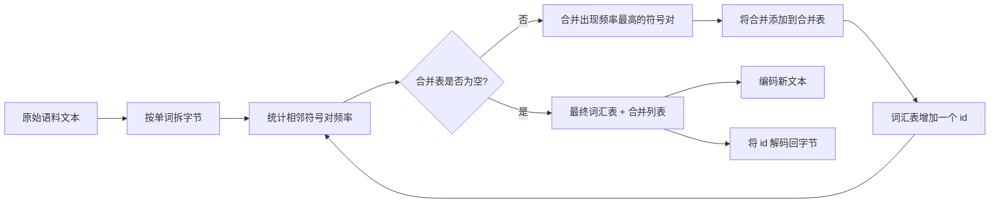
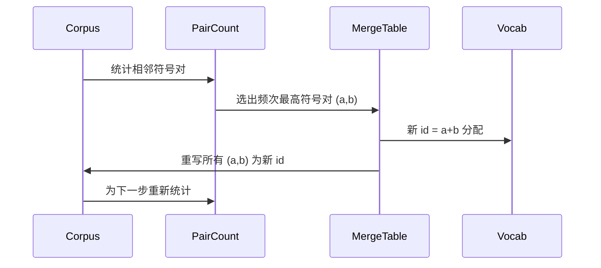

# 从零开始构建 BPE 分词器

> 字节输入，id 输出，id 再回到相同字节。构建每个现代文本模型都从中开始的分词器。

**类型:** 构建  
**语言:** Python  
**先决条件:** 第04阶段课程，第07阶段 Transformer（Transformer 架构）课程  
**时间:** ~90分钟

## 学习目标
- 通过反复合并出现频率最高的相邻符号对，从原始文本语料库中训练 Byte-Pair Encoding（字节对编码）词汇表。
- 实现一个确定性的合并表，并将其应用到新文本中以生成子词 id 流。
- 将任意 UTF-8 输入实现无信息丢失地进行 id 编码及解码回字节。
- 预留并保护特殊 tokens（例如 `<|endoftext|>`、`<|pad|>`），使其能在训练和解码中保留。
- 理解为何字节级字母表是通用分词器的合适最低层。

## 框架

语言模型看不到文本，它看到的是整数。字符串到整数列表的映射以及反向映射即是分词器。如果这层搞错了，训练过程中每一个损失曲线都在误测。

主流通用文本模型的子词分词器家族是 Byte-Pair Encoding（字节对编码）。想法很简单：从已知字母表开始，在训练语料库中找到出现频率最高的相邻符号对。合并它成一个新符号。重复此过程，直到词汇表达到目标大小。编码新文本时使用完全相同顺序的合并列表。

我们将构建字节级变体。字母表是 256 个原始字节，而非 Unicode 码点。正是这个选择，使分词器能处理任意 UTF-8 输入，而不退化为未知 token。

## 流程图

训练端和推理端共享合并表。这个共享是协议。如果推理时改变合并顺序，会解码出不同的 id 流。

## 字节字母表

前256个 id 保留给原始字节 0x00 到 0xFF。这保证了在任何合并发生之前，每个输入字符串都能在词汇表中表达。字节区块之后，我们预留一小段 id 用于特殊 token。训练循环永远不会将这些 id 作为合并目标，因为我们在预分词流中完全剔除它们。

预分词器在训练开始前按空白和标点边界拆分语料。如果不拆分，BPE 合并步骤会学会跨单词边界合并，词汇表将被整个常用短语占满。拆分让合并限定于单词内部，结果更具泛化性。

## 训练循环

训练循环每步做三件事。它遍历语料中每个单词，统计当前符号序列中每个相邻符号对出现的加权次数（权重为该单词出现频率）。选出计数最高的符号对。将出现该符号对的所有位置重写为一个新符号，新符号的 id 是词汇表的下一个空闲位置。然后记录合并操作。

每步花费与表示为符号序列列表的语料大小线性相关。对于百万字词量和1万词汇表容量的目标，因合并导致符号序列缩短，循环几秒内完成。

## 编码新文本

推理时不调用合并计数器。它按学习的相同顺序应用合并表。对新词，编码器从字节拆分开始，扫描符号序列找到最低排名的合并（最早出现且能合并的符号对）。执行该合并后重新扫描。循环直到没有合并能应用为止。

按排名排序是保证编码确定性并符合训练行为的特性。最先学会合并的排在表顶，优先应用。如在同位置有多个合并可选，排名最低的生效。

## 特殊 tokens

特殊 token 是字节流永远无法自然生成的 id，由我们人工预留。本课只需两个：

- `<|endoftext|>`: 在预训练中分隔文档，告诉模型“新文档开始，之前上下文不影响这里”。
- `<|pad|>`: 补齐短序列以形成规整的 batch 张量，训练时用 mask 掩盖其损失。

编码器接受标志允许输入中包含特殊 token。关闭时，字符串 `<|endoftext|>` 和 `<|pad|>` 按字节拆分编码；开启时，字面字符串映射到预留 id，不参与任何合并。

## 编码解码的回环保证

编码再解码必须准确还原输入字节。解码器按顺序将每个 id 展开的字节串拼接。每个 id 要么是原始字节，要么是前两个已知 id 拼接而成，递归展开最终终止于原始字节。解码后返回这些字节对应的 UTF-8 字符串。

本课测试套件检验此性质，包括对未见句子、有 Unicode 表情符号的句子以及含字面 `<|endoftext|>` token 的句子。

## 本课不涉及内容

不构建类似大型生产分词器那样基于正则表达式的预分词器。此处预分词器仅是简易的空白和标点拆分，足以在小语料上产生合理合并结果，且协议保持一致。下一课将黑盒化分词器，基于此构建滑动窗口数据集。

不并行化符号对计数。Python 循环几千字的语料量不到一秒完成。对大规模语料，可在单词级别并行统计，再合并结果。

## 如何阅读代码

`main.py` 定义了四个对象。`BPETokenizer` 保存词汇表、合并表和特殊 token 表。`train` 是训练循环。`encode` 是推理路径。`decode` 是字节拼接。底部演示使用内置语料训练小分词器，编码保留句子，再解码回原文，打印结果。`code/tests/test_bpe.py` 中的测试固定了回环性质、特殊 token 预留和合并顺序。

运行演示。然后将演示中的目标词汇表大小从 300 改为 600，观察保留句子编码长度降低。这条曲线即为 BPE 压缩曲线。
