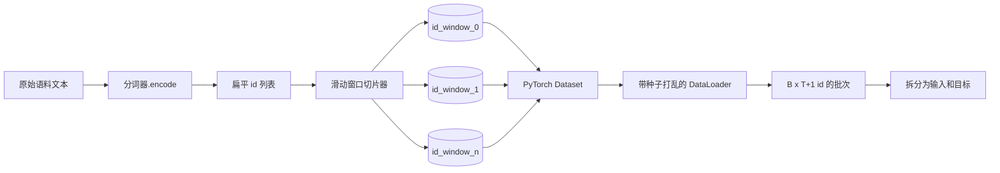
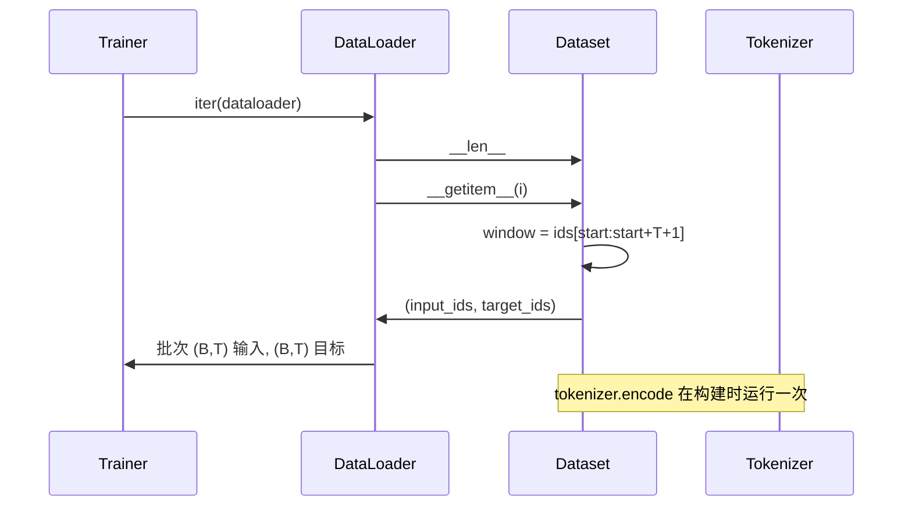

# 带滑动窗口的分词数据集

> 预训练运行是一个从 token id 到梯度的函数。本课构建了输入 id 的输送带。

**类型：** 构建  
**语言：** Python  
**前置知识：** 第04阶段课程，第07阶段 Transformer（Transformer 架构）课程，本阶段第30课  
**时间：** ~90分钟

## 学习目标
- 通过调用分词器（tokenizer）一次，将原始语料转换为 token id 流。
- 将 id 流切割成具有可配置重叠步长的固定长度窗口。
- 构建返回用于下一个 token 预测的输入和目标张量的 PyTorch Dataset。
- 用确定性打乱（deterministic shuffle）并且基于每个 epoch 种子的 DataLoader 包装数据集。
- 评估步长、冗余和有效数据集大小之间的权衡。

## 框架概述

预训练运行一次读取一个批次的 token id 并更新模型。每个批次的形状由训练协议固定。对于因果语言模型（causal language model），批次包含 `(B, T)` 的输入 id 和 `(B, T)` 的目标 id，目标是输入整体左移一个位置。数据管道的任务是按需、确定性且可复现地从可能包含数 GB 原始文本的语料库中生成符合这个协议的数据。

本课构建这个管道。来自上一课的分词器将文本转换为一个长而扁平的 id 列表。滑动窗口将该列表切分为训练样本。定制的 Dataset 将样本作为张量暴露。DataLoader 批处理样本并用已知种子打乱。

## 形状协议

因果语言模型输入 id 形状是 `(B, T)`，其中 `B` 是批次大小，`T` 是上下文长度。位置 `t` 的目标等于位置 `t+1` 的输入。这意味着每个训练样本包含 `T+1` 个原始 id。窗口步长控制连续样本之间的重叠度。

切片器不会与语料边界重叠。如果最后一个窗口的 id 数不足以填满 `T+1` 个位置，则该窗口会被丢弃。用 `<|pad|>` 填充尾部也是一种有效选择，但会增加损失掩码的复杂度。本课选择丢弃。

## 为什么使用滑动窗口

预训练语料是一个长的 id 流。如果模型仅看到不重叠的窗口，每个训练样本会教授完全相同的 `T` 个边界。调整步长可以改变这些边界的位置，使模型见到更多样的下一个 token 预测任务。

步长为 `T` 产生不重叠窗口。步长为 `T // 2` 产生 50% 重叠，使数据集有效大小翻倍。步长为 `1` 产生最大重叠，使数据集有效大小增加 `T` 倍。代价是每个 epoch 计算资源更多，收益是更多样的边界。大多数预训练运行使用步长等于上下文长度因为语料库已经远大于模型一次 epoch 能完成的规模，边界多样性影响较弱。

## Dataset 类

PyTorch Dataset 需要两个方法。`__len__` 返回样本数。`__getitem__` 返回单个样本的一对张量。我们的 Dataset 存储了编码的 id 流和步长。索引时即时计算窗口起点，因此无论步长产生多少个样本，内存成本只有一份 id 流的副本。

该偏移由 `__getitem__` 内部完成。Dataset 返回 `(input, target)`，其中 `input = window[:-1]`，`target = window[1:]`。二者都是 PyTorch long 张量。训练循环将它们视为 ground truth。

## 确定性打乱

带 `shuffle=True` 的 DataLoader 使用 PyTorch 随机生成器。通过传入基于每个 epoch 的显式 `torch.Generator` 种子，我们可以保证每次重启运行时打乱顺序一致。当你想对比仅在单一超参数不同的两次运行时，这个性质很重要。缺少种子，两次运行数据顺序不同，损失曲线就会因非模型改动而分叉。

本课的种子协议很简单。`epoch_seed = base_seed + epoch_index`。基种子在构造时传入。每个 epoch 开始时训练器递增 epoch 索引。相同基种子重复运行时，每个 epoch 总是看到相同数据顺序。

## 批次采样器

PyTorch 默认采样器均匀随机选择索引且不重复。预训练时这是我们想要的。小数据集微调时协议相同。DataLoader 通过调用 `__getitem__` `B` 次并堆叠结果来组装批次。由于样本构造时都是相同长度，无需填充逻辑。

本课为了简单把 `num_workers` 设为0。在生产环境中，workers 并行执行 `__getitem__` 调用。我们的管道中这其实没太大效果因为工作主要是对内存张量的切片，但相同 Dataset API 支持 worker 并行。

## 样本计数

对于长度为 `N` 的 id 流，上下文长度 `T`，步长 `S`，样本数为 `max(0, 1 + (N - (T + 1)) // S)`。本课以 Dataset 静态方法暴露该计算，方便训练器计算每 epoch 总步数，避免遍历。

## 本课未涉及内容

不支持从磁盘流式读取。语料完全编码加载到内存，储存为单个张量。几百万长度的 id 流内存占用不到百兆，适合本课规模。磁盘流式读取属于替换存储的独立内容，维持 Dataset 协议不变。

不支持多文档处理。语料被视为连续的 id 流。在多文档构建语料时通过插入 `<|endoftext|>` id 来编码文档边界，模型学习预测边界附近的 token。

## 代码阅读指南

`main.py` 定义两个类和一个辅助函数。`SlidingWindowDataset` 是 PyTorch Dataset。`make_dataloader` 返回带种子生成器的配置好 DataLoader。`_encode_corpus_to_ids` 是一次性调用的分词器。底部演示构建一个小型分词器，编码内置语料，构造数据集和 DataLoader，打印一个批次并断言形状协议。`code/tests/test_dataset.py` 中的测试涵盖窗口计数公式、偏移一位性质、确定性打乱，以及步长权衡。

运行演示。然后将上下文长度从 16 改为 32，观察每 epoch 样本数下降。这就是你的步数预算。
