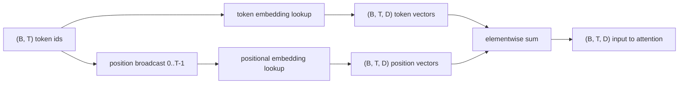
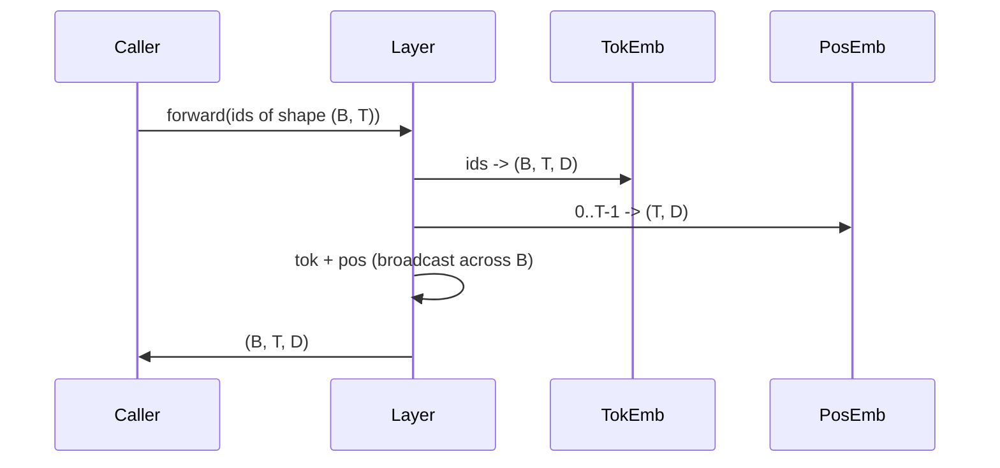

# Token 和 Positional Embeddings（位置嵌入）

> Ids 是整数。模型需要的是向量。两张查找表位于它们之间，位置嵌入表的选择决定了模型能学到什么。

**类型：** 构建  
**语言：** Python  
**先决条件：** 第04阶段课程，第07阶段 Transformer 课程，本阶段第30和31课  
**时间：** ~90分钟

## 学习目标
- 构建一个将词汇表 id 映射到稠密向量的 token-embedding 查找表。
- 构建一个通过位置索引的学习型位置嵌入查找表。
- 构建一个无参数的固定正弦波位置嵌入，通过位置索引。
- 将 token 和位置嵌入组合为 transformer 模块的单一输入。
- 对比学习型和正弦波嵌入在长度泛化和参数数量上的异同。

## 框架

模型接触 token id 的第一步是对 token-embedding 矩阵的行查找。该矩阵每行对应一个词汇表 id，每列对应模型维度。查找返回一个向量，模型其余部分将其视为该 id 的语义。反向传播只更新前向传播中用到的行。训练过程中这些行的几何形状学会用方向来编码相似度。

单独的 token id 没有顺序。模型需要第二个信号告诉它位置1和位置17不同。主流的两种信号是学习型位置嵌入（第二张查找表，每个位置一行）和固定的正弦波位置嵌入（一个无参数的数学公式）。选择带来后果。学习型查找表是参数，且受限于模型训练时的最大上下文长度。理论上正弦表无参数，且公式能扩展到任意位置，但本课的 `SinusoidalPositionalEmbedding` 在 `max_context_length` 处预计算了固定表，`forward` 超过它会报错；因此两个模块都强制最大上下文长度。即使表足够大以索引，模型在超出训练长度时仍可能表现不佳。

本课构建两者并将它们与 token 嵌入组合，作为下一节注意力模块的输入。

## 形状契约

嵌入阶段输入是形状为 `(B, T)` 的 token id 批次。输出是形状为 `(B, T, D)` 的张量，其中 `D` 是模型维度。每个批次元素上下文长度相同为 `T`，每个位置的向量维度相同为 `D`。



组合是求和，而不是拼接。求和使得 `D` 在网络中保持不变，让模型在每层能对每个特征决定是 token 含义还是位置起主导作用。

## Token embedding 矩阵

Token embedding 是一个形状为 `(V, D)` 的参数张量，其中 `V` 是词汇表大小。PyTorch 用 `nn.Embedding(V, D)` 实现。初始化时条目从小高斯分布采样，转化器规模模型传统上均值为0，标准差约0.02。具体初始化方式不如每次保持一致重要。

前向传播是单次索引操作。PyTorch 通过 gather 行操作将 `(B, T)` int64 id 转成 `(B, T, D)` float 张量。反向传播只把梯度累积到前向中用到的行。未出现的两行在该步梯度为0。

细节：token embedding 和模型末端的输出投影常常权重共享（weight tying）。发生时，每次反向传播都会通过输出侧触及 embedding 所有行。本课把它们做成独立模块，但完整模型中同一矩阵可兼任二者。

## 学习型位置嵌入

学习型位置嵌入是第二个 `nn.Embedding`，形状为 `(max_context_length, D)`。查找用位置 id `0, 1, 2, ..., T-1` 作为键。前向传播将该位置向量沿批次维 broadcast。

学习表缺点是如果模型只训练到位置 `T-1`，则无法查询位置 `T`，该行不存在。生产环境的解码器模型会将最大上下文长度硬编码进架构，拒绝处理更长输入。

## 正弦波位置嵌入

正弦波位置嵌入是由位置映射到向量的函数。位置 `p` 和特征 `i` 生成：

```python
angle = p / (10000 ** (2 * (i // 2) / D))
emb[p, 2k]     = sin(angle)
emb[p, 2k + 1] = cos(angle)
```

该函数无参数。每个位置有唯一向量。波长沿特征维几何级变化，低维编码粗略位置，高维编码精细位置。

利用 `sin` 和 `cos` 的特性，位置向量 `p + k` 是 `p` 位置向量的线性函数，给予注意力层学习相对位置偏移的简便路径。模型不需额外参数表达“往回看五个 token”。

本课在构造时预计算整个正弦波表，前向时索引。

## 组合方式

输入管线顺序做三件事。读取 token id，查 token 向量，叠加位置向量，返回求和结果。



求和步骤中的广播在批次维复制形状 `(T, D)` 的位置张量。PyTorch 自动处理因调用 `unsqueeze` 后位置张量形状为 `(1, T, D)`。

## 对比分析

课程对两种嵌入在相同输入上运行，并打印两个诊断信息：

第一是参数量。学习变体在 token embedding 基础上增加 `max_context_length * D` 参数。正弦波变体零参数增加。

第二是相邻位置嵌入间余弦相似度。正弦波变体因函数连续性具有平滑可预测的衰减曲线。学习变体初始化时近似随机相似度（行独立采样）。训练后通常发展出类似平滑结构，但需数据驱动发现。

## 本课未涵盖内容

未构建 rotary positional encoding（RoPE）或 AliBi。它们是现代生产 Transformer 的常用选择。它们遵循本课嵌入相同的形状契约（对形状 `(B, T, D)` 的向量应用位置相关变换），但在注意力投影步骤应用，而不是输入端。下一节课搭建注意力模块，部分可选扩展会将 rotary 捆绑进 query-key 投影。

未训练嵌入权重。训练需损失函数，需模型输出，需注意力和语言模型头。那些是下一节课及之后的内容。

## 如何阅读代码

`main.py` 定义三个模块。`TokenEmbedding` 封装 `nn.Embedding(V, D)`。`LearnedPositionalEmbedding` 封装 `nn.Embedding(L, D)`。`SinusoidalPositionalEmbedding` 预计算表并以 buffer 暴露。`EmbeddingComposer` 将 token embedding 和 position embedding 绑定。底部演示打印形状、参数计数和邻近位置相似度诊断。`code/tests/test_embeddings.py` 中测试形状、广播行为、参数量和正弦波公式。

运行演示，修改模型维度 `D` 从64变32，观察正弦波波长带的变化。
