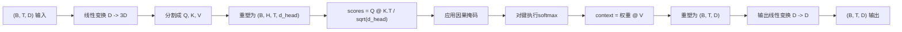
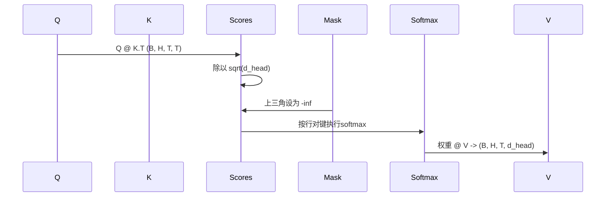

# 多头自注意力（Multi-Head Self-Attention）

> 一个线性投影，三种视图，H个并行头，一个掩码。模型实际使用的注意力块。

**类型：** 构建  
**语言：** Python  
**先决条件：** 第04阶段课程，第07阶段Transformer（Transformer 架构）课程，本阶段第30至32课  
**时间：** 约90分钟

## 学习目标
- 实现一个批量的Query/Key/Value投影，作为单个线性层并分成H个头。
- 使用正确的归一化和数据类型处理计算缩放点积注意力（scaled dot-product attention）。
- 应用因果掩码，防止某个位置关注未来位置。
- 检查固定输入的每个头的注意力权重，分析每个头关注的内容。
- 在玩具任务上训练一个小的注意力块，观察随着头的特化，损失下降。

## 框架

注意力（Attention）是让一个token的表示从同一序列中的其他token中拉取信息的函数。自注意力（Self-attention）意味着查询（queries）、键（keys）和值（values）都源自相同输入。多头（Multi-head）意味着投影被划分为H个并行的注意力问题，其输出级联后再投影回去。

高效的实现模式是一个线性层将维度从`D`投影到`3 * D`，然后切分成三种视图，再重塑为H个头，每个头大小为`D // H`。矩阵乘法（matmul）、softmax和加权和作为批处理张量操作执行，因此头可以在加速器上并行运行。

本课程将构建这个注意力块。同时加入因果掩码使同一代码可作为仅解码器语言模型的注意力层。下一课将堆叠该块成完整Transformer（Transformer 架构），再下一课进行训练。

## 形状约定

输入形状为 `(B, T, D)`，输出形状为 `(B, T, D)`。掩码形状为 `(T, T)` 或可广播至其。块内中间张量形状为 `(B, H, T, d_head)`，其中 `d_head = D // H`。约束条件是 `D % H == 0`。

两个线性层（QKV投影和输出投影）是该模块中唯一的可学习参数。掩码、softmax、矩阵乘法和重塑均不含参数。

## QKV分割

朴素实现有三个独立线性层，分别对应Q、K和V。高效实现只有一层输出`3 * D`特征并分割结果。这两者数学等价，因为三个分别作用于`(D, D)`维度的矩阵乘法，等于用一个`(3D, D)`维度的大矩阵一次乘法完成，后者由三个子矩阵上下叠加构成。

高效版本更快，因为加速器只发起一次矩阵乘法，而不是三次。初始化时也简单，因为这三个子矩阵生活在同一参数张量内，可以一起初始化。

## 头的重塑

分割后，Q、K、V各自形状为 `(B, T, D)`。为了转为H个并行注意力问题，将其重塑为 `(B, T, H, d_head)` 并转置为 `(B, H, T, d_head)`。头维度现在贴近批量维度，PyTorch将每头注意力视为批量操作，跨`B * H`个独立实例进行。

`d_head`维度保留在最后，因此分数矩阵乘法 `Q @ K.transpose(-2, -1)` 会对其进行缩并。结果是 `(B, H, T, T)` 的每头注意力分数矩阵。

## 缩放

分数在softmax之前被除以 `sqrt(d_head)`。如果不缩放，点积会随着 `d_head` 增大而增大，softmax会进入一项几乎独占所有权重、其余几乎为零的极端模式，梯度极小，学习停滞。除以 `sqrt(d_head)` 保持分数的方差在不同头尺寸下大致恒定。

## 因果掩码

仅解码器语言模型只能基于过去预测下一个token，掩码强制执行该限制。具体来说，在softmax前，将`(T, T)`分数矩阵主对角线上方的元素替换为负无穷，softmax后这些位置权重为零。

掩码在构建时注册为缓冲区（buffer），因此与模型参数同在设备上，不作为梯度图的一部分。掩码覆盖块所见的最大上下文长度，前向时截取左上角 `(T, T)` 块。

## 输出投影

每头上下文向量 `(B, H, T, d_head)` 先转置回 `(B, T, H, d_head)`，再重塑为 `(B, T, D)`，然后通过最后的 `(D, D)` 线性投影。输出投影让模型能够混合各头信息。若无此层，H个头只能通过后续层组合，模块表达能力受限。

## 注意力权重检查

本课向前传递函数增加了 `return_weights=True` 标志。置为True时，模块返回形状为 `(B, H, T, T)` 的每头注意力权重和输出。演示打印短输入一个头的热力图，可见因果三角结构及各位置的关注焦点。

训练好的模型中，不同头学习不同模式。有头关注紧邻的前一个token，有头关注序列开头，有的头则几乎均匀分布注意力。该检查接口是可解释性研究的切入点。

## 训练演示

`main.py`底部的演示将注意力块接入一个极简LM头，在重复任务上训练整个模块。输入每行是同一随机ID在上下文中重复。目标是输入右移一位，模型必须学会下一个token与上一个token相同。损失为交叉熵。设置`H=4`，`D=32`，`T=12`，词汇表大小64时，损失从随机水平（约`log(64) ~ 4.16`）三轮内降至远低于1.0（CPU上）。

演示目的不是训练实用模型，而是确认梯度能穿透模块每部分，且头在简单问题上学习有效信息。

## 本课未涵盖内容

- 未添加前馈（feed-forward）模块。真实Transformer层由注意力、两层MLP、残差连接和层归一化组成，下一课添加这些。
- 未实现旋转（rotary）或AliBi位置编码。这些在QKV投影步骤应用，属于独立教学单元。这里构建的模块兼容二者，只需在矩阵乘法前变换Q和K。
- 未实现推理时的KV缓存。缓存键和值可加速自回归解码，改动了K和V形状但不变Q，属于推理课程内容。

## 代码阅读指南

`main.py`定义了`MultiHeadSelfAttention`类。该类持有两个线性层和一个注册的掩码缓冲区。前向传播完成投影、重塑、打分、掩码、softmax、加权、重塑和再次投影。底部演示构建一个小模型，封装上述注意力及token与位置嵌入和LM头，训练复制任务三轮，打印损失曲线和每头注意力热力图。`code/tests/test_attention.py`的测试验证形状约定、因果属性、softmax性质、头划分正确性和梯度流动。

运行演示。然后将`n_heads`从4增到8（保持`d_model=32`，即`d_head=4`），观察热力图变化。
