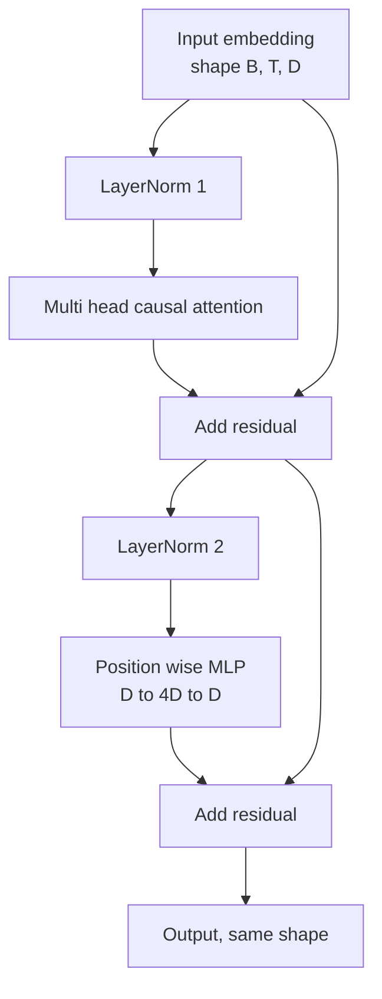
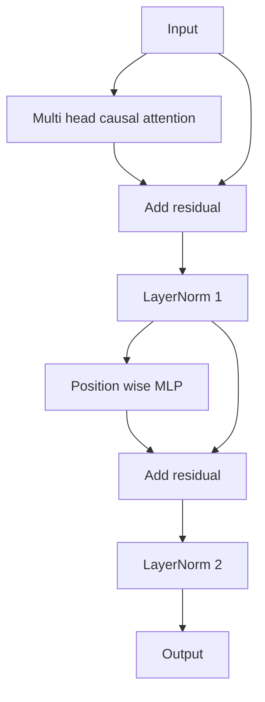

# Transformer Block from Scratch（从零实现 Transformer 块）

> 一个块是一切现代解码器大语言模型（LLM）中的基本单元。Layer norm（层归一化）、multi head attention（多头注意力）、residual（残差连接）、MLP（多层感知机）、residual。pre-LN（前置层归一化）版本在没有warmup（预热）的情况下训练稳定。post-LN（后置层归一化）版本是原始论文采用的版本。本课将并列构建两者，并展示在常见学习率下哪一个可以在12层堆叠中存活。

**类型：** 构建  
**语言：** Python  
**先修：** 第19阶段第30至33课（分词器、嵌入、注意力数学、批处理数据加载器）  
**时间：** 约90分钟

## 学习目标

- 使用 PyTorch 从四个组成部分构建 transformer 块：LayerNorm（层归一化）、multi head causal attention（多头因果注意力）、residual connections（残差连接）、position wise MLP（逐位置多层感知机）。
- 在两种配置（pre-LN 和 post-LN）中放置 LayerNorm，并解释为什么前者能在无预热下稳定训练。
- 在多头注意力中实现因果掩码，使令牌 `i` 不能看到令牌 `j > i`。
- 在12层堆叠的两种版本中跟踪梯度流，并不假手于人地读取结果。
- 当下一课组装一个1.24亿参数的 GPT 时，能将该块作为无缝替换单元复用。

## 问题描述

Transformer 是重复的同一个块。一次块写错了，重复12次，就得到了一个在第一周期就发散或需要使用预热技巧的模型。本课你会看到的两个失败模式并非奇异。它们在学习者第一次天真堆叠块时就会出现。一个是注意力层错误关注未来的令牌。另一个是 LayerNorm 位置放错，无法在深度抑制残差信号。

一旦看懂，修正就机械了。该块有且仅有两条残差路径和两个归一化位置。正确选择位置，剩余堆叠只是记账工作。

## 概念

每个仅由解码器组成的 Transformer 块是一个函数，输入形状为 `(batch, sequence, embedding)` 的张量，输出同形状张量。内部有两个子层完成工作。



这就是 pre-LN 版本。LayerNorm 位于残差分支内，子层前。残差连接携带了未归一化的信号向前传递。

post-LN 版本将 LayerNorm 移到了残差相加之后。



形状完全相同。训练表现却不同。使用 post-LN 时，沿残差路径回传的梯度必须经过 LayerNorm。12层深度、学习率为 `3e-4` 时，梯度快速缩小，需要 Warmup。pre-LN 保留未归一化的残差路径，使梯度能干净传递到嵌入层。因这个原因，GPT-2 及以后版本采用 pre-LN 配置。

### 因果多头注意力

注意力子层将输入投射为 query（查询）、key（键）、value（值）三组张量。每组张量从 `(B, T, D)` 重塑为 `(B, H, T, D/H)`，其中 `H` 是头数。缩放点积注意力计算每个头的 `softmax(Q K^T / sqrt(d_k))`，将上三角掩码为负无穷，掩码应用于 softmax，再乘以 `V`。各头再串联成单个 `(B, T, D)` 张量并进行一次线性投射。掩码是使模型因果的唯一关键。若去掉掩码，模型会“作弊”。

### MLP

逐位置多层感知机（position wise MLP）对每个令牌独立应用相同的两层网络。隐藏层宽度是嵌入维度的4倍，激活函数为 GELU，第二层后跟 dropout。令牌间无交互，所有令牌混合都发生在注意力层。

### 残差连接的两个作用

它们使梯度路径在深度方向叠加，保持了通过12层梯度范数的尺度。它们也允许每个块学习对传递表示的加法更新，而非完全替换。这两个效果是块能扩展的原因。

## 构建实现

`code/main.py` 实现：

- `class LayerNorm`，具有可学习的缩放和平移，带偏置的 eps，按令牌向量逐个应用。
- `class MultiHeadAttention`，带有 `num_heads`、计算 `head_dim = d_model // num_heads`，融合的 QKV 投射，注册的因果掩码，注意力和残差 dropout。
- `class FeedForward`，两层线性，GELU 激活，后跟 dropout。
- `class TransformerBlock`，带 `pre_ln` 标志切换两种版本。
- 演示代码构建一个6层 pre-LN 堆栈和6层 post-LN 堆栈，输入相同，打印（a）输出形状，（b）一次反向传播后嵌入层的梯度范数。

运行：

```bash
python3 code/main.py
```

输出：对两个堆栈的形状检查，梯度范数并列展示。pre-LN 堆栈的嵌入梯度比 post-LN 堆栈大一个数量级，实验证明 pre-LN 在无预热条件下训练稳定。

## 技术栈

- 使用 `torch` 进行张量计算、自动求导和 `nn.Module` 结构。
- 不使用 `transformers` 包，无预训练权重。块从基本构件实现。

## 业界生产实践模式

三个模式让教材中的块变成可发布产品：

**融合的 QKV 投射。** 三个线性层相当于三次内核启动和三次矩阵乘法。使用一个宽度为 `3 * d_model` 的线性层替代这三层，并在最后一轴分割输出。融合路径在各种加速器上都更快，且与 GPT-2、LLaMA、Mistral 参考实现一致。

**注册的因果掩码缓冲区。** 掩码只依赖最大上下文长度。构造时用 `register_buffer` 申请一次，前向时切片激活区域，避免每次调用分配频繁。忘记此优化，掩码分配会成为长上下文时的性能瓶颈。

**两个位置使用 dropout，非三个。** dropout 应该放在注意力 softmax 之后（注意力 dropout）和 MLP 第二层线性之后（残差 dropout）。对残差本身使用 dropout 会破坏在深度处梯度流通的加法恒等式。一些早期实现因此训练不稳定。

## 应用

- 本课实现的块可直接插入第35课构建的 GPT。
- pre-LN 版本是所有现代公开权重 LLM 采用的。post-LN 版本则是2017年注意力原始论文用的。二者兼知，足以理解绝大多数解码器架构。
- 将 GELU 替换为 SiLU，即为 LLaMA 系列激活函数。将 LayerNorm 换成 RMSNorm，即为 LLaMA 系列归一化。框架相同。

## 练习

1. 给块中所有线性层加个 `bias=False` 标志。现代公开权重 LLM 在线性层不带偏置。测量 12层768维模型节省了多少参数。
2. 用自己实现的 RMSNorm 替换 `nn.LayerNorm`，验证输出形状不变。
3. 加一个标志返回第一头注意力权重，形状 `(B, T, T)`。绘制上三角，确认 softmax 后为零。
4. 构造一个 sanity check，输入 `(2, 16, 384)` 张量，`H=6`，跑两种版本，断言前向输出不相同（如 `not torch.allclose`），前提是权重初始化相同且 dropout 设为零。

## 关键词汇

| 术语       | 常用说法         | 实际含义                                       |
|------------|------------------|------------------------------------------------|
| Pre-LN     | “Pre norm”       | 残差分支内，子层前的 LayerNorm；残差携带未经归一化信号 |
| Post-LN    | “Post norm”      | 残差相加后 LayerNorm；2017论文采用，需预热           |
| Causal mask| “Triangle mask”  | 注意力 logits 上三角被设置为负无穷，使得令牌 i无法读取 j > i    |
| Fused QKV  | “Combined projection” | 一个宽度为 3D 的线性层替代三个宽度为 D 的线性层；一次内核调用，一次矩阵乘法 |
| Residual stream | “Skip connection” | 未归一化的张量，自上而下流经每个块；每块实现加法更新         |

## 延伸阅读

- 第7阶段第2课（自注意力从零实现），介绍本块下的注意力数学原理。
- 第7阶段第5课（完整 Transformer），介绍同骨架的编码器-解码器版本。
- 第10阶段第4课（预训练迷你 GPT），本块所应用的训练流程。
- 第19阶段第35课（本轨道），用12个这类块堆叠成 GPT 模型。
