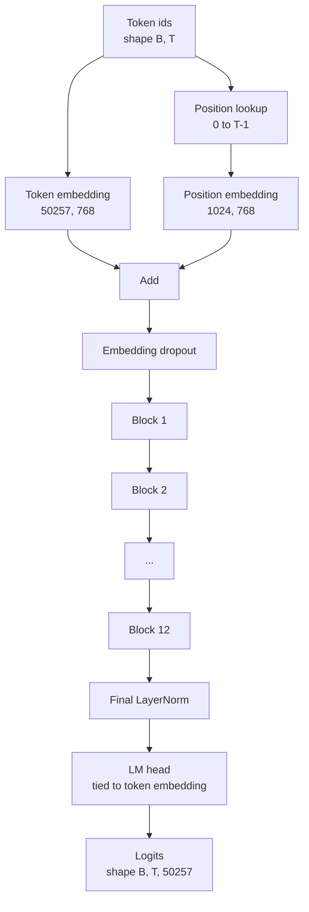
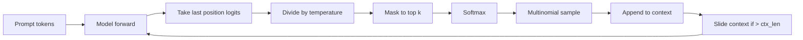

# GPT 模型组装

> 十二个块堆叠，一个 token embedding（词元嵌入）、一个学习的位置 embedding（位置嵌入）、一个最终的 LayerNorm（层归一化）和一个共享权重的语言模型头。这就是整个 1.24 亿参数的 GPT 模型。本课将这些部分组装成一个工作类，计算参数数量以确认模型匹配参考的 1.24 亿规模，并使用多项式采样、温度和 top-k 生成文本。

**类型：** 构建  
**语言：** Python  
**先决条件：** 第19阶段第30到34课  
**时间：** ~90 分钟

## 学习目标

- 将第34课中的 transformer block（Transformer 块）组装成完整的 GPT 模型：token embedding、position embedding、N个块、最终 LayerNorm、语言模型头。  
- 复现 1.24 亿参数配置：词表大小 50257，上下文长度 1024，embedding 维度 768，十二头，十二层。  
- 将语言模型头权重绑定（weight tying）到 token embedding，并解释为什么在此规模可节省约 3800 万参数。  
- 使用多项式采样、温度缩放和 top-k 截断从提示生成文本，借助滑动窗口保持上下文长度。  
- 测量参数数量和前向计算代价，和 1.24 亿参数目标对齐。

## 问题解析

Transformer block 本身无法完成任务。你需要把 token id 转为向量，混入位置信息，传入堆栈，然后投影回词表的 logits（词表概率分布）。缺少上述任何一步，模型要么无法前向传播，要么位置信息漂移，要么无法输出文本。

模型的形状也很关键。参考的 GPT-2 small 模型是准确如上的 1.24 亿参数。数字非偶然。词表 50257 乘 embedding 768 构成 token 表。位置 1024 乘 768 构成位置表。十二个块，每个约 700 万参数，加起来是 8400 万。最终的头部通过权重绑定重用 token 表。把这些部分加起来刚好是 1.24 亿参数。参数数量不匹配参考值，说明组装有误。

## 概念图



Token id 转变为 token 向量。位置 id 转成位置向量。两者相加后传入堆栈。最终 LayerNorm 是块外的唯一固定组件，适用于所有现代 GPT 变体。语言模型头复用 token embedding 矩阵，这就是权重绑定的含义。

### 权重绑定（Weight tying）

token embedding 的形状是 `(vocab, d_model)`。语言模型头需要将 `d_model` 映射回 `vocab`。两者互为转置矩阵。绑定意味着两者使用同一参数张量，重复利用。在 vocab 50257 和 d_model 768 下，该矩阵约含 3800 万参数。不绑定则需要各自花费参数两倍；绑定既节省参数，也因为 embedding 和头部梯度一致，提供更干净的梯度信号。

### 位置嵌入是学习的，不是正弦（sinusoidal）

GPT-2 使用学习的位置嵌入，位置表是单个参数张量，形状为 `(1024, 768)`。模型在每次前向时查找位置 0 到 T-1 并加到 token embedding 上。这是最简单的位置编码方案（其他方案如 RoPE、ALiBi、T5 相对偏置）。该方案是参考 1.24 亿参数模型使用的。

### 生成：温度（temperature）、top-k、多项式采样（multinomial）

生成是自回归的。每步模型返回所有位置上全词表的 logits，你取最后位置的 logits，除以温度，选择性地将除 top-k 之外的位置 logits 掩码为负无穷，softmax 获得概率分布，然后从该分布采样一个 token。



三个调节参数，三个不同效果。温度接近零趋向贪婪采样；温度为1为模型的自然分布；top-k 为 1 也是贪婪采样；top-k 为 40 过滤长尾。它们的组合很重要；下一课的训练使用生成作为定性评测信号。

## 构建

`code/main.py` 实现：

- `class GPTConfig` 数据类，默认配置符合 1.24 亿参数模型：`vocab_size=50257`、`context_length=1024`、`d_model=768`、`num_heads=12`、`num_layers=12`、`mlp_expansion=4`、`dropout=0.1`、`use_bias=True`、`weight_tying=True`。  
- `class GPTModel` 包含 token embedding、position embedding、embedding dropout、十二个 `TransformerBlock`、最终 LayerNorm 和在参数标志为真时与 token embedding 共享权重的 `lm_head`。  
- `count_parameters` 辅助函数，返回实际的唯一参数数（支持权重绑定计数）。  
- `generate` 函数支持温度、top-k、多项式采样以及滑动窗口上下文。  
- 演示程序创建模型，打印参数数量对比 1.24 亿参考值，从固定提示生成简短序列，展示流水线端到端。

运行：

```bash
python3 code/main.py
```

输出：参数数量与 1.24 亿参考对比，从随机提示生成的 token id，以及当绑定开启时确认语言模型头和 token embedding 共享存储。

为加快演示，脚本还运行一个小规模配置（`d_model=64`、`num_layers=2`）完成端到端流程，并内联打印生成的 token 序列。1.24 亿配置仅构建并执行一次前向计算及参数计数。

## 技术栈

- 使用 `torch` 进行张量计算、自动求导和模块组装。  
- `code/main.py` 重新实现第34课的同一块模式。

## 生产环境模式

三个模式区别运行模型与部署模型：

**残差投影初始化小。** 注意力的输出投影和 MLP 的第二个线性层都直接进入残差相加。用与其他线性层相同标准差初始化会导致残差流随层数增长膨胀，最终 LayerNorm 进入负荷过高状态。对这两处权重标准差乘以 `1 / sqrt(2 * num_layers)`，残差流在十二层中保持合理范围。

**缓存位置 id 张量，避免重复计算。** 每次前向计算调用 `torch.arange(T)` 会重新分配内存。应在 `__init__` 里为最大上下文分配一次，每次调用截取前 T 个，避免重复分配。

**在参数层面绑定权重，而非单纯复制。** 直接赋值 `lm_head.weight = token_embedding.weight` 是共享张量；复制不是。优化器只需更新一组参数，autograd 图仅产生一次梯度累积。复制会导致头部权重漂移，与嵌入不一致，权重绑定将失效。

## 使用方式

- 本课的模型类与下一课训练的模型形状相同。  
- 用 RoPE 替换学习位置嵌入，即可得到 LLaMA 家族模型，无需修改块或头部。  
- 用 SiLU 替换 GELU，用 RMSNorm 替换 LayerNorm 得到 LLaMA 其他变体改动。  
- 生成函数适用于任何 logits 源，不仅本模型。可以从第37课的预训练 GPT-2 加载 logits，复用相同生成流程。

## 练习

1. 取消 LM 头与 token embedding 的绑定，重新计算参数，验证差值为 50257 × 768 = 3800 万。  
2. 用构造时计算的正弦表替换学习型位置嵌入，确认模型仍可前向，参数减少 786432。  
3. 给生成函数添加 `greedy=True` 标志，跳过采样直接取最大概率，验证生成序列在多次运行中一致。  
4. 添加 `repetition_penalty` 控制，将提示或生成历史中任一 token 的 logit 除以常数（>1）后 softmax，演示该调节减少输出中的重复。  
5. 在 `top_k` 旁实现 `top_p`（核采样），用两行代码检查被保留 token 概率和超过 `top_p`。

## 关键词

| 术语 | 俗称 | 实际含义 |
|------|-------|----------|
| 权重绑定（Weight tying） | “绑定嵌入” | LM 头和 token embedding 共享同一参数张量；节省词表大小乘以 embedding 维度的参数，符合 GPT-2 参考实现。 |
| 位置嵌入（Position embedding） | “学习位置编码” | 形状为（上下文长度，d_model）的独立表，训练时学习并加至 token 向量。 |
| 滑动窗口上下文（Sliding window context） | “上下文限制” | 当提示加生成超出上下文长度时，丢弃最早的 token 保持活动窗口大小。 |
| top-k 采样 | “K截断采样” | 保留最高的 K 个 logits，其余设为负无穷，softmax 后采样。 |
| 温度（Temperature） | “采样温度” | 采样前将 logits 除以温度 T；T<1 梯度更锐利，T=1 保持自然分布，T>1 更平滑。 |

## 延伸阅读

- 第19阶段第34课，关于本模型堆叠的 Transformer block。  
- 第19阶段第36课，驱动本模型的训练循环与交叉熵损失。  
- 第19阶段第37课，将预训练的 GPT-2 权重加载至本架构。  
- 第7阶段第07课（GPT 自回归语言建模），下一 token 预测的数学原理。  
- 第10阶段第04课（迷你 GPT 预训练），同架构的原始训练流程。
