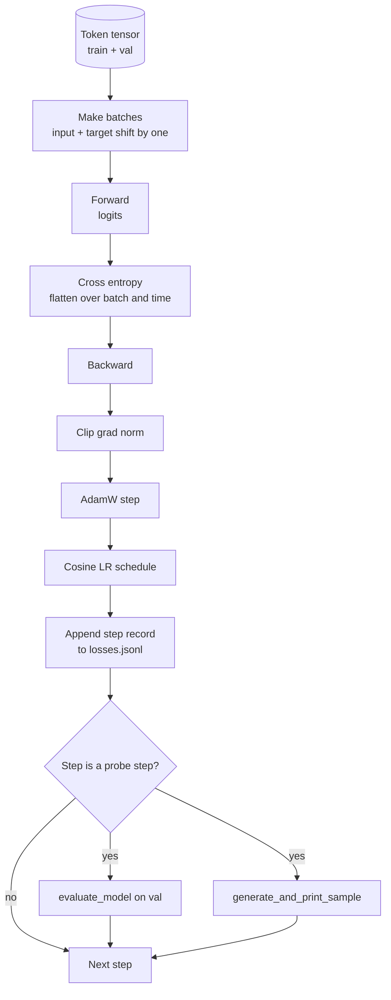

# Training Loop and Evaluation

> 不测量的循环是骗人的循环。本课构建驱动GPT模型的训练循环：带权重衰减拆分的AdamW，包含预热加余弦学习率调度，`calc_loss_batch`辅助函数，持出数据上的`evaluate_model`评估，每隔K步的`generate_and_print_sample`定性探查，以及可用于绘图的损失JSONL日志。相同的框架训练你将构建的所有解码器LLM（大型语言模型）。

**类型：** 构建  
**语言：** Python  
**先决条件：** 第19阶段第30至35课  
**时间：** 约90分钟

## 学习目标

- 构建训练循环，正确对齐输入和目标以计算用于下一个标记预测的交叉熵损失。  
- 配置AdamW，使权重衰减只应用于权重张量，而不应用于LayerNorm（层归一化）或偏置张量。  
- 实现含线性预热与余弦衰减的学习率调度，并能够读取随时间变化的学习率。  
- 使用`evaluate_model`在持出拆分集上评估，确保评估损失在不同运行间可比较。  
- 每隔K步使用`generate_and_print_sample`生成定性样本，能在损失曲线之前捕捉模型发散。  
- 以JSONL格式持久化每步损失，便于重新加载、绘图和作为交付成果发布训练日志。

## 问题所在

一个只打印损失但不做其它的训练脚本存在三方面缺陷。它无法判断损失是否因为正确原因下降（模型可能过拟合训练集，未真正学到东西）。无法判断是否开始出现发散（损失可能在某一步骤突然激增然后恢复，或者一步骤后崩溃）。无法判断模型到底学了什么（损失是标量，生成样本是一段文字）。这三种失败都会被隐藏，除非循环进行测量。

本课的循环测量三个方面。每步训练批次的损失；每隔K步持出批次的损失；每隔K步从固定提示生成的文本。训练日志存储为JSONL，成为该循环的“证词”。

## 概念图



两个不明显的部分是损失对齐和AdamW的权重衰减拆分。

### 损失对齐

模型在每个位置预测下一个标记。如果输入批次是标记 `[t0, t1, t2, t3]`，目标批次必须是 `[t1, t2, t3, t4]`。交叉熵在展平形状 `(batch * seq, vocab)` 上计算，目标为展平的 `(batch * seq,)`。若忘记了偏移，模型就会学自己预测自己，损失会收敛到零，但不会学到有用信息。

### AdamW 权重衰减拆分

权重衰减正则化权重张量，但不适用于归一化的scale或偏置。对LayerNorm的scale应用衰减会缓慢地将scale驱动为零，破坏归一化。对偏置应用衰减在数学上无害，但浪费计算。常用拆分是矩阵形状的张量（线性权重、嵌入表）接受衰减，任何看起来像scale或偏移的张量不接受。

### 预热加余弦调度

预热阶段将学习率从零线性提升到目标值，给优化器状态时间充分填充。余弦衰减阶段将学习率在剩余步骤中缓慢降至接近零，使最终阶段用较小步长微调权重。该调度在开源权重的LLM训练中最为常见，因为它去除了前后一千步中大部分易碎问题。

### 持出评估

`evaluate_model`运行验证拆分的固定批次数，累积损失，除以批次数，返回平均损失。无梯度追踪，无dropout。给定相同种子和拆分，结果是一致的。与训练损失一起报告持出损失，用于发现过拟合。

### 定性采样作为早期信号

训练损失持续下降，但生成的样本都是同一个标记代表模型坏了；损失曲线平坦，但生成样本逐渐变得连贯代表模型在学习。定性探查比完整损失曲线更快，能捕捉标量没法发现的模式。

## 构建它

`code/main.py`实现了：

- `make_batches(token_ids, batch_size, context_length)`：将长标记张量切片为输入和目标对。  
- `calc_loss_batch(model, inputs, targets)`：前向计算，展平，并返回标量交叉熵。  
- `evaluate_model(model, val_loader, max_batches)`：无梯度迭代指定验证批次数并返回平均损失。  
- `generate_and_print_sample(model, prompt, max_new_tokens)`：使用第35课生成函数对固定提示生成并打印结果。  
- `build_param_groups(model, weight_decay)`：生成两组AdamW参数列表。  
- `cosine_with_warmup(step, warmup_steps, total_steps, max_lr, min_lr)`：返回指定步骤的学习率。  
- `train(...)`：运行训练循环，持久化`outputs/losses.jsonl`，每`eval_every`步打印评估损失和样本。  
- 一个演示，使用合成数据训练一个小模型少量步骤，写JSONL日志，打印评估损失和样本。演示在CPU下运行时间远少于一分钟。

运行命令：

```bash
python3 code/main.py
```

输出：每步损失行、每测试步的评估损失、生成样本及最终的`outputs/losses.jsonl`，可以逐行用`json.loads`加载。

## 技术栈

- 使用`torch`完成自动求导、优化器及模型构建。  
- `main.py`本地重实现第35课的`GPTModel`及辅助模块。

## 生产环境模式

三个模式让教科书式循环变成能让你通宵运行的脚本。

**梯度范数裁剪是硬性要求。** 一批异常数据、学习率峰值或数值边缘情况会产生巨大梯度，消耗数小时训练成果。`torch.nn.utils.clip_grad_norm_(params, max_norm=1.0)`放在`backward`后`step`前，能保持优化器在安全范围。裁剪值是自由参数，默认1能应付绝大多数情况。

**可恢复的JSONL日志，不用pickle状态。** 每步损失以`{"step": int, "train_loss": float, "lr": float}`行存储JSONL，抗崩溃、可grep、可用少量Python绘图，并可通过读取最后步骤恢复训练。pickle状态依赖精确模块结构，更改模块后极易失效。

**评估批次从固定切片中抽取。** 验证标记在脚本启动时切片成批次，而不是动态生成。可复现性依赖每次运行评估批次保持一致，否则对比时批次洗牌变化等价于模型差异。

## 使用建议

- 本课循环就是训练124M真实数据模型的骨架。只需将合成标记张量换成`datasets`风格加载器即可无改动运行。  
- JSONL日志是将训练变成有据可查的交付物。下一课将用它比较新训练模型和预训练模型。  
- 定性样本探查是标量损失无法替代的万能检测。

## 练习

1. 增加`weight_decay_groups()`单元测试，确认scale和bias参数进入免衰减组，线性及嵌入权重进入衰减组。  
2. 将合成随机标记替换为小文本文件的字节流, 使演示训练可读文本。验证生成样本仅用文件中出现的字符。  
3. 在余弦调度中增加`min_lr`下限为`max_lr`的10%，重新绘制曲线。  
4. 除JSONL日志外，每`eval_every`步保存检查点。增加`resume_from`参数，可重载模型和优化器状态。  
5. 除损失外，每步记录吞吐量（token/s），确认其保持稳定区间。

## 关键词

| 术语           | 常用说法           | 实际含义                                   |
|----------------|--------------------|--------------------------------------------|
| Loss alignment | “Shift by one”     | 输入标记位置0..T-1，目标位置1..T；交叉熵在展平形状上计算 |
| Decay split    | “Two groups”       | AdamW对矩阵形张量适用权重衰减，scale或bias张量不适用      |
| Warmup        | “Ramp”             | 学习率在预定步数内从0线性升至目标值，用于优化器状态填充         |
| Eval batches  | “Held out batches” | 验证标记在脚本启动时切片固定，用于所有探查步骤                      |
| Qualitative probe | “Sample print”   | 每隔K步从固定提示短生成输出，捕捉单纯损失无法发现的失败模式           |

## 参考阅读

- 第19阶段第35课：由本循环驱动的模型。  
- 第19阶段第37课：加载预训练权重至同一模型。  
- 第10阶段第04课（预训练迷你GPT）：应用于真实数据的流程。  
- 第10阶段第10课（评估）：除交叉熵损失外更广泛的评估范式。
