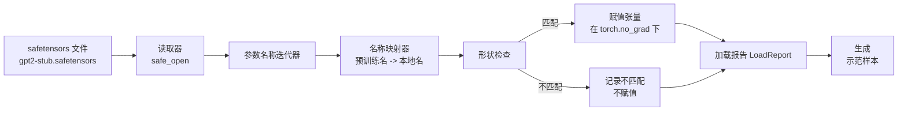

# 加载预训练权重

> 从头训练一个拥有1.24亿参数的模型是预算决定；加载已发布的检查点是日常事务。本课将从 safetensors 文件加载预训练的 GPT-2 风格权重到第35课中的精确架构，逐条讲解参数名称映射，并生成简短续写以验证加载成功。无需网络，无第三方加载器，无不可知的魔法。

**类型：** 构建  
**语言：** Python  
**先决条件：** 阶段19，第30到36课  
**时间：** 约90分钟

## 学习目标

- 使用 `safetensors` Python 库读取 safetensors 文件，并检查张量名称和形状。
- 将每个预训练参数名称映射到第35课 GPT 模型中的相应参数。
- 处理发布的 GPT-2 权重与本课程模型之间两种不同的命名约定：`wte/wpe/h.N.attn.c_attn/c_proj` 和 `mlp.c_fc/c_proj` 与本地命名的 `tok_embed/pos_embed/blocks.N.attn.qkv/out_proj` 以及 `mlp.fc1/fc2`。
- 在任何权重赋值前检测并拒绝形状不匹配，抛出清晰的错误。
- 使用加载后的权重生成简短续写，确认生成的token来源于加载的分布，而不是随机初始化。

## 问题描述

已发布的权重并没有针对你的架构打包。它们保留了原始实现中使用的名称。预训练文件中有形状为 `(2304, 768)` 的 `transformer.h.0.attn.c_attn.weight`；而你的模型期望的是形状为 `(2304, 768)` 的 `blocks.0.attn.qkv.weight`（这是同一矩阵的不同布局约定），或者你的模型使用的 `nn.Linear` 存储的是转置矩阵。同一个参数以三种细微不同的身份出现（名称、形状、字节布局），加载器必须调和这三者。

盲目复制的加载器会把正确的张量放错地方，导致模型生成胡言乱语。一个当形状不匹配时不做任何记录就拒绝加载的加载器，会让你猜测哪一个张量没成功加载。本课中的加载器是显式的：每次赋值都有日志，形状都被检查，一个 `LoadReport` 汇总了成功加载、缺失、未预期及形状不匹配，方便你查看加载详情。

## 概念图



名称映射器就是一个字符串到字符串的函数。形状检查是一个条件判断。赋值操作在 `torch.no_grad()` 作用域下进行，使自动求导不追踪加载过程。报告对象记录每个名称的处理结果。

### GPT-2 命名约定

发布的 GPT-2 权重位于如下名称下：

| 预训练名称 | 形状 | 含义 |
|------------|------|------|
| `wte.weight` | (50257, 768) | Token 嵌入 |
| `wpe.weight` | (1024, 768) | 位置嵌入 |
| `h.N.ln_1.weight` | (768,) | 第N层的 LayerNorm 1 缩放参数 |
| `h.N.ln_1.bias` | (768,) | 第N层的 LayerNorm 1 偏置参数 |
| `h.N.attn.c_attn.weight` | (768, 2304) | 融合的 QKV 线性权重 |
| `h.N.attn.c_attn.bias` | (2304,) | 融合的 QKV 线性偏置 |
| `h.N.attn.c_proj.weight` | (768, 768) | 注意力输出投影权重 |
| `h.N.attn.c_proj.bias` | (768,) | 注意力输出投影偏置 |
| `h.N.ln_2.weight` | (768,) | LayerNorm 2 缩放 |
| `h.N.ln_2.bias` | (768,) | LayerNorm 2 偏置 |
| `h.N.mlp.c_fc.weight` | (768, 3072) | MLP fc1 权重 |
| `h.N.mlp.c_fc.bias` | (3072,) | MLP fc1 偏置 |
| `h.N.mlp.c_proj.weight` | (3072, 768) | MLP fc2 权重 |
| `h.N.mlp.c_proj.bias` | (768,) | MLP fc2 偏置 |
| `ln_f.weight` | (768,) | 最终 LayerNorm 缩放 |
| `ln_f.bias` | (768,) | 最终 LayerNorm 偏置 |

需要注意两点。`c_attn`、`c_proj`、`c_fc` 线性层的权重相较于 `nn.Linear.weight` 的权重存储是转置的。加载时会转置。另外 LM 头权重文件中根本不存在，模型通过权重绑定（weight tying）到 `wte` 来实现，`wte` 加载完成后通过别名实现 LM 头赋值。

### 本地命名约定

本课程中模型采用更具描述性的命名：

| 本地名称 | 含义 |
|----------|------|
| `tok_embed.weight` | Token 嵌入 |
| `pos_embed.weight` | 位置嵌入 |
| `blocks.N.ln1.scale` | 第N层 LayerNorm 1 缩放 |
| `blocks.N.ln1.shift` | 第N层 LayerNorm 1 偏置 |
| `blocks.N.attn.qkv.weight` | 融合的 QKV 权重 |
| `blocks.N.attn.qkv.bias` | 融合的 QKV 偏置 |
| `blocks.N.attn.out_proj.weight` | 注意力输出投影权重 |
| `blocks.N.attn.out_proj.bias` | 输出投影偏置 |
| `blocks.N.ln2.scale` | LayerNorm 2 缩放 |
| `blocks.N.ln2.shift` | LayerNorm 2 偏置 |
| `blocks.N.mlp.fc1.weight` | MLP fc1 权重 |
| `blocks.N.mlp.fc1.bias` | MLP fc1 偏置 |
| `blocks.N.mlp.fc2.weight` | MLP fc2 权重 |
| `blocks.N.mlp.fc2.bias` | MLP fc2 偏置 |
| `final_ln.scale` | 最后 LayerNorm 缩放 |
| `final_ln.shift` | 最后 LayerNorm 偏置 |

映射规则是固定函数。本课提供以 dict 形式给出的映射表，加载器对其迭代。

### Stub 固定装置

真实 GPT-2 权重文件大约0.5 GB。示例代码不会下载它们；第一次运行时会生成一个符合 GPT-2 命名约定、适合12层深度、模型维度为192（而非768）的精简 safetensors 固定装置。该固定装置结构正确，能覆盖加载器所有代码路径。用真实文件替换后，加载器无需修改即可正常工作。

## 构建

`code/main.py` 实现了：

- 一个小型的第35课 `GPTModel` 副本，使本课独立自足。
- `make_pretrained_to_local(num_layers)`，展开每层映射条目。
- `load_safetensors(model, path)`，迭代名称，映射，检测形状，转置 conv1d 风格权重，在 `torch.no_grad()` 下赋值，并返回 `LoadReport`。
- `make_stub_safetensors(path, cfg)`，生成符合预训练命名约定的固定装置文件。
- 演示程序首次运行时创建 `outputs/gpt2-stub.safetensors`，构建新模型，捕获随机初始化的生成样本，加载固定装置，捕获另一个生成结果，打印两者并验证不同（证明加载真的影响了模型）。

运行命令：

```bash
python3 code/main.py
```

输出包括：生成的固定装置路径、每个参数加载日志、`LoadReport` 摘要、加载前续写、加载后续写，并通过故意注入一个形状错误的张量在固定装置中，触发失败路径并显示形状不匹配。

## 技术栈

- `safetensors` 用于磁盘格式和流式读取。
- `torch` 用于模型和张量赋值计算。
- 不使用 `transformers`、不使用 `huggingface_hub`，无网络调用。

## 生产环境中的模式

三条经验保证加载器能应对不属于你创建的权重：

**在任何赋值前始终校验完整文件。** 打开文件，列出所有张量名称及其 dtype 和形状，执行全映射及形状检查，只有全部通过才开始赋值。半加载的模型会默默失败。

**记录每次赋值的源名称和目标名称。** 出现异常时，日志能告诉你哪个张量被放哪儿；否则只能看十六进制转储。课程中的 `LoadReport` 数据类跟踪 `loaded`、`missing`、`unexpected` 和 `shape_mismatch` 列表，结束时打印汇总。

**LM 头是权重绑定别名，不是独立副本。** 加载 `tok_embed` 后设置 `model.lm_head.weight = model.tok_embed.weight` 是标准做法。复制嵌入矩阵到新的 `lm_head.weight` 会破坏绑定，悄无声息地参数数量翻倍。

## 使用场景

- 加载器支持任何采用预训练命名约定的 safetensors 文件。真实 GPT-2 文件（small/medium/large/xl）无需代码改动；只是模型配置不同。
- 同样文件处理逻辑扩展到 LLaMA、Mistral、Qwen 权重，只需更新名称映射。形状检查和报告不变。
- 加载后即做样本生成是快速校验方法：如果加载后样本与加载前几乎无差，说明映射未能覆盖任何张量。

## 练习

1. 给加载器添加 `dtype` 参数，使每个张量在赋值时转换为目标 dtype（`bfloat16`、`float16`、`float32`），确认 `float32` 模型可降精度到 `bfloat16` 并保持能生成。
2. 添加 `expected_layers` 参数，拒绝加载与模型 `num_layers` 不匹配的检查点。
3. 将加载器接入第35课的生成函数，比较随机初始化与加载固定装置后生成的两个样本。
4. 添加导出路径：将当前模型状态写入符合预训练命名约定的新 safetensors 文件。循环加载确认无形状不匹配。
5. 扩展 `NAME_MAP`，处理 LLaMA 命名约定（无偏置，RMSNorm，融合 qkv 布局），在你生成的 LLaMA 固定装置上再次运行加载器。

## 关键词

| 术语 | 常说 | 实际含义 |
|------|-------|----------|
| Name map | “键重映射” | 预训练张量名到本地参数名的函数，通常是遍历层索引展开的字典 |
| Shape mismatch | “形状错误” | 预训练张量存在映射名下，但维度与本地参数不符；加载器拒绝赋值并记录 |
| Transpose-on-load | “Conv1d 布局” | 公开的 GPT-2 中注意力和 MLP 投影权重与 nn.Linear 期望的转置关系，加载时转置 |
| Weight tying alias | “共享 LM 头” | 赋值 `model.lm_head.weight = model.tok_embed.weight`，头和嵌入共享存储；头未存文件 |
| Load report | “覆盖汇总” | 一个数据类，跟踪已加载、缺失、未预期及形状不匹配列表；打印报告判定加载成败 |

## 相关阅读

- 阶段19，第35课，权重接收架构详解。
- 阶段19，第36课，训练循环产生相同形状检查点。
- 阶段10，第11课（量化），加载权重内存紧张时的处理方式。
- 阶段10，第13课（构建完整大语言模型流水线），加载与推理全生命周期。
