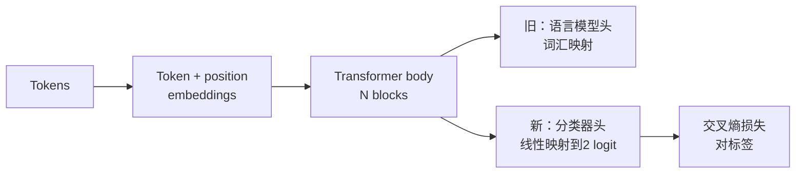
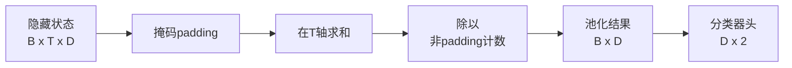
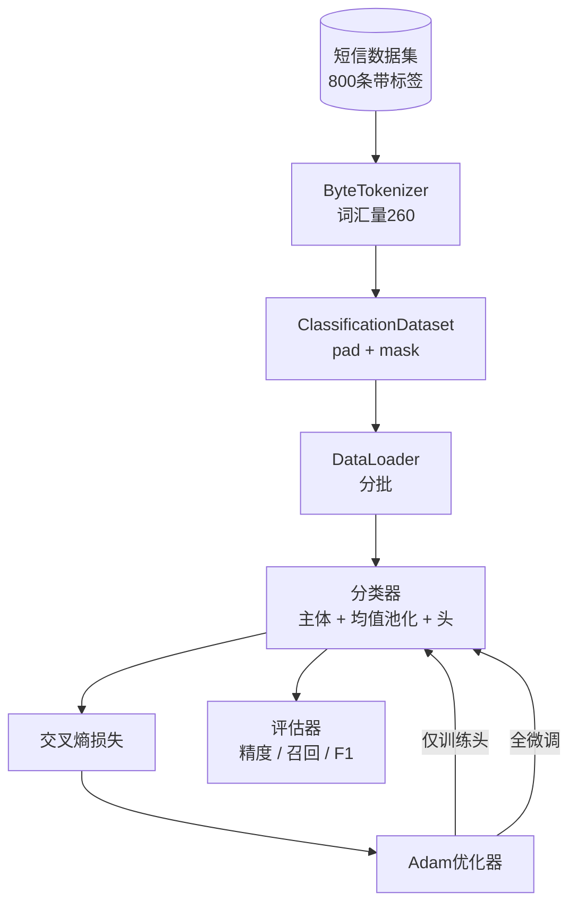

# 毕业设计课程 38：通过交换头进行分类器微调

> B轨的第一个毕业设计。预训练语言模型是一堆自注意力块叠加，最后接一个token预测头。当你需要判定垃圾短信与正常短信时，头部是错误的，但主体大多是正确的。本课拆掉头部，粘上一个两类的线性层到池化表示上，采用两种不同方式训练分类器：仅训练最终层和全层微调。评估指标是保留集上的精度、召回率和F1。你将了解到每种策略带来的收益和代价。

**类别：** 构建  
**语言：** Python（torch, numpy）  
**先决条件：** 第19阶段第30-37课（NLP 大语言模型轨道：tokenizer（分词器）、embedding表、attention块、transformer主体、预训练循环、检查点保存、生成、困惑度）  
**时长：** ~90分钟

## 学习目标

- 替换语言模型的head为分类head，且不重新初始化主体。
- 实现两种训练方式：冻结主体（仅训练头）和全微调，二者共享一个训练循环。
- 构建一个tokenizer感知的数据流水线，进行padding、掩码padding和注意力输出的池化。
- 从原始logits计算精度、召回率、F1和混淆矩阵。
- 理解参数量、训练时间和模型容量（head-room）之间的权衡。

## 问题背景

你在通用语料上预训练了一个小型transformer。输出头投影最后的隐藏状态到一个1000词汇量的词表。现在你有800条标注为垃圾（spam）或正常（ham）的短信数据，想要一个二分类器。有三个选择。

错误的选择是用这800个样例从头训练一个新的分类器。预训练模型的主体已经编码了有用的结构：词身份、位置、简单共现。直接丢弃它就是浪费了构建它的计算成本。

正确的两个选择是：交换头并冻结主体，或交换头并允许主体训练。仅训练头速度快，几乎不占用额外内存，对小数据集很少过拟合。全微调较慢，小数据集容易过拟合，但在下游领域与预训练语料不同的情况下准确率更高。

本课实现两种方案，以便你能在相同数据集上进行比较。

## 概念

模型是函数 `f_theta(tokens) -> hidden_states`。头是函数 `g_phi(hidden) -> logits`。交换头意味着保持`theta`，替换`g_phi`。主体参数最昂贵，头则是单层线性层。

两个可训练参数集：

- `theta`（主体）：每个attention块成千上万的权重。
- `phi`（头）：`hidden_dim * num_classes`权重加一个偏置。

仅训练头时，你让`phi`执行梯度计算，`theta`梯度为零。PyTorch通过将主体参数的`requires_grad=False`实现这一点。优化器只看到头，主体冻结。

全微调时，梯度贯穿全网络。主体权重向分类目标调整。风险是小样本下灾难性遗忘，主体预训练知识被过拟合噪声覆盖。

## 池化问题

分类器需要每个序列一个向量，而不是每个token一个向量。三种常见选择：

- **均值池化**：按注意力掩码权重对隐藏状态序列求平均。
- **CLS池化**：加入特殊CLS token，只用它的输出。这是BERT的做法。
- **末尾token池化**：使用序列最后一个非padding token输出。GPT类分类器一般使用。

本课使用带显式注意力掩码加权的均值池化。简单、跨序列长度稳定，不需预训练CLS token。

## 数据

800条短信，均衡400垃圾、400正常，由 `code/main.py` 确定性生成。生成器用固定种子，根据模板替换槽位，输出5到25 token长的信息。真实数据比这个标准测试集更有噪声。此数据集重点在于复现性。

划分80/20：640训练，160测试。划分采用分层采样，保证测试集50/50。持出集比例已知，精度和召回率可作为真实统计。

## 评估指标

二分类，类别1为正类（垃圾）。计数如下：

- `TP`：预测为垃圾，实际也为垃圾。
- `FP`：预测为垃圾，实际正常。
- `FN`：预测正常，实际垃圾。
- `TN`：预测正常，实际正常。

主要指标：

- `precision = TP / (TP + FP)`。被标记为垃圾的信息中实际是垃圾的比例。
- `recall = TP / (TP + FN)`。实际垃圾中被正确识别的比例。
- `F1 = 2 * P * R / (P + R)`。精度和召回率的调和平均数。

混淆矩阵以2x2网格显示以上四个数值。演示中会将其打印到标准输出，供两种训练方案对比。

## 架构

主体为一个特意设计的超小型transformer：词汇量260，隐藏层64，4个头，2个block，最大序列长32。小到在CPU上90秒内能收敛两种训练方案。课程中主体不是直接预训练的；`pretrain_quick`辅助函数在同数据集文本上做5个epoch的语言模型预训练，使主体有一定基础，保持课程自给自足。

## 你将构建

实现包含一个 `main.py` 和一个测试模块（`code/tests/test_main.py`）。

1. `ByteTokenizer`：将字节映射到id，保留一个padding id。
2. `Block`：带多头注意力和前馈层的transformer块。预层归一化。
3. `LMBody`：token+位置embedding叠加block堆栈，输出隐藏状态。
4. `MeanPool`：对序列轴做掩码加权平均。
5. `Classifier`：主体、池化、线性头。主体在两种方案中是同一实例。
6. `freeze_body` 和 `unfreeze_body`：切换主体参数的 `requires_grad`。
7. `train_classifier`：共享一个循环。接受模型和针对可训练参数组配置的优化器。
8. `evaluate`：运行测试集，返回 `Metrics(precision, recall, f1, confusion)`。
9. `run_demo`：先短暂预训练主体，再训练并评估仅训练头和全微调，打印两个报告，最后正常退出。

## 为什么比较很重要

仅训练头一般训练更快，且更稳健地欠拟合。此数据集上，头训练20 epoch后，通常精度约0.9，召回约0.85。全微调耗时约三倍，结果高低凭随机种子相差几个百分点。

课程不选赢家，教你如何读数值和代价。在800样例＋超小主体环境下，头训练是合适选择。80,000样例＋较大主体时，全微调才更值得。课程拿到的契约是API：同一个 `train_classifier` 支持两种方案，切换仅需一行代码。

## 进阶目标

- 添加第三种方案，只解冻最后一个block。这被称为部分微调。成本低于全微调，学习能力强于仅训练头。
- 增加学习率调度。头部用余弦退火，主体用较小恒定率是常见生产方案。
- 用可学习的注意力池替换均值池化：用一个小的注意力层和一个可学习的查询向量。对较长序列通常优于均值池化。

实现提供了钩子，测试保证契约，数值由你来推动。
