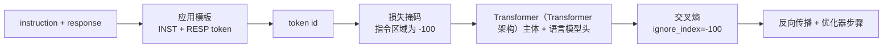
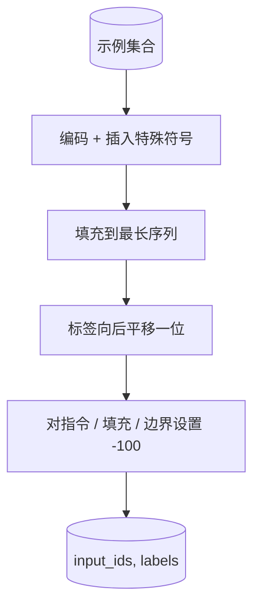
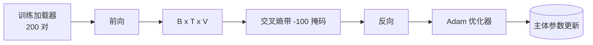

# 总结课 39：通过监督微调进行指令调优

> 预训练基础模型可以扩展序列但不能遵循指令。监督微调是解决此问题的最小改动：向模型提供成对的指令和期望响应示例，并训练模型预测响应的 token。关键是只对响应部分计算损失，不计算指令部分。本课构建了一个 Alpaca 风格的 SFT 循环，使用自定义的 collate 函数将指令 token 设置为 `ignore_index=-100`，在 200 组指令-响应对上训练，并在保留分割集上使用完全匹配（exact-match）进行评估。

**类型：** 构建  
**语言：** Python（torch，numpy）  
**先决条件：** 第 19 阶段第 30-37 课（NLP LLM 轨道：分词器，嵌入表，注意力块，Transformer（Transformer 架构）主体，预训练循环，检查点，生成，困惑度）  
**耗时：** 约 90 分钟

## 学习目标

- 将成对的指令-响应数据格式化为单个因果序列，包含显式边界标记。  
- 构建一个 collate 函数，对指令 token 使用掩码，使交叉熵只计算响应 token。  
- 在 SFT 目标下训练一个微小的 Transformer（Transformer 架构）主体，并观察评估指标的变化。  
- 实现尊重响应起始边界的贪婪和温度采样生成。  
- 在生成的完成结果上计算保留集的完全匹配指标。  

## 问题描述

一个基于下一 token 预测训练的基础模型不知道什么是指令。给它字符串 `"What is the capital of France?"`，它会续写这个问题或创造一个新句子。模型掌握语言本身，但不了解格式契约。

SFT 约定了一个字符串模板。每个训练示例变成一个包含三个区域的单序列：

```text
<INST> What is the capital of France? <RESP> The capital of France is Paris.
```

边界 token 是训练时预留的特殊 token。模型学会了 `<RESP>` 之后的内容是响应，而评分时只评响应。基础模型的下一 token 目标依然有效，只是所有示例都符合这种格式。

但有一个问题。如果将整序列输入到普通交叉熵损失，会促使模型去预测指令 token，而指令是已知的，不需要预测。你希望那些位置的梯度为零。解决方法是在这些位置做掩码。

## 概念说明



`ignore_index` 是 `torch.nn.functional.cross_entropy` 的一个特性，任何目标位置等于该索引的不会贡献损失和梯度。PyTorch 的惯例是使用 `-100`。collate 函数为每个示例构建两个张量：`input_ids`（完整序列）和 `labels`（`input_ids` 的副本，将指令位置改为 `-100`）。

模型前向时看到全序列，注意力可以关注到指令。损失只针对响应 token。这正是我们想要的：以指令为条件，预测响应。

## 数据

在 `main.py` 中确定性生成了 200 组指令-响应对，涵盖六种任务类型：

- 事实单次任务（X 的首都）  
- 算术  
- 列表提取  
- 单句摘要  
- 代码（打印、排序）  
- 定义  

每个任务都有模板化的指令和确定性响应。故意设计得简单直接。完全匹配指标很脆弱，本课所用示例中正确答案仅有一个固定字符串。真实 SFT 数据集需要模糊度量，原则相同。

划分为 160 训练，40 测试。测试集涵盖所有六个任务，以便报告每类的完全匹配结果。

## 分词和填充

分词器采用字节级别，三个特殊预留符号：

- `INST_ID = 256`：标记指令区域的起始。  
- `RESP_ID = 257`：标记指令和响应的分界。  
- `PAD_ID = 258`：批量中变长序列的填充。  

序列结构为 `[INST] inst_bytes [RESP] resp_bytes [PAD]*`。collate 函数步骤：

1. 对每个示例分词。  
2. 将批次内所有示例填充到最长序列长度。  
3. 构建 `labels` = `input_ids` 向后平移一位（因果语言模型目标），同时：  
   - 将指令区域标记为 `-100`。  
   - 将填充区域标记为 `-100`。  
   - 将 `RESP_ID` 边界标记本身标记为 `-100`（不训练模型预测边界 token，而是预测其后内容）。  



向后平移是标准的因果技巧：`input_ids` 位置 `i` 用来预测位置 `i+1`，所以 `labels[i] = input_ids[i+1]`（输入丢弃最后一个位置，标签丢弃第一个位置）。掩码在平移后应用，确保掩码对应正确位置。

## 训练



这是标准的 PyTorch SFT 循环。Adam 优化器，学习率约为 3e-4 到 1e-3，训练十到二十个 epoch，无学习率调度器。模型尺寸小（隐藏层 96，2 层，最大长度 64），能在 CPU 上两分钟内收敛。

每隔五个 epoch，循环将在保留集上做一个小规模评估并打印完全匹配指标。观察完全匹配从 epoch 1 的 0.0 上升到 epoch 15 的约 0.85，是本课核心成果：看到模型同时学习了格式和答案。

## 生成

评估时，模型收到指令前缀 `[INST] inst_bytes [RESP]`，生成 token 直到：

- 序列长度达到 `max_len`，或  
- 模型生成特殊停止启发式：连续两个句末字节（`.`，`!`，`?`）。  

本课提供贪婪解码和可选温度采样。完全匹配评估采用贪婪解码，因为温度采样会使指标变得随机。真实系统常先采样再使用模糊判别；此流程见第 41 课。

## 完全匹配评估

完全匹配是最严格的文本度量。预测响应字符串经过归一化处理（小写、去空白、合并双空格）后，与同样归一化的参考响应比较。每个示例指标为 0 或 1，聚合为平均值。

真实 SFT 流程常用 token 级 F1（第 41 课）和判别模型辅助。完全匹配依然有用，因为它无二义性：若指标是 0.7，表示 70% 测试指令字符层面完全匹配黄金响应。

## 你将构建的内容

实现包括一个 `main.py` 和测试：

1. `InstructionTokenizer`：字节级编码器，包含预留特殊符号。对单指令或全对编码。  
2. `make_dataset`：生成 200 组，涵盖六种任务类型，使用固定种子。  
3. `SFTDataset`：每个示例返回 `(input_ids, labels)`，掩码已处理。  
4. `sft_collate`：动态填充，构建批次张量，在指令和填充位置设置 `-100`。  
5. `TinyGPT`：Transformer（Transformer 架构）主体，带绑定或解绑定语言模型头。  
6. `train_sft`：SFT 训练循环，包含每 epoch 评估钩子。  
7. `generate`：给定前缀进行因果解码，支持贪婪和采样，带停止启发式。  
8. `exact_match`：归一化字符串比较，返回 `[0, 1]` 浮点值。  
9. `run_demo`：构建数据，训练 20 个 epoch，评估，打印每类指标，成功返回 0。  

## 掩码的重要性

没有掩码，损失会将指令 token 视为预测目标。模型会学着预测指令，这改变了目标并对模型造成两个方面的负面影响。首先，模型容量浪费在重构用户总是提供的输入。其次，因指令 token 通常比响应 token 多，响应的损失占梯度的比重变小，优化器对重要部分的有效学习率低于预期。掩码不是一个额外步骤，而是目标本身。

## 拓展目标

- 添加学习率预热和余弦衰减。SFT 对学习率更敏感于预训练。  
- 添加每个 token 损失日志，绘制训练曲线。注意早期 epoch 主要由模板 token（`<RESP>`、常用前缀）主导，后期由答案 token 主导。  
- 将评估扩展至 BLEU-1 或 chrF 指标。完全匹配低估了能产出内容等价的释义答案的模型。  
- 添加多轮聊天模板，训练包含后续对话的示例。  

实现给你格式契约，掩码和训练循环。从基础模型到指令跟随者，改变只在于一个 collate 函数。
