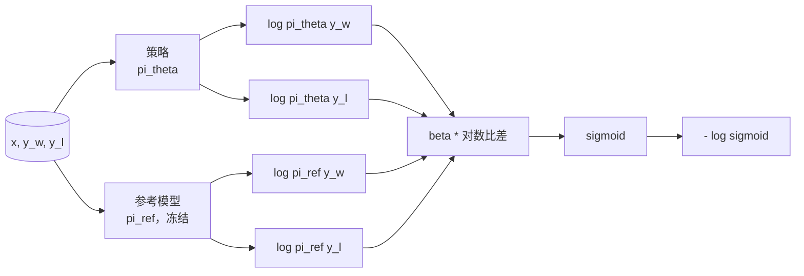
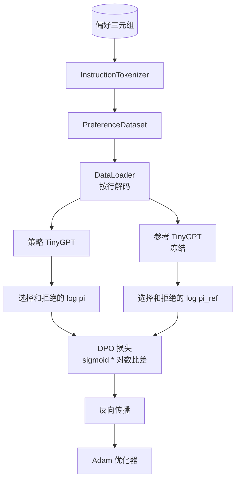

# 毕业设计课程 40：从零开始的直接偏好优化（Direct Preference Optimization）

> 奖励模型和 PPO 是经典的 RLHF 栈。DPO 将该栈简化为单个监督损失，直接通过偏好对拟合策略。此课程从奖励差异恒等式推导 DPO 损失，提供工作参考模型及策略模型，计算每个 token 的对数概率，并在一个偏好数据集（选择与拒绝的完成）上训练一个小型 Transformer。测试严格校验损失公式和梯度方向，确保实现与论文一致。

**类型：** 构建  
**语言：** Python（torch、numpy）  
**先修：** 阶段 19 课程 30-37（NLP 大语言模型轨道：分词器、嵌入表、注意力模块、Transformer 主体、预训练循环、检查点、生成、困惑度）  
**时间：** 约 90 分钟

## 学习目标

- 推导 DPO 损失作为一个缩放对数比差的 sigmoid，并将其与隐式奖励联系起来。  
- 构建带有冻结参考模型和可训练策略的一对模型。  
- 计算两个模型下的序列级对数概率，屏蔽提示（prompt）tokens。  
- 对 `(prompt, chosen, rejected)` 三元组训练策略，观察选择完成的对数概率相较拒绝完成的提升。  
- 通过测试锁定损失计算、梯度符号及参考不变性确保行为一致。

## 问题背景

你拥有一个 SFT（监督微调）模型，它能遵循指令，但输出质量不均匀，有些完成准确，有些废话连篇或错误。你也有一个小型偏好对数据集：对于同一提示，人类标记一个完成为选择，另一个为拒绝。

传统的 RLHF 方案是两阶段流程：先用偏好训练奖励模型，再用 PPO 针对奖励优化策略。此法有效，但成本高昂：PPO 期间需要存两套模型，使用 KL 控制以限制策略偏离参考，奖励模型脆弱时会出现奖励欺骗。

DPO 用一个监督损失替代两阶段，奖励模型不显式存在。策略直接基于偏好对训练，且显式加 KL 惩罚限制策略靠近 SFT 参考。与 Bradley-Terry 偏好模型下同一最优解，代码量大减。

## 概念介绍

从 Bradley-Terry 偏好模型开始。给定提示 `x` 和两个完成 `y_w`（选择）及 `y_l`（拒绝），人类选择 `y_w` 的概率为

```text
P(y_w > y_l | x) = sigmoid( r(x, y_w) - r(x, y_l) )
```

其中 `r` 是某种隐式奖励函数。RLHF 首先基于偏好拟合 `r`，再用带 KL 正则的目标训练策略 `pi` 最大化奖励：

```text
max_pi   E_{x, y~pi} [ r(x, y) ] - beta * KL(pi || pi_ref)
```

DPO 推导发现，最优策略 `pi*` 在此优化下的解析形式为：

```text
pi*(y | x) = (1/Z(x)) * pi_ref(y | x) * exp( r(x, y) / beta )
```

重新排布 `r` 得：

```text
r(x, y) = beta * ( log pi*(y | x) - log pi_ref(y | x) ) + beta * log Z(x)
```

由于 `log Z(x)` 仅依赖于 `x`，不依赖 `y`，计算偏好差时可抵消：

```text
r(x, y_w) - r(x, y_l) = beta * ( log pi_theta(y_w|x) - log pi_ref(y_w|x)
                                - log pi_theta(y_l|x) + log pi_ref(y_l|x) )
```

代入 Bradley-Terry sigmoid，并对偏好对取负对数似然：

```text
L_DPO(theta) = - E_{(x, y_w, y_l)} [
  log sigmoid( beta * ( log pi_theta(y_w|x) - log pi_ref(y_w|x)
                       - log pi_theta(y_l|x) + log pi_ref(y_l|x) ) )
]
```

这即是损失函数。它对每个样本基于四个对数概率计算一个标量，套用 sigmoid。无奖励模型，无 PPO，无额外 KL 损失项，因为 KL 限制隐含在解析推导中。



## 梯度符号

训练前的有用 sanity check。对 `log pi_theta(y_w | x)` 求梯度：

```text
d L_DPO / d log pi_theta(y_w | x) = - beta * (1 - sigmoid(z))
```

其中 `z` 是 sigmoid 的输入项。该式始终为负，意味着提升选择完成的策略对数概率会降低损失。相反，对 `log pi_theta(y_l | x)` 的梯度为正，提升拒绝完成的概率会增加损失。训练推动选择完成概率上升，拒绝完成概率下降。参考模型被冻结，不发生变化。

## 数据集

课程配套提供 12 组偏好三元组 `(prompt, chosen, rejected)`。选择的完成简短精准，拒绝的则繁琐、离题或错误。三元组覆盖第 39 课任务分类（首都、算数、列表），保证基于 SFT 基础的策略有合理起点。

数据集特意做小。DPO 在生产环境上能处理数万组偏好；这里重点是验证损失数学和训练循环可在小数据集上端到端运行，且选择与拒绝对数概率差逐步扩大。

## 参考不变性

DPO 实现须谨慎处理参考模型，参考为冻结的 SFT 模型。需满足三条属性：

- 参考参数永不更新梯度。  
- 参考的对数概率在各 epoch 间保持不变。  
- 策略初始化权重同参考模型一致（最优 `theta` 为参考加一个学习更新，初始化为参考复制是明确起点）。

实现细节：

- 前向过程中用 `torch.no_grad()` 包裹参考模型。  
- 对所有参考参数设 `requires_grad=False`。  
- 通过 `policy.load_state_dict(reference.state_dict())` 构造策略。

## 架构



模型与第 39 课相同，使用 TinyGPT（仅解码器、因果、字节分词器）。参考和策略结构相同，训练期间策略权重逐渐偏离参考，参考保持固定。

## 你将构建的内容

实现包括一个 `main.py` 和配套测试。

1. `InstructionTokenizer`：带有 `INST` 和 `RESP` 特殊符的字节分词器，形状与第 39 课相同。  
2. `TinyGPT`：仅解码器 Transformer，保持与第 39 课一致使课程自包含。  
3. `make_preferences`：返回 12 组 `(prompt, chosen, rejected)` 三元组。  
4. `sequence_log_prob`：给定模型、提示前缀和完成内容，返回完成部分的下一 token 对数概率和（不包含提示部分）。  
5. `dpo_loss`：接受四个对数概率及 `beta`，返回每样本损失张量和隐式奖励差供日志使用。  
6. `train_dpo`：每 epoch 循环，计算策略和参考的选择及拒绝对数概率，计算损失并调用 Adam 步进。  
7. `evaluate_margins`：在任一时刻返回策略下的平均选择-拒绝对数概率差。  
8. `run_demo`：基于小预训练搭建参考和策略，复制权重，训练 30 步，打印逐步损失和差距，成功则退出代码 0。

## 为什么 DPO 有效

DPO 数学上等价于 Bradley-Terry 偏好模型下的 RLHF，除了奖励的参数化形式不同。隐式奖励定义为 `r(x, y) = beta * (log pi(y|x) - log pi_ref(y|x))`，偏好对能唯一确定该奖励至依赖于 `x` 的函数（该函数在差值中被抵消）。解析形式策略让你跳过显式奖励模型。KL 限制体现在结构中：`pi` 与 `pi_ref` 偏离越大，对数比例越大，sigmoid 趋于饱和，梯度减弱，防止策略过度偏离。参考模型是安全保障。

## 拓展目标

- 给对数概率和加上长度归一化：除以完成长度。长度偏差是已知 DPO 失败模式，模型偏好较短的完成因其绝对对数概率较大。  
- 加入 IPO 版本的损失：用 `(z - 1)^2` 替代 sigmoid + log，比对收敛速度。  
- 添加一个标签平滑参数，在硬选择-拒绝标签和均匀 0.5 之间插值。  
- 用更小更廉价模型替代参考（知识蒸馏方向）。

该实现提供完整损失、参考不变性保障和训练循环。数学原理即课程主体，代码让数学概念具体化。
