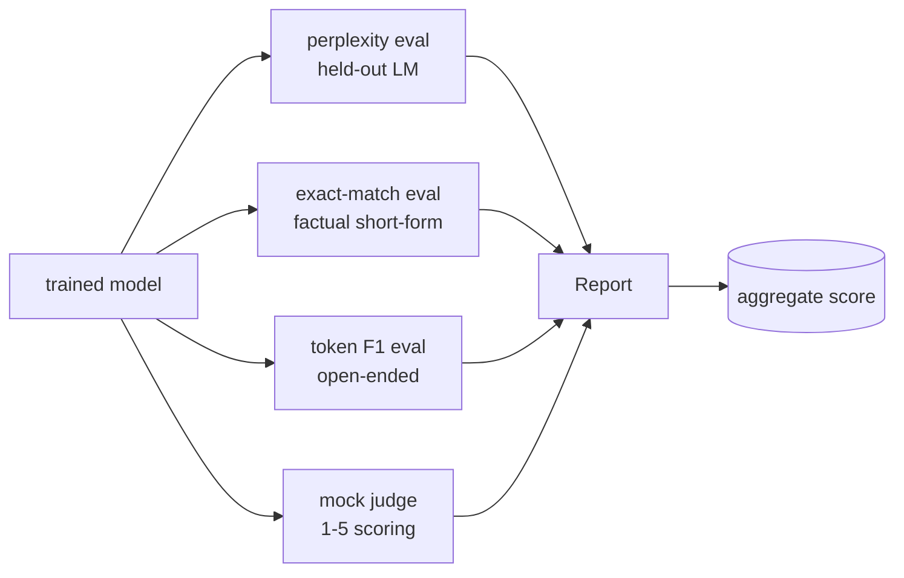
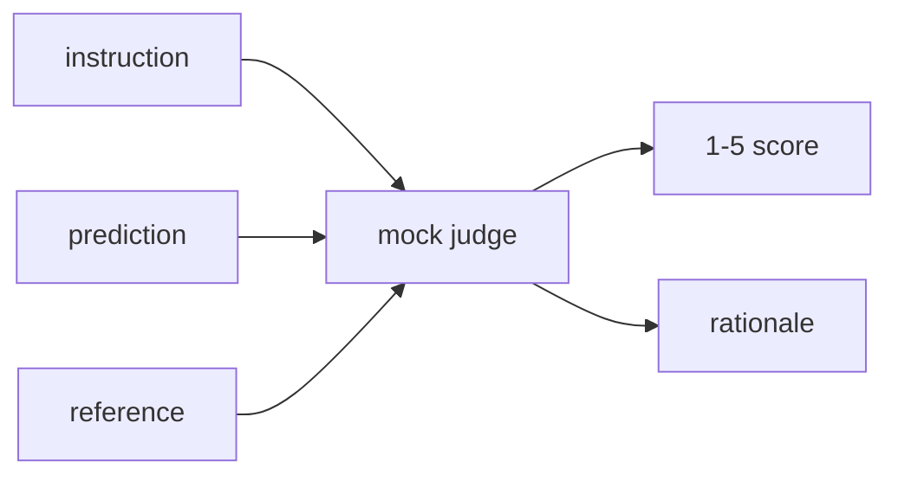
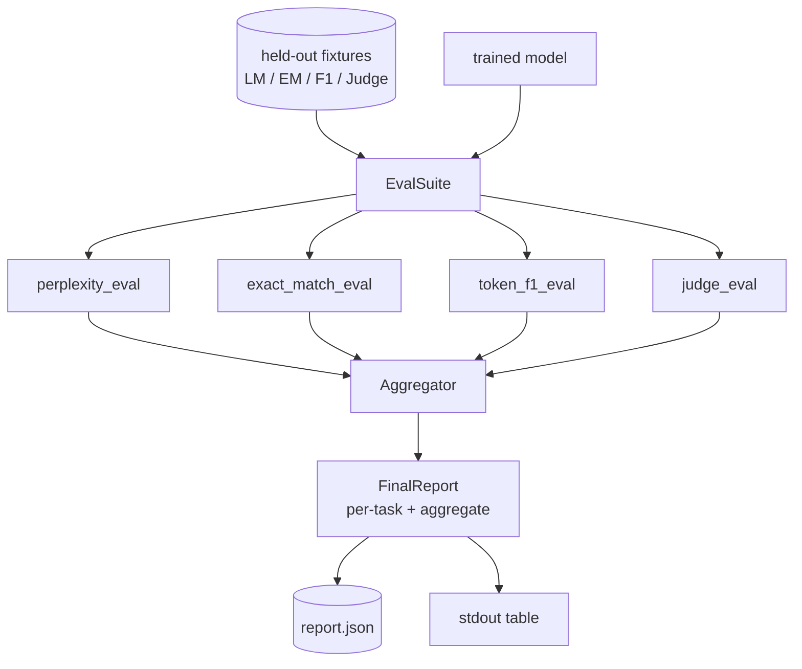

# 毕业项目第41课：完整评估流水线

> 训练是你可以通过损失曲线监控的部分。评估是你必须设计的部分。本课构建了一个统一的评估流水线，该流水线接受任何训练好的语言模型，在其上运行四种异构评估，将结果汇总成每项任务的报告，并部署一个本地的模拟LLM作为裁判，使得整个流程无需网络即可运行。这四种评估覆盖了交付模型必需的维度：语言建模（perplexity 困惑度）、短文本正确性（exact-match 精确匹配）、开放式相似度（token F1）、定性评分（judge 裁判）。

**类型：** 构建  
**语言：** Python（torch，numpy）  
**先决条件：** 第19阶段第30-37课（NLP LLM路径：tokenizer 分词器，embedding table 嵌入表，attention block 注意力模块，transformer body Transformer主体，预训练循环，checkpointing 检查点保存，生成，perplexity 困惑度）  
**时间：** ~90分钟

## 学习目标

- 使用带掩码的token统计计算验证集的perplexity（困惑度）。
- 对短文本事实类提示运行exact-match（精确匹配）评估。
- 计算预测和参考字符串之间的token级F1，使用归一化处理。
- 构建本地模拟LLM作为裁判，使用1-5分制评分模型输出。
- 将四种评估结果汇总成一个加权报告，提供按任务划分的详细数据。

## 问题

单一指标无法完整描述语言模型。Perplexity表示模型对语言分布的拟合度，却无法说明其是否能回答问题。Exact-match判断模型是否生成了黄金答案，但会惩罚正确的同义表达。Token F1允许同义表达，但容易被含错误内容的词汇重叠蒙蔽。LLM-as-judge捕捉定性维度，但计算代价高且不确定。

你真正需要的评估流水线要包含这四个指标。每个评估覆盖其他指标未能评估的维度，每个评估在针对该指标设计的不同验证数据子集上运行。最终报告并排显示每项指标数值及汇总，使审阅者一目了然模型的权衡表现。

本课将端到端构建该评估流水线，整合在一个文件中。

## 概念

每个评估函数的签名为 `(model, dataset) -> EvalResult`。结果包含指标值、每个样本的详细记录（便于检查）和聚合名称。流水线根据配置决定运行哪些评估以及它们的权重。

## 正确计算困惑度（Perplexity）

Perplexity 定义为 `exp(每token的负对数似然的均值)`。实现在两处常见陷阱：

- 均值必须基于实际token位置计算，而非batch*sequence长度。padding token必须排除在分母外，否则困惑度数值会被人为拉低。
- 模型预测下一个token，所以位置 `i` 的logits预测的是位置 `i+1` 的token。这里的越界一位错误不会报错：损失依然能够训练但指标失去意义。

该评估计算每batch中非padding位置的 `-log p(token)` 之和及token数，最后统一相除。这种做法比对每batch困惑度取平均更稳定，且符合教材定义（后者会使短序列权重偏低）。

## 精确匹配（Exact-match）及其归一化

比较预测和参考前，会先对两者做归一化处理：

- 转为小写
- 去除首尾空白符
- 连续空白合并为单空格
- 若两者仅因末尾标点符号（`.`, `!`, `?`）不同，则去除末尾标点符号后再比较

归一化使exact-match更实用。比如，模型输出`"Paris"`、`"Paris."` 或 `"  paris  "`都视为正确。但匹配仍要求归一化后字符串一致。

## 正确计算Token F1

Token F1是基于词袋模型计算的精准率和召回率的调和平均。步骤如下：

1. 对预测与参考进行归一化（同exact-match规则）。
2. 按空白切分成token列表。
3. 计算多重集合的交集数量。
4. 计算精准率 = `intersection_count / len(pred_tokens)`，召回率 = `intersection_count / len(ref_tokens)`，F1为二者调和平均。

若预测和参考均为空，F1为1（空匹配）；只有一方为空，F1为0。该方法符合SQuAD评测标准，能稳定反映同义表达。

## 本地模拟LLM作为裁判

真实的评判模型多为前沿大模型，运行在API后端。本课要求脱机运行，故使用模拟裁判。模拟裁判是一个确定性评分函数，接收指令、模型预测及参考答案，返回 `{1, 2, 3, 4, 5}` 评分和一行评分理由。评分规则明确：

- 5分：归一化预测等于归一化参考。
- 4分：预测与参考的token F1至少0.8。
- 3分：token F1介于[0.5, 0.8)。
- 2分：token F1介于[0.2, 0.5)。
- 1分：其他情况。

这不是一个真实评判模型，但接口相符。后续可替换为真实模型而不改动流水线。

## 汇总

最终分数为归一化后各评估指标的加权平均。每个评估输出的成绩均在 `[0, 1]` 范围：

- Perplexity：归一化为 `1 / (1 + log(perplexity))`，perplexity为1映射到1，无穷大映射到0。
- Exact-match：原本就在 `[0, 1]`。
- Token F1：原本就在 `[0, 1]`。
- Judge：除以5以归一化。

权重可配置，默认组合为：perplexity 0.2，exact-match 0.3，token F1 0.3，judge 0.2。权重设计是产品决策，课程提供参数可供尝试。

## 架构

`EvalSuite`是一个简单的协调器。各个评估均为自由函数，签名为`(model, tokenizer, dataset, config)`，返回`EvalResult`。`Aggregator`接收各项结果，生成最终报告。示例会打印表格，写入供后续CI使用的JSON文件。

## 你将构建的内容

实现包含`main.py`和测试：

1. `TinyGPT`：与第38-40课相同的解码器架构，保证课程独立完整。
2. `InstructionTokenizer`：带有INST/RESP/PAD特殊token的字节分词器。
3. 四个测试数据集：一个语言模型语料，一个exact-match数据集，一个F1数据集，一个裁判集。各20个确定性样本。
4. `perplexity_eval`：返回带困惑度及每token损失直方图的`EvalResult`。
5. `exact_match_eval`：返回平均exact-match和每样本记录。
6. `token_f1_eval`：返回平均token F1和每样本记录。
7. `mock_judge`和`judge_eval`：每样本分值及理由，集成后的平均分。
8. `Aggregator.normalise`：各评估指标的归一化规则。
9. `Aggregator.aggregate`：加权平均和最终报告组合。
10. `run_demo`：短暂训练一个微型模型，执行四种评估，打印报告表格并输出JSON，成功时返回零。

## 阅读报告

报告分三层。顶层是总分。下层为四项评估数值。最底层是样本级详细统计，便于诊断。CI失败时主看总分，追踪回归时需要具体样本对比模型错误。

JSON输出用固定key设计，便于CI仪表盘绘制版本趋势。美观表格便于训练结束后在终端浏览。

## 拓展目标

- 增加校准评估：检验模型的softmax概率与准确率是否匹配，按置信度区分桶，报告桶内经验准确率。
- 增加鲁棒性评估：标注每个样本扰动类型（拼写错误、同义改写、干扰项），报告不同扰动下指标下降。
- 用真实模型替换模拟裁判，调用HTTP服务。函数签名不变。
- 增加每任务权重学习：不固定权重，通过调整权重使模型之间符合目标偏好排序。

本项目给出四个评估函数、聚合器和报告机制。真实评估流水线上会加层层额外维度，但核心模式不变：每个评估一个函数，一个聚合器，一个报告。
