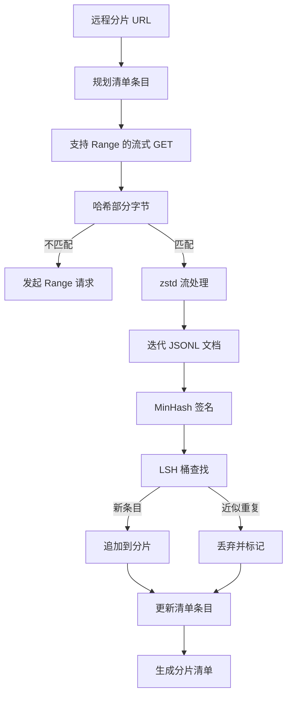

# 大型语料下载器

> 训练语言模型从第一次正向传播开始之前就已经启动。语料必须先落盘、解压、去重，并且能够被定位，下载续传机制也得在网络掉线（例如在百分之四时）之前就设计好。本课将构建一个流式下载器，拉取压缩分片，使用 Zstandard 现场解压，通过 MinHash 加局部敏感哈希（Locality-Sensitive Hashing，LSH）实现近似重复文档指纹识别，并写出一份其余流水线可以信赖的分片清单（manifest）。

**类型：** 构建  
**语言：** Python  
**前提条件：** Phase 19 课程 30-37  
**时间：** ~90 分钟  

## 学习目标

- 使用 `urllib` 流式拉取远程分片，并用 `zstandard` 现场解压，避免将整个文件缓存在内存中。
- 通过 HTTP `Range` 请求针对已验证的字节偏移实现断点续传。
- 为每个文档构建 MinHash 签名，并用 LSH 进行分桶，令近似重复文档冲突归为一类。
- 输出包含内容哈希、字节大小、文档计数、去重判定的分片清单。

## 问题所在

首次训练一个 200 GB 语料时，网络在 41% 处断开，脚本抛出 `urllib` 异常退出。第二次断在 78%。到 99% 你已经重写了三遍循环。你必须从第一分钟起设计的两个失败处理是：续传中断和重复文档剔除。两者都有成熟方案，但经常被忽略，因为流水线最初只是一个一行的 `requests.get` 调用，后来变得棘手起来。

续传是一个 HTTP 问题。服务器必须支持 `Range`，客户端必须维护经过验证的偏移并和磁盘记录比较，验证后的偏移必须能跨进程存活。如果偏移和文件字节有哪怕一个字节偏差，续传会写入垃圾数据，语料就会损坏，且错误只会在分词阶段暴露。

去重是签名问题。精确哈希去重会漏掉近似重复：比如同一维基百科文章有三种不同的模板页脚、同一份代码文件不同的许可证头、同篇博客有带跟踪参数的不同链接。MinHash 加 LSH 可以以次线性成本捕捉这些。成本是每个文档一个签名，每个签名一次桶查找。

## 概念图



### 使用 `urllib` 流式读取

标准库 `urllib.request.urlopen` 返回类文件对象。将其包裹在 `zstandard.ZstdDecompressor().stream_reader`，字节数据就会从网络流经解压器进入文档迭代器，中间不会在内存中完整存储压缩分片或解压分片。唯一的内存代价是行缓冲区、当前文档的 MinHash 签名和 LSH 索引。

### 用 `Range` 实现续传

下载器为每个分片写两个文件：分片文件和 `.partial.json` 检查点文件。检查点包含 `verified_bytes`（已验证的字节数）、`expected_size`（预期大小）、`sha256_prefix`（对已验证字节计算的 sha256 前缀哈希）、和源 URL。启动时，下载器读取检查点，重新计算磁盘上字节的 `sha256_prefix`，只有当哈希匹配才续传。若哈希错误，丢弃部分内容，从字节零开始重新下载。这样避免了静默的文件损坏，已验证字节经过校验保证可靠。

### MinHash 加 LSH

MinHash 用固定空间估计两个集合的 Jaccard 相似度。对于文档，集合是其文本的 shingles（重叠 n-gram）。签名是 `k` 个独立哈希函数计算的最小哈希值。相似度为 `s` 的两个文档对任意单个签名分量一致的概率是 `s`。

LSH 将 `k` 个分量划分成 `b` 个 bands（段），每段 `r` 行，满足 `k = b * r`。两个文档至少在一段碰撞的概率是 `1 - (1 - s^r)^b`，这在阈值附近非常陡峭，你通过调节 `(b, r)` 来设定阈值。典型去重阈值是 `s=0.8`，文献中常用 `k=128`, `b=32`, `r=4`。

### 分片清单即契约

下载器唯一的持久产物是清单。清单记录每个分片的 URL、解压字节数、文档数、去重后文档数，以及最终分片文件的 sha256。下游分词阶段读取清单，而非目录列表。若分片缺失或 sha256 不符，清单告知下游拒绝启动。清单决定了“数据已下载”和“数据已下载且可验证”之间的边界。

## 构建实现

`code/main.py` 实现了：

- `ShardPlanner` —— 读取分片 URL 列表，生成规划清单条目。
- `StreamingDownloader` —— 打开带可选 `Range` 的 `urllib` 流，写入临时文件，每块更新 `.partial.json` 检查点，并在续传时验证 sha256 前缀。
- `ZstdDocIterator` —— 包裹类文件流为 `zstandard.ZstdDecompressor`，逐行产出 JSONL 文档。
- `MinHasher` —— 使用固定哈希种子族为字符串生成 `k` 组件签名。
- `LSHIndex` —— 按 band 将签名分桶并报告碰撞。
- `Dedup` —— 结合哈希器和索引标记文档为 `keep` 或 `near_duplicate`，并附带碰撞的分片 ID。
- `ManifestWriter` —— 收集各分片统计并写 `manifest.json`。

文件底部的演示构建了一个小型合成语料，使用 `zstandard` 压缩，通过 `file://` URL 下载，去重并打印清单。

运行：

```bash
python3 code/main.py
```

脚本正常退出，打印清单摘要。

## 生产环境模式

四个模式让本课方法适配真实语料：

**写前检查点。** `.partial.json` 必须先 `fsync`，再写入分片字节。否则断电时可能先写了分片字节但检查点未更新，续传时认为已验证字节少于实际，从而重复写入字节尾部，损坏文件。此顺序类似预写日志（write-ahead log）机制。

**分片式 LSH 索引。** 单个 LSH 索引无法容纳 200 GB 级语料的所有数据。根据首个 band 哈希分区索引，存盘只查对应分区。代价是每文档多一次磁盘读，但好处是内存瓶颈解除。

**打上墓碑而非删除。** 丢弃的重复记录在清单以判定 `near_duplicate` 和碰撞分片 ID 形式保存。删除会丢失重复体与保留体间的联系。打墓碑保留审计轨迹，下游任务还可以调整阈值。

**清单中包含每分片 sha256 及清单自身 sha256。** 清单自身有内容哈希。下游在信任各分片条目前验证清单哈希。否则清单是沉默的攻击面：攻击者能编辑单一文件就能破坏整个流水线。

## 使用指南

生产环境模式：

- **每次 CI 都续传。** CI runner 短暂且无状态，下载器必须假设每次都是新盘，且从缓存或远程恢复。`--cache-dir` 是一等参数。
- **去重在分词前。** 分词开销大，相同文档跑两次分词成本加倍而无收益。去重必须位于分词上游。
- **清单作为合并门槛。** 训练运行从固定提交中读取清单哈希。新数据版本需新清单提交。代码与数据间用 git 连接，而非口口相传。

## 上线指南

`outputs/skill-corpus-downloader.md` 会在真实项目中描述下载器用到的 URL 来源、检查点目录结构、分片宽度和 `(k, b, r)` 参数选型细节，以及清单在版本控制中的存放位置。本课侧重引擎实现。

## 练习

1. 增加一个 `--shingle-width` 参数，测量宽度在 3、5、9 时去重判定的变化，并辩护默认值的选择。  
2. 在支持 zstd 的基础上添加 gzip 支持，通过嗅探魔数自动识别格式。下载器不应要求调用者指定编解码器。  
3. 增加 `--resume-only` 模式，若找不到检查点，则拒绝重新开始下载。CI 中避免意外拉取 200 GB 有用。  
4. 将 LSH 索引迁移到 `shelf` 或 `sqlite` 文件，测量吞吐与内存版的差异。  
5. 启动时增加清单 sha256 校验。若磁盘清单与 `manifest.lock` 中哈希不符，下载器应安全失败。

## 关键词解释

| 术语             | 俗称         | 实际含义                                 |
|------------------|--------------|------------------------------------------|
| Shard（分片）       | “一个文件”     | 具备自身 sha256 的自包含语料切片，用于续传与去重单位         |
| MinHash signature（MinHash 签名）| “指纹”       | 集合的 `k` 组件草图，每个组件是独立哈希函数的最小值           |
| LSH band（LSH 段）   | “桶”          | 若干（`r`）签名分量组合作为一个桶键用于碰撞检测               |
| Verified bytes（已验证字节） | “续传偏移”     | 磁盘上字节的 sha256 前缀验证通过的长度，是唯一安全的续传偏移     |
| Manifest（清单）      | “索引”        | 下载器产出的唯一持久记录，包含内容哈希等关键信息               |

## 参考资料

- [RFC 7233](https://datatracker.ietf.org/doc/html/rfc7233) - HTTP Range 请求，续传协议  
- [Zstandard format specification](https://datatracker.ietf.org/doc/html/rfc8478) - 保证流式解压安全的帧格式  
- [MinHash](https://en.wikipedia.org/wiki/MinHash) - 本课使用的签名族  
- [Locality-sensitive hashing](https://en.wikipedia.org/wiki/Locality-sensitive_hashing) - 去重阈值背后的分段方案  
- Phase 19 · 43 - 下载器供给的 HDF5 分词语料  
- Phase 19 · 44 - 训练用的余弦学习率调度  
- Phase 19 · 45 - 消费调度的 AMP 循环
