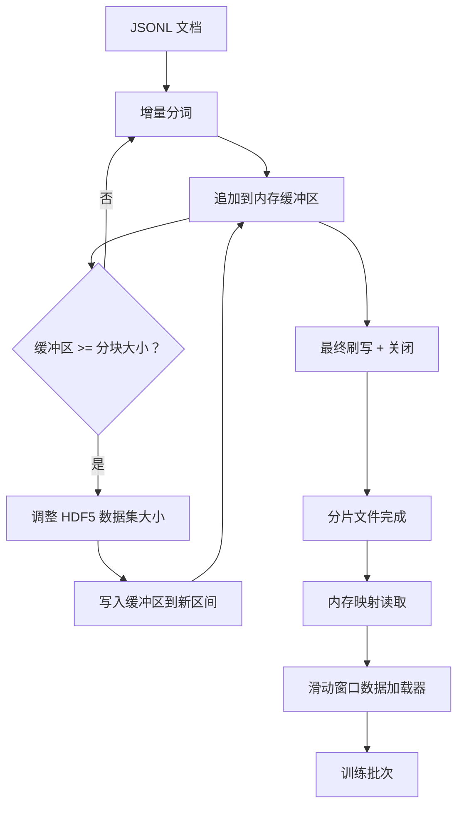

# HDF5 分词语料库

> 下载的语料库必须以训练器能以线速流式读取的格式存储。磁盘上的 JSONL 无法承受 16 个数据加载器（dataloader）工作线程的负载。而带有可调整大小、分块的整数数据集的 HDF5 可以。本课程构建了流式分词写入一个可调整大小的 HDF5 数据集，支持跨多个文件的分片写入，训练时的内存映射读取，以及产生固定长度序列且具有正确打包方式的滑动窗口数据加载器。

**类型：** 构建  
**语言：** Python  
**先决条件：** 第19阶段课程 30-37课  
**时间：** 约90分钟

## 学习目标

- 将文档流式写入可调整大小、带确定性分块的 HDF5 整数数据集。
- 跨多个 HDF5 文件分片写入，使失败影响可控且支持并行。
- 通过 HDF5 的页缓存驱动的分块布局读取 tokens，使数据加载器只在批处理时将数据拷贝入批次缓冲区。
- 实现一个滑动窗口数据加载器，输出具有显式打包规则的固定长度训练序列。

## 问题描述

现代的语言模型训练运行时，多个工作线程每秒读取成百上千个样本的 token。磁盘上的 JSONL 文件在第一次冷缓存页面错误时就会崩溃：JSON 解析器慢，文档边界无法定位，定位到“样本第4,217,884号”需要扫描整个文件。即使压缩效果良好的 Parquet 也不适合，因为训练器不需要列式数据，而是一个线性 token 流且需要 O(1) 随机访问。

HDF5 适合该需求，因为它支持分块、可调整大小且仅含整数的数据集，且读取时分块对页缓存友好。训练器请求 `tokens[3200000 : 3208192]` 这段切片时，HDF5 会将请求的超片（hyperslab）从页缓存复制到新分配的 NumPy 数组中。每个工作线程只需维护一个打开的文件句柄和一个分块大小的页缓存，这相比解码 JSONL 的代价可以忽略不计。

构建上的难点是保证写入端的正确性。可调整大小的数据集易被误用：逐条写入文档会导致 HDF5 文件严重碎片化，难以使用；一次性写入全部文档则一旦进程崩溃，整个分片数据都丢失。正确做法是先缓冲然后扩展，缓冲大小与分块大小匹配，并采用分片写入，将工作负载分散到不同文件，这样崩溃最多损失一个分片。

## 概念



### 正确的可调整大小 HDF5

token 数据集创建时设置为 `maxshape=(None,)` 和固定的 `chunks=(chunk_size,)`。写入时，先缓存在长为 `chunk_size` 的 NumPy 数组中。当缓冲区满时，将数据集大小增加一个 `chunk_size`，并将缓冲区写入新扩展的区间。分片末尾的残余缓冲区写入最后一个部分区间。每次写入均是连续且块对齐的，除了最后一次，读取端会根据分片 HDF5 属性中记录的 `token_count` 截断数据。

### 分片写入

单个 HDF5 文件是单点故障。流程并行写入分片：第19阶段第42课的每个输入分片产生一个 HDF5 输出分片。`shards.json` 索引记录每个分片的文件路径、token 数量、文档数和 token 的 sha256。训练器读取 `shards.json` 来计算全局偏移并验证语料库。

### 内存映射读取

训练时每个工作线程以 `swmr=True` 模式打开其对应的 HDF5 文件，按需读取 `tokens[start:stop]`。HDF5 的分块布局使该操作变为基于页缓存的读取，只要分块已被加载。工作线程不会加载整个文件：切片被复制到数据加载器的批次缓冲区，数据加载器随后在批处理时复制到固定内存（pinned memory）的训练张量。热路径上每个分块转换有一次系统调用，其余均为内存访问。

### 滑动窗口数据加载器

数据加载器是唯一知道训练序列长度的阶段。它在全局 token 流中随机选取一个起始索引，读取 `window_size + 1` 个 token，返回 `(input, target) = (tokens[:-1], tokens[1:])`。不强制文档边界：一个窗口可能跨两个文档，中间有显式的 `boundary_token_id`，模型学习用该分隔符。此为标准打包规律，然而初学者常忘记此点，导致最终语料库中 8% 是训练边界 token，92% 是自然文本。

## 构建它

`code/main.py` 实现了：

- `Tokenizer` —— 基于字节的确定性分词器，足够演示使用。接口为 `encode(text) -> list[int]` 和 `vocab_size`。
- `HDF5ShardWriter` —— 打开可调整大小的整数数据集，将 tokens 缓冲到分块大小，调整大小并固定步长写入，关闭时记录 `token_count` 和 `sha256` 到 HDF5 属性。
- `ShardedTokenizationPipeline` —— 遍历输入文档，路由到写入器，生成 `shards.json` 索引。
- `MmapTokenStore` —— 打开分片文件进行内存映射读取，计算全局偏移，暴露单一 `get_slice(start, stop)` API。
- `SlidingWindowDataloader` —— 从全局流中选取随机窗口，产出 `(input_ids, target_ids)` NumPy 数组。

文件底部有一个演示，构建一个小型内存语料库，分词成两个分片，通过内存映射打开，运行数据加载器 10 个批次，并打印每批大小和校验和。

运行它：

```bash
python3 code/main.py
```

脚本零退出，并打印批次校验和。

## 生产模式

四种技术模式将本课内容扩展到真实训练流程：

**分块大小等于典型读取大小。** 训练器每个样本读取 `window_size + 1` 个 token。HDF5 分块设置为 `window_size` 的倍数，读取时页缓存对齐。分块不匹配会使吞吐量降低一半，因为每个样本会跨越两个分块。

**token 计数作为属性存储，不在数据集中。** 数据集尾部切片可能部分填充，因为分块大小不整除文档边界。将真实的 `token_count` 存入数据集的 HDF5 属性，并让读取端在该位置截断。否则读取端会超出边界读取零填充 token，模型学会预测零。

**分片 sha256 与并行验证。** 每个分片有其 token 字节的 sha256。训练器可训练前并行校验所有分片，sha256 不符则提前失败，而非训练第三个 epoch 后的第十六小时失败。

**双方均开启 `swmr=True`，写入端设 `libver="latest"`。** 单写多读模式要求写入端以 `libver="latest"` 打开，预先创建所有数据集，然后启用 `file.swmr_mode = True`。此后写入端每次调整大小后必须调用 `dataset.flush()`，使开启 `swmr=True` 的工作线程看到一致数据。跳过 `libver="latest"` 或结构变动后才启用 SWMR 是导致“文件被锁定”错误的常见原因。

## 使用它

生产实践：

- **每个源分片对应一个 HDF5 文件。** 下载器（第42课）对每个 URL 输出一个分片，分词（本课）对每个源分片输出一个 HDF5 文件。1:1 映射使续跑和部分失败恢复变得简单。
- **边界 token id。** 边界 token 位于分词器词汇表中，是数据加载器唯一注入的 token。若模型应忽略边界 token，训练损失会屏蔽它；否则模型学习将其作为序列分隔符使用。
- **`shards.json` 作为真相源。** 新增分片时，需写入 HDF5，计算其 sha256，并追加索引条目。训练器启动时读取一次该文件，之后不再触及目录列表。

## 交付它

`outputs/skill-hdf5-tokenized-corpus.md` 在真实项目中会描述使用的分词器、匹配训练窗口大小的分块大小、`shards.json` 在版本控制中的位置，以及数据加载器工作线程如何跨文件分片。本课程交付引擎部分。

## 练习

1. 向 HDF5 写入器添加 `--compression gzip` 参数，测量演示语料库的吞吐率开销。辩护为何选择该默认。
2. 向滑动窗口数据加载器添加确定性种子，验证两次相同种子运行批次完全一致。
3. 添加 `--validate` 模式，读取每个分片，重新计算 token 的 sha256，与 `shards.json` 比对。CI 应在训练前运行此验证。
4. 比较分块大小等于、为窗口大小一半及两倍时的数据加载器吞吐率。报告页缓存效应。
5. 添加 `--max-document-tokens` 参数，在写入时截断超长文档。辩护此方案相较于读取时截断的权衡。

## 关键词

| 术语 | 常见说法 | 实际含义 |
|------|----------|---------|
| 可调整大小数据集 | “追加式” | 一个 HDF5 数据集，设置 `maxshape=(None,)`，通过分块大小步长的 `resize` 调整尺寸 |
| 分块布局 | “HDF5 的存储方式” | 固定大小的磁盘页，内核可对页执行内存映射，数据加载器可连续读取 |
| `swmr` 模式 | “写时可读” | 单写多读模式，允许数据加载器安全共享文件 |
| 分片索引 | “shards.json” | 所有 token 分片的持久索引，含偏移和内容哈希 |
| 滑动窗口 | “训练样本” | 全局 token 流中固定长度的切片，训练器配对其向后偏移的目标序列 |

## 深入阅读

- [HDF5 分块文档](https://docs.hdfgroup.org/hdf5/v1_14/) - 本课程所用分块、可调整大小数据集布局解析  
- [h5py 用户指南](https://docs.h5py.org/en/stable/) - HDF5 的 Python 绑定  
- [NumPy 内存映射](https://numpy.org/doc/stable/reference/generated/numpy.memmap.html) - HDF5 通过 h5py 提供的读端原语  
- 第19阶段 · 42课 - 本课分词的数据下载器产出  
- 第19阶段 · 44课 - 消耗本数据加载器的余弦调度器  
- 第19阶段 · 45课 - 包装训练步骤的 AMP 循环
