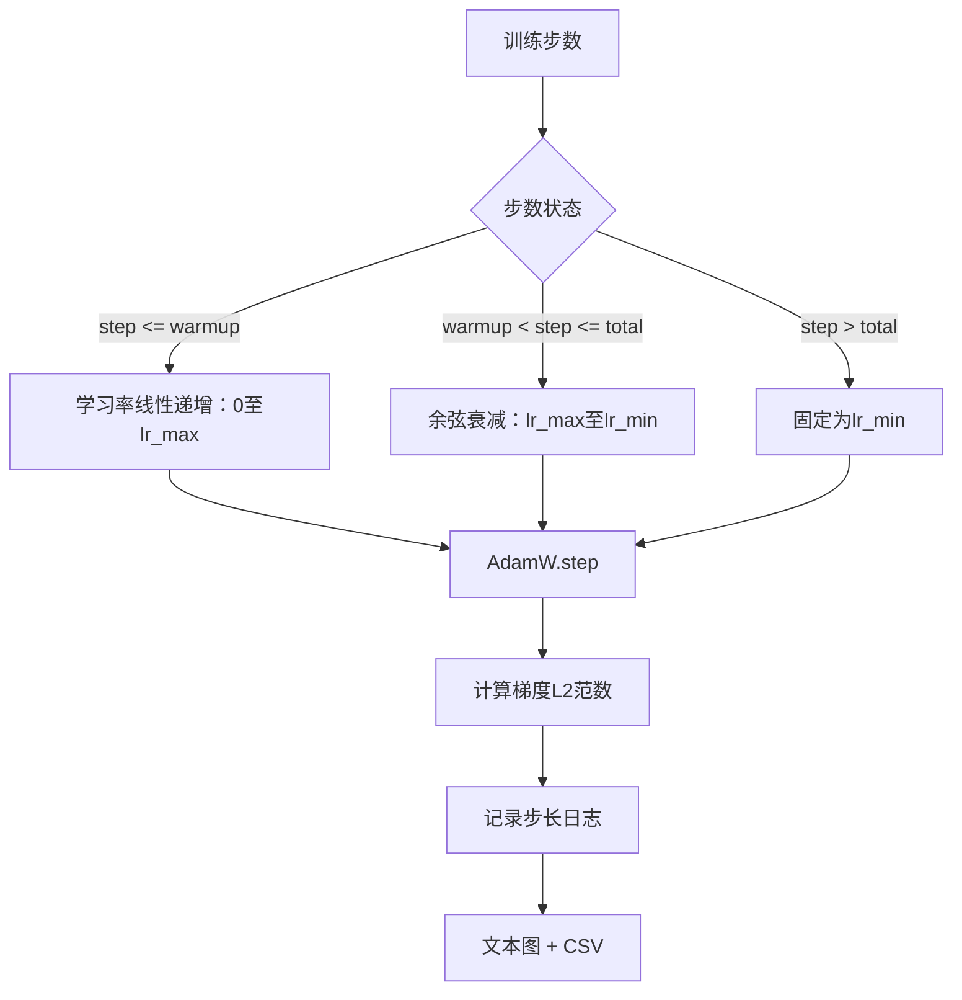

# Cosine LR with Linear Warmup（带线性预热的余弦学习率）

> 学习率调度是仅次于损失函数的第二重要决策。AdamW 配合余弦衰减和线性预热是语言模型训练的现代默认方案，因为它让模型在初始几千次更新中以较小的有效步长训练，逐步提升到设定的峰值，并平滑地衰减回零。本课将构建该调度，绘制训练步长上的曲线，记录梯度范数与调度对比，并验证调度是否遵守预热、峰值和衰减边界。

**类型：** 构建  
**语言：** Python  
**先决条件：** 第19阶段第30-37课  
**时间：** ~90分钟

## 学习目标

- 实现一个与余弦学习率调度及线性预热相连的 AdamW 优化器。
- 计算任意步长上调度的精确值，避免跨次运行的浮点漂移。
- 记录梯度 L2 范数与学习率并列，以便观察训练健康状态。
- 以人眼可读的文本图和任意工具可消费的 CSV 格式渲染调度。

## 问题描述

前一千个训练更新是最关键的。模型权重依旧接近初始化，优化器的二阶矩估计还未稳定，梯度范数大且噪声多。如果这时学习率在峰值，模型要么直接发散，要么进入无法摆脱的损失平台期。两种常见解决方案是梯度裁剪（第19阶段45课主题）和从很小的初始学习率开始逐步上升的学习率调度。

带预热的余弦调度有三个区域。从第0步到 `warmup_steps` 步时，学习率从0线性递增到配置的峰值 `lr_max`。从 `warmup_steps` 到 `total_steps`，学习率沿余弦曲线的上半部分衰减，从 `lr_max` 到 `lr_min`。超过 `total_steps` 后，学习率固定为 `lr_min`，避免训练器配置错误导致调度静默失效。

构建难点在于调度函数易出现“偏移一（off-by-one）”错误。此错误通常在训练6小时后显现，表现为过拟合开始时学习率高或低约1%，这种错误在不全面测试边界时无法察觉。

## 概念说明



### 预热计算公式

当 `step` 在 `[0, warmup_steps]` 且 `warmup_steps > 0` 时，学习率是 `lr_max * step / warmup_steps`。退化情况 `warmup_steps = 0` 表示“无预热”，则调度从第0步直接开始于 `lr_max`，并立即进入余弦衰减。一些测试环境会传入 `warmup_steps = 0` 以验证调度仍生成可用曲线。

### 余弦计算公式

当 `step` 在 `(warmup_steps, total_steps]`，学习率为：

```text
lr_min + 0.5 * (lr_max - lr_min) * (1 + cos(pi * progress))
```

其中 `progress = (step - warmup_steps) / max(1, total_steps - warmup_steps)`。  
在 `step = warmup_steps`，余弦值是 `cos(0) = 1`，对应 `lr_max`，正好匹配预热终点。  
在 `step = total_steps`，余弦值是 `cos(pi) = -1`，对应 `lr_min`，正好匹配衰减终点。

两端的连续性不是偶然。它是调度作为单一函数实现的原因，而不是将三个函数粘合在一起。粘合型调度一旦改变 `lr_max`，第一边界就会丢失。

### 超过总步数的处理

当 `step > total_steps`，学习率固定为 `lr_min`。这是明确的约定：调度不报错、不外推，只钉在下限，让训练器输出警告。需要延长训练的训练器应修改调度的 `total_steps`，而不是更改训练循环。

### 与学习率同步的梯度范数日志

调度是训练健康的半边，梯度范数是另一半。训练循环每步记录两者。发散训练会在损失升高之前表现为梯度范数暴增；恰当的预热下，范数与学习率线性增长；峰值过高则预热后范数持续偏高。磁盘上的数据集格式为 `step, lr, grad_l2_norm, loss`。CSV 是唯一持久化记录。

## 构建步骤

`code/main.py` 实现：

- `CosineWithWarmup` —— 一个无状态函数 `lr(step) -> float`，基于配置调度计算学习率。
- `TrainState` —— 将模型、`AdamW` 优化器和调度封装为单个步进函数。
- `TrainState.step` —— 进行一次前向、一次反向传播，记录梯度 L2 范数，并对优化器应用 `lr(step)`。
- `plot_schedule_ascii` —— 以人眼可读的文本形式渲染调度。
- `write_schedule_csv` —— 按步输出包含学习率的 CSV 行。

文件底部的示范构建了一个小型 `nn.Linear` 模型，对固定输入批次训练20步，并打印每步的学习率、梯度范数和损失。调度也以文本图形式输出，用作直观检查。

运行命令：

```bash
python3 code/main.py
```

脚本正常退出，打印每步训练日志及调度图。

## 生产环境模式

四个模式使调度成为生产级产物：

**调度配置化，不硬编码。** 训练器从 YAML 或 JSON 配置读取 `warmup_steps`、`total_steps`、`lr_max`、`lr_min`，并提交到 git。调度因内容地址确定而可复现，配置作为 PR 差异部分可审计。

**步数计数器单调递增并解耦于 epoch。** 某些框架混淆了数据拆分或重启的步数与 epoch。调度从训练器检查点读取 `global_step`，非局部变量。断点续训时，步数计数保证调度位置准确。

**训练目录内保留调度图。** 每次训练写入 `outputs/lr_schedule.png`（此课使用文本图）至训练目录。评审者可通过目录内容快速验证调度正确，无需重跑。此做法在 PR 阶段能捕捉配置错误类缺陷。

**日志行结构固定。** 依次是 `step, lr, grad_l2_norm, loss`。下游笔记本或仪表盘读取该结构，若改名列而无版本升级，会破坏所有现有仪表盘。

## 应用建议

生产模式：

- **首先针对峰值学习率做扫描。** `lr_max` 是最敏感的参数。先在小模型上调优，其最优值随模型规模变化不大，因此小模型调优能作为强先验。
- **预热步数应是总步数的比例，而非绝对值。** 例如两亿总步数训练若预热2000步，几乎立即达到峰值；而两万总步数训练同样2000步，则是10%预热阶段。配置预热为比例（典型 1-3%）使调度与训练时长同步扩展。
- **`lr_min` 非零是有意为之。** 将下限设为 `lr_max` 的10% 令优化器在训练后期仍能继续学习。`lr_min = 0` 的调度虽在曲线上看似训练完成，但模型实际未完全收敛。

## 交付说明

`outputs/skill-cosine-warmup.md` 会在真实项目中描述哪个配置承载调度，训练器某步读取全局计数器，及 `lr_max` 扫描得出部署值。本课交付的是调度引擎。

## 练习

1. 添加一个反平方根（inverse-square-root）变体，在200步玩具训练中比较两者性能。哪种曲线最终损失更低？
2. 增加 `--restart` 标志，在 `total_steps / 2` 再次预热。论证在玩具训练中预热重启是否有益或有害。
3. 为调度写单元测试，保证连续性：对 `[0, total_steps]` 中的每一步，差值 `|lr(step+1) - lr(step)|` 限制在 `lr_max / warmup_steps`。
4. 将调度接入 `torch.optim.lr_scheduler.LambdaLR`，使其可与框架调度器组合。课中使用简单步进函数，包装器会带来什么变化？
5. 添加 `--plot-png` 标记，用 `matplotlib` 写入真实图像。论证文本图和 PNG 图哪个作为 CI 默认更优。

## 关键词

| 术语             | 一般说法           | 实际含义                                      |
|------------------|--------------------|-----------------------------------------------|
| Warmup（预热）    | “缓慢启动”         | 在前 `warmup_steps` 步中，学习率从0线性递增到 `lr_max` |
| Cosine decay（余弦衰减） | “平滑下降”         | 余弦上半波，在剩余训练步中从 `lr_max` 逐步衰减到 `lr_min`  |
| Floor（下限）     | “训练后”           | 超过总步数后，学习率固定为 `lr_min`                       |
| Gradient norm（梯度范数）  | “梯度的L2范数”      | 连接梯度向量的欧几里德范数，每步记录                       |
| Global step（全局步数）    | “调度轴”           | 单调递增、能跨重启维持的步数计数器，驱动调度                |

## 相关阅读

- [Loshchilov and Hutter, SGDR: Stochastic Gradient Descent with Warm Restarts (arXiv 1608.03983)](https://arxiv.org/abs/1608.03983) - 余弦调度的参考论文
- [Loshchilov and Hutter, Decoupled Weight Decay Regularization (arXiv 1711.05101)](https://arxiv.org/abs/1711.05101) - AdamW 的参考论文
- [PyTorch torch.optim.lr_scheduler](https://docs.pytorch.org/docs/stable/optim.html#how-to-adjust-learning-rate) - 步进函数如何与框架调度器组合
- 第19阶段 · 42 - 本调度使用的下载语料
- 第19阶段 · 43 - 本调度协同演进的数据加载器
- 第19阶段 · 45 - 下游主题：梯度裁剪与 AMP
