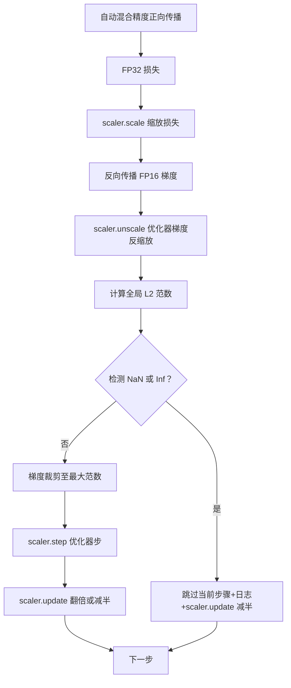

# 梯度裁剪和混合精度

> 之前课程中的优化器和调度假设梯度是合理的，实际通常并非如此。单个异常批次可能会导致梯度范数暴涨三个数量级。混合精度训练通过在损失端引入 FP16 溢出进一步放大了这一问题。本课构建生产训练不可缺少的两个安全带：将梯度裁剪至配置的全局 L2 范数，以及带有 autocast 和 GradScaler 的混合精度训练循环，该循环检测 NaN 和 Inf，干净跳过该步，并记录缩放因子以便追查。

**类型：**构建  
**语言：**Python  
**先决条件：**第19阶段课程 30-37  
**时间：**约90分钟

## 学习目标

- 计算所有参数梯度的全局 L2 范数，并在其超过配置阈值时就地裁剪。
- 使用 autocast 和 GradScaler 包裹训练步骤，使 FP16 正向和反向传播过程能承受溢出。
- 检测损失或梯度中的 NaN 和 Inf，跳过优化器步骤并记录跳过信息。
- 每步报告 GradScaler 的缩放因子，确保能即时观察到连续跳过的情况。

## 问题背景

昨天运行正常的训练，损失在第 8,217 步骤突然垂直飙升。罪魁祸首是单个批次，其梯度范数达 4,200，是之前峰值的 20 倍。若无裁剪，优化器执行的步长会抹除模型过去一小时的所有学习。若全局 L2 范数裁剪阈值设为 1.0，则该批次只贡献一个单位范数的更新，损失保持在趋势线上，训练顺利继续。

混合精度训练通过在 FP16 中计算前向传播及大部分反向传播将吞吐量提高 2-3 倍。代价是 FP16 指数范围窄。典型的溢出梯度在 FP16 中会变为 Inf，随后层传播为 NaN，导致下一步优化器将所有权重变为 NaN。PyTorch 的 GradScaler 解决方案是在反向传播前对损失乘以一个大缩放因子，优化步骤前对梯度除以该因子。若在反缩放时发现任何梯度为 Inf 或 NaN，Scaler 会跳过该步并将缩放因子减半；若前 N 步无异常，则因子翻倍。训练过程中该因子会调整至 FP16 允许的最高值。

构建的难点在于正确连接两者。如果在 unscale 之前裁剪，则阈值作用于已缩放梯度；如果在 unscale 之后裁剪，则操作顺序对 GradScaler 至关重要。正确顺序是：`scaler.scale(loss).backward()`，随后 `scaler.unscale_(optimizer)`，再 `clip_grad_norm_`，紧接着 `scaler.step(optimizer)`，最后 `scaler.update()`。其它顺序会导致静默失败。

## 概念示意



### 全局 L2 范数

全局 L2 范数是所有参数梯度向量拼接后的欧几里得范数，而非逐参数范数。PyTorch 提供函数 `torch.nn.utils.clip_grad_norm_(parameters, max_norm)` 来实现，其返回裁剪前的范数，方便本课日志记录自然范数和裁剪后范数，这对“每步都在裁剪”问题诊断必不可少。

### autocast 和 GradScaler

`torch.amp.autocast(device_type)` 是上下文管理器，选择性地将兼容操作（主要是矩阵乘法类操作）使用 FP16 运行。`torch.amp.GradScaler(device_type)` 是辅助工具，在反向传播前对损失缩放，优化器步骤前对梯度反缩放。两者配合设计，单用其中一者即为配置错误，测试应捕获。

本课使用 CPU autocast 版本以便 CI 运行；通过将 `device_type="cpu"` 替换为 `device_type="cuda"`，该方法可无修改迁移至 CUDA。CPU 上的 GradScaler 是空壳（CPU autocast 默认使用 BF16，不需损失缩放），但本课保留调用点，使调用结构与 GPU 循环一致。

### NaN 和 Inf 检测

检测发生在两个阶段。首先，反向传播前用 `torch.isfinite` 检测损失本身；若损失为 Inf 或 NaN，跳过当前步且不进入优化器。其次，在执行 `scaler.unscale_(optimizer)` 后，用 `has_non_finite_grad(...)` 扫描未缩放的梯度，若发现 Inf 或 NaN，同样跳过该步。两者合力涵盖前向和反向传播失败模式。

### 缩放因子诊断

缩放因子是 GradScaler 内部状态。每步训练读取 `scaler.get_scale()` 并将其与学习率、梯度范数一同日志记录。正常训练中，缩放因子会以 2 的幂次方递增，至 `2^{17}` 或 `2^{18}` 左右饱和。异常训练中，因子会在高低值间震荡，表明模型梯度时而在 FP16 范围内时而溢出。无日志记录无法实现该诊断。

## 实现要点

`code/main.py` 实现：

- `clip_global_l2_norm`：对 `torch.nn.utils.clip_grad_norm_` 的包装，返回裁剪前后范数。
- `has_non_finite_grad`：辅助函数，扫描梯度中是否存在 NaN 或 Inf。
- `AmpTrainState`：封装模型、`AdamW` 优化器、GradScaler 和 autocast 设备。公开 `step(inputs, targets)` 运行完整裁剪、缩放和遇 NaN 跳过的流程。
- `StepLog` 与 `SkipLog`：结构化的逐步记录。
- 一个示例演示训练小型 `nn.Linear` 模型 20 步，第 5 步注入一个 Inf 梯度以触发跳过路径，最后打印日志。

运行方式：

```bash
python3 code/main.py
```

执行结束后返回 0，打印逐步日志，每行标有 `STEP` 或 `SKIP` 标签，至少有一行为 `SKIP`。

## 生产实践模式

四个模式将本循环升级为生产训练步骤。

**跳过计数作为告警而非仅日志。** 每个训练周期几次跳过是正常的。若每个 epoch 跳过数达数百则是严重告警：模型进入 FP16 无法覆盖的区间，循环静默失败。本课跟踪 1,000 步内滚动跳过率，生产环境中超过 5% 需报警。

**裁剪阈值配置化。** 语言模型训练中 `max_norm=1.0` 是现代默认。先在小模型上调试，阈值较大有助模型从难批次恢复，阈值较小可控制最大更新幅度，但会使损失曲线更噪。阈值应与第44课的调度配置放在同一个 YAML 或 JSON 中。

**范数日志输出 CSV，结合调度。** CSV 列含 `step, lr, grad_l2_pre_clip, grad_l2_post_clip, loss, skipped, skip_reason, scaler_scale`。审查者打开文件即可一览调度、梯度信息、缩放因子和跳过结果及原因。若分散多文件，分析易出错。

**`scaler.update()` 每步执行，即使跳过。** 正常步时，Scaler 读取无 Inf 计数器、自增计数，必要时翻倍缩放因子。跳过步时，Scaler 缩放因子减半并重置计数器。忘记执行跳过路径的 `update()` 会导致“缩放因子始终不变”问题。

## 使用建议

生产环境模式：

- **Autocast 设备需与优化器一致。** GPU 使用 `torch.amp.autocast(device_type="cuda")`，CPU 使用 `torch.amp.autocast(device_type="cpu")`。设备混用产生静默类型错误，表现在损失曲线正常但模型不收敛。
- **反向传播前损失检测。** `torch.isfinite(loss).all()` 是单次张量归约，成本极低，能有效跳过 NaN 损失导致的整个步骤。务必运行。
- **`zero_grad` 使用 `set_to_none=True`。** 将梯度设为 None 而非 0，优化器可跳过未被影响的参数组计算。该设置既提升吞吐量又减少潜在错误。

## 交付方案

`outputs/skill-clip-amp.md` 应在真实项目中描述训练步骤使用的裁剪阈值、autocast 设备，版本控制中逐步 CSV 存放位置，以及生产跳过率告警阈值。本课完成了引擎部分。

## 练习题

1. 用真实损失爆炸替换合成 Inf 注入（将某批次目标乘以 1e8），验证跳过路径生效。  
2. 增加 `--bf16` 模式，将 autocast 切换为 BF16。BF16 指数范围较宽，极少需要损失缩放；验证示例中跳过率降至零。  
3. 增加单元测试，验证梯度裁剪包装器在未裁剪时返回的前裁剪和后裁剪范数正确。  
4. 增加滑动窗口跳过率统计及 CLI 参数，当跳过率持续 100 步超过阈值时使运行失败。  
5. 将循环输出标准 CSV (`step, lr, grad_l2_pre_clip, grad_l2_post_clip, loss, skipped, skip_reason, scaler_scale`)，并确认文件在 Ctrl-C 中断时因每行刷新而完整。

## 关键术语

| 术语 | 通常说法 | 实际含义 |
|------|----------|----------|
| Global L2 norm（全局 L2 范数） | “裁剪目标” | 所有可训练参数梯度拼接后的欧几里得范数 |
| autocast（自动混合精度） | “混合精度” | 在 `with` 块内选择性使用 FP16（或 BF16）执行符合条件的操作 |
| GradScaler（梯度缩放器） | “损失缩放器” | 训练中反向传播前缩放损失，优化步骤前反缩放梯度的辅助工具 |
| Skip（跳过） | “坏步” | 因梯度或损失为非有限值拒绝执行优化步骤，缩放因子减半 |
| Scaling factor（缩放因子） | “缩放器状态” | GradScaler 当前的缩放倍数，干净周期后翻倍，跳过时减半 |

## 拓展阅读

- [Micikevicius et al., Mixed Precision Training (arXiv 1710.03740)](https://arxiv.org/abs/1710.03740) - 最初的损失缩放论文  
- [Pascanu, Mikolov, Bengio, On the difficulty of training recurrent neural networks (arXiv 1211.5063)](https://arxiv.org/abs/1211.5063) - 梯度裁剪经典文献  
- [PyTorch torch.amp.GradScaler](https://docs.pytorch.org/docs/stable/amp.html) - 本课封装的缩放器 API  
- [PyTorch torch.nn.utils.clip_grad_norm_](https://docs.pytorch.org/docs/stable/generated/torch.nn.utils.clip_grad_norm_.html) - 本课使用的裁剪原语  
- 第19阶段 · 42 - 下载器，生成本循环语料库  
- 第19阶段 · 43 - 循环使用的数据加载器  
- 第19阶段 · 44 - 本循环组合的调度器
