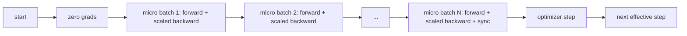
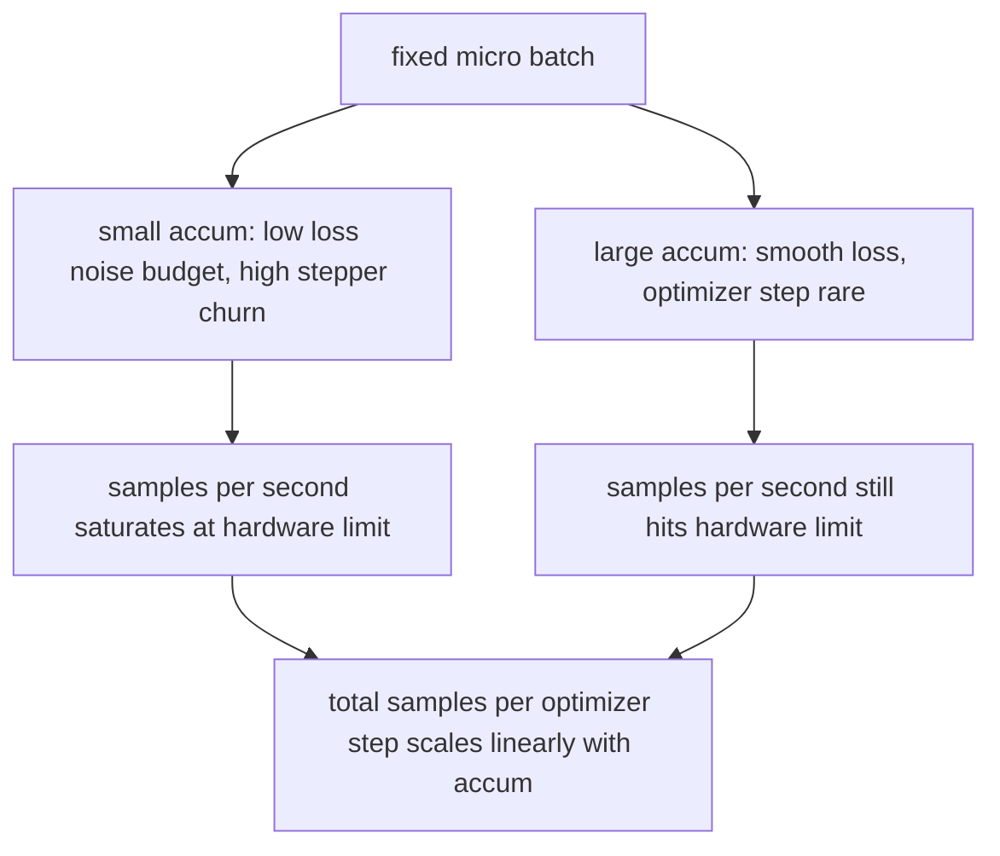

# Gradient Accumulation（梯度累积）

> 以你负担不起的有效 batch 大小，分批进行微 batch 训练。缩放损失，暂停优化器步骤，让梯度堆积起来。

**类型:** 构建  
**语言:** Python  
**先修:** 第19阶段第42到45课  
**时间:** ~90分钟

## 学习目标

- 推导有效 batch 恒等式：`effective_batch = micro_batch * accum_steps`。  
- 实现对每个微 batch 的损失缩放，使累积梯度匹配单次全 batch 反向传播。  
- 跳过除最后一个微 batch 之外的优化器同步（sync-on-last-step）。  
- 读取有效 batch 对应的吞吐量曲线并解释递减收益。  

## 问题

你想要以有效 batch 大小为512进行训练，因为损失曲线更平滑，优化器的每步更合理。然而桌面上的加速设备一次只能容纳32个样本，无法加倍 batch，也不能减半模型。2017年领域采用但一直未放弃的技巧是：执行16次反向传播，让梯度累积在参数缓存中，只有当累积次数达到目标时才执行优化器步骤。

风险在于此时的损失值不再等同于较大 batch 的损失。16个微 batch 的交叉熵直接相加，损失是单个全 batch 的16倍。若不缩放，梯度方向正确但大小错误，优化器步长将大16倍。解决方法是简单的除以一个数，但也容易忘记。

## 概念



核心规范：

- 每个微 batch 的损失在 `backward()` 前除以 `accum_steps`。PyTorch 默认将梯度累加到 `param.grad`，除法调整累积值回合适规模。  
- 优化器步骤在最后一个微 batch 的反向传播之后，仅执行一次。如果在累积中途执行优化器步长，将影响之后所有参数。  
- 优化器状态（动量缓冲、Adam矩）按有效步长推进，而非微 batch 频率。否则指数滑动平均会受到错误频率影响，导致调度失效。  
- 单设备这是基本账本操作；多卡集群下，相同模式将除最后一个微批次外的其他包裹在 `no_sync` 上下文中，跳过梯度 all-reduce；最后一个微批次再统一全量梯度聚合，避免多次通信开销。

### 代码中的等价证明

```python
loss = criterion(model(x_full), y_full)
loss.backward()
opt.step()
```

等价于

```python
for x, y in chunks(x_full, y_full, n):
    scaled = criterion(model(x), y) / n
    scaled.backward()
opt.step()
```

浮点累加顺序除外，循环结束时累积梯度缓存与单次全 batch 反向传播产生的张量相同。课程代码通过 `equivalence_check` 断言最大绝对差异小于1e-4。

### 成本去向

每个微 batch 都需一次前向和一次反向传播。累积用时间换内存。`outputs/accum-curve.json` 的吞吐量曲线展示在固定微 batch 下，随着有效 batch 增大发生的情况：



天下没有免费的午餐。`accum_steps` 翻倍意味着每个优化器步长所需的时间也翻倍。变化的是梯度估计的方差：相同时间预算下，步数减少但每步梯度是更多样本的平均。文献将大批量和小批量视为不同优化问题；这里的要点是机械运算，而非统计分析。

## 构建步骤

`code/main.py` 是可运行工件，实现以下三点。

### 第1步：等价性检查

`equivalence_check()` 创建两个完全相同的网络副本，随机种子一致。一个在一次正向传递中处理16样本batch，另一个分成4个4样本块，损失除以4。函数在优化器步长前比较梯度缓存，步长后比较参数，断言最大绝对差值 `< 1e-4`。

### 第2步：sync-on-last-step 模式

`train_one_optimizer_step` 遍历所有微批次。除最后一个微批次外，每个都进入 `no_sync_context(model)` 上下文。在单进程中无操作；在 DDP 环境中这里跳过梯度 all-reduce。账本行为相同。`sync_counter` 记录离开 `no_sync` 的次数，每 N 个微批次对应一次有效步长。

### 第3步：吞吐量曲线

`sweep_effective_batches` 用固定微 batch 测试不同累积步数列表。每种配置记录：

- `samples_per_sec`：总样本数除以耗时  
- `median_step_ms`：有效步长的中位时间耗时  
- `sync_calls`：调用的集合通信次数  
- `avg_loss`：累计优化步长的平均损失  

结果写入 `outputs/accum-curve.json`，可通过笔记本复用。

运行命令：

```bash
python3 code/main.py
```

脚本先打印等价性差异、扫表结果和JSON路径，返回码为0。

## 使用方法

实际训练中，梯度累积隐藏在一个旋钮后。PyTorch 模式为：`accumulation_steps = effective_batch // (micro_batch * world_size)`。其他框架虽不允许本课使用，核心代码依然都是缩放损失，非终止微批跳过同步，累积梯度，最后执行优化器步长。

实践中有三种典型模式：

- 微批大小选满设备内存使用率。太小浪费加速资源，太大则OOM。  
- 有效批大小来自学习率调度。大有效批需要缩放学习率和预热，称为线性缩放规则，自2017年起广泛讨论。  
- 累积次数是两者桥梁，也是唯一能在运行时调节而无需重写数据加载器的参数。

## 交付

`outputs/skill-gradient-accumulation.md` 记录了方案，方便同事快速复刻：按 `accum_steps` 缩放损失，非末尾微批跳过优化器同步，单次有效批做优化步长，记录吞吐量与有效批关系用于权衡。

## 练习

1. 使用 `--num-steps 100` 重跑扫表，绘制样本速率随有效批变化图，观察曲线趋于平坦的位置。  
2. 添加错误缩放版本（无除法），展示步骤1时参数差异。  
3. 以 AdamW 替换 SGD，确认优化器状态按有效步进更新，不是按微批。  
4. 接入真实 `DistributedDataParallel` 包装，将 `no_sync_context` 绑定到其方法，确认 `sync_calls` 每有效步减少 N-1 次。  
5. 修改等价性检查比较不同微批切分（2×8 vs 4×4），说明需要放宽的容差。

## 关键词

| 词汇 | 常见表达 | 实际含义 |
|------|---------|----------|
| Micro batch（微批） | 你做前向的批量 | 适合一次前向传递的内存切片 |
| Accum steps（累积步） | 每步反向次数 | 一次优化器步长前累计的反向传播次数 |
| Effective batch（有效批） | 实际批量大小 | 微批 × 累积步 × 数据并行世界大小 |
| Loss scaling（损失缩放） | 除以N | 每微批损失除以累积步，使梯度和全批一致 |
| Sync on last（仅末尾同步） | 跳过其余同步 | 仅在窗口最后一次反向传播时执行梯度汇总 |

## 拓展阅读

- PyTorch 文档中 `DistributedDataParallel.no_sync`，是生产环境中 sync-on-last-step 技巧的正式实现。  
- Goyal 等，2017 年论述大批量线性缩放训练，是关注有效批的经典理由。  
- PyTorch 议题追踪中涉及梯度累积与混合精度反缩放的交互。  
- 第19阶段第42至45课涵盖了本课假定的模型、数据加载器、优化器和训练器框架。  
- 第19阶段第47课讲解 checkpoint 和恢复，使长时间累积训练能突破时钟限制。
