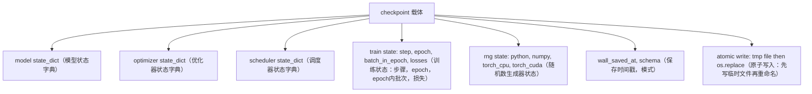
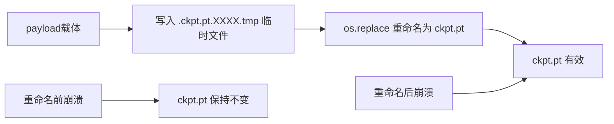
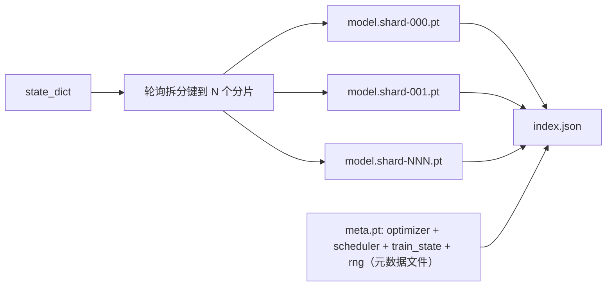

# Checkpoint 保存与恢复

> 训练中断会导致运行终止；检查点（checkpoint）让训练可以继续。原子性地保存模型、优化器、调度器、损失历史、步骤计数器和随机数生成器（RNG）状态，这样无论何时中断，磁盘上都会留下一个有效文件。

**类型：** 构建  
**语言：** Python  
**先决条件：** 第19阶段第42到45课  
**时间：** 约90分钟

## 学习目标

- 将完整的训练状态捕获到一个可以在全新进程中重新加载的载体中。
- 实现原子保存，即先写入临时文件然后重命名，这样崩溃永远不会留下半写入的文件。
- 恢复 Python、NumPy 和 PyTorch 的 RNG 状态，使恢复后损失与不中断的基线匹配。
- 为无法放入单个文件的大模型构建分片检查点布局，带有哈希验证的分片和 JSON 索引。

## 问题描述

你设置了一个18小时的训练作业，但墙钟时间上限是4小时。集群在第11小时重启，因为有人批准了内核升级。如果没有检查点，你只能重新开始。没有恢复机制，你还会丢失花费前11小时学习到的优化器状态，即使模型权重保存下来了，AdamW 的动量（moments）也没了，下一步朝着训练轨迹早已走过的方向蹒跚前进。

正确的产物是一个包含继续训练所需全部信息的单一文件：模型参数、优化器状态、调度器状态、用于绘图的损失历史、当前步骤数、epoch 和 epoch 内批次计数器，以及所有随机源的 RNG 状态。没有 RNG 状态，恢复后的损失曲线就会是不同的曲线。同样的模型、同样的数据，但 shuffle 变了，dropout 掩码变了，仪表盘上的数值也变了。

原子保存是另一半契约。直接写入最终文件名意味着崩溃时会留下损坏文件，恢复时读到的是垃圾。写入同目录下的临时文件然后重命名意味着崩溃时旧文件保持不变。POSIX 文件系统上的重命名是原子的。

## 概念图



### 五个状态桶（Bucket）

| 桶名 | 重要原因 |
|--------|------------|
| Model（模型） | 权重和缓冲区；模型本身所代表的状态。 |
| Optimizer（优化器） | 动量和自适应时刻；没有它们下一步就是不同的问题。 |
| Scheduler（调度器） | 学习率曲线上的当前点；尤其是余弦调度器。 |
| Train counters（训练计数器） | 步骤数、epoch、epoch内批次，以及绘制仪表盘的损失历史。 |
| RNG state（随机数生成器状态） | dropout、数据shuffle以及模型内部采样的确定性控制。 |

### 原子保存流程



两条规则。首先，临时文件必须和目标文件在同一目录下，确保重命名在同一文件系统中进行，跨设备重命名不是原子的。其次，临时文件名必须每次唯一，避免多个写入进程覆盖。

### 分片检查点

当模型变大时，单文件负载太大，加载慢，检查困难，网络共享读取中断则极其痛苦。解决方案是将参数状态分片，写一个小索引用来关联它们。



索引记录分片数量、每个分片的 sha256 和元数据文件的 sha256。加载器会在哈希不匹配时迅速失败。分片可以位于不同物理磁盘，元数据文件较小并先读取。

### 续训时定位到 epoch 中间

续训直接跳到下一 epoch 开头会浪费几分钟到一天不等的时间。解决办法是 `(epoch, batch_in_epoch)` 再加 RNG 状态。载入后训练循环会让随机数发生器快进，跳过该 epoch 里已经消耗的批次，从 `batch_in_epoch` 继续。课程代码完全如此断言：续训后的损失轨迹与不中断基线的误差小于 1e-4。

## 构建步骤

`code/main.py` 提供四个基本操作和一个演示驱动。

### 第1步：捕获和恢复 RNG 状态

`capture_rng_state` 返回字典，包括 Python 的 `random.getstate`，NumPy 的 `np.random.get_state`，及 PyTorch CPU 和 CUDA 的 RNG 字节。`restore_rng_state` 还原之。CPU 张量是一个 uint8 字节缓冲区，PyTorch RNG 会识别它。

### 第2步：原子保存

`atomic_save` 将载体写入目标目录下的临时文件，再调用 `os.replace` 替换为最终文件。`atomic_write_json` 对分片索引也执行同样操作。

### 第3步：完整的检查点读写

`save_checkpoint` 将模型、优化器、调度器、训练状态和 RNG 打包到一个字典。`load_checkpoint` 读取并返回 `TrainState`。`schema` 字段作为升级钩子：未来格式升级时增加版本字符串，加载器据此派发处理。

### 第4步：分片变体

`save_sharded_checkpoint` 使用轮询方法将参数键分配到 N 个分片，逐个分片执行原子保存，写入一个包含优化器、调度器和训练状态的元数据文件，再写入包含分片 sha256 的 JSON 索引。`load_sharded_checkpoint` 在合并前验证所有分片哈希。

### 第5步：续训演示

`run_resume_demo` 训练一个小模型 `total_steps` 步，在 `interrupt_at` 保存检查点后继续。第二个进程装载检查点，执行剩余步骤。函数返回中断点后两个损失轨迹的最大绝对差值。恢复 RNG 后差值为零或仅浮点误差。

运行命令：

```bash
python3 code/main.py
```

单文件和分片演示都断言最大差值低于 1e-4。结果保存在 `outputs/resume-demo.json`。

## 使用指南

生产级训练框架会将检查点功能作为训练器的一部分。结构相同：模型 + 优化器 + 调度器 + 计数器 + RNG，原子写入，按步骤命名，方便找出最新。分片布局支持大模型并行加载；`index.json` 是实现这一功能的关键。

必须遵守三条规范：

- **schema 是载体中的字符串。** 基于它做迁移判断。无此字段就无法演进格式而不破坏旧任务。
- **对每个分片做 sha256。** 不完整的下载是最糟糕的错误，加载器必须快速失败。
- **保持检查点保存的节奏。** 每隔 N 步或者每隔几个墙钟分钟保存一次，以较短者为准。否则崩溃时长时间步长导致的工作浪费严重。

## 上线操作

`outputs/skill-checkpoint-save-resume.md` 是任何新训练脚本的指南：载体形态、原子写入、RNG 捕获、分片索引。将该技能放入仓库，在定期保存点挂载 `save_checkpoint`，在启动时挂载 `load_checkpoint`，即可让训练任务抗中断。

## 练习题

1. 用按参数组分片替换轮询分片（例如区分以 `.weight` 和 `.bias` 结尾的层）。何时使用哪种布局更合适？
2. 扩展保存循环，保留最近 K 个检查点，删除旧的。磁盘空间小的时候，K 应该选多大？
3. 增加 `--ckpt-every-seconds` 参数，支持基于墙钟时长而非仅步数的保存触发。
4. 添加校验和验证路径，启动时扫描目录下所有检查点，报告损坏文件。
5. 实现 `migrate_v1_to_v2` 函数，添加新字段并更新 schema 字符串，使加载兼容两个版本。

## 关键词汇

| 术语 | 常见说法 | 实际含义 |
|------|-----------|-----------|
| Atomic save（原子保存） | “写了就祈祷没崩” | 先写临时文件，再用 `os.replace` 原子替换目标文件 |
| State dict（状态字典） | “权重” | 模型参数和缓冲区，以参数名为键 |
| Sharded checkpoint（分片检查点） | “巨大的模型文件” | 多个文件，每个分片一个，外加元数据文件和带 sha256 的 JSON 索引 |
| RNG state（随机数生成器状态） | “随机种子” | 捕获的 python random、numpy、torch CPU 和 CUDA 状态，不只是种子 |
| Mid-epoch resume（epoch 中恢复） | “重启训练” | 快进 RNG，继续当前 epoch 中剩余批次 |

## 拓展阅读

- POSIX `rename` 语义，说明 `os.replace` 的原子性。
- PyTorch `torch.save` 和 `torch.load` 文档，包括跨设备恢复的 `map_location`。
- 第19阶段第46课覆盖了本课检查点载体能跨越的梯度累积。
- 第19阶段第48课包含了分布式包装器的状态字典格式，该方案兼容其状态。
- Linux 内核 `fsync` 文档，解释原子重命名背后的持久性保证。
