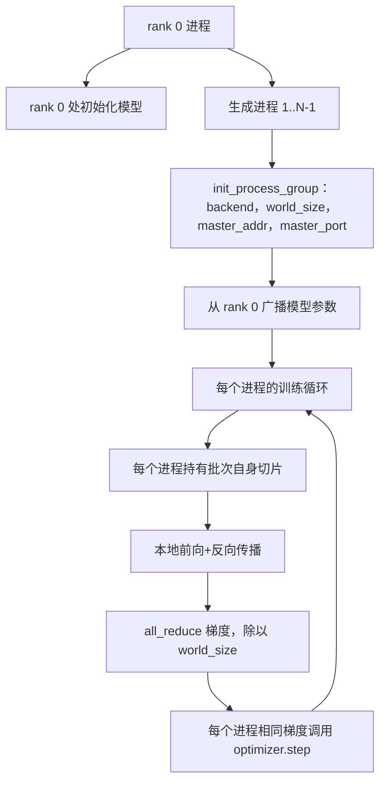
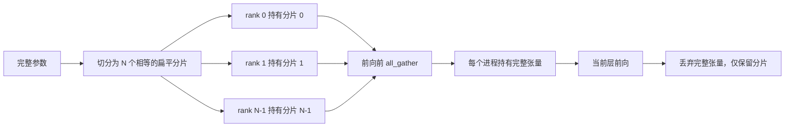

# 从零实现分布式数据并行（Distributed Data Parallel）和全参数分片并行（FSDP）

> 多进程训练涉及两个通信操作和一条规则。启动时广播参数，反向传播后平均梯度，永远确保各进程对当前训练步数达成一致。

**类型：** 实践构建  
**语言：** Python  
**先决条件：** 第19阶段第42到45课  
**时长：** ~90分钟

## 学习目标

- 使用 `gloo` 后端，跨 N 个进程组建无特殊硬件依赖的通信组。
- 实现一个简洁的 DDP 封装，构造时广播参数，反向传播后 all-reduce 梯度。
- 验证每进程梯度 all-reduce 结果与单进程对拼接输入计算的梯度一致。
- 概述 FSDP 参数分片：每个进程存储参数的一个切片，前向过程中聚合完整张量，随后释放。

## 问题描述

模型能放入单个设备，但数据集不能。优化预算要求每秒内看到 N 倍的数据样本。第一个杠杆是数据并行：每个进程在批次不同切片上训练相同模型，再在优化器步前平均梯度。第二个杠杆是 FSDP：模型也放不下单个设备，故每个进程仅持有每个参数的一个分片，并在前向传递时逐层重建完整张量。

难点在于账务管理。如果参数在进程间漂移，训练结果无声损坏；只平均梯度不平均损失，监控面板数据错误；通信后端不同意拓扑方式，运行无限停滞。解决方法是手写通信操作代码，且不信任无法重现的封装。

本课在 CPU 上运行，无假设 CUDA。`gloo` 后端随每个 PyTorch 版本提供，支持 `torch.multiprocessing` 进程；同一代码在多 GPU 节点上自动切换到 `nccl`，结构不变。

## 概念示意



### 两个关键通信操作

| 操作       | 功能                         | 触发时机                       |
|------------|------------------------------|-------------------------------|
| `broadcast` | 从一进程向所有进程复制张量    | 参数初始化，调度器状态，同步任务 |
| `all_reduce` | 对所有进程的张量求和（或平均、最大） | 反向传播后梯度平均             |
| `all_gather` | 各进程分别贡献张量，所有进程获得拼接结果 | Logits 收集，FSDP 参数重组     |

DDP 协议是在构造时 `broadcast`，反向传播后 `all_reduce`。FSDP 会在每层前向前增加 `all_gather`。

### 梯度平均等价于单进程梯度

在 N 个进程上用 B 个样本训练的模型，其平均梯度应与单进程 N*B 样本训练所得梯度相同。诀窍是对每个进程梯度求和再除以 N，等于整个批次的平均损失梯度，这和带 `mean` 归约的交叉熵损失产生的梯度相同。代码中断言该梯度最大绝对差小于 1e-3。

### FSDP 结构示意



内存优势是准确的：每个进程的参数内存降至1/N。代价是每次前向需要聚合张量。产品级 FSDP 会将聚合与上一层计算重叠，实际墙钟时间远小于简单估计。示例对每个参数执行往返，断言重建后的张量与原始二进制完全一致。

### CPU 与 gloo 后端

CUDA 是目标环境，但相同代码路径也在 CPU。`gloo` 是 CPU 的通信后端，尽管速度比 GPU 上的 `nccl` 慢数个量级，API 完全相同。示例中进程组使用 `backend="gloo"` 初始化，进程通过 `torch.multiprocessing` 启动而非 `torchrun`，两者最终调用相同的 `torch.distributed` 接口。在多 GPU 节点，只需改后端为 `nccl`，并使用设备张量及 `torchrun` 启动。

## 构建步骤

`code/main.py` 是可执行脚本。

### 步骤1：初始化进程组

```python
os.environ["MASTER_ADDR"] = "127.0.0.1"
os.environ["MASTER_PORT"] = str(port)
dist.init_process_group(backend="gloo", rank=rank, world_size=world_size)
```

`MASTER_ADDR` 和 `MASTER_PORT` 是会合地址：所有进程连接同一地址及端口。示例用绑定再关闭端口的技巧选取空闲端口，避免多次运行同主机时冲突。

### 步骤2：构造时广播

`MinimalDDP.__init__` 遍历参数和缓冲区，调用 `dist.broadcast(tensor, src=0)`。0号进程值作为参数的唯一“正本”。无该步骤，每进程用自身随机种子初始化，参数从第一步就开始漂移。

### 步骤3：反向传播后 all-reduce 梯度

```python
def all_reduce_grads_(module, world_size):
    for p in module.parameters():
        if p.grad is None:
            p.grad = torch.zeros_like(p.data)
        dist.all_reduce(p.grad.data, op=dist.ReduceOp.SUM)
        p.grad.data.div_(world_size)
```

每个进程最后都获得相同的平均梯度。优化器步是对同一输入执行，保证参数全程同步。

### 步骤4：证明等价性

`manual_all_reduce_matches_single_process` 在0号进程创建相同模型，比较手动 all-reduce 后梯度与单进程对拼接输入的梯度，最大绝对差约 1e-8。

### 步骤5：FSDP 往返

`fsdp_round_trip_sketch` 展平参数，填充到 `world_size` 的整倍数，切片，all_gather，去填充。每个进程重建的张量与原始一致。这是反分片步骤；向前传完成后，重分片即切片全连接张量中对应的分片。

执行：

```bash
python3 code/main.py
```

默认进程数为 2。两个 CPU 进程启动，使用 `gloo` 互通信，退出码为 0。输出 `outputs/ddp-demo.json` 跟踪每个进程的参数和、all-reduce 后梯度范数、FSDP 往返检查结果以及手动与参考梯度差异。

## 使用方法

产品训练框架调用同样的通信原语。PyTorch 的 `DistributedDataParallel` 增加了：后向后梯度钩子并行 all-reduce，bucketed all-reduce 聚合多个小梯度，及第19阶段第46课中的 `no_sync` 上下文。

PyTorch 的 FSDP 增加了：每层的扁平参数视图，使每进程持连续缓冲区，下一层反分片与当前层计算重叠，及可选的分片 CPU 卸载。

总体流程不变：启动时广播，反向后 reduce，参数超过单设备容量时分片。

## 部署方案

`outputs/skill-distributed-fsdp-ddp.md` 记录了新训练脚本的步骤：使用 CPU 时 `gloo`，GPU 时 `nccl` 启动进程组，模型包裹 DDP 外壳构造时广播，反向后归约，可选使用 FSDP 全参数分片 + all_gather 模式。

## 练习

1. 使用 `--world-size 4` 运行，确认参数差异保持在 1e-3 以内。
2. 用 `dist.all_reduce(op=dist.ReduceOp.AVG)` 替代手动平均，对比时间差。
3. 在 DDP 包裹层添加后向钩子，实现 all-reduce 与剩余反向传播重叠，测量墙钟时间改进。
4. 实现 FSDP 的重分片步骤：前向结束后用本地分片替换完整张量，确认内存降低。
5. 在 CUDA 环境切换后端至 `nccl`，记录改变与未变的环境变量。

## 术语表

| 术语       | 通俗说法       | 实际含义                                   |
|------------|---------------|--------------------------------------------|
| Backend    | "gloo 或 nccl" | 实现通信操作的库；gloo 是 CPU，nccl 是 GPU |
| World size | "总进程数"     | 组内进程数量；通信操作在此组执行            |
| Rank       | "工作进程编号" | 组内进程标识，0 起始编号                     |
| All-reduce | "梯度求和"     | 所有进程张量求和，每进程获得相同结果          |
| Unshard    | "聚合参数"     | 通过 all_gather 将分片重建完整张量            |

## 拓展阅读

- PyTorch `torch.distributed` 文档，详述本课依赖的通信语义。  
- `gloo` 库通信列表，与 CUDA 支持的 `nccl` 操作接口完全相同。  
- 第19阶段第46课，DDP all-reduce 中包装梯度累积的 `no_sync` 模式。  
- 第19阶段第47课，适配 DDP 和 FSDP 训练的检查点布局。  
- PyTorch FSDP 文档，生产级实现参数分片策略详解。
