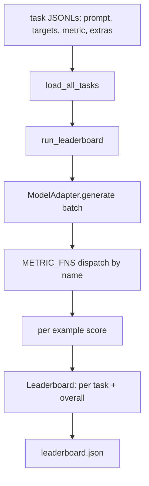
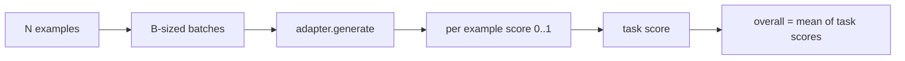

# Language Model Evaluation Harness（语言模型评估框架）

> 一个在你无法定义的任务上表现好的模型，是偶然表现好的模型。这个框架是任务定义、指标、运行器和排行榜的结合体，一个简洁且可替换的形态。

**类型:** 构建  
**语言:** Python  
**先决条件:** 阶段19，第42至45课  
**时长:** ~90分钟

## 学习目标

- 使用包含 `prompt`（提示）、`targets`（目标）、`metric`（指标）和可选 `extras`（附加信息）的 JSONL 文件定义任务。  
- 实现五个指标：exact match（完全匹配）、rouge-l F1、executable check（可执行检查）、multiple choice（多选题）、substring contains（子串包含）。  
- 构建一个运行器，对每个任务的示例进行批处理，并分派给可替换的模型适配器。  
- 输出一个排行榜 JSON，包含每个任务的分数、延迟以及可以复现的整体平均分。  

## 问题描述

每周都会有新的语言模型发布。营销宣传它表现很好。坦率地问：表现好在哪？诚实的答案是你自己写的排行榜，因为厂商的排行榜是他们调优过的。

没有框架支持，你只能凭感觉比较两个模型。有了框架，你可以在固定任务集和固定指标上按分数比较，并且可以对比 JSON 输出。框架是昨天运行和今天运行之间的合同。没有它，回退就会发布。

陷阱是将框架过度拟合到单一模型。解决方法是倒过来做：框架足够小，15分钟内能读懂；任务足够小，能随仓库发布；指标从头编写，方便同事审核；适配器是唯一有模型相关代码的地方。替换适配器，排行榜随之变动；替换任务，排行榜也变动。其他任何东西都不该变。

## 概念



### 任务规格

每个示例是一行 JSONL：

```json
{"id": "arith-00", "prompt": "compute: 2 + 2", "targets": ["4"], "metric": "exact_match"}
```

需要辅助评分的指标，`extras` 携带额外信息：

```json
{
  "id": "code-00",
  "prompt": "python: write a function f that doubles its input",
  "targets": ["ok"],
  "metric": "code_exec",
  "extras": {"io_pairs": [[1, 2], [3, 6]]}
}
```

任务是存放在 `outputs/tasks/` 目录下的 `.jsonl` 文件，文件名即任务名。文件内所有示例共用一个指标。

### 五个固定任务

| 任务            | 指标           | 测试内容                           |
|-----------------|----------------|----------------------------------|
| arithmetic      | exact_match    | 确定性答案的标记级正确性           |
| summary         | rouge_l        | 与单行参考摘要的最长公共子序列 F1  |
| code-exec       | code_exec      | 可执行测试：预测函数必须满足输入输出对 |
| multiple-choice | multiple_choice| 预测的首字母必须匹配允许的字母      |
| generation      | substring_contains | 自由文本必须包含至少一个目标子串    |

### 指标合同

每个指标是一个函数，签名为 `(prediction, targets, extras) -> float in [0.0, 1.0]`。框架对每个示例分数取平均得任务分，再对所有任务分数平均得整体分。指标函数都非常小巧：

- `exact_match`：小写，折叠空白，判等。  
- `substring_contains`：同样的归一化，子串测试。  
- `multiple_choice`：首字符大写匹配。  
- `rouge_l`：最长公共子序列长度除以预测和参考长度，计算精确率和召回率的 F1。  
- `code_exec`：在受限命名空间执行预测，对每个输入输出对调用 `f(x)`，计算匹配数。

`code_exec` 指标在去除内置函数的命名空间中运行预测。课程测试会断言 `import os` 会出错，因为 `os` 不在命名空间内；代码预测不能访问文件系统。

### 模型适配器

```python
class ModelAdapter(Protocol):
    def generate(self, prompts: Sequence[str]) -> List[str]: ...
    @property
    def name(self) -> str: ...
```

适配器是接口。课程源码提供了 `ToyAdapter`，一个确定性模式匹配器，能为五个固定任务中的每个提示返回正确答案。真实适配器调用模型并返回输出。框架不关心是哪一个。

### 运行器

`run_task` 按 `batch_size` 批量处理提示并调用指标函数。`run_leaderboard` 遍历所有任务并求平均。`write_leaderboard` 输出带有 schema 字符串的 JSON，以防将来格式变更导致仪表盘静默失败。



## 构建

`code/main.py` 是可运行的主程序。

### 第1步：生成固定任务

`seed_fixture_tasks(target_dir)` 编写五个 `.jsonl` 文件。首次运行 `main.py` 在目录为空时种子生成这些文件。

### 第2步：加载任务

`load_all_tasks(task_dir)` 读取每个 `.jsonl` 文件，返回任务名映射到 `Example` 记录列表的字典。以 `#` 开头的注释行和空行会被跳过，方便贡献者添加注释。

### 第3步：实现指标

每个指标是一个小函数且带有单元测试。课程测试套件包含13个用例，覆盖归一化、部分重叠、代码执行及不安全代码拒绝。

### 第4步：编写运行器

`run_task` 对批次迭代产生含分数、正确数、总数和延迟的 `TaskResult`。`run_leaderboard` 遍历所有任务产生含整体平均分的 `Leaderboard`。

### 第5步：输出 JSON

`write_leaderboard` 序列化排行榜。`--include-per-example` 标志导出每个示例记录，以便分数变动时对比预测输出。

执行：

```bash
python3 code/main.py
```

脚本首次运行时种子生成固定任务，使用玩具适配器打分（全部正确），并写入 `outputs/leaderboard.json`。玩具适配器的整体分是1.0；`test_main.py` 中的存根适配器测试表明，当适配器不能回答时，该框架得分为0.0。

## 使用

要接入真实模型，编写一个适配器。示例：

```python
class HttpAdapter:
    name = "vendor.v1"

    def __init__(self, endpoint, api_key):
        self.endpoint = endpoint
        self.api_key = api_key

    def generate(self, prompts):
        out = []
        for prompt in prompts:
            response = http_post(self.endpoint, prompt, self.api_key)
            out.append(response["text"])
        return out
```

将 `main()` 顶部的 `ToyAdapter` 替换为 `HttpAdapter`。框架、任务、指标和排行榜保持不变。

真实项目发布框架时应遵循三大规范：

- **锁定任务文件。** leaderboard.json 需要携带哈希固定的任务内容或与 JSONL 文件同目录；否则任务文件变动时分数会变，无法追踪变更原因。  
- **差异对比预测，不仅仅是分数。** `--include-per-example` 标志可查看分数下降当天模型说了什么。  
- **限制批量大小。** 真实适配器通常有速率限制，小批量保持框架与不同供应商兼容。

## 发布

`outputs/skill-lm-eval-harness.md` 包含配方：JSONL 任务规范、五个指标、可替换适配器、批处理运行器、带 schema 字符串的排行榜 JSON。`outputs/tasks/` 目录下的任务文件作为固定装置；复制走入真实项目作为起点。

## 练习

1. 添加第六个任务，编写自定义指标（如类 BLEU 重叠分、类 BLEURT 参考评分，任何有明确合同的指标）。  
2. 扩展 `code_exec`，捕获 stdout 并接受预期的 stdout 列表作为目标。  
3. 添加排行榜差异对比命令：给两个 `leaderboard.json`，打印哪个任务分数变动了以及变动幅度。  
4. 限制每个示例的延迟。在适配器调用上加超时；在排行榜中单独显示 `timeouts` 列。  
5. 用 sha256 哈希锁定任务内容，在排行榜中记录，以便未来读者验证他们打分的是相同任务。

## 关键术语

| 术语        | 常用说法          | 实际含义                                                |
|-------------|-------------------|---------------------------------------------------------|
| Task spec   | “评估格式”        | JSONL 文件，包含每个示例的 prompt、targets、metric 和可选 extras |
| Metric      | “评分方法”        | (prediction, targets, extras) -> [0,1] 范围内的函数        |
| Adapter     | “模型客户端”      | 带有 generate(prompts) -> list[str] 方法的对象；仅包含模型相关代码 |
| Leaderboard | “排行榜”          | JSON，含每个任务分数、总数、延迟和整体平均值                       |
| Code exec metric | “运行并检查” | 在受限命名空间执行预测，比较输入输出对                                |

## 深入阅读

- 原始的 lm-evaluation-harness，作为生产参考，规模更大但形态相同。  
- HuggingFace 的 lighteval，另一种同合同的实现方案。  
- 阶段19第46课涵盖了训练栈中梯度累积模式和框架评分。  
- 阶段19第47课涉及评分时基于的检查点格式；在排行榜中锁定检查点哈希。  
- 阶段19第48课讲述了产生被测模型的分布式训练栈。
