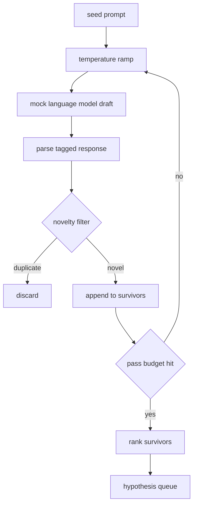

# 假设生成器

> 一个向同一个问题问两次的研究代理是在浪费 tokens。技巧是强制每个草稿落脚于新的地方。

**类型：** 构建  
**语言：** Python  
**先决条件：** 第19阶段 A 轨道第20-29课  
**时间：** ~90分钟

## 学习目标
- 从种子提示驱动采样器，并将输出转化为类型化的假设记录。
- 在每次迭代时提升采样器的温度，让下一个草稿比上一个有更大漂移。
- 使用小型 embedding（嵌入）模型和余弦距离阈值过滤近似重复。
- 用混合新颖性、具体性和可测试性的评分函数对幸存者排序。
- 保持每一步确定性，使相同种子始终产生相同的队列。

## 为什么先生成再过滤

一个规划器对模型仅询问一次，得到一个假设。对于示例演示这没有问题，但对研究循环来说，这样的形态不合适。循环需要的是有深度的排序队列，这样当第一个假设失败时，执行器可以立即用下一个假设，无需再次完整采样。

两个理念结合成这个队列。第一是温度提升：每次通过采样器时提升温度，使后续草稿更敢于探索漂移。第二是新颖性过滤：每个草稿后，生成器测量该草稿 embedding 与先前所有幸存假设的距离，拒绝任何落在簇内的草稿。

课程附带一个模拟语言模型，针对固定提示返回固定的 token 序列。该模拟模型足够覆盖全部流程：种子提示输入、温度提升应用、候选解析、新颖性过滤执行、输出排序队列。

## 假设结构

```text
Hypothesis
  id             : int           (在一次运行中单调递增)
  text           : str           (假设声明)
  variables      : list[str]     (条件间变化变量)
  metric         : str           (运行器将测量的指标)
  baseline_ref   : str | None    (比较引用的论文或运行)
  draft_pass     : int           (产生本草稿的采样轮次)
  temperature    : float         (草稿时采样器温度设置)
  novelty_score  : float         (与先前幸存者的距离，0..1)
  rank_score     : float         (加权和用于排序)
```

`variables` 和 `metric` 不是自由文本。解析器从带标签的响应中抽取它们。第52课运行器直接读取这些字段来构建实验配置。

`baseline_ref` 是可选但推荐的。第53课评估器需要基线进行比较。如果假设中缺失基线，评估器会回退到使用同一指标的前一次运行。

## 架构



流程非常直接。有趣的是每个模块都遵守严格的约定。

## 温度提升

从 `t_min` 开始，到 `t_max` 结束，步长为 `(t_max - t_min) / (n_passes - 1)`。每次采样器使用当前温度调用，总共 `n_passes` 个均匀间隔值来自 `GeneratorConfig.schedule()`。模拟模型通过 `(prompt, temp_bucket)` 作为键从一组脚本响应中切换以体现温度。桶为开区间，所以温度略微变化会选中不同桶，从而产生不同草稿。生产环境中采样器会是一个实际模型，传入 `temperature=t`。

默认计划为6次采样，从 `0.2` 到 `1.2`。6次足够填满队列，不会额外采样被新颖性过滤剔除的草稿。低于 `0.2`，模型倾向复述种子。高于 `1.2`，回答趋于偏题且解析失败。

## 新颖性过滤

每个草稿解析后，生成器将文本嵌入并与所有已接受假设比较。嵌入是词袋哈希，归一化为单位长度。两个单位向量的余弦距离为 `1 - dot(a, b)`。草稿若与任一幸存者的最小距离超过 `novelty_threshold`，则通过。默认阈值为 `0.25`。

哈希嵌入不复杂，确定性高，无依赖，足以发现明显重复：两个草稿共享大部分名词。生产环境下会替换为小型句子模型，接口保持不变。

## 排序分数

```text
rank_score = w_novelty * novelty_score
           + w_specificity * specificity_score
           + w_testability * testability_score
```

三个子分数。`novelty_score` 是与先前幸存者的最小 embedding 距离。`specificity_score` 是假设中具体变量数除以目标数。`testability_score` 若既指定指标又有基线则为1，只有指标则为0.5，否则为0。

默认权重为 `0.4`、`0.3`、`0.3`。权重写在生成器配置中，下游课程可无需分叉代码便调整。

## 模拟语言模型

```python
class MockLLM:
    def sample(self, prompt: str, temperature: float, seed: int) -> str:
        ...
```

采样器对 `(prompt, temperature, seed)` 三元组确定性输出。模拟模型保有以 `(prompt_signature, temperature_bucket)` 为键的脚本响应表。若表中无对应键，采样器返回会导致解析失败的回退响应。测试中覆盖了该回退逻辑。

种子混入响应，使得相同 `(prompt, temperature)` 但不同种子产生不同草稿。测试中固定种子以保证结果可复现。实际部署时种子来自系统时钟或计数器。

## 输出队列

输出为按 `rank_score` 降序排列的 `Hypothesis` 记录列表。第52课的运行器弹出队首，执行实验，第53课的评估器写入判决。若判决表示假设错误，运行器弹出下一个假设。

队列大小有限。当队列空时，调度器可扩大种子提示再次运行生成器，或者停止并报告预算耗尽。

## 如何阅读代码

`code/main.py` 定义了 `Hypothesis`、`MockLLM`、`HypothesisGenerator` 以及一个确定性演示。生成器暴露单个 `run(seed_prompt)` 方法返回排序队列；轮次数从 `GeneratorConfig.n_passes` 读取，而非作为参数传入。嵌入为词袋哈希。新颖性过滤是单函数实现。排序分数是单函数实现。完全无依赖 `numpy`，嵌入计算用纯标准库，保证课程可移植性。

`code/tests/test_generator.py` 覆盖了线性路径、重复拒绝路径、解析失败路径、温度提升边界和排序顺序。

## 课程槽位

第50课生成队列。第51课取队首做文献检索以确认或反驳。第52课用同一队首做实际实验。第53课综合两个结果写判决。四课组成无人工干预的研究循环；人在任意边界可介入。
