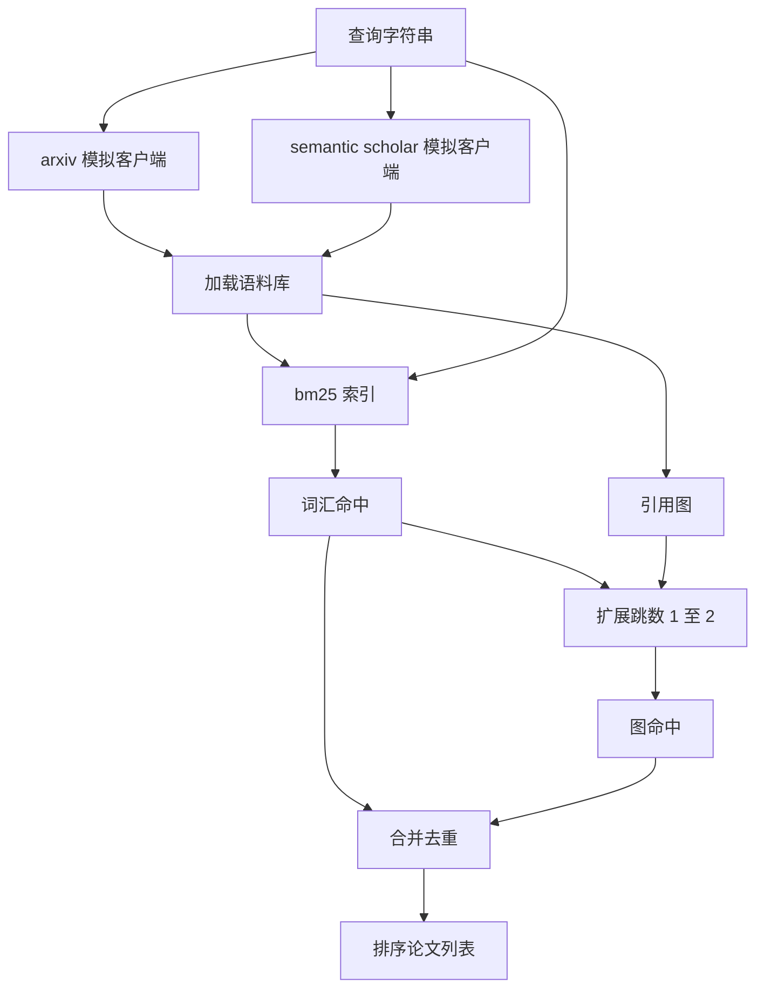

# 文献检索

> 一个假设很廉价。知道别人是否已经证明了它才是昂贵的部分。在执行器启动沙盒之前构建能回答这个问题的检索层。

**类型：** 构建  
**语言：** Python  
**先决条件：** 第十九阶段 Track A 课程 20-29 课时  
**时间：** 约 90 分钟

## 学习目标
- 用循环下游将读取的字段建模一个小型论文记录。
- 仅用标准库数据结构构建基于摘要的 BM25 索引。
- 遍历引用图，找出词汇搜索遗漏的论文。
- 通过稳定的论文 id 去重词汇和图检索的结果。
- 将两个模拟外部 API 封装在单一客户端后面，使得上游调用站点在真实端点到来时保持不变。

## 为什么要两个检索过程

基于关键词的摘要搜索返回与查询共享词汇的论文，这覆盖了大部分表面情况。但它漏掉了两种情况。第一种是基础论文使用了不同的词汇；例如查询 “sparse attention” 会漏掉标题为 “block selection in transformer routing” 的论文。第二种是相关论文是引用已知锚点的后续工作；找到锚点并向前遍历比暴力搜索摘要池更高效。

本课构建了两种检索过程。基于摘要的 BM25 捕捉词汇命中。引用图遍历从种子集向前及向后扩展一到两跳。两者的并集通过论文 id 去重，并用一个小的综合分数排序。

## 论文结构

```text
Paper
  id          : str           （稳定标识符，模拟语料库中如 "p001"）
  title       : str
  abstract    : str
  year        : int
  authors     : list[str]
  references  : list[str]     （该论文引用的论文 id）
  citations   : list[str]     （引用该论文的论文 id）
  source      : str           （哪个模拟 API 提供，"arxiv" 或 "s2"）
```

references 和 citations 字段形成定向引用图。两个模拟 API 返回重叠但不完全相同的字段，语料加载器会基于 `id` 进行合并。

## 架构



检索客户端拥有两个过程和合并逻辑。调用者传入查询，返回排序列表，每条包含解释排序的论文分数字段（`bm25_score`、`graph_distance`、`recency_score`、`final_score`）。

## 从零实现 BM25

实现采用标准 Okapi BM25，默认参数为 `k1=1.5`，`b=0.75`。索引包含两个字典：`term -> doc_frequency` 和 `term -> (doc_id, term_count) 列表`。文档长度为摘要的词元数。平均文档长度只在构建索引时计算一次。查询得分为对查询项中各词的 `idf * tf_norm` 之和，其中 `tf_norm` 是标准 BM25 长度归一化的词频。

分词器为先 `lower` 再以非字母数字字符分割，不做词干处理。生产系统会引入小型词干器，但接口保持不变。

```text
idf(t)      = log((N - df + 0.5) / (df + 0.5) + 1.0)
tf_norm(t)  = (f * (k1 + 1)) / (f + k1 * (1 - b + b * dl / avgdl))
score(d, q) = 对查询中各词 t 求和 idf(t) * tf_norm(t)
```

## 引用图遍历

图从语料库构建一次。向前边从论文到其引用。向后边从论文到其被引用。遍历是以前 BM25 命中为种子进行广度优先搜索，限制最多两跳。

两跳是有意设定的上限。一跳太浅；代理通常需要直接祖先或后代。三跳导致连通图上结果数量爆炸，且容易偏离主题。本课将跳数限制暴露为配置项，下游循环可调整。

## 去重和排序

两个过程返回重叠集，基于论文 id 进行合并。对于每篇论文，最终分数为加权混合。

```text
final_score = w_bm25 * bm25_score_norm
            + w_graph * graph_score
            + w_recency * recency_score
```

`bm25_score_norm` 为BM25分数除以合并集中最大 BM25分数（分数区间 0 到 1）。`graph_score` 为直接词汇命中为 1，一跳为 0.6，两跳为 0.3，其它为 0。`recency_score` 按年线性计算，从语料库最小年份线性递增到最大年份为 1。

默认权重为 `0.5`、`0.3`、`0.2`。权重可配置；旧主题可能降低 recency 权重，快速变化主题则提升。

## 模拟语料库

语料库包含一百篇论文，由 `build_corpus()` 生成。每篇论文有针对五个主题之一（注意力稀疏性、检索增强、低秩适配器、数据集蒸馏和评估框架）手写的标题和摘要。引用和被引用字段连接，确保每个主题形成一个连通子图，并含少量跨主题链接。

两个模拟 API 客户端（`ArxivMockClient`，`SemanticScholarMockClient`）读取同一语料库，但暴露字段不同。Arxiv 返回标题、摘要、年份、作者。Semantic Scholar 额外返回引用和被引用。检索客户端基于 id 进行联合；跨客户端字段不一致处理在后续课程中解决。

## 第 52 和 53 课读取内容

第五十二课中的执行器读取 `paper.id`、`paper.title` 和摘要前三句作为实验上下文。第五十三课的评估器读取 `paper.year` 和 `paper.references` 以将基线归属至具体论文。

检索客户端返回 `RetrievalResult`，包含排序列表及每次查询的指标：命中数、平均得分、最高得分、总耗时。执行器记录它们，以便后续可观测性过程绘制质量随时间变化图。

## 如何阅读代码

`code/main.py` 定义了 `Paper`、`ArxivMockClient`、`SemanticScholarMockClient`、`BM25Index`、`CitationGraph`、`RetrievalClient` 和一个确定性演示。模拟客户端和语料库在同一文件，保持课程可移植。BM25 实现为一个包含六十行代码的类。图遍历为一个方法。

`code/tests/test_retrieval.py` 覆盖了词汇路径、图路径、合并、去重和空查询测试。

## 所处课程位置

第五十课生成假设。第五十一课检索文献看假设是否已成立。第五十二课若未成立则运行实验。第五十三课读取检索结果和实验指标写出判决。检索客户端是四阶段中最廉价的，且在协调器中最先运行。
