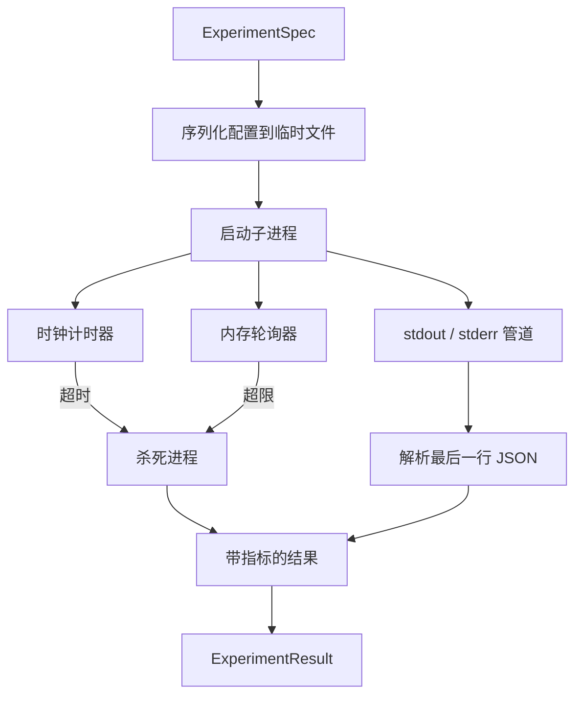

# 实验运行器（Experiment Runner）

> 循环的诚实度取决于它的测量。构建一个运行器，接收规范（spec），在沙箱子进程中执行，并发出评估器可信赖的 JSON 指标数据块。

**类型：** 构建  
**语言：** Python  
**先决条件：** 第19阶段 A轨迹 第20-29课  
**时间：** 约90分钟

## 学习目标
- 将实验编码为类型化规范，运行器可序列化传递给子进程。
- 启动具有硬时钟超时（hard wall clock timeout）和软内存限制（soft memory cap）的子进程，并将两者作为终止条件显现。
- 捕获 stdout、stderr 和结构化指标数据块到单一结果记录。
- 构建消融表（ablation table），在固定的基础规范上一次调节一个配置开关。
- 保持每个结果在给定种子下的确定性，使评估器在多次运行中看到相同数值。

## 为什么使用子进程（subprocess）

研究循环运行不可信代码。假设由采样器产生，实验脚本来自同一路径；将任何一方当做安全的同进程代码运行，极易导致崩溃，拖垮编排器。子进程是语言提供的最简单隔离：独立进程、独立地址空间、父进程一侧的信号处理。

此处的运行器不实现完全沙箱。没有 cgroup、seccomp 过滤器或命名空间重映射。它拥有的是：时钟超时、内存增长轮询循环，以及一条超过限制即可杀死进程的终结路径。每个更复杂沙箱都扩展了这一运行时约定。此课保持约定足够精简，一次阅读即可理解。

## ExperimentSpec 结构

```text
ExperimentSpec
  spec_id        : str            （稳定ID，如 "exp_001"）
  hypothesis_id  : int            （链接回第50课队列）
  script_path    : str            （运行的 Python 脚本路径）
  config         : dict           （作为一个 JSON 参数传递给脚本）
  seed           : int            （实验的确定性种子）
  wall_timeout_s : float          （硬超时，超时即杀死）
  memory_cap_mb  : int            （软内存上限，轮询；超出即杀死）
  metric_keys    : list[str]      （评估器将读取的字段）
```

脚本文件存储于磁盘；运行器写入配置到一个临时文件路径，脚本读取该文件。脚本应在 stdout 打印一行 JSON，键集合是 `metric_keys` 的超集。stdout 中的其他内容被捕获，但指标解析器忽略。

## 架构



运行器是一类，拥有一个主方法。轮询器是一个小线程，每隔轮询周期唤醒，读取子进程的 `psutil` 等价物（从 proc 文件系统，当可用时），否则不操作。

## 为什么采用软内存限制（soft memory cap）

硬内存限制需要 `resource.setrlimit`，且仅适用于 POSIX 系统。本课采用可移植方案：轮询平台上的驻留集大小（RSS），若超出限制则杀死子进程。该限制为软限制，因为轮询器有非零间隔；进程可能在轮询间隙突增内存后回落。运行器记录最大观察到的 RSS，方便评估器查看运行时内存利用上限情况。

在不支持进程监视的平台，轮询器会记录一次警告并禁用自身。时钟超时依旧生效。测试覆盖两种路径。

## 捕获 stdout 和 stderr

运行器读取两管道，完成时清空。stdout 按行扫描；最后一行同时解析为 JSON 并含有全部所需 `metric_keys` 的作为指标数据块。之前的 JSON 行保存在 `intermediate_metrics` 中，评估器可用来绘制学习曲线。

stderr 原样捕获到结果。运行器不因非零退出码抛错，而是将退出码记录在结果中。任何非零退出均标记为 `"crash"`，即使脚本打印了指标，评估器默认将部分运行视为失败。

## 消融表（Ablation table）

```python
def ablate(base: ExperimentSpec, knob: str, values: list[Any]) -> list[ExperimentSpec]:
    ...
```

给定基础规范和一个配置开关名，助手返回一系列规范，分别为每个值覆盖 `config[knob]`。每个规范获取派生的 `spec_id`（格式 `f"{base.spec_id}_{knob}_{value}"`）。运行器提供 `AblationRunner`，按顺序运行这些规范并返回一个以开关值为键的 `AblationTable`。

为何一键一动。全因子扫描成指数爆炸，结果评估器难以理解。单键扫描产生干净轴线便于绘图。课上只支持多键扫描的叠加，即调用方组合多次单键消融。

## 确定性

每个规范携带一个种子。运行器通过配置字典将种子传给脚本（`config["__seed"] = spec.seed`）。`code/experiments/` 中的模拟实验脚本恪守此约定，跨多次运行生成一致指标。第53课的评估器依赖确定性，否则“性能回退”可能由于不同随机初始化。

## 模拟实验脚本

课程提供一个实验脚本：`code/experiments/sparsity_experiment.py`。该脚本读取配置文件，模拟一个带 numpy 随机过程的小规模训练，并打印 JSON 指标数据块。脚本支持 `sleep_s` 用于测试超时，`allocate_mb` 用于测试内存轮询器。

模拟并没有真正训练，只是数值计算，模拟训练循环形态：损失曲线、最终困惑度、耗时。重点在于运行器实现，而非模拟本身。真实实验脚本应导入模型。

## 结果结构

```text
ExperimentResult
  spec_id              : str
  hypothesis_id        : int
  exit_code            : int
  terminal             : "ok" | "timeout" | "oom" | "crash"
  wall_time_s          : float
  peak_rss_mb          : float | None
  metrics              : dict
  intermediate_metrics : list[dict]
  stdout_tail          : str
  stderr_tail          : str
```

评估器优先读取 `metrics` 和 `terminal`。若 `terminal` 非 `"ok"`，实验视为失败运行，评估器判定自动确定。否则，将指标传递到显著性测试。

## 如何阅读代码

`code/main.py` 定义了 `ExperimentSpec`、`ExperimentResult`、`ExperimentRunner`、`AblationRunner` 和一个确定性演示。子进程管理为一类，内存轮询器是一个小线程。消融助手为一个函数。

`code/experiments/sparsity_experiment.py` 是测试使用的模拟实验。它从 argv 读取配置文件路径，完成时写出一行 JSON 指标。

`code/tests/test_runner.py` 覆盖成功路径、超时路径、崩溃路径、消融表和两个运行间的确定性检测。

## 本课程所在环节

第50课生成假设。第51课筛选掉文献已解决的假设。第52课对余下的运行实验。第53课读取结果，运行显著性测试，并写入由编排器根据假设 ID 存储的评判结果。
